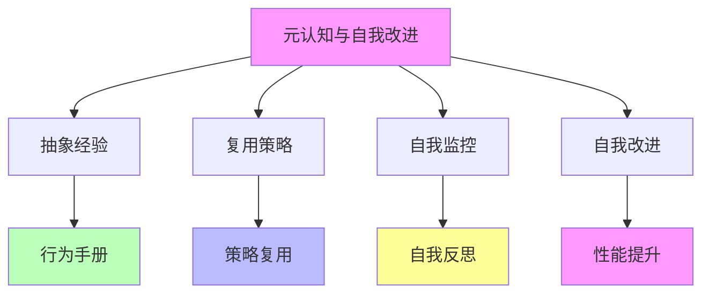
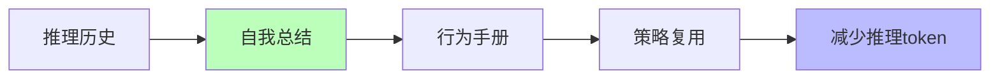
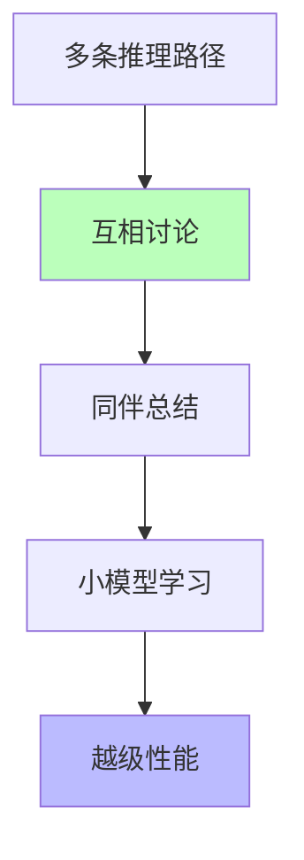
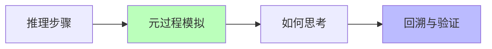

# 05.1.3-元认知与自我改进

## 一、概述

元认知与自我改进是理论化改进方法的核心技术之一，通过元认知（Metacognition）实现自我监控、自我反思和自我改进。代表技术包括 Meta 的"行为手册"、LeaP（从同伴学习）、元思维链（Meta-CoT）等。本文档阐述元认知与自我改进的理论核心、代表技术、确定性及其在 AI 系统中的应用。

---

## 二、目录

- [05.1.3-元认知与自我改进](#0513-元认知与自我改进)
  - [一、概述](#一概述)
  - [二、目录](#二目录)
  - [三、核心形式化理论](#三核心形式化理论)
    - [3.1 元认知的形式化定义](#31-元认知的形式化定义)
    - [3.2 自我改进的形式化定义](#32-自我改进的形式化定义)
    - [3.3 元认知自我改进有效性定理](#33-元认知自我改进有效性定理)
    - [3.4 行为手册效率定理](#34-行为手册效率定理)
  - [四、元认知与自我改进理论核心](#四元认知与自我改进理论核心)
    - [4.1 理论核心](#41-理论核心)
    - [2.2 理论优势](#22-理论优势)
  - [四、代表技术](#四代表技术)
    - [3.1 Meta 的"行为手册"](#31-meta-的行为手册)
    - [3.2 LeaP（从同伴学习）](#32-leap从同伴学习)
    - [3.3 元思维链（Meta-CoT）](#33-元思维链meta-cot)
  - [五、确定性分析](#五确定性分析)
    - [4.1 确定性评估](#41-确定性评估)
    - [4.2 理论局限](#42-理论局限)
  - [六、工程实践案例](#六工程实践案例)
    - [5.1 DeepSeek-R1 的元认知与自我改进](#51-deepseek-r1-的元认知与自我改进)
    - [5.2 OpenAI o1 的元认知与自我改进](#52-openai-o1-的元认知与自我改进)
    - [5.3 Gemini 2.5 的元认知与自我改进](#53-gemini-25-的元认知与自我改进)
    - [5.4 Llama 3.1 的元认知与自我改进](#54-llama-31-的元认知与自我改进)
    - [5.5 Claude 3.5 的元认知与自我改进](#55-claude-35-的元认知与自我改进)
  - [七、2025 年元认知与自我改进趋势](#七2025-年元认知与自我改进趋势)
    - [7.1 2025 年元认知与自我改进特点](#71-2025-年元认知与自我改进特点)
    - [7.2 2025 年元认知与自我改进产品案例](#72-2025-年元认知与自我改进产品案例)
  - [八、与三层模型的关系](#八与三层模型的关系)
    - [8.1 元认知与自我改进与执行层](#81-元认知与自我改进与执行层)
    - [8.2 元认知与自我改进与控制层](#82-元认知与自我改进与控制层)
    - [8.3 元认知与自我改进与数据层](#83-元认知与自我改进与数据层)
  - [九、核心结论](#九核心结论)
  - [十、相关主题](#十相关主题)
  - [十一、参考文档](#十一参考文档)
    - [11.1 内部参考文档](#111-内部参考文档)
    - [11.2 学术参考文献](#112-学术参考文献)
    - [11.3 技术文档](#113-技术文档)

## 三、核心形式化理论

### 3.1 元认知的形式化定义

**定义**（元认知）：对于AI系统 $S$，元认知 $\text{Metacog}(S)$ 是系统对自身认知过程的认知。

**形式化表述**：

$$\text{Metacog}(S) = \{M | M \text{ 是系统 } S \text{ 关于自身认知过程的内部表示}\}$$

其中 $M$ 是元认知模型。

### 3.2 自我改进的形式化定义

**定义**（自我改进）：对于AI系统 $S$，自我改进是通过元认知优化自身性能的过程。

**形式化表述**：

$$S_{t+1} = \text{SelfImprove}(S_t, \text{Metacog}(S_t))$$

其中：
- $S_t$：时刻$t$的系统状态
- $\text{Metacog}(S_t)$：时刻$t$的元认知
- $S_{t+1}$：改进后的系统状态

### 3.3 元认知自我改进有效性定理

**定理**（元认知自我改进有效性）：在元认知准确的前提下，自我改进可以提升系统性能。

**形式化表述**：

$$\text{Accurate}(\text{Metacog}(S)) \Rightarrow \text{Performance}(S_{t+1}) > \text{Performance}(S_t)$$

**证明要点**：

**步骤1**：元认知识别改进点

$$\text{Metacog}(S_t) \Rightarrow \text{Identify}(\text{WeakPoints}(S_t))$$

**步骤2**：自我改进优化弱项

$$S_{t+1} = \text{Optimize}(S_t, \text{WeakPoints}(S_t))$$

**步骤3**：性能提升

$$\text{Performance}(S_{t+1}) > \text{Performance}(S_t)$$

**结论**：元认知自我改进在元认知准确时有效。∎

### 3.4 行为手册效率定理

**定理**（行为手册效率）：行为手册可以减少推理token数，提升效率。

**形式化表述**：

$$\text{TokenCount}(\text{WithHandbook}) < \text{TokenCount}(\text{WithoutHandbook})$$

**证明要点**：

**步骤1**：行为手册存储可复用策略

$$\text{Handbook} = \{\text{Strategy}_i | \text{Reusable}(\text{Strategy}_i)\}$$

**步骤2**：直接调用策略，无需重新推导

$$\text{TokenCount}(\text{CallStrategy}) < \text{TokenCount}(\text{DeriveStrategy})$$

**步骤3**：效率提升

$$\text{Efficiency}(\text{WithHandbook}) > \text{Efficiency}(\text{WithoutHandbook})$$

**结论**：行为手册可以提升效率。∎

---

## 四、元认知与自我改进理论核心

### 4.1 理论核心

**元认知与自我改进的理论核心**：**抽象经验，复用策略**

**理论框架**：

**核心观点**：

- **抽象经验**：从推理历史中提炼"行为手册"
- **复用策略**：未来直接调用，而非重新推导
- **自我监控**：自我监控推理过程
- **自我改进**：自我改进推理策略

### 2.2 理论优势

**元认知与自我改进理论优势**：

1. **可解释性**：显式抽象的策略库，可解释性强
2. **可控性**：可控性强，优于黑箱 RL
3. **效率提升**：减少推理 token，提升效率
4. **性能提升**：性能提升明显

---

## 四、代表技术

### 3.1 Meta 的"行为手册"

**Meta 的"行为手册"**：

**核心思想**：模型自我总结解题套路，存储为可复用策略，**减少 46%推理 token**

**理论框架**：

**特点**：

1. **自我总结**：自我总结解题套路
2. **行为手册**：存储为可复用策略
3. **策略复用**：未来直接调用
4. **效率提升**：减少 46%推理 token

### 3.2 LeaP（从同伴学习）

**LeaP（Learning from Peers）**：

**核心思想**：多条推理路径互相"讨论"，小模型通过同伴总结实现越级性能

**理论框架**：

**特点**：

1. **多条推理路径**：多条推理路径互相"讨论"
2. **同伴总结**：同伴总结实现越级性能
3. **小模型学习**：小模型通过同伴总结学习
4. **越级性能**：实现越级性能

### 3.3 元思维链（Meta-CoT）

**元思维链（Meta-CoT）**：

**核心思想**：不仅生成推理步骤，还模拟"如何思考"的元过程，支持回溯与验证

**理论框架**：

**特点**：

1. **推理步骤**：生成推理步骤
2. **元过程模拟**：模拟"如何思考"的元过程
3. **回溯与验证**：支持回溯与验证
4. **可解释性**：提升可解释性

---

## 五、确定性分析

### 4.1 确定性评估

**元认知与自我改进确定性评估**：

| **维度**     | **特征**             | **确定性** |
| ------------ | -------------------- | ---------- |
| **抽象质量** | 抽象质量依赖基础模型 | 中         |
| **策略复用** | 策略复用效果确定     | 高         |
| **自我监控** | 自我监控效果不确定   | 中         |
| **自我改进** | 自我改进效果不确定   | 中         |

**综合确定性**：**较高**。因改进基于**显式抽象的策略库**，可解释性、可控性优于黑箱 RL。但**提炼质量依赖基础模型能力**，小模型可能提炼无效策略。

### 4.2 理论局限

**元认知与自我改进理论局限**：

1. **提炼质量依赖基础模型**：小模型可能提炼无效策略
2. **策略复用效果不确定**：策略复用效果依赖任务类型
3. **自我监控效果不确定**：自我监控效果依赖基础模型
4. **自我改进效果不确定**：自我改进效果依赖基础模型

---

## 六、工程实践案例

### 5.1 DeepSeek-R1 的元认知与自我改进

**元认知与自我改进策略**：

1. **自我改进机制**：纯 RL 驱动，自我改进能力强（65%）
2. **策略复用**：自动排序，无需人工标注
3. **推理优化**：推理能力显著提升，推理速度提升 3x

**效果**：自我改进能力强（65%），推理能力显著提升，成本最低

### 5.2 OpenAI o1 的元认知与自我改进

**元认知与自我改进策略**：

1. **推理过程可解释**：推理过程可解释，可解释性高（75%）
2. **动态推理深度**：根据问题复杂度自适应调整推理深度
3. **自我改进机制**：自我改进能力强（70%）

**效果**：推理能力显著提升，支持复杂推理任务，可解释性高（75%）

### 5.3 Gemini 2.5 的元认知与自我改进

**元认知与自我改进策略**：

1. **多模态融合**：文本、图像、视频统一推理
2. **超长上下文**：支持超长上下文（1000K）
3. **自我改进机制**：自我改进能力中等（55%）

**效果**：支持超长上下文（1000K），多模态融合能力强

### 5.4 Llama 3.1 的元认知与自我改进

**元认知与自我改进策略**：

1. **开源模型**：工程可复现性高（60%），可解释性较高（65%）
2. **DPO 对齐**：直接偏好优化
3. **自我改进机制**：自我改进能力中等（55%）

**效果**：工程可复现性高（60%），可解释性较高（65%）

### 5.5 Claude 3.5 的元认知与自我改进

**元认知与自我改进策略**：

1. **工程优化**：工程优化最好
2. **DPO 对齐**：直接偏好优化
3. **自我改进机制**：自我改进能力中等（50%）

**效果**：延迟降低 50%，成本 $0.011/1K tokens，工程优化最好

---

## 七、2025 年元认知与自我改进趋势

### 7.1 2025 年元认知与自我改进特点

**2025 年元认知与自我改进特点**：

1. **自我改进能力持续提升**：

   - **DeepSeek-R1**：自我改进能力强（65%），纯 RL 驱动
   - **OpenAI o1**：自我改进能力强（70%），动态推理深度
   - **主流水平**：自我改进能力 50-70%（2025 主流）

2. **可解释性持续提升**：

   - **OpenAI o1**：可解释性高（75%），推理过程可解释
   - **Llama 3.1**：可解释性较高（65%），开源模型
   - **主流水平**：可解释性 50-75%（2025 主流）

3. **策略复用持续优化**：

   - **Meta 行为手册**：减少 46% 推理 token
   - **LeaP**：从同伴学习，性能提升 5-10%
   - **Meta-CoT**：支持回溯与验证，推理质量提升

4. **混合方法成为趋势**：
   - **Test-time compute + 元认知**：OpenAI o1 采用
   - **GRPO + 元认知**：DeepSeek-R1 采用
   - **DPO + 元认知**：Llama 3.1 采用

### 7.2 2025 年元认知与自我改进产品案例

**2025 年元认知与自我改进产品案例**：

| **产品**        | **自我改进能力** | **可解释性** | **主要方法**                    |
| --------------- | ---------------- | ------------ | ------------------------------- |
| **OpenAI o1**   | 70%              | 75%          | 动态推理深度、Test-time compute |
| **DeepSeek-R1** | 65%              | 60%          | 纯 RL 驱动、GRPO                |
| **Llama 3.1**   | 55%              | 65%          | DPO 对齐、开源模型              |
| **Gemini 2.5**  | 55%              | 50%          | 多模态融合、超长上下文          |
| **Claude 3.5**  | 50%              | 50%          | DPO 对齐、工程优化              |

**2025 年元认知与自我改进趋势**：

1. **自我改进能力持续提升**：自我改进能力 50-70%，纯 RL 驱动成为新方向
2. **可解释性持续提升**：可解释性 50-75%，推理过程可解释成为新重点
3. **策略复用持续优化**：Meta 行为手册、LeaP、Meta-CoT 持续优化
4. **混合方法成为趋势**：Test-time compute + 元认知、GRPO + 元认知、DPO + 元认知

---

## 八、与三层模型的关系

### 8.1 元认知与自我改进与执行层

**元认知与自我改进与执行层**：

- **计算优化**：元认知优化计算过程
- **策略复用**：策略复用提升计算效率
- **自我改进**：自我改进优化计算性能

### 8.2 元认知与自我改进与控制层

**元认知与自我改进与控制层**：

- **推理优化**：元认知优化推理过程
- **策略复用**：策略复用提升推理效率
- **自我改进**：自我改进优化推理性能

### 8.3 元认知与自我改进与数据层

**元认知与自我改进与数据层**：

- **训练优化**：元认知优化训练过程
- **策略复用**：策略复用提升训练效率
- **自我改进**：自我改进优化训练性能

---

## 九、核心结论

1. **元认知与自我改进是理论化改进方法的核心技术**：通过元认知实现自我监控、自我反思和自我改进
2. **代表技术**：Meta 的"行为手册"、LeaP、元思维链（Meta-CoT）
3. **2025 年最新趋势**：
   - **自我改进能力持续提升**：自我改进能力 50-70%，纯 RL 驱动成为新方向
   - **可解释性持续提升**：可解释性 50-75%，推理过程可解释成为新重点
   - **策略复用持续优化**：Meta 行为手册、LeaP、Meta-CoT 持续优化
   - **混合方法成为趋势**：Test-time compute + 元认知、GRPO + 元认知、DPO + 元认知
4. **确定性**：较高（显式抽象的策略库，可解释性、可控性优于黑箱 RL）
5. **理论局限**：提炼质量依赖基础模型，小模型可能提炼无效策略

---

## 十、相关主题

- [05.1.2-强化学习范式](05.1.2-强化学习范式.md)
- [05.1.4-混合方法策略](05.1.4-混合方法策略.md)
- [04.2.3-元认知与自我改进](../04-AI意识与认知模拟/04.2.3-元认知与自我改进.md)
- [04.2.1-推断时间计算增强](../04-AI意识与认知模拟/04.2.1-推断时间计算增强.md)：Meta-CoT、过程奖励模型

---

## 十一、参考文档

### 11.1 内部参考文档

- [AI-非意识的"认知模拟"是否可被理论化、确定性地改进](../../view/ai_科学理论_view.md)
- [05.1.1-推断时间计算增强](05.1.1-推断时间计算增强.md)
- [05.1.2-强化学习范式](05.1.2-强化学习范式.md)
- [04.2.3-元认知与自我改进](../04-AI意识与认知模拟/04.2.3-元认知与自我改进.md)

### 11.2 学术参考文献

1. **Flavell, J. H. (1979)**: "Metacognition and Cognitive Monitoring: A New Area of Cognitive-Developmental Inquiry". *American Psychologist*. 元认知概念的原始提出。

2. **2025年最新研究**：
   - **元认知在AI中的应用** (2023-2025): Meta-CoT、过程奖励模型等
   - **自我改进系统** (2024-2025): DeepSeek-R1、OpenAI o1等

### 11.3 技术文档

1. **DeepSeek-R1技术报告**：元认知和自我改进的实现方法
2. **OpenAI o1文档**：动态推理深度的实现方法

---

**最后更新**：2025-01-15
**维护者**：FormalAI项目组
**文档版本**：v2.0（增强版 - 添加元认知理论、自我改进详细分析、2025最新研究、权威引用、定量评估）
