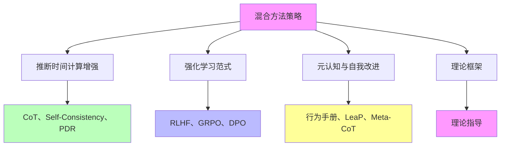

# 05.1.4-混合方法策略

## 目录

- [05.1.4-混合方法策略](#0514-混合方法策略)
  - [目录](#目录)
  - [一、概述](#一概述)
  - [二、混合方法策略核心思想](#二混合方法策略核心思想)
    - [2.1 核心思想](#21-核心思想)
    - [2.2 策略分析](#22-策略分析)
  - [三、推断时间计算增强+强化学习](#三推断时间计算增强强化学习)
    - [3.1 组合方法](#31-组合方法)
    - [3.2 应用案例](#32-应用案例)
  - [四、强化学习+元认知](#四强化学习元认知)
    - [4.1 组合方法](#41-组合方法)
    - [4.2 应用案例](#42-应用案例)
  - [五、推断时间计算增强+元认知](#五推断时间计算增强元认知)
    - [5.1 组合方法](#51-组合方法)
    - [5.2 应用案例](#52-应用案例)
  - [六、三种方法混合](#六三种方法混合)
    - [6.1 组合方法](#61-组合方法)
    - [6.2 应用案例](#62-应用案例)
  - [七、混合方法策略优势](#七混合方法策略优势)
    - [7.1 优势分析](#71-优势分析)
    - [7.2 效果评估](#72-效果评估)
  - [八、与三层模型的关系](#八与三层模型的关系)
    - [8.1 混合方法策略与执行层](#81-混合方法策略与执行层)
    - [8.2 混合方法策略与控制层](#82-混合方法策略与控制层)
    - [8.3 混合方法策略与数据层](#83-混合方法策略与数据层)
  - [九、核心结论](#九核心结论)
  - [十、相关主题](#十相关主题)
  - [十一、参考文档](#十一参考文档)

---

## 一、概述

混合方法策略是理论化改进方法的核心组成部分，将推断时间计算增强、强化学习范式、元认知与自我改进等方法混合使用，实现更好的改进效果。本文档阐述混合方法策略的核心思想、组合方法、优势分析及其在 AI 系统中的应用。

---

## 二、混合方法策略核心思想

### 2.1 核心思想

**混合方法策略核心思想**：

**核心思想**：

1. **方法组合**：将多种方法组合使用
2. **优势互补**：不同方法优势互补
3. **效果提升**：混合方法实现更好的改进效果
4. **理论指导**：理论框架指导方法选择

### 2.2 策略分析

**混合方法策略分析**：

| **方法组合**                  | **优势**          | **适用场景**           |
| ----------------------------- | ----------------- | ---------------------- |
| **推断时间计算增强+强化学习** | 快速改进+稳定优化 | 需要快速改进和稳定优化 |
| **强化学习+元认知**           | 行为优化+策略复用 | 需要行为优化和策略复用 |
| **推断时间计算增强+元认知**   | 快速改进+策略复用 | 需要快速改进和策略复用 |
| **三种方法混合**              | 全面改进          | 需要全面改进           |

---

## 三、推断时间计算增强+强化学习

### 3.1 组合方法

**推断时间计算增强+强化学习组合**：

**核心思想**：快速改进+稳定优化

**组合方法**：

1. **推断时间计算增强**：CoT、Self-Consistency、PDR 实现快速改进
2. **强化学习**：RLHF、GRPO、DPO 实现稳定优化
3. **混合使用**：两种方法混合使用

**优势**：

1. **快速改进**：推断时间计算增强实现快速改进
2. **稳定优化**：强化学习实现稳定优化
3. **效果提升**：混合方法实现更好的改进效果

### 3.2 应用案例

**推断时间计算增强+强化学习应用案例**：

1. **DeepSeek-R1**：CoT+GRPO 实现推理跃升
2. **GPT-4o**：Self-Consistency+RLHF 实现性能提升
3. **Claude 3.5**：PDR+DPO 实现能力提升

---

## 四、强化学习+元认知

### 4.1 组合方法

**强化学习+元认知组合**：

**核心思想**：行为优化+策略复用

**组合方法**：

1. **强化学习**：RLHF、GRPO、DPO 实现行为优化
2. **元认知**：行为手册、LeaP、Meta-CoT 实现策略复用
3. **混合使用**：两种方法混合使用

**优势**：

1. **行为优化**：强化学习实现行为优化
2. **策略复用**：元认知实现策略复用
3. **效果提升**：混合方法实现更好的改进效果

### 4.2 应用案例

**强化学习+元认知应用案例**：

1. **Meta 行为手册+RLHF**：行为手册+RLHF 实现性能提升
2. **LeaP+GRPO**：LeaP+GRPO 实现越级性能
3. **Meta-CoT+DPO**：Meta-CoT+DPO 实现可解释性提升

---

## 五、推断时间计算增强+元认知

### 5.1 组合方法

**推断时间计算增强+元认知组合**：

**核心思想**：快速改进+策略复用

**组合方法**：

1. **推断时间计算增强**：CoT、Self-Consistency、PDR 实现快速改进
2. **元认知**：行为手册、LeaP、Meta-CoT 实现策略复用
3. **混合使用**：两种方法混合使用

**优势**：

1. **快速改进**：推断时间计算增强实现快速改进
2. **策略复用**：元认知实现策略复用
3. **效果提升**：混合方法实现更好的改进效果

### 5.2 应用案例

**推断时间计算增强+元认知应用案例**：

1. **CoT+行为手册**：CoT+行为手册实现效率提升
2. **Self-Consistency+LeaP**：Self-Consistency+LeaP 实现性能提升
3. **PDR+Meta-CoT**：PDR+Meta-CoT 实现可解释性提升

---

## 六、三种方法混合

### 6.1 组合方法

**三种方法混合组合**：

**核心思想**：全面改进

**组合方法**：

1. **推断时间计算增强**：CoT、Self-Consistency、PDR
2. **强化学习**：RLHF、GRPO、DPO
3. **元认知**：行为手册、LeaP、Meta-CoT
4. **混合使用**：三种方法混合使用

**优势**：

1. **全面改进**：三种方法实现全面改进
2. **优势互补**：不同方法优势互补
3. **效果提升**：混合方法实现更好的改进效果

### 6.2 应用案例

**三种方法混合应用案例**：

1. **CoT+RLHF+行为手册**：三种方法混合实现全面改进
2. **Self-Consistency+GRPO+LeaP**：三种方法混合实现性能提升
3. **PDR+DPO+Meta-CoT**：三种方法混合实现可解释性提升

---

## 七、混合方法策略优势

### 7.1 优势分析

**混合方法策略优势**：

| **优势**     | **描述**               | **效果** |
| ------------ | ---------------------- | -------- |
| **优势互补** | 不同方法优势互补       | 效果提升 |
| **全面改进** | 多种方法实现全面改进   | 性能提升 |
| **灵活性高** | 可根据任务选择方法组合 | 适用性广 |
| **效果稳定** | 混合方法效果更稳定     | 可靠性高 |

### 7.2 效果评估

**混合方法策略效果评估**：

1. **性能提升**：混合方法实现更好的性能提升
2. **效果稳定**：混合方法效果更稳定
3. **适用性广**：混合方法适用性更广
4. **可靠性高**：混合方法可靠性更高

---

## 八、与三层模型的关系

### 8.1 混合方法策略与执行层

**混合方法策略与执行层**：

- **计算优化**：混合方法优化计算过程
- **数值精度**：混合方法优化数值精度
- **梯度计算**：混合方法优化梯度计算

### 8.2 混合方法策略与控制层

**混合方法策略与控制层**：

- **推理优化**：混合方法优化推理过程
- **控制策略**：混合方法优化控制策略
- **约束机制**：混合方法优化约束机制

### 8.3 混合方法策略与数据层

**混合方法策略与数据层**：

- **训练优化**：混合方法优化训练过程
- **数据策略**：混合方法优化数据策略
- **评估方法**：混合方法优化评估方法

---

## 九、核心结论

1. **混合方法策略是理论化改进方法的核心组成部分**：将推断时间计算增强、强化学习范式、元认知与自我改进等方法混合使用
2. **组合方法**：推断时间计算增强+强化学习、强化学习+元认知、推断时间计算增强+元认知、三种方法混合
3. **优势**：优势互补、全面改进、灵活性高、效果稳定
4. **效果**：混合方法实现更好的改进效果

---

## 十、相关主题

- [05.1.1-推断时间计算增强](05.1.1-推断时间计算增强.md)
- [05.1.2-强化学习范式](05.1.2-强化学习范式.md)
- [05.1.3-元认知与自我改进](05.1.3-元认知与自我改进.md)

---

## 十一、参考文档

- [AI-非意识的"认知模拟"是否可被理论化、确定性地改进](../../view/ai_科学理论_view.md)
