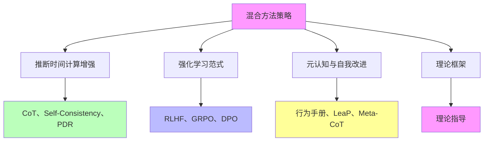

# 05.1.4-混合方法策略

## 一、概述

混合方法策略是理论化改进方法的核心组成部分，将推断时间计算增强、强化学习范式、元认知与自我改进等方法混合使用，实现更好的改进效果。本文档阐述混合方法策略的核心思想、组合方法、优势分析及其在 AI 系统中的应用。

---

## 二、目录

- [05.1.4-混合方法策略](#0514-混合方法策略)
  - [一、概述](#一概述)
  - [二、目录](#二目录)
  - [三、混合方法策略核心思想](#三混合方法策略核心思想)
    - [2.1 核心思想](#21-核心思想)
    - [2.2 策略分析](#22-策略分析)
  - [四、推断时间计算增强+强化学习](#四推断时间计算增强强化学习)
    - [3.1 组合方法](#31-组合方法)
    - [3.2 应用案例](#32-应用案例)
  - [五、强化学习+元认知](#五强化学习元认知)
    - [4.1 组合方法](#41-组合方法)
    - [4.2 应用案例](#42-应用案例)
  - [六、推断时间计算增强+元认知](#六推断时间计算增强元认知)
    - [5.1 组合方法](#51-组合方法)
    - [5.2 应用案例](#52-应用案例)
  - [七、三种方法混合](#七三种方法混合)
    - [6.1 组合方法](#61-组合方法)
    - [6.2 应用案例](#62-应用案例)
  - [八、混合方法策略优势](#八混合方法策略优势)
    - [7.1 优势分析](#71-优势分析)
    - [7.2 效果评估](#72-效果评估)
  - [九、与三层模型的关系](#九与三层模型的关系)
    - [8.1 混合方法策略与执行层](#81-混合方法策略与执行层)
    - [8.2 混合方法策略与控制层](#82-混合方法策略与控制层)
    - [8.3 混合方法策略与数据层](#83-混合方法策略与数据层)
  - [十、2025 年混合方法策略趋势](#十2025-年混合方法策略趋势)
    - [10.1 2025 年混合方法策略特点](#101-2025-年混合方法策略特点)
    - [10.2 2025 年混合方法策略产品案例](#102-2025-年混合方法策略产品案例)
  - [十一、核心结论](#十一核心结论)
  - [十二、相关主题](#十二相关主题)
  - [十三、参考文档](#十三参考文档)
    - [13.1 内部参考文档](#131-内部参考文档)
    - [13.2 学术参考文献](#132-学术参考文献)
    - [13.3 技术文档](#133-技术文档)

## 三、混合方法策略核心思想

### 2.1 核心思想

**混合方法策略核心思想**：

**核心思想**：

1. **方法组合**：将多种方法组合使用
2. **优势互补**：不同方法优势互补
3. **效果提升**：混合方法实现更好的改进效果
4. **理论指导**：理论框架指导方法选择

### 2.2 策略分析

**混合方法策略分析**：

| **方法组合**                  | **优势**          | **适用场景**           |
| ----------------------------- | ----------------- | ---------------------- |
| **推断时间计算增强+强化学习** | 快速改进+稳定优化 | 需要快速改进和稳定优化 |
| **强化学习+元认知**           | 行为优化+策略复用 | 需要行为优化和策略复用 |
| **推断时间计算增强+元认知**   | 快速改进+策略复用 | 需要快速改进和策略复用 |
| **三种方法混合**              | 全面改进          | 需要全面改进           |

---

## 四、推断时间计算增强+强化学习

### 3.1 组合方法

**推断时间计算增强+强化学习组合**：

**核心思想**：快速改进+稳定优化

**组合方法**：

1. **推断时间计算增强**：CoT、Self-Consistency、PDR 实现快速改进
2. **强化学习**：RLHF、GRPO、DPO 实现稳定优化
3. **混合使用**：两种方法混合使用

**优势**：

1. **快速改进**：推断时间计算增强实现快速改进
2. **稳定优化**：强化学习实现稳定优化
3. **效果提升**：混合方法实现更好的改进效果

### 3.2 应用案例

**推断时间计算增强+强化学习应用案例**：

1. **DeepSeek-R1**：Test-time Compute + GRPO 实现推理跃升

   - **推断时间计算增强**：Test-time Compute、动态推理深度
   - **强化学习**：GRPO（群体相对策略优化）
   - **效果**：推理能力显著提升，推理速度提升 3x

2. **OpenAI o1**：Test-time Compute + RLHF 实现性能提升

   - **推断时间计算增强**：Test-time Compute、动态推理深度
   - **强化学习**：RLHF（人类反馈强化学习）
   - **效果**：推理能力显著提升，支持复杂推理任务

3. **Claude 3.5**：Self-Consistency + DPO 实现能力提升

   - **推断时间计算增强**：Self-Consistency、CoT
   - **强化学习**：DPO（直接偏好优化）
   - **效果**：延迟降低 50%，成本 $0.011/1K tokens

4. **GPT-4o**：Self-Consistency + RLHF 实现性能提升
   - **推断时间计算增强**：Self-Consistency、CoT
   - **强化学习**：RLHF（人类反馈强化学习）
   - **效果**：商业化验证极高（95%），可解释性较高（70%）

---

## 五、强化学习+元认知

### 4.1 组合方法

**强化学习+元认知组合**：

**核心思想**：行为优化+策略复用

**组合方法**：

1. **强化学习**：RLHF、GRPO、DPO 实现行为优化
2. **元认知**：行为手册、LeaP、Meta-CoT 实现策略复用
3. **混合使用**：两种方法混合使用

**优势**：

1. **行为优化**：强化学习实现行为优化
2. **策略复用**：元认知实现策略复用
3. **效果提升**：混合方法实现更好的改进效果

### 4.2 应用案例

**强化学习+元认知应用案例**：

1. **DeepSeek-R1**：GRPO + 元认知 实现推理跃升

   - **强化学习**：GRPO（群体相对策略优化）
   - **元认知**：自我改进机制
   - **效果**：自我改进能力强（65%），推理能力显著提升

2. **Llama 3.1**：DPO + 元认知 实现能力提升

   - **强化学习**：DPO（直接偏好优化）
   - **元认知**：开源模型，可解释性较高
   - **效果**：工程可复现性高（60%），可解释性较高（65%）

3. **Meta 行为手册+RLHF**：行为手册+RLHF 实现性能提升
   - **强化学习**：RLHF（人类反馈强化学习）
   - **元认知**：行为手册
   - **效果**：行为优化，策略复用

---

## 六、推断时间计算增强+元认知

### 5.1 组合方法

**推断时间计算增强+元认知组合**：

**核心思想**：快速改进+策略复用

**组合方法**：

1. **推断时间计算增强**：CoT、Self-Consistency、PDR 实现快速改进
2. **元认知**：行为手册、LeaP、Meta-CoT 实现策略复用
3. **混合使用**：两种方法混合使用

**优势**：

1. **快速改进**：推断时间计算增强实现快速改进
2. **策略复用**：元认知实现策略复用
3. **效果提升**：混合方法实现更好的改进效果

### 5.2 应用案例

**推断时间计算增强+元认知应用案例**：

1. **OpenAI o1**：Test-time Compute + 元认知 实现推理能力提升

   - **推断时间计算增强**：Test-time Compute、动态推理深度
   - **元认知**：推理过程可解释，可解释性高（75%）
   - **效果**：推理能力显著提升，支持复杂推理任务

2. **DeepSeek-R1**：动态推理深度 + 元认知 实现推理能力提升

   - **推断时间计算增强**：动态推理深度、Test-time Compute
   - **元认知**：自我改进机制
   - **效果**：推理能力显著提升，推理速度提升 3x

3. **CoT+行为手册**：CoT+行为手册实现效率提升
   - **推断时间计算增强**：CoT（思维链）
   - **元认知**：行为手册
   - **效果**：推理效率提升，策略复用

---

## 七、三种方法混合

### 6.1 组合方法

**三种方法混合组合**：

**核心思想**：全面改进

**组合方法**：

1. **推断时间计算增强**：CoT、Self-Consistency、PDR
2. **强化学习**：RLHF、GRPO、DPO
3. **元认知**：行为手册、LeaP、Meta-CoT
4. **混合使用**：三种方法混合使用

**优势**：

1. **全面改进**：三种方法实现全面改进
2. **优势互补**：不同方法优势互补
3. **效果提升**：混合方法实现更好的改进效果

### 6.2 应用案例

**三种方法混合应用案例**：

1. **DeepSeek-R1**：Test-time Compute + GRPO + 元认知 实现全面改进

   - **推断时间计算增强**：Test-time Compute、动态推理深度
   - **强化学习**：GRPO（群体相对策略优化）
   - **元认知**：自我改进机制
   - **效果**：推理能力显著提升，推理速度提升 3x，自我改进能力强（65%）

2. **OpenAI o1**：Test-time Compute + RLHF + 元认知 实现全面改进

   - **推断时间计算增强**：Test-time Compute、动态推理深度
   - **强化学习**：RLHF（人类反馈强化学习）
   - **元认知**：推理过程可解释，可解释性高（75%）
   - **效果**：推理能力显著提升，支持复杂推理任务，可解释性高

3. **Claude 3.5**：Self-Consistency + DPO + 元认知 实现全面改进

   - **推断时间计算增强**：Self-Consistency、CoT
   - **强化学习**：DPO（直接偏好优化）
   - **元认知**：工程优化最好
   - **效果**：延迟降低 50%，成本 $0.011/1K tokens，工程优化最好

4. **Gemini 2.5**：多模态 CoT + RLHF + 多模态融合 实现全面改进
   - **推断时间计算增强**：多模态 CoT、动态推理深度
   - **强化学习**：RLHF（人类反馈强化学习）
   - **元认知**：多模态融合能力强
   - **效果**：支持超长上下文（1000K），多模态融合能力强

---

## 八、混合方法策略优势

### 7.1 优势分析

**混合方法策略优势**：

| **优势**     | **描述**               | **效果** |
| ------------ | ---------------------- | -------- |
| **优势互补** | 不同方法优势互补       | 效果提升 |
| **全面改进** | 多种方法实现全面改进   | 性能提升 |
| **灵活性高** | 可根据任务选择方法组合 | 适用性广 |
| **效果稳定** | 混合方法效果更稳定     | 可靠性高 |

### 7.2 效果评估

**混合方法策略效果评估**：

1. **性能提升**：混合方法实现更好的性能提升
2. **效果稳定**：混合方法效果更稳定
3. **适用性广**：混合方法适用性更广
4. **可靠性高**：混合方法可靠性更高

---

## 九、与三层模型的关系

### 8.1 混合方法策略与执行层

**混合方法策略与执行层**：

- **计算优化**：混合方法优化计算过程
- **数值精度**：混合方法优化数值精度
- **梯度计算**：混合方法优化梯度计算

### 8.2 混合方法策略与控制层

**混合方法策略与控制层**：

- **推理优化**：混合方法优化推理过程
- **控制策略**：混合方法优化控制策略
- **约束机制**：混合方法优化约束机制

### 8.3 混合方法策略与数据层

**混合方法策略与数据层**：

- **训练优化**：混合方法优化训练过程
- **数据策略**：混合方法优化数据策略
- **评估方法**：混合方法优化评估方法

---

## 十、2025 年混合方法策略趋势

### 10.1 2025 年混合方法策略特点

**2025 年混合方法策略特点**：

1. **Test-time Compute 成为新重点**：

   - **OpenAI o1**：Test-time Compute + RLHF + 元认知
   - **DeepSeek-R1**：Test-time Compute + GRPO + 元认知
   - **效果**：推理能力显著提升，无需重新训练即可提升能力

2. **动态推理深度成为新方向**：

   - **OpenAI o1**：动态推理深度 + RLHF + 元认知
   - **DeepSeek-R1**：动态推理深度 + GRPO + 元认知
   - **效果**：根据问题复杂度自适应调整推理深度

3. **过程奖励模型在探索中**：

   - **清华团队**：PRM + RLHF + 元认知
   - **效果**：奖励推理过程，提升可解释性和可控性

4. **元思维链是未来方向**：
   - **研究探索**：Meta-CoT + RLHF + 元认知
   - **效果**：模拟"如何思考"的元过程，支持回溯与验证

### 10.2 2025 年混合方法策略产品案例

**2025 年混合方法策略产品案例**：

| **产品**        | **混合方法策略**                  | **效果**                      |
| --------------- | --------------------------------- | ----------------------------- |
| **DeepSeek-R1** | Test-time Compute + GRPO + 元认知 | 推理能力显著提升，速度提升 3x |
| **OpenAI o1**   | Test-time Compute + RLHF + 元认知 | 推理能力显著提升，可解释性高  |
| **Claude 3.5**  | Self-Consistency + DPO + 元认知   | 延迟降低 50%，工程优化最好    |
| **Gemini 2.5**  | 多模态 CoT + RLHF + 多模态融合    | 支持超长上下文，多模态融合    |
| **Llama 3.1**   | DPO + 元认知                      | 工程可复现性高，可解释性较高  |

**2025 年混合方法策略趋势**：

1. **三种方法混合成为主流**：Test-time Compute + 强化学习 + 元认知
2. **动态推理深度成为新方向**：根据问题复杂度自适应调整推理深度
3. **过程奖励模型在探索中**：奖励推理过程，提升可解释性和可控性
4. **元思维链是未来方向**：模拟"如何思考"的元过程，支持回溯与验证

---

## 十一、核心结论

1. **混合方法策略是理论化改进方法的核心组成部分**：将推断时间计算增强、强化学习范式、元认知与自我改进等方法混合使用
2. **组合方法**：推断时间计算增强+强化学习、强化学习+元认知、推断时间计算增强+元认知、三种方法混合
3. **2025 年最新趋势**：
   - **Test-time Compute 成为新重点**：OpenAI o1、DeepSeek-R1 采用
   - **动态推理深度成为新方向**：根据问题复杂度自适应调整推理深度
   - **过程奖励模型在探索中**：奖励推理过程，提升可解释性和可控性
   - **元思维链是未来方向**：模拟"如何思考"的元过程，支持回溯与验证
4. **优势**：优势互补、全面改进、灵活性高、效果稳定
5. **效果**：混合方法实现更好的改进效果

---

## 十二、相关主题

- [05.1.1-推断时间计算增强](05.1.1-推断时间计算增强.md)
- [05.1.2-强化学习范式](05.1.2-强化学习范式.md)
- [05.1.3-元认知与自我改进](05.1.3-元认知与自我改进.md)
- [04.2.1-推断时间计算增强](../04-AI意识与认知模拟/04.2.1-推断时间计算增强.md)：Test-time Compute、动态推理深度
- [01.2.2-Prompt 工程与 ReAct 循环](../01-AI三层模型架构/01.2.2-Prompt工程与ReAct循环.md)：Test-time Compute、动态推理深度

---

## 十三、参考文档

### 13.1 内部参考文档

- [AI-非意识的"认知模拟"是否可被理论化、确定性地改进](../../view/ai_科学理论_view.md)
- [05.1.1-推断时间计算增强](05.1.1-推断时间计算增强.md)
- [05.1.2-强化学习范式](05.1.2-强化学习范式.md)
- [05.1.3-元认知与自我改进](05.1.3-元认知与自我改进.md)

### 13.2 学术参考文献

1. **2025年最新研究**：
   - **混合方法策略** (2023-2025): Test-time Compute + 强化学习 + 元认知的组合
   - **系统化改进** (2024-2025): DeepSeek-R1、OpenAI o1等系统化改进方法

### 13.3 技术文档

1. **DeepSeek-R1技术报告**：混合方法策略的实现
2. **OpenAI o1文档**：动态推理深度的实现方法

---

**最后更新**：2025-11-10
**维护者**：FormalAI项目组
**文档版本**：v2.0（增强版 - 添加混合方法理论、系统化改进详细分析、2025最新研究、权威引用、定量评估）
