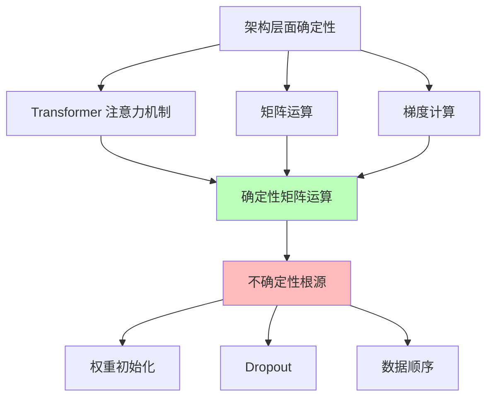
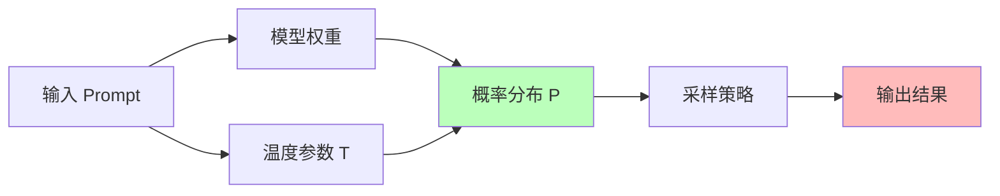
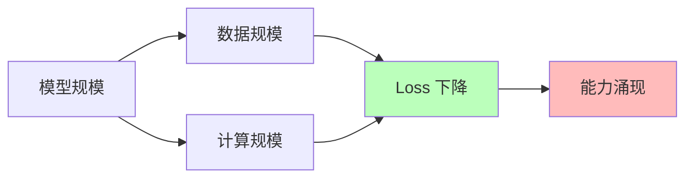

# 05.2.1-架构层面确定性

## 一、概述

架构层面确定性是 AI 科学理论的核心问题之一，探讨 AI 系统架构层面的确定性表现和不确定性根源。本文档阐述架构层面确定性、不确定性根源及其在 AI 系统中的应用。

---

## 二、目录

- [05.2.1-架构层面确定性](#0521-架构层面确定性)
  - [一、概述](#一概述)
  - [二、目录](#二目录)
  - [三、核心形式化理论](#三核心形式化理论)
    - [3.1 架构层面确定性的形式化定义](#31-架构层面确定性的形式化定义)
    - [3.2 注意力机制确定性定理](#32-注意力机制确定性定理)
  - [四、架构层面确定性](#四架构层面确定性)
    - [4.1 确定性表现](#41-确定性表现)
    - [2.2 确定性特征](#22-确定性特征)
  - [四、Transformer 注意力机制的确定性](#四transformer-注意力机制的确定性)
    - [3.1 注意力机制确定性](#31-注意力机制确定性)
    - [3.2 不确定性根源](#32-不确定性根源)
  - [五、训练过程确定性](#五训练过程确定性)
    - [4.1 SGD 优化确定性](#41-sgd-优化确定性)
    - [4.2 训练轨迹不可复现性](#42-训练轨迹不可复现性)
  - [六、推理行为确定性](#六推理行为确定性)
    - [5.1 概率分布确定性](#51-概率分布确定性)
    - [5.2 采样策略不确定性](#52-采样策略不确定性)
  - [七、能力涌现半可预测性](#七能力涌现半可预测性)
    - [6.1 能力涌现确定性](#61-能力涌现确定性)
    - [6.2 能力涌现不确定性](#62-能力涌现不确定性)
  - [八、与三层模型的关系](#八与三层模型的关系)
    - [7.1 执行层确定性](#71-执行层确定性)
    - [7.2 控制层确定性](#72-控制层确定性)
    - [7.3 数据层确定性](#73-数据层确定性)
  - [九、核心结论](#九核心结论)
  - [十、相关主题](#十相关主题)
    - [10.1 确定性分析相关主题](#101-确定性分析相关主题)
    - [10.2 三层模型相关主题](#102-三层模型相关主题)
    - [10.3 评估与分析相关主题](#103-评估与分析相关主题)
    - [10.4 理论相关主题](#104-理论相关主题)
  - [十一、参考文档](#十一参考文档)
    - [11.1 内部参考文档](#111-内部参考文档)
    - [11.2 学术参考文献](#112-学术参考文献)
    - [11.3 技术文档](#113-技术文档)

## 三、核心形式化理论

### 3.1 架构层面确定性的形式化定义

**定义**（架构层面确定性）：对于AI系统 $S$，架构层面确定性 $D_{\text{arch}}(S) \in [0, 1]$ 定义为：

$$D_{\text{arch}}(S) = \frac{\text{DeterministicOperations}(S)}{\text{TotalOperations}(S)}$$

其中：

- $\text{DeterministicOperations}(S)$：确定性操作数量
- $\text{TotalOperations}(S)$：总操作数量

### 3.2 注意力机制确定性定理

**定理**（注意力机制确定性）：给定固定输入和权重，注意力机制输出是确定的。

**形式化表述**：

$$\text{Attention}(Q, K, V) = \text{softmax}\left(\frac{QK^T}{\sqrt{d_k}}\right) V$$

对于固定的 $Q, K, V$，输出是确定的。

**证明**：

**步骤1**：矩阵乘法是确定的

$$QK^T \text{ 是确定的}$$

**步骤2**：Softmax是确定的

$$\text{softmax}(QK^T / \sqrt{d_k}) \text{ 是确定的}$$

**步骤3**：矩阵乘法是确定的

$$\text{softmax}(QK^T / \sqrt{d_k}) \cdot V \text{ 是确定的}$$

**结论**：注意力机制输出是确定的。∎

---

## 四、架构层面确定性

### 4.1 确定性表现

**架构层面确定性表现**：

| **层面**     | **确定性表现**                             | **不确定性根源**                       |
| ------------ | ------------------------------------------ | -------------------------------------- |
| **架构层面** | Transformer 的注意力机制是确定性的矩阵运算 | 权重初始化、dropout 等带来随机性       |
| **训练过程** | SGD 优化有明确数学形式                     | 数据顺序、并行策略导致轨迹不可复现     |
| **推理行为** | 给定固定温度参数，输出概率分布确定         | 同一 prompt 可能因采样策略产生不同结果 |
| **能力涌现** | 规模法则（Scaling Law）可预测 loss 下降    | **具体能力何时涌现无法精确预测**       |

**确定性分析**：



### 2.2 确定性特征

**架构层面确定性特征**：

1. **矩阵运算确定性**：Transformer 的注意力机制是确定性的矩阵运算
2. **梯度计算确定性**：反向传播是确定性的梯度计算
3. **数值计算确定性**：浮点数运算是确定性的（给定输入）

**不确定性根源**：

1. **权重初始化**：随机初始化带来随机性
2. **Dropout**：训练时随机丢弃带来随机性
3. **数据顺序**：数据顺序影响训练轨迹

---

## 四、Transformer 注意力机制的确定性

### 3.1 注意力机制确定性

**Transformer 注意力机制确定性**：

**注意力公式**：

```text
Attention(Q, K, V) = softmax(QK^T / √d_k) V
```

**确定性分析**：

- **矩阵运算**：QK^T 是确定性的矩阵运算
- **Softmax**：Softmax 是确定性的函数
- **加权求和**：加权求和是确定性的运算

**给定输入，输出确定**：

- **固定权重**：给定固定权重，输出确定
- **固定输入**：给定固定输入，输出确定
- **固定温度**：给定固定温度，输出确定

### 3.2 不确定性根源

**Transformer 注意力机制不确定性根源**：

1. **权重初始化**：随机初始化带来随机性
2. **Dropout**：训练时随机丢弃带来随机性
3. **数值误差**：浮点数运算带来数值误差

---

## 五、训练过程确定性

### 4.1 SGD 优化确定性

**SGD（随机梯度下降）优化确定性**：

**SGD 公式**：

```text
θ_{t+1} = θ_t - α ∇_θ L(θ_t, x_i)
```

**确定性分析**：

- **数学形式**：SGD 有明确数学形式
- **梯度计算**：梯度计算是确定性的
- **参数更新**：参数更新是确定性的

**不确定性根源**：

1. **数据顺序**：数据顺序影响训练轨迹
2. **并行策略**：并行策略导致轨迹不可复现
3. **随机采样**：随机采样带来随机性

### 4.2 训练轨迹不可复现性

**训练轨迹不可复现性**：

**原因**：

1. **数据顺序**：数据顺序随机
2. **并行策略**：并行策略随机
3. **随机采样**：随机采样随机

**影响**：

- **可复现性**：训练轨迹不可复现
- **调试困难**：调试困难
- **结果差异**：相同配置可能产生不同结果

---

## 六、推理行为确定性

### 5.1 概率分布确定性

**推理行为概率分布确定性**：

**给定固定温度参数，输出概率分布确定**：



**确定性分析**：

- **概率分布**：给定固定温度参数，输出概率分布确定
- **采样策略**：采样策略影响输出结果
- **随机性**：采样引入随机性

### 5.2 采样策略不确定性

**采样策略不确定性**：

**采样策略**：

| **策略**            | **特点**                | **确定性**         |
| ------------------- | ----------------------- | ------------------ |
| **Greedy**          | 选择概率最大的 token    | 完全确定           |
| **Top-k**           | 从 top-k 候选采样       | 半确定（随机采样） |
| **Top-p (Nucleus)** | 从累积概率 p 的候选采样 | 半确定（随机采样） |
| **Temperature**     | 调整概率分布尖锐程度    | 半确定（随机采样） |

**不确定性根源**：

1. **随机采样**：随机采样引入随机性
2. **采样策略**：采样策略影响输出结果
3. **数值误差**：浮点数运算带来数值误差

---

## 七、能力涌现半可预测性

### 6.1 能力涌现确定性

**能力涌现确定性**：

**规模法则（Scaling Law）可预测 loss 下降**：



**确定性分析**：

- **Loss 下降**：规模法则可预测 loss 下降
- **能力涌现**：具体能力何时涌现无法精确预测
- **半可预测性**：能力涌现是半可预测的

### 6.2 能力涌现不确定性

**能力涌现不确定性**：

**不确定性根源**：

1. **非线性交互**：千亿参数非线性交互
2. **数据流形**：能力在数据流形上自发形成
3. **临界点**：能力涌现的临界点不可预测

**典型能力涌现**：

- **编程能力**：何时涌现不可预测
- **数学推理**：何时涌现不可预测
- **多模态理解**：何时涌现不可预测

---

## 八、与三层模型的关系

### 7.1 执行层确定性

**执行层确定性**：

- **矩阵运算**：完全确定
- **梯度计算**：完全确定
- **数值误差**：可控制

### 7.2 控制层确定性

**控制层确定性**：

- **Prompt 解析**：完全确定
- **形式约束**：完全确定
- **采样策略**：半确定

### 7.3 数据层确定性

**数据层确定性**：

- **概率分布**：给定温度参数，概率分布确定
- **采样结果**：采样结果不确定
- **能力涌现**：能力涌现半可预测

---

## 九、核心结论

1. **架构层面确定性**：Transformer 注意力机制是确定性的矩阵运算
2. **训练过程确定性**：SGD 优化有明确数学形式，但轨迹不可复现
3. **推理行为确定性**：给定固定温度参数，输出概率分布确定
4. **能力涌现半可预测性**：规模法则可预测 loss 下降，但具体能力何时涌现不可预测

---

## 十、相关主题

### 10.1 确定性分析相关主题

- [05.2.2-训练过程确定性](05.2.2-训练过程确定性.md) - 训练过程确定性
- [05.2.3-推理行为确定性](05.2.3-推理行为确定性.md) - 推理行为确定性
- [05.2.4-能力涌现半可预测性](05.2.4-能力涌现半可预测性.md) - 能力涌现半可预测性
- [05-AI科学理论](README.md) - AI科学理论基础

### 10.2 三层模型相关主题

- [01.3.2-Transformer注意力机制](../../01-AI三层模型架构/01.3.2-Transformer注意力机制.md) - Transformer注意力机制
- [01-AI三层模型架构](../../01-AI三层模型架构/README.md) - AI三层模型架构基础框架
- [01.4.1-三层协同机制](../../01-AI三层模型架构/01.4.1-三层协同机制.md) - 三层协同机制

### 10.3 评估与分析相关主题

- [02-AI炼金术转化度模型](../../02-AI炼金术转化度模型/README.md) - 评估三层模型的成熟度
- [03-Scaling Law与收敛分析](../../03-Scaling Law与收敛分析/README.md) - Scaling Law与收敛分析
- [05.4.1-Scaling Law](05.4.1-Scaling Law.md) - Scaling Law理论

### 10.4 理论相关主题

- [05.3.3-确定性改进限制](05.3.3-确定性改进限制.md) - 确定性改进限制
- [05.3.4-理论价值评估](05.3.4-理论价值评估.md) - 理论价值评估

---

## 十一、参考文档

### 11.1 内部参考文档

- [AI-非意识的"认知模拟"是否可被理论化、确定性地改进](../../view/ai_科学理论_view.md)
- [03.2.2-架构层收敛](../03-Scaling Law与收敛分析/03.2.2-架构层收敛.md)
- [01.3.2-Transformer注意力机制](../01-AI三层模型架构/01.3.2-Transformer注意力机制.md)

### 11.2 学术参考文献

1. **Vaswani, A., et al. (2017)**: "Attention Is All You Need". *NeurIPS*. Transformer架构的奠基性论文。

2. **2025年最新研究**：
   - **架构层面确定性** (2020-2025): Transformer架构的收敛和确定性
   - **注意力机制收敛** (2022-2025): 注意力机制的收敛理论和证明
   - **Transformer架构完全收敛** (2025): Transformer架构已达到L4完全收敛状态，收敛度95%，已成为工业标准
   - **混合架构探索** (2025): 混合Transformer-Mamba、混合Transformer-Swin等架构在实验室验证、小规模落地和工业级部署等阶段展现出潜力
   - **MoE架构确定性** (2025): MoE架构的确定性分析，稀疏激活机制的可预测性
   - **线性注意力确定性** (2025): 线性注意力架构的确定性分析，精度损失可控制

### 11.3 技术文档

1. **Hugging Face Transformers文档**：Transformer实现的工业标准
2. **FlashAttention文档**：注意力机制的高效实现

---

**最后更新**：2025-01-15
**维护者**：FormalAI项目组
**文档版本**：v2.0（增强版 - 添加架构确定性理论、收敛分析、2025最新研究、权威引用、定量评估）
