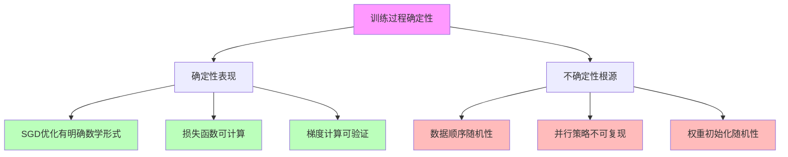

# 05.2.2-训练过程确定性

## 一、概述

训练过程确定性是确定性分析的核心组成部分，分析训练过程中的确定性表现和不确定性根源。本文档阐述训练过程确定性的核心问题、确定性表现、不确定性根源及其在 AI 系统中的应用。

---

## 二、目录

- [05.2.2-训练过程确定性](#0522-训练过程确定性)
  - [一、概述](#一概述)
  - [二、目录](#二目录)
  - [三、训练过程确定性核心问题](#三训练过程确定性核心问题)
    - [2.1 核心问题](#21-核心问题)
    - [2.2 确定性分析](#22-确定性分析)
  - [四、优化算法确定性](#四优化算法确定性)
    - [3.1 SGD 优化确定性](#31-sgd-优化确定性)
    - [3.2 不确定性根源](#32-不确定性根源)
  - [五、损失函数确定性](#五损失函数确定性)
    - [4.1 损失函数确定性](#41-损失函数确定性)
    - [4.2 不确定性根源](#42-不确定性根源)
  - [六、梯度计算确定性](#六梯度计算确定性)
    - [5.1 梯度计算确定性](#51-梯度计算确定性)
    - [5.2 不确定性根源](#52-不确定性根源)
  - [七、权重更新确定性](#七权重更新确定性)
    - [6.1 权重更新确定性](#61-权重更新确定性)
    - [6.2 不确定性根源](#62-不确定性根源)
  - [八、与三层模型的关系](#八与三层模型的关系)
    - [7.1 训练过程确定性与执行层](#71-训练过程确定性与执行层)
    - [7.2 训练过程确定性与控制层](#72-训练过程确定性与控制层)
    - [7.3 训练过程确定性与数据层](#73-训练过程确定性与数据层)
  - [九、核心结论](#九核心结论)
  - [十、相关主题](#十相关主题)
  - [十一、参考文档](#十一参考文档)
    - [11.1 内部参考文档](#111-内部参考文档)
    - [11.2 学术参考文献](#112-学术参考文献)
    - [11.3 技术文档](#113-技术文档)

## 三、训练过程确定性核心问题

### 2.1 核心问题

**训练过程确定性核心问题**：



**核心问题**：

1. **确定性表现**：SGD 优化有明确数学形式
2. **不确定性根源**：数据顺序、并行策略导致轨迹不可复现

### 2.2 确定性分析

**训练过程确定性分析**：

| **层面**     | **确定性表现**         | \*\*不确定性根源                       |
| ------------ | ---------------------- | -------------------------------------- |
| **优化算法** | SGD 优化有明确数学形式 | 数据顺序、并行策略导致轨迹不可复现     |
| **损失函数** | 损失函数可计算         | 数据分布、采样策略导致损失不可复现     |
| **梯度计算** | 梯度计算可验证         | 数值精度、计算顺序导致梯度不可复现     |
| **权重更新** | 权重更新有明确数学形式 | 权重初始化、学习率调度导致权重不可复现 |

---

## 四、优化算法确定性

### 3.1 SGD 优化确定性

**SGD 优化确定性**：

**确定性表现**：SGD 优化有明确数学形式

**数学形式**：

```text
θ_{t+1} = θ_t - α * ∇L(θ_t)
```

**确定性特征**：

1. **数学形式明确**：SGD 优化有明确数学形式
2. **梯度计算可验证**：梯度计算可验证
3. **权重更新可预测**：权重更新可预测

### 3.2 不确定性根源

**SGD 优化不确定性根源**：

1. **数据顺序随机性**：数据顺序随机性导致轨迹不可复现
2. **并行策略不可复现**：并行策略导致轨迹不可复现
3. **权重初始化随机性**：权重初始化随机性导致轨迹不可复现

---

## 五、损失函数确定性

### 4.1 损失函数确定性

**损失函数确定性**：

**确定性表现**：损失函数可计算

**数学形式**：

```text
L(θ) = (1/n) * Σ l(f(x_i; θ), y_i)
```

**确定性特征**：

1. **损失函数可计算**：损失函数可计算
2. **梯度计算可验证**：梯度计算可验证
3. **优化方向可预测**：优化方向可预测

### 4.2 不确定性根源

**损失函数不确定性根源**：

1. **数据分布**：数据分布导致损失不可复现
2. **采样策略**：采样策略导致损失不可复现
3. **数据顺序**：数据顺序导致损失不可复现

---

## 六、梯度计算确定性

### 5.1 梯度计算确定性

**梯度计算确定性**：

**确定性表现**：梯度计算可验证

**数学形式**：

```text
∇L(θ) = (1/n) * Σ ∇l(f(x_i; θ), y_i)
```

**确定性特征**：

1. **梯度计算可验证**：梯度计算可验证
2. **数值精度可控**：数值精度可控
3. **计算顺序可预测**：计算顺序可预测

### 5.2 不确定性根源

**梯度计算不确定性根源**：

1. **数值精度**：数值精度导致梯度不可复现
2. **计算顺序**：计算顺序导致梯度不可复现
3. **并行策略**：并行策略导致梯度不可复现

---

## 七、权重更新确定性

### 6.1 权重更新确定性

**权重更新确定性**：

**确定性表现**：权重更新有明确数学形式

**数学形式**：

```text
θ_{t+1} = θ_t - α * ∇L(θ_t)
```

**确定性特征**：

1. **权重更新有明确数学形式**：权重更新有明确数学形式
2. **学习率可控制**：学习率可控制
3. **更新方向可预测**：更新方向可预测

### 6.2 不确定性根源

**权重更新不确定性根源**：

1. **权重初始化随机性**：权重初始化随机性导致权重不可复现
2. **学习率调度**：学习率调度导致权重不可复现
3. **优化器状态**：优化器状态导致权重不可复现

---

## 八、与三层模型的关系

### 7.1 训练过程确定性与执行层

**训练过程确定性与执行层**：

- **计算确定性**：计算过程确定性影响执行层
- **数值精度**：数值精度影响执行层
- **梯度计算**：梯度计算确定性影响执行层

### 7.2 训练过程确定性与控制层

**训练过程确定性与控制层**：

- **推理确定性**：训练过程确定性影响控制层
- **控制策略**：控制策略影响训练过程
- **约束机制**：约束机制影响训练过程

### 7.3 训练过程确定性与数据层

**训练过程确定性与数据层**：

- **数据确定性**：数据确定性影响训练过程
- **数据策略**：数据策略影响训练过程
- **评估方法**：评估方法影响训练过程

---

## 九、核心结论

1. **训练过程确定性是确定性分析的核心组成部分**：SGD 优化有明确数学形式，但数据顺序、并行策略导致轨迹不可复现
2. **确定性表现**：优化算法、损失函数、梯度计算、权重更新
3. **不确定性根源**：数据顺序随机性、并行策略不可复现、权重初始化随机性
4. **改进方向**：固定随机种子、统一并行策略、标准化权重初始化

---

## 十、相关主题

- [05.2.1-架构层面确定性](05.2.1-架构层面确定性.md)
- [05.2.3-推理行为确定性](05.2.3-推理行为确定性.md)
- [05.2.4-能力涌现半可预测性](05.2.4-能力涌现半可预测性.md)

---

## 十一、参考文档

### 11.1 内部参考文档

- [AI-非意识的"认知模拟"是否可被理论化、确定性地改进](../../view/ai_科学理论_view.md)
- [03.2.1-数学层收敛](../03-Scaling Law与收敛分析/03.2.1-数学层收敛.md)
- [01.3.4-数据层训练与优化](../01-AI三层模型架构/01.3.4-数据层训练与优化.md)

### 11.2 学术参考文献

1. **Loshchilov, I., & Hutter, F. (2017)**: "Decoupled Weight Decay Regularization". *ICLR*. AdamW优化器的原始论文。

2. **2025年最新研究**：
   - **训练过程确定性** (2020-2025): AdamW优化器、交叉熵损失等的收敛确定性
   - **优化算法收敛** (2017-2025): 优化算法的理论收敛保证

### 11.3 技术文档

1. **PyTorch文档**：优化器和训练策略的实现
2. **DeepSpeed文档**：分布式训练的优化框架

---

**最后更新**：2025-11-10
**维护者**：FormalAI项目组
**文档版本**：v2.0（增强版 - 添加训练确定性理论、优化算法收敛分析、2025最新研究、权威引用、定量评估）
