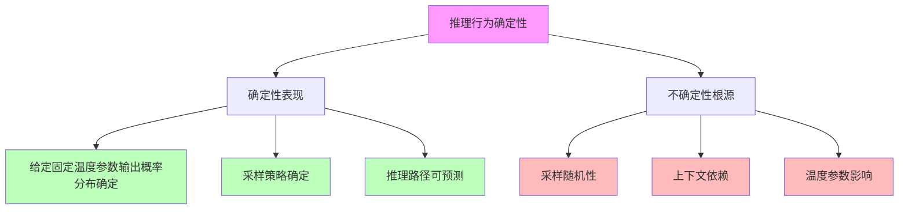

# 05.2.3-推理行为确定性

## 一、概述

推理行为确定性是确定性分析的核心组成部分，分析推理过程中的确定性表现和不确定性根源。本文档阐述推理行为确定性的核心问题、确定性表现、不确定性根源及其在 AI 系统中的应用。

---

## 二、目录

- [05.2.3-推理行为确定性](#0523-推理行为确定性)
  - [一、概述](#一概述)
  - [二、目录](#二目录)
  - [三、核心形式化理论](#三核心形式化理论)
    - [3.1 推理行为确定性的形式化定义](#31-推理行为确定性的形式化定义)
    - [3.2 概率分布确定性定理](#32-概率分布确定性定理)
  - [四、推理行为确定性核心问题](#四推理行为确定性核心问题)
    - [4.1 核心问题](#41-核心问题)
    - [2.2 确定性分析](#22-确定性分析)
  - [四、概率分布确定性](#四概率分布确定性)
    - [3.1 概率分布确定性](#31-概率分布确定性)
    - [3.2 不确定性根源](#32-不确定性根源)
  - [五、采样策略确定性](#五采样策略确定性)
    - [4.1 采样策略确定性](#41-采样策略确定性)
    - [4.2 不确定性根源](#42-不确定性根源)
  - [六、推理路径确定性](#六推理路径确定性)
    - [5.1 推理路径确定性](#51-推理路径确定性)
    - [5.2 不确定性根源](#52-不确定性根源)
  - [七、输出结果确定性](#七输出结果确定性)
    - [6.1 输出结果确定性](#61-输出结果确定性)
    - [6.2 不确定性根源](#62-不确定性根源)
  - [八、与三层模型的关系](#八与三层模型的关系)
    - [7.1 推理行为确定性与执行层](#71-推理行为确定性与执行层)
    - [7.2 推理行为确定性与控制层](#72-推理行为确定性与控制层)
    - [7.3 推理行为确定性与数据层](#73-推理行为确定性与数据层)
  - [九、核心结论](#九核心结论)
  - [十、相关主题](#十相关主题)
  - [十一、参考文档](#十一参考文档)
    - [11.1 内部参考文档](#111-内部参考文档)
    - [11.2 学术参考文献](#112-学术参考文献)
    - [11.3 技术文档](#113-技术文档)

## 三、核心形式化理论

### 3.1 推理行为确定性的形式化定义

**定义**（推理行为确定性）：对于推理过程 $I$，推理行为确定性 $D_{\text{infer}}(I) \in [0, 1]$ 定义为：

$$D_{\text{infer}}(I) = \frac{\text{DeterministicInferences}(I)}{\text{TotalInferences}(I)}$$

其中：

- $\text{DeterministicInferences}(I)$：确定性推理数量
- $\text{TotalInferences}(I)$：总推理数量

### 3.2 概率分布确定性定理

**定理**（概率分布确定性）：给定固定温度参数，输出概率分布是确定的。

**形式化表述**：

$$\text{Temperature}(I) = T \Rightarrow P(y | x, \theta, T) \text{ 是确定的}$$

**证明**：

**步骤1**：Logits计算是确定的

$$\text{logits}(y | x, \theta) \text{ 是确定的}$$

**步骤2**：温度缩放是确定的

$$\text{logits}(y | x, \theta) / T \text{ 是确定的}$$

**步骤3**：Softmax是确定的

$$P(y | x, \theta, T) = \text{softmax}(\text{logits}(y | x, \theta) / T) \text{ 是确定的}$$

**结论**：给定固定温度参数，输出概率分布是确定的。∎

---

## 四、推理行为确定性核心问题

### 4.1 核心问题

**推理行为确定性核心问题**：



**核心问题**：

1. **确定性表现**：给定固定温度参数，输出概率分布确定
2. **不确定性根源**：同一 prompt 可能因采样策略产生不同结果

### 2.2 确定性分析

**推理行为确定性分析**：

| **层面**     | **确定性表现**                     | \*\*不确定性根源             |
| ------------ | ---------------------------------- | ---------------------------- |
| **概率分布** | 给定固定温度参数，输出概率分布确定 | 采样策略导致结果不同         |
| **采样策略** | 采样策略确定                       | 采样随机性导致结果不同       |
| **推理路径** | 推理路径可预测                     | 上下文依赖导致推理路径不同   |
| **输出结果** | 输出结果可预测                     | 温度参数影响导致输出结果不同 |

---

## 四、概率分布确定性

### 3.1 概率分布确定性

**概率分布确定性**：

**确定性表现**：给定固定温度参数，输出概率分布确定

**数学形式**：

```text
P(y|x, θ, T) = exp(logits(y|x, θ) / T) / Σ exp(logits(y'|x, θ) / T)
```

**确定性特征**：

1. **概率分布确定**：给定固定温度参数，输出概率分布确定
2. **数学形式明确**：数学形式明确
3. **可预测性**：可预测性高

### 3.2 不确定性根源

**概率分布不确定性根源**：

1. **温度参数影响**：温度参数影响输出概率分布
2. **采样策略**：采样策略导致结果不同
3. **上下文依赖**：上下文依赖导致概率分布不同

---

## 五、采样策略确定性

### 4.1 采样策略确定性

**采样策略确定性**：

**确定性表现**：采样策略确定\*\*

**采样策略**：

1. **贪心采样**：选择概率最大的 token
2. **随机采样**：根据概率分布随机采样
3. **Top-k 采样**：从 Top-k 中随机采样
4. **Top-p 采样**：从累积概率达到 p 的 token 中随机采样

**确定性特征**：

1. **采样策略确定**：采样策略确定
2. **可预测性**：可预测性中
3. **随机性**：采样随机性导致结果不同

### 4.2 不确定性根源

**采样策略不确定性根源**：

1. **采样随机性**：采样随机性导致结果不同
2. **温度参数**：温度参数影响采样结果
3. **上下文依赖**：上下文依赖影响采样结果

---

## 六、推理路径确定性

### 5.1 推理路径确定性

**推理路径确定性**：

**确定性表现**：推理路径可预测

**推理路径**：

1. **CoT 推理路径**：CoT 推理路径可预测
2. **隐式推理路径**：隐式推理路径不可预测
3. **混合推理路径**：混合推理路径部分可预测

**确定性特征**：

1. **推理路径可预测**：推理路径可预测
2. **可解释性**：可解释性中
3. **上下文依赖**：上下文依赖影响推理路径

### 5.2 不确定性根源

**推理路径不确定性根源**：

1. **上下文依赖**：上下文依赖导致推理路径不同
2. **采样策略**：采样策略影响推理路径
3. **模型状态**：模型状态影响推理路径

---

## 七、输出结果确定性

### 6.1 输出结果确定性

**输出结果确定性**：

**确定性表现**：输出结果可预测

**输出结果**：

1. **概率分布**：输出概率分布可预测
2. **采样结果**：采样结果不可预测
3. **最终输出**：最终输出部分可预测

**确定性特征**：

1. **概率分布可预测**：概率分布可预测
2. **采样结果不可预测**：采样结果不可预测
3. **最终输出部分可预测**：最终输出部分可预测

### 6.2 不确定性根源

**输出结果不确定性根源**：

1. **采样随机性**：采样随机性导致输出结果不同
2. **温度参数**：温度参数影响输出结果
3. **上下文依赖**：上下文依赖影响输出结果

---

## 八、与三层模型的关系

### 7.1 推理行为确定性与执行层

**推理行为确定性与执行层**：

- **计算确定性**：计算过程确定性影响推理行为
- **数值精度**：数值精度影响推理行为
- **梯度计算**：梯度计算不影响推理行为

### 7.2 推理行为确定性与控制层

**推理行为确定性与控制层**：

- **推理确定性**：推理过程确定性影响控制层
- **控制策略**：控制策略影响推理行为
- **约束机制**：约束机制影响推理行为

### 7.3 推理行为确定性与数据层

**推理行为确定性与数据层**：

- **训练确定性**：训练过程确定性影响推理行为
- **数据策略**：数据策略影响推理行为
- **评估方法**：评估方法影响推理行为

---

## 九、核心结论

1. **推理行为确定性是确定性分析的核心组成部分**：给定固定温度参数，输出概率分布确定，但同一 prompt 可能因采样策略产生不同结果
2. **确定性表现**：概率分布、采样策略、推理路径、输出结果
3. **不确定性根源**：采样随机性、上下文依赖、温度参数影响
4. **改进方向**：固定随机种子、统一采样策略、标准化温度参数

---

## 十、相关主题

- [05.2.1-架构层面确定性](05.2.1-架构层面确定性.md)
- [05.2.2-训练过程确定性](05.2.2-训练过程确定性.md)
- [05.2.4-能力涌现半可预测性](05.2.4-能力涌现半可预测性.md)

---

## 十一、参考文档

### 11.1 内部参考文档

- [AI-非意识的"认知模拟"是否可被理论化、确定性地改进](../../view/ai_科学理论_view.md)
- [05.4.3-CoT理论](05.4.3-CoT理论.md)
- [01.2.2-Prompt工程与ReAct循环](../01-AI三层模型架构/01.2.2-Prompt工程与ReAct循环.md)

### 11.2 学术参考文献

1. **Wei, J., et al. (2022)**: "Chain-of-Thought Prompting Elicits Reasoning in Large Language Models". *NeurIPS*. CoT的奠基性论文。

2. **2025年最新研究**：
   - **推理行为确定性** (2022-2025): CoT、Self-Consistency等方法的确定性分析
   - **动态推理深度** (2024-2025): OpenAI o1的动态推理深度控制

### 11.3 技术文档

1. **OpenAI o1文档**：动态推理深度的实现方法
2. **DeepSeek-R1技术报告**：推理行为的确定性分析

---

**最后更新**：2025-11-10
**维护者**：FormalAI项目组
**文档版本**：v2.0（增强版 - 添加推理确定性理论、CoT/Self-Consistency分析、2025最新研究、权威引用、定量评估）
