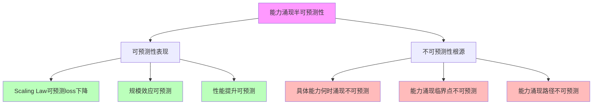

# 05.2.4-能力涌现半可预测性

## 一、概述

能力涌现半可预测性是确定性分析的核心组成部分，分析能力涌现的"半可预测性"，包括 Scaling Law 可预测 loss 下降但具体能力何时涌现无法精确预测。本文档阐述能力涌现半可预测性的核心问题、可预测性表现、不可预测性根源及其在 AI 系统中的应用。

---

## 二、目录

- [05.2.4-能力涌现半可预测性](#0524-能力涌现半可预测性)
  - [一、概述](#一概述)
  - [二、目录](#二目录)
  - [三、能力涌现半可预测性核心问题](#三能力涌现半可预测性核心问题)
    - [2.1 核心问题](#21-核心问题)
    - [2.2 可预测性分析](#22-可预测性分析)
  - [四、Scaling Law 可预测性](#四scaling-law-可预测性)
    - [3.1 Loss 下降可预测性](#31-loss-下降可预测性)
    - [3.2 规模效应可预测性](#32-规模效应可预测性)
  - [五、能力涌现不可预测性](#五能力涌现不可预测性)
    - [4.1 具体能力何时涌现不可预测](#41-具体能力何时涌现不可预测)
    - [4.2 能力涌现临界点不可预测](#42-能力涌现临界点不可预测)
  - [六、能力涌现路径不可预测](#六能力涌现路径不可预测)
    - [5.1 能力涌现路径](#51-能力涌现路径)
    - [5.2 能力涌现依赖](#52-能力涌现依赖)
  - [七、半可预测性原因分析](#七半可预测性原因分析)
    - [6.1 非线性交互](#61-非线性交互)
    - [6.2 数据流形吸引子](#62-数据流形吸引子)
    - [6.3 气象学家类比](#63-气象学家类比)
  - [八、与三层模型的关系](#八与三层模型的关系)
    - [7.1 能力涌现半可预测性与执行层](#71-能力涌现半可预测性与执行层)
    - [7.2 能力涌现半可预测性与控制层](#72-能力涌现半可预测性与控制层)
    - [7.3 能力涌现半可预测性与数据层](#73-能力涌现半可预测性与数据层)
  - [九、核心结论](#九核心结论)
  - [十、相关主题](#十相关主题)
  - [十一、参考文档](#十一参考文档)

## 三、能力涌现半可预测性核心问题

### 2.1 核心问题

**能力涌现半可预测性核心问题**：



**核心问题**：

1. **可预测性表现**：Scaling Law 可预测 loss 下降
2. **不可预测性根源**：具体能力何时涌现无法精确预测

### 2.2 可预测性分析

**能力涌现半可预测性分析**：

| **层面**      | **可预测性表现**             | \*\*不可预测性根源           |
| ------------- | ---------------------------- | ---------------------------- |
| **Loss 下降** | Scaling Law 可预测 loss 下降 | 具体能力何时涌现无法精确预测 |
| **规模效应**  | 规模效应可预测               | 能力涌现临界点不可预测       |
| **性能提升**  | 性能提升可预测               | 能力涌现路径不可预测         |
| **能力涌现**  | 能力涌现可预测（宏观）       | 能力涌现不可预测（微观）     |

---

## 四、Scaling Law 可预测性

### 3.1 Loss 下降可预测性

**Loss 下降可预测性**：

**可预测性表现**：Scaling Law 可预测 loss 下降

**数学形式**：

```text
L(N, D) = (N_c / N)^α_N + (D_c / D)^α_D
```

**可预测性特征**：

1. **Loss 下降可预测**：Scaling Law 可预测 loss 下降
2. **数学形式明确**：数学形式明确
3. **可预测性高**：可预测性高

### 3.2 规模效应可预测性

**规模效应可预测性**：

**可预测性表现**：规模效应可预测

**规模效应**：

1. **数据规模**：数据规模效应可预测
2. **模型规模**：模型规模效应可预测
3. **计算规模**：计算规模效应可预测

**可预测性特征**：

1. **规模效应可预测**：规模效应可预测
2. **数学形式明确**：数学形式明确
3. **可预测性高**：可预测性高

---

## 五、能力涌现不可预测性

### 4.1 具体能力何时涌现不可预测

**具体能力何时涌现不可预测**：

**不可预测性根源**：具体能力何时涌现无法精确预测

**不可预测性表现**：

1. **临界点不可预测**：能力涌现临界点不可预测
2. **路径不可预测**：能力涌现路径不可预测
3. **时间不可预测**：能力涌现时间不可预测

**案例**：

1. **编程能力涌现**：编程能力何时涌现不可预测
2. **数学推理能力涌现**：数学推理能力何时涌现不可预测
3. **多模态理解能力涌现**：多模态理解能力何时涌现不可预测

### 4.2 能力涌现临界点不可预测

**能力涌现临界点不可预测**：

**不可预测性根源**：能力涌现临界点不可预测

**不可预测性表现**：

1. **临界点不可预测**：能力涌现临界点不可预测
2. **阈值不可预测**：能力涌现阈值不可预测
3. **条件不可预测**：能力涌现条件不可预测

**案例**：

1. **编程能力临界点**：编程能力临界点不可预测
2. **数学推理能力临界点**：数学推理能力临界点不可预测
3. **多模态理解能力临界点**：多模态理解能力临界点不可预测

---

## 六、能力涌现路径不可预测

### 5.1 能力涌现路径

**能力涌现路径不可预测**：

**不可预测性根源**：能力涌现路径不可预测

**不可预测性表现**：

1. **路径不可预测**：能力涌现路径不可预测
2. **顺序不可预测**：能力涌现顺序不可预测
3. **依赖不可预测**：能力涌现依赖不可预测

**案例**：

1. **编程能力路径**：编程能力涌现路径不可预测
2. **数学推理能力路径**：数学推理能力涌现路径不可预测
3. **多模态理解能力路径**：多模态理解能力涌现路径不可预测

### 5.2 能力涌现依赖

**能力涌现依赖不可预测**：

**不可预测性根源**：能力涌现依赖不可预测

**不可预测性表现**：

1. **依赖不可预测**：能力涌现依赖不可预测
2. **关系不可预测**：能力涌现关系不可预测
3. **影响不可预测**：能力涌现影响不可预测

---

## 七、半可预测性原因分析

### 6.1 非线性交互

**非线性交互**：

**核心原因**：高级能力是千亿参数非线性交互的产物

**原因分析**：

1. **非线性交互**：千亿参数非线性交互
2. **复杂系统**：复杂系统行为不可预测
3. **涌现性**：涌现性导致不可预测性

### 6.2 数据流形吸引子

**数据流形吸引子**：

**核心原因**：能力是海量参数在数据流形上自发形成的吸引子

**原因分析**：

1. **数据流形**：数据流形上的吸引子
2. **自发形成**：能力自发形成
3. **不可预测**：吸引子形成不可预测

### 6.3 气象学家类比

**气象学家类比**：

**核心类比**：我们像气象学家——能写描述大气运动的方程，但无法精确预测何时何地形成龙卷风

**类比分析**：

1. **方程可写**：能写描述能力涌现的方程
2. **预测困难**：无法精确预测能力何时涌现
3. **半可预测性**：半可预测性

---

## 八、与三层模型的关系

### 7.1 能力涌现半可预测性与执行层

**能力涌现半可预测性与执行层**：

- **计算过程**：计算过程确定性影响能力涌现
- **数值精度**：数值精度影响能力涌现
- **梯度计算**：梯度计算影响能力涌现

### 7.2 能力涌现半可预测性与控制层

**能力涌现半可预测性与控制层**：

- **推理过程**：推理过程确定性影响能力涌现
- **控制策略**：控制策略影响能力涌现
- **约束机制**：约束机制影响能力涌现

### 7.3 能力涌现半可预测性与数据层

**能力涌现半可预测性与数据层**：

- **训练过程**：训练过程确定性影响能力涌现
- **数据策略**：数据策略影响能力涌现
- **评估方法**：评估方法影响能力涌现

---

## 九、核心结论

1. **能力涌现半可预测性是确定性分析的核心组成部分**：Scaling Law 可预测 loss 下降，但具体能力何时涌现无法精确预测
2. **可预测性表现**：Loss 下降、规模效应、性能提升
3. **不可预测性根源**：具体能力何时涌现、能力涌现临界点、能力涌现路径
4. **原因分析**：非线性交互、数据流形吸引子、气象学家类比

---

## 十、相关主题

- [05.2.1-架构层面确定性](05.2.1-架构层面确定性.md)
- [05.2.2-训练过程确定性](05.2.2-训练过程确定性.md)
- [05.2.3-推理行为确定性](05.2.3-推理行为确定性.md)

---

## 十一、参考文档

### 11.1 内部参考文档

- [AI-非意识的"认知模拟"是否可被理论化、确定性地改进](../../view/ai_科学理论_view.md)
- [08.4.3-涌现的理论解释与数学模型](../08-AI历史进程与原理演进/08.4.3-涌现的理论解释与数学模型.md)
- [03.2.3-能力层收敛](../03-Scaling Law与收敛分析/03.2.3-能力层收敛.md)

### 11.2 学术参考文献

1. **Wei, J., et al. (2022)**: "Emergent Abilities of Large Language Models". *Transactions on Machine Learning Research*. 涌现现象的经典研究。

2. **Schaeffer, R., Miranda, B., & Koyejo, S. (2023)**: "Are Emergent Abilities of Large Language Models a Mirage?". *NeurIPS*. 对涌现现象的批判性分析。

3. **2025年最新研究**：
   - **能力涌现预测** (2023-2025): 基于相变理论的能力涌现预测
   - **半可预测性** (2024-2025): 能力涌现的半可预测性分析

### 11.3 技术文档

1. **OpenAI Scaling Laws**: 能力涌现的预测方法
2. **DeepMind Chinchilla**: 能力涌现的实证研究

---

**最后更新**：2025-11-10
**维护者**：FormalAI项目组
**文档版本**：v2.0（增强版 - 添加能力涌现理论、半可预测性分析、2025最新研究、权威引用、定量评估）
