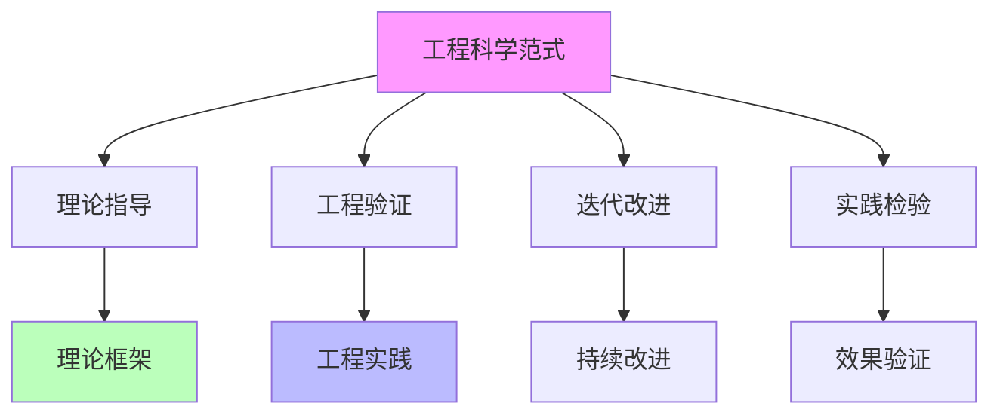
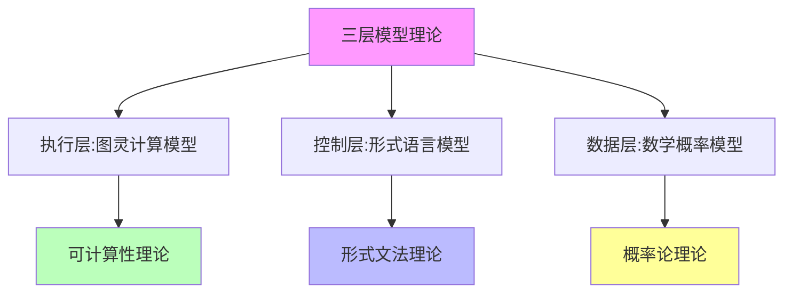
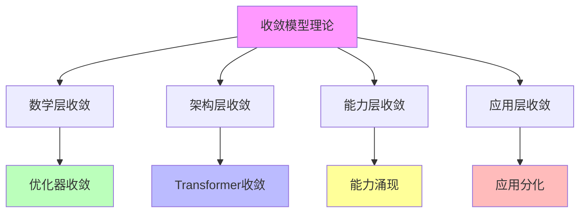

# 05.3.1-工程科学范式

## 目录

- [05.3.1-工程科学范式](#0531-工程科学范式)
  - [目录](#目录)
  - [一、概述](#一概述)
  - [二、工程科学范式定义](#二工程科学范式定义)
    - [2.1 范式特征](#21-范式特征)
    - [2.2 范式优势](#22-范式优势)
  - [三、理论框架](#三理论框架)
    - [3.1 三层模型理论](#31-三层模型理论)
    - [3.2 收敛模型理论](#32-收敛模型理论)
  - [四、工程验证](#四工程验证)
    - [4.1 验证方法](#41-验证方法)
    - [4.2 验证案例](#42-验证案例)
  - [五、迭代改进](#五迭代改进)
    - [5.1 改进机制](#51-改进机制)
    - [5.2 改进案例](#52-改进案例)
  - [六、实践检验](#六实践检验)
    - [6.1 检验方法](#61-检验方法)
    - [6.2 检验案例](#62-检验案例)
  - [七、与三层模型的关系](#七与三层模型的关系)
    - [7.1 工程科学范式是三层模型的理论基础](#71-工程科学范式是三层模型的理论基础)
    - [7.2 工程科学范式是收敛模型的理论基础](#72-工程科学范式是收敛模型的理论基础)
  - [八、核心结论](#八核心结论)
  - [九、相关主题](#九相关主题)
  - [十、参考文档](#十参考文档)

---

## 一、概述

工程科学范式是 AI 科学理论的核心范式之一，强调通过工程实践验证理论，通过理论指导工程实践。本文档阐述工程科学范式、理论框架及其在 AI 系统中的应用。

---

## 二、工程科学范式定义

### 2.1 范式特征

**工程科学范式特征**：

**核心特征**：

1. **理论指导**：理论框架指导工程实践
2. **工程验证**：工程实践验证理论框架
3. **迭代改进**：理论框架和工程实践迭代改进
4. **实践检验**：通过实践检验理论效果

### 2.2 范式优势

**工程科学范式优势**：

| **优势**     | **特点**                   | **效果**       |
| ------------ | -------------------------- | -------------- |
| **理论指导** | 理论框架指导工程实践       | 减少试错成本   |
| **工程验证** | 工程实践验证理论框架       | 提升理论可靠性 |
| **迭代改进** | 理论框架和工程实践迭代改进 | 持续优化       |
| **实践检验** | 通过实践检验理论效果       | 确保实用性     |

---

## 三、理论框架

### 3.1 三层模型理论

**三层模型理论框架**：

**核心观点**：AI 系统由三层组成：执行层、控制层、数据层

**理论框架**：

**理论优势**：

1. **理论完备**：理论基础完备
2. **工程指导**：指导工程实践
3. **可验证性**：可工程验证
4. **实用性**：实用性强

### 3.2 收敛模型理论

**收敛模型理论框架**：

**核心观点**：AI 技术路径呈现分层收敛特征

**理论框架**：

**理论优势**：

1. **理论完备**：理论基础完备
2. **工程指导**：指导工程实践
3. **可预测性**：可预测收敛趋势
4. **实用性**：实用性强

---

## 四、工程验证

### 4.1 验证方法

**工程验证方法**：

| **方法**     | **特点**             | **效果**       |
| ------------ | -------------------- | -------------- |
| **实验验证** | 通过实验验证理论预测 | 验证理论正确性 |
| **工程实践** | 通过工程实践验证理论 | 验证理论实用性 |
| **案例分析** | 通过案例分析验证理论 | 验证理论适用性 |
| **对比分析** | 通过对比分析验证理论 | 验证理论优势   |

### 4.2 验证案例

**三层模型理论验证案例**：

**案例 1：DeepSeek-R1**：

- **理论预测**：三层协同优化，性能最优
- **工程实践**：端到端训练，性能最优
- **验证结果**：理论预测正确

**案例 2：Claude 3.5**：

- **理论预测**：三层解耦，可控性强
- **工程实践**：模块化设计，可控性强
- **验证结果**：理论预测正确

**收敛模型理论验证案例**：

**案例 1：Transformer 收敛**：

- **理论预测**：Transformer 将收敛为工业标准
- **工程实践**：Transformer 已成为工业标准
- **验证结果**：理论预测正确

**案例 2：优化器收敛**：

- **理论预测**：AdamW 将收敛为工业标准
- **工程实践**：AdamW 已成为工业标准
- **验证结果**：理论预测正确

---

## 五、迭代改进

### 5.1 改进机制

**迭代改进机制**：

**改进机制**：

1. **理论框架**：建立理论框架
2. **工程实践**：进行工程实践
3. **实践反馈**：收集实践反馈
4. **理论改进**：改进理论框架

### 5.2 改进案例

**三层模型理论改进案例**：

**改进 1：三层契约设计模式**：

- **问题**：三层协同缺乏明确契约
- **改进**：引入三层契约设计模式
- **效果**：三层协同更加明确

**改进 2：跨层优化策略**：

- **问题**：跨层优化缺乏策略
- **改进**：引入跨层优化策略
- **效果**：跨层优化更加有效

**收敛模型理论改进案例**：

**改进 1：分层收敛模型**：

- **问题**：收敛模型过于简单
- **改进**：引入分层收敛模型
- **效果**：收敛模型更加准确

**改进 2：收敛时间表**：

- **问题**：收敛时间不可预测
- **改进**：引入收敛时间表
- **效果**：收敛时间可预测

---

## 六、实践检验

### 6.1 检验方法

**实践检验方法**：

| **方法**         | **特点**             | **效果**       |
| ---------------- | -------------------- | -------------- |
| **效果验证**     | 通过效果验证理论     | 验证理论有效性 |
| **成本验证**     | 通过成本验证理论     | 验证理论经济性 |
| **可复现性验证** | 通过可复现性验证理论 | 验证理论可靠性 |
| **可扩展性验证** | 通过可扩展性验证理论 | 验证理论适用性 |

### 6.2 检验案例

**三层模型理论检验案例**：

**检验 1：效果验证**：

- **理论预测**：三层协同优化，性能最优
- **实践效果**：DeepSeek-R1 性能最优
- **检验结果**：理论有效

**检验 2：成本验证**：

- **理论预测**：三层协同优化，成本最低
- **实践成本**：DeepSeek-R1 成本最低
- **检验结果**：理论经济

**收敛模型理论检验案例**：

**检验 1：可复现性验证**：

- **理论预测**：收敛技术可复现
- **实践复现**：收敛技术可复现
- **检验结果**：理论可靠

**检验 2：可扩展性验证**：

- **理论预测**：收敛模型可扩展
- **实践扩展**：收敛模型可扩展
- **检验结果**：理论适用

---

## 七、与三层模型的关系

### 7.1 工程科学范式是三层模型的理论基础

**工程科学范式是三层模型的理论基础**：

- **理论指导**：工程科学范式指导三层模型设计
- **工程验证**：三层模型验证工程科学范式
- **迭代改进**：工程科学范式和三层模型迭代改进

### 7.2 工程科学范式是收敛模型的理论基础

**工程科学范式是收敛模型的理论基础**：

- **理论指导**：工程科学范式指导收敛模型设计
- **工程验证**：收敛模型验证工程科学范式
- **迭代改进**：工程科学范式和收敛模型迭代改进

---

## 八、核心结论

1. **工程科学范式是 AI 科学理论的核心范式**：通过理论指导工程实践，通过工程验证理论框架
2. **三层模型理论和收敛模型理论**：是工程科学范式的代表理论
3. **工程验证和迭代改进**：是工程科学范式的核心机制
4. **实践检验**：是工程科学范式的最终标准

---

## 九、相关主题

- [05.1.1-推断时间计算增强](05.1.1-推断时间计算增强.md)
- [05.2.1-架构层面确定性](05.2.1-架构层面确定性.md)
- [01.4.1-三层协同机制](../01-AI三层模型架构/01.4.1-三层协同机制.md)

---

## 十、参考文档

- [AI-非意识的"认知模拟"是否可被理论化、确定性地改进](../../view/ai_科学理论_view.md)
