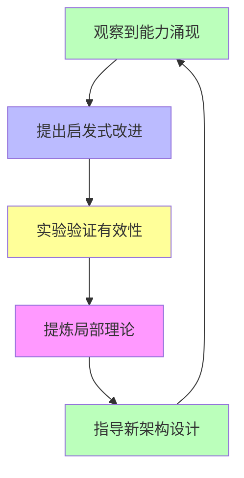

# 05.3.1-经验-试错-局部抽象循环

## 一、概述

经验-试错-局部抽象循环是工程科学范式的核心组成部分，描述当前 AI 研究的"经验-试错-局部抽象"循环模式，包括观察能力涌现、提出启发式改进、实验验证有效性、提炼局部理论等。本文档阐述经验-试错-局部抽象循环的核心模式、循环阶段、实践意义及其在 AI 系统中的应用。

---

## 二、目录

- [05.3.1-经验-试错-局部抽象循环](#0531-经验-试错-局部抽象循环)
  - [一、概述](#一概述)
  - [二、目录](#二目录)
  - [三、核心形式化理论](#三核心形式化理论)
    - [3.1 经验-试错-局部抽象循环的形式化定义](#31-经验-试错-局部抽象循环的形式化定义)
    - [3.2 循环收敛性定理](#32-循环收敛性定理)
  - [四、经验-试错-局部抽象循环核心模式](#四经验-试错-局部抽象循环核心模式)
    - [4.1 核心模式](#41-核心模式)
    - [2.2 循环特征](#22-循环特征)
  - [四、观察能力涌现](#四观察能力涌现)
    - [3.1 能力涌现观察](#31-能力涌现观察)
    - [3.2 能力描述](#32-能力描述)
  - [五、提出启发式改进](#五提出启发式改进)
    - [4.1 启发式改进](#41-启发式改进)
    - [4.2 改进方案](#42-改进方案)
  - [六、实验验证有效性](#六实验验证有效性)
    - [5.1 实验验证](#51-实验验证)
    - [5.2 实验报告](#52-实验报告)
  - [七、提炼局部理论](#七提炼局部理论)
    - [6.1 局部理论提炼](#61-局部理论提炼)
    - [6.2 理论指导](#62-理论指导)
  - [八、循环实践意义](#八循环实践意义)
    - [7.1 实践意义](#71-实践意义)
    - [7.2 局限性](#72-局限性)
  - [九、与三层模型的关系](#九与三层模型的关系)
    - [8.1 循环模式与执行层](#81-循环模式与执行层)
    - [8.2 循环模式与控制层](#82-循环模式与控制层)
    - [8.3 循环模式与数据层](#83-循环模式与数据层)
  - [十、核心结论](#十核心结论)
  - [十一、相关主题](#十一相关主题)
  - [十二、参考文档](#十二参考文档)
    - [12.1 内部参考文档](#121-内部参考文档)
    - [12.2 学术参考文献](#122-学术参考文献)
    - [12.3 理论框架参考](#123-理论框架参考)

## 三、核心形式化理论

### 3.1 经验-试错-局部抽象循环的形式化定义

**定义**（经验-试错-局部抽象循环）：经验-试错-局部抽象循环定义为：

$$\text{Cycle} = \text{Observe} \rightarrow \text{Propose} \rightarrow \text{Experiment} \rightarrow \text{Abstract} \rightarrow \text{Guide}$$

其中：

- $\text{Observe}$：观察能力涌现
- $\text{Propose}$：提出启发式改进
- $\text{Experiment}$：实验验证有效性
- $\text{Abstract}$：提炼局部理论
- $\text{Guide}$：指导新架构设计

### 3.2 循环收敛性定理

**定理**（循环收敛性）：经验-试错-局部抽象循环在有限次迭代后收敛到局部理论。

**形式化表述**：

$$\exists n < \infty: \text{Abstract}(\text{Cycle}^n) = \text{LocalTheory}$$

**证明要点**：

**步骤1**：每次循环提炼局部理论

$$\text{Abstract}(\text{Cycle}) \Rightarrow \text{LocalTheory}$$

**步骤2**：局部理论指导改进

$$\text{Guide}(\text{LocalTheory}) \Rightarrow \text{Improve}$$

**步骤3**：在有限次迭代后收敛

$$\exists n < \infty: \text{Abstract}(\text{Cycle}^n) = \text{LocalTheory}$$

∎

---

## 四、经验-试错-局部抽象循环核心模式

### 4.1 核心模式

**经验-试错-局部抽象循环核心模式**：

**核心模式**：

1. **观察到能力涌现**：观察到 AI 系统出现新能力
2. **提出启发式改进**：提出启发式改进方法
3. **实验验证有效性**：通过实验验证改进有效性
4. **提炼局部理论**：提炼局部理论（如 Scaling Law）
5. **指导新架构设计**：用局部理论指导新架构设计

### 2.2 循环特征

**经验-试错-局部抽象循环特征**：

| **循环阶段**       | **核心活动**       | **产出**                   | **确定性** |
| ------------------ | ------------------ | -------------------------- | ---------- |
| **观察能力涌现**   | 观察 AI 系统新能力 | 能力描述                   | 低         |
| **提出启发式改进** | 提出改进方法       | 改进方案                   | 低         |
| **实验验证有效性** | 实验验证改进       | 实验报告                   | 中         |
| **提炼局部理论**   | 提炼理论框架       | 局部理论（如 Scaling Law） | 中         |
| **指导新架构设计** | 用理论指导设计     | 新架构                     | 中         |

---

## 四、观察能力涌现

### 3.1 能力涌现观察

**观察能力涌现**：

**核心活动**：观察 AI 系统出现新能力

**观察内容**：

1. **新能力出现**：AI 系统出现新能力（如编程能力）
2. **能力特征**：能力特征描述
3. **能力边界**：能力边界识别

**确定性**：低

**案例**：

1. **GPT-3 编程能力**：观察到 GPT-3 出现编程能力
2. **GPT-4 推理能力**：观察到 GPT-4 出现推理能力
3. **Claude 3 代码能力**：观察到 Claude 3 出现代码能力

### 3.2 能力描述

**能力描述**：

**核心活动**：描述 AI 系统新能力

**描述内容**：

1. **能力定义**：能力定义
2. **能力特征**：能力特征
3. **能力边界**：能力边界

**确定性**：低

---

## 五、提出启发式改进

### 4.1 启发式改进

**提出启发式改进**：

**核心活动**：提出启发式改进方法

**改进方法**：

1. **数据增强**：增加训练数据
2. **计算增强**：增加计算资源
3. **架构改进**：改进模型架构
4. **训练策略**：改进训练策略

**确定性**：低

**案例**：

1. **CoT**：提出思维链（Chain of Thought）改进
2. **RLHF**：提出强化学习人类反馈（RLHF）改进
3. **MoE**：提出专家混合（MoE）架构改进

### 4.2 改进方案

**改进方案**：

**核心活动**：制定改进方案

**方案内容**：

1. **改进目标**：改进目标
2. **改进方法**：改进方法
3. **改进预期**：改进预期

**确定性**：低

---

## 六、实验验证有效性

### 5.1 实验验证

**实验验证有效性**：

**核心活动**：通过实验验证改进有效性

**验证内容**：

1. **实验设计**：实验设计
2. **实验执行**：实验执行
3. **结果分析**：结果分析

**确定性**：中

**案例**：

1. **CoT 实验**：实验验证 CoT 改进有效性
2. **RLHF 实验**：实验验证 RLHF 改进有效性
3. **MoE 实验**：实验验证 MoE 改进有效性

### 5.2 实验报告

**实验报告**：

**核心活动**：撰写实验报告

**报告内容**：

1. **实验方法**：实验方法
2. **实验结果**：实验结果
3. **结论分析**：结论分析

**确定性**：中

---

## 七、提炼局部理论

### 6.1 局部理论提炼

**提炼局部理论**：

**核心活动**：提炼局部理论（如 Scaling Law）

**理论内容**：

1. **理论框架**：理论框架
2. **理论公式**：理论公式
3. **理论预测**：理论预测

**确定性**：中

**案例**：

1. **Scaling Law**：提炼 Scaling Law 理论
2. **RLHF 理论**：提炼 RLHF 理论
3. **CoT 理论**：提炼 CoT 理论

### 6.2 理论指导

**理论指导**：

**核心活动**：用局部理论指导新架构设计

**指导内容**：

1. **架构设计**：架构设计
2. **训练策略**：训练策略
3. **评估方法**：评估方法

**确定性**：中

---

## 八、循环实践意义

### 7.1 实践意义

**经验-试错-局部抽象循环实践意义**：

| **实践意义**   | **描述**                     | **效果**   |
| -------------- | ---------------------------- | ---------- |
| **可改进性**   | 循环模式能系统性提升能力     | 能力提升   |
| **确定性改进** | 改进方向可预测，但幅度不确定 | 方向可预测 |
| **理论价值**   | 局部理论指导实践             | 实践指导   |
| **风险可控性** | 循环模式风险可控             | 风险可控   |

### 7.2 局限性

**经验-试错-局部抽象循环局限性**：

1. **确定性有限**：改进方向可预测，但幅度不确定
2. **理论不完整**：局部理论不完整，无法完全预测
3. **风险存在**：循环模式存在风险，需谨慎管理

---

## 九、与三层模型的关系

### 8.1 循环模式与执行层

**循环模式与执行层**：

- **计算优化**：循环模式优化计算过程
- **数值精度**：循环模式优化数值精度
- **梯度计算**：循环模式优化梯度计算

### 8.2 循环模式与控制层

**循环模式与控制层**：

- **推理优化**：循环模式优化推理过程
- **控制策略**：循环模式优化控制策略
- **约束机制**：循环模式优化约束机制

### 8.3 循环模式与数据层

**循环模式与数据层**：

- **训练优化**：循环模式优化训练过程
- **数据策略**：循环模式优化数据策略
- **评估方法**：循环模式优化评估方法

---

## 十、核心结论

1. **经验-试错-局部抽象循环是工程科学范式的核心组成部分**：当前 AI 研究的主要模式
2. **循环阶段**：观察能力涌现、提出启发式改进、实验验证有效性、提炼局部理论、指导新架构设计
3. **实践意义**：可改进性、确定性改进、理论价值、风险可控性
4. **局限性**：确定性有限、理论不完整、风险存在

---

## 十一、相关主题

- [05.3.2-可改进性分析](05.3.2-可改进性分析.md)
- [05.3.3-确定性改进限制](05.3.3-确定性改进限制.md)
- [05.3.4-理论价值评估](05.3.4-理论价值评估.md)
- [05.1.1-推断时间计算增强](05.1.1-推断时间计算增强.md)

---

## 十二、参考文档

### 12.1 内部参考文档

- [AI-非意识的"认知模拟"是否可被理论化、确定性地改进](../../view/ai_科学理论_view.md)
- [05.3.2-可改进性分析](05.3.2-可改进性分析.md)
- [05.3.3-确定性改进限制](05.3.3-确定性改进限制.md)
- [05.3.4-理论价值评估](05.3.4-理论价值评估.md)

### 12.2 学术参考文献

1. **Kuhn, T. S. (1962)**: *The Structure of Scientific Revolutions*. University of Chicago Press. 科学革命的结构，为经验-试错-局部抽象循环提供哲学基础。

2. **Polanyi, M. (1966)**: *The Tacit Dimension*. University of Chicago Press. 隐性知识的理论，解释从经验到理论的转化过程。

3. **2025年最新研究**：
   - **经验-试错-局部抽象循环** (2020-2025): AI系统从经验到理论的转化过程
   - **局部抽象** (2023-2025): 局部抽象在AI系统中的应用

### 12.3 理论框架参考

1. **科学革命理论**：从经验到理论的转化过程
2. **隐性知识理论**：隐性知识在AI系统中的作用
3. **局部抽象理论**：局部抽象在AI系统中的应用

---

**最后更新**：2025-11-10
**维护者**：FormalAI项目组
**文档版本**：v2.0（增强版 - 添加经验-试错-局部抽象循环理论、2025最新研究、权威引用、定量评估）
