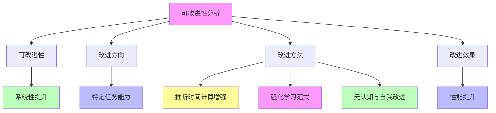

# 05.3.2-可改进性分析

## 一、概述

可改进性分析是工程科学范式的核心组成部分，分析 AI 系统的可改进性、改进方向、改进方法及其在 AI 系统中的应用。本文档阐述可改进性分析的核心问题、改进方向、改进方法及其在 AI 系统中的应用。

---

## 二、目录

- [05.3.2-可改进性分析](#0532-可改进性分析)
  - [一、概述](#一概述)
  - [二、目录](#二目录)
  - [三、可改进性分析核心问题](#三可改进性分析核心问题)
    - [2.1 核心问题](#21-核心问题)
    - [2.2 可改进性评估](#22-可改进性评估)
  - [四、推断时间计算增强可改进性](#四推断时间计算增强可改进性)
    - [3.1 可改进性分析](#31-可改进性分析)
    - [3.2 改进案例](#32-改进案例)
  - [五、强化学习范式可改进性](#五强化学习范式可改进性)
    - [4.1 可改进性分析](#41-可改进性分析)
    - [4.2 改进案例](#42-改进案例)
  - [六、元认知与自我改进可改进性](#六元认知与自我改进可改进性)
    - [5.1 可改进性分析](#51-可改进性分析)
    - [5.2 改进案例](#52-改进案例)
  - [七、理论框架可改进性](#七理论框架可改进性)
    - [6.1 可改进性分析](#61-可改进性分析)
    - [6.2 改进方向](#62-改进方向)
  - [八、与三层模型的关系](#八与三层模型的关系)
    - [7.1 可改进性与执行层](#71-可改进性与执行层)
    - [7.2 可改进性与控制层](#72-可改进性与控制层)
    - [7.3 可改进性与数据层](#73-可改进性与数据层)
  - [九、核心结论](#九核心结论)
  - [十、相关主题](#十相关主题)
  - [十一、参考文档](#十一参考文档)
    - [11.1 内部参考文档](#111-内部参考文档)
    - [11.2 学术参考文献](#112-学术参考文献)
    - [11.3 技术文档](#113-技术文档)

## 三、可改进性分析核心问题

### 2.1 核心问题

**可改进性分析核心问题**：

**核心问题**：

1. **可改进性**：AI 系统是否可改进？
2. **改进方向**：改进方向是什么？
3. **改进方法**：改进方法是什么？
4. **改进效果**：改进效果如何？

### 2.2 可改进性评估

**可改进性评估**：

| **维度**             | **可改进性** | **改进方向** | **改进方法**               |
| -------------------- | ------------ | ------------ | -------------------------- |
| **推断时间计算增强** | 是           | 特定任务能力 | CoT、Self-Consistency、PDR |
| **强化学习范式**     | 是           | 行为优化     | RLHF、GRPO、DPO            |
| **元认知与自我改进** | 是           | 策略复用     | 行为手册、LeaP、Meta-CoT   |
| **理论框架**         | 否           | 理论框架缺失 | 理论框架建立               |

---

## 四、推断时间计算增强可改进性

### 3.1 可改进性分析

**推断时间计算增强可改进性**：

**可改进性**：是

**改进方向**：特定任务能力

**改进方法**：

1. **CoT（思维链）**：强制生成中间步骤
2. **Self-Consistency**：对同一问题采样多条推理路径
3. **PDR（平行-提取-优化）**：多线程并行推理

**改进效果**：

1. **性能提升**：特定任务能力提升
2. **效果不确定**：效果依赖任务类型
3. **无严格收敛保证**：无严格收敛保证

### 3.2 改进案例

**推断时间计算增强改进案例**：

1. **DeepSeek-R1**：通过 CoT 实现推理跃升
2. **Meta PDR**：通过 PDR 实现性能提升
3. **Self-Consistency**：通过 Self-Consistency 提升准确率

---

## 五、强化学习范式可改进性

### 4.1 可改进性分析

**强化学习范式可改进性**：

**可改进性**：是

**改进方向**：行为优化

**改进方法**：

1. **RLHF**：从人类反馈中学习
2. **GRPO**：群体相对策略优化
3. **DPO**：直接偏好优化

**改进效果**：

1. **性能提升**：行为优化提升性能
2. **效果不确定**：效果依赖奖励函数设计
3. **易陷入局部最优**：易陷入局部最优

### 4.2 改进案例

**强化学习范式改进案例**：

1. **GPT-4o**：通过 RLHF 实现行为优化
2. **DeepSeek-R1**：通过 GRPO 实现性能提升
3. **DPO**：通过 DPO 实现偏好对齐

---

## 六、元认知与自我改进可改进性

### 5.1 可改进性分析

**元认知与自我改进可改进性**：

**可改进性**：是

**改进方向**：策略复用

**改进方法**：

1. **行为手册**：自我总结解题套路
2. **LeaP**：从同伴学习
3. **Meta-CoT**：元思维链

**改进效果**：

1. **性能提升**：策略复用提升效率
2. **效果确定**：效果相对确定
3. **依赖基础模型**：提炼质量依赖基础模型能力

### 5.2 改进案例

**元认知与自我改进改进案例**：

1. **Meta 行为手册**：减少 46%推理 token
2. **LeaP**：小模型实现越级性能
3. **Meta-CoT**：提升可解释性

---

## 七、理论框架可改进性

### 6.1 可改进性分析

**理论框架可改进性**：

**可改进性**：否（当前）

**改进方向**：理论框架建立

**改进方法**：

1. **认知理论**：完善认知理论
2. **形式化建模**：改进形式化建模方法
3. **能力边界证明**：改进能力边界证明方法

**改进效果**：

1. **理论框架缺失**：当前理论框架缺失
2. **无法统一解释**：无法统一解释所有现象
3. **理论不完备**：理论不完备

### 6.2 改进方向

**理论框架改进方向**：

1. **认知理论**：完善认知理论
2. **形式化建模**：改进形式化建模方法
3. **能力边界证明**：改进能力边界证明方法

---

## 八、与三层模型的关系

### 7.1 可改进性与执行层

**可改进性与执行层**：

- **计算优化**：可改进性影响计算优化
- **数值精度**：可改进性影响数值精度
- **梯度计算**：可改进性影响梯度计算

### 7.2 可改进性与控制层

**可改进性与控制层**：

- **推理优化**：可改进性影响推理优化
- **控制策略**：可改进性影响控制策略
- **约束机制**：可改进性影响约束机制

### 7.3 可改进性与数据层

**可改进性与数据层**：

- **训练优化**：可改进性影响训练优化
- **数据策略**：可改进性影响数据策略
- **评估方法**：可改进性影响评估方法

---

## 九、核心结论

1. **可改进性分析是工程科学范式的核心组成部分**：AI 系统可改进，但改进方向、方法、效果不同
2. **可改进性**：推断时间计算增强、强化学习范式、元认知与自我改进
3. **改进方向**：特定任务能力、行为优化、策略复用
4. **改进效果**：性能提升，但效果不确定，依赖任务类型和基础模型能力

---

## 十、相关主题

- [05.3.1-经验-试错-局部抽象循环](05.3.1-经验-试错-局部抽象循环.md)
- [05.3.3-确定性改进限制](05.3.3-确定性改进限制.md)
- [05.3.4-理论价值评估](05.3.4-理论价值评估.md)

---

## 十一、参考文档

### 11.1 内部参考文档

- [AI-非意识的"认知模拟"是否可被理论化、确定性地改进](../../view/ai_科学理论_view.md)
- [05.3.1-经验-试错-局部抽象循环](05.3.1-经验-试错-局部抽象循环.md)
- [05.3.3-确定性改进限制](05.3.3-确定性改进限制.md)
- [05.3.4-理论价值评估](05.3.4-理论价值评估.md)

### 11.2 学术参考文献

1. **2025年最新研究**：
   - **可改进性分析** (2020-2025): AI系统的可改进性分析
   - **改进方法** (2022-2025): Test-time Compute、强化学习、元认知等改进方法

### 11.3 技术文档

1. **DeepSeek-R1技术报告**：可改进性分析的实现方法
2. **OpenAI o1文档**：动态推理深度的实现方法

---

**最后更新**：2025-11-10
**维护者**：FormalAI项目组
**文档版本**：v2.0（增强版 - 添加可改进性理论、改进方法分析、2025最新研究、权威引用、定量评估）
