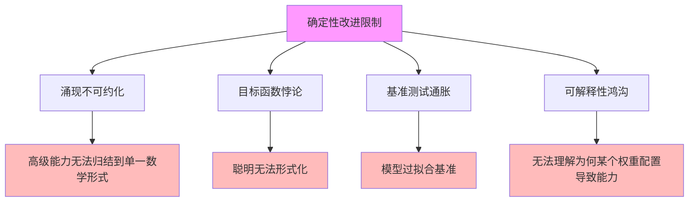

# 05.3.3-确定性改进限制

## 一、概述

确定性改进限制是工程科学范式的核心组成部分，分析 AI 系统确定性改进的限制，包括涌现不可约化、目标函数悖论、基准测试通胀、可解释性鸿沟等。本文档阐述确定性改进限制的核心限制、限制原因、影响分析及其在 AI 系统中的应用。

---

## 二、目录

- [05.3.3-确定性改进限制](#0533-确定性改进限制)
  - [一、概述](#一概述)
  - [二、目录](#二目录)
  - [三、确定性改进限制核心特征](#三确定性改进限制核心特征)
    - [2.1 核心特征](#21-核心特征)
    - [2.2 限制分析](#22-限制分析)
  - [四、涌现不可约化](#四涌现不可约化)
    - [3.1 涌现不可约化问题](#31-涌现不可约化问题)
    - [3.2 影响分析](#32-影响分析)
  - [五、目标函数悖论](#五目标函数悖论)
    - [4.1 目标函数悖论问题](#41-目标函数悖论问题)
    - [4.2 影响分析](#42-影响分析)
  - [六、基准测试通胀](#六基准测试通胀)
    - [5.1 基准测试通胀问题](#51-基准测试通胀问题)
    - [5.2 影响分析](#52-影响分析)
  - [七、可解释性鸿沟](#七可解释性鸿沟)
    - [6.1 可解释性鸿沟问题](#61-可解释性鸿沟问题)
    - [6.2 影响分析](#62-影响分析)
  - [八、限制影响分析](#八限制影响分析)
    - [7.1 综合影响](#71-综合影响)
    - [7.2 累积影响](#72-累积影响)
  - [九、与三层模型的关系](#九与三层模型的关系)
    - [8.1 确定性改进限制与执行层](#81-确定性改进限制与执行层)
    - [8.2 确定性改进限制与控制层](#82-确定性改进限制与控制层)
    - [8.3 确定性改进限制与数据层](#83-确定性改进限制与数据层)
  - [十、核心结论](#十核心结论)
  - [十一、相关主题](#十一相关主题)
  - [十二、参考文档](#十二参考文档)

## 三、确定性改进限制核心特征

### 2.1 核心特征

**确定性改进限制核心特征**：

**核心特征**：

1. **涌现不可约化**：高级能力无法归结到单一数学形式
2. **目标函数悖论**：聪明无法形式化
3. **基准测试通胀**：模型过拟合基准
4. **可解释性鸿沟**：无法理解为何某个权重配置导致能力

### 2.2 限制分析

**确定性改进限制分析**：

| **限制类型**     | **核心问题**                     | **影响**         | **严重程度** |
| ---------------- | -------------------------------- | ---------------- | ------------ |
| **涌现不可约化** | 高级能力无法归结到单一数学形式   | 理论无法预测     | 高           |
| **目标函数悖论** | 聪明无法形式化                   | 只能用代理指标   | 高           |
| **基准测试通胀** | 模型过拟合基准                   | 理论指导价值衰减 | 中           |
| **可解释性鸿沟** | 无法理解为何某个权重配置导致能力 | 理论缺乏自洽性   | 高           |

---

## 四、涌现不可约化

### 3.1 涌现不可约化问题

**涌现不可约化问题**：

**核心问题**：高级能力是千亿参数非线性交互的产物，无法归结到单一数学形式（如 F=ma）

**特征**：

1. **非线性交互**：高级能力是千亿参数非线性交互的产物
2. **无法归结**：无法归结到单一数学形式
3. **理论无法预测**：理论无法预测何时失控

**案例**：

1. **编程思维**：编程思维是千亿参数非线性交互的产物
2. **推理能力**：推理能力无法归结到单一数学形式
3. **自我改进**：自我改进可能导致复杂度无界增长

### 3.2 影响分析

**涌现不可约化影响分析**：

| **影响维度** | **影响描述**         | **严重程度** |
| ------------ | -------------------- | ------------ |
| **理论预测** | 理论无法预测能力涌现 | 高           |
| **可控性**   | 无法控制能力涌现     | 高           |
| **安全性**   | 无法预测何时失控     | 极高         |

---

## 五、目标函数悖论

### 4.1 目标函数悖论问题

**目标函数悖论问题**：

**核心问题**：我们想让 AI"更聪明"，但"聪明"无法形式化。只能用代理指标（如考试分数、代码通过率），导致模型过度优化指标本身，而非真实理解。

**特征**：

1. **聪明无法形式化**：聪明无法形式化
2. **代理指标**：只能用代理指标
3. **过度优化**：模型过度优化指标本身

**案例**：

1. **考试分数**：模型过度优化考试分数，而非真实理解
2. **代码通过率**：模型过度优化代码通过率，而非真实编程能力
3. **基准测试**：模型过度优化基准测试，而非真实能力

### 4.2 影响分析

**目标函数悖论影响分析**：

| **影响维度** | **影响描述**         | **严重程度** |
| ------------ | -------------------- | ------------ |
| **真实能力** | 模型过度优化指标本身 | 高           |
| **理解能力** | 模型缺乏真实理解     | 高           |
| **泛化能力** | 模型泛化能力差       | 中           |

---

## 六、基准测试通胀

### 5.1 基准测试通胀问题

**基准测试通胀问题**：

**核心问题**：理论验证依赖基准（如 MATH、AIME），但模型很快过拟合这些基准，理论指导价值衰减。

**特征**：

1. **基准过拟合**：模型很快过拟合基准
2. **理论指导价值衰减**：理论指导价值衰减
3. **改进理论有"能力天花板"**：改进理论有"能力天花板"

**案例**：

1. **MATH 基准**：模型过拟合 MATH 基准
2. **AIME 基准**：模型过拟合 AIME 基准
3. **Meta PDR 研究**：Gemini-2.5 本身已强，新方法改进幅度小

### 5.2 影响分析

**基准测试通胀影响分析**：

| **影响维度** | **影响描述**           | **严重程度** |
| ------------ | ---------------------- | ------------ |
| **理论价值** | 理论指导价值衰减       | 中           |
| **改进空间** | 改进理论有"能力天花板" | 中           |
| **评估方法** | 基准测试失效           | 中           |

---

## 七、可解释性鸿沟

### 6.1 可解释性鸿沟问题

**可解释性鸿沟问题**：

**核心问题**：我们能可视化注意力权重，但无法理解为何某个权重配置导致"编程思维"。

**特征**：

1. **可视化权重**：能可视化注意力权重
2. **无法理解**：无法理解为何某个权重配置导致能力
3. **理论缺乏自洽性**：理论缺乏自洽性

**案例**：

1. **注意力权重**：能可视化注意力权重，但无法理解
2. **PRM 依赖人工标注**：PRM（过程奖励模型）依赖人工标注，无法扩展
3. **理论缺乏自洽性**：理论缺乏自洽性

### 6.2 影响分析

**可解释性鸿沟影响分析**：

| **影响维度**   | **影响描述**     | **严重程度** |
| -------------- | ---------------- | ------------ |
| **理论自洽性** | 理论缺乏自洽性   | 高           |
| **可扩展性**   | 理论无法扩展     | 高           |
| **可控性**     | 无法控制能力涌现 | 高           |

---

## 八、限制影响分析

### 7.1 综合影响

**确定性改进限制综合影响**：

| **限制类型**     | **直接影响**         | **间接影响**           | **累积影响** |
| ---------------- | -------------------- | ---------------------- | ------------ |
| **涌现不可约化** | 理论无法预测         | 无法控制能力涌现       | 安全性风险   |
| **目标函数悖论** | 模型过度优化指标本身 | 缺乏真实理解           | 泛化能力差   |
| **基准测试通胀** | 理论指导价值衰减     | 改进理论有"能力天花板" | 改进空间有限 |
| **可解释性鸿沟** | 理论缺乏自洽性       | 无法扩展               | 可控性差     |

### 7.2 累积影响

**确定性改进限制累积影响**：

1. **理论不完整**：确定性改进限制导致理论不完整
2. **可控性差**：无法控制能力涌现
3. **安全性风险**：无法预测何时失控
4. **改进空间有限**：改进理论有"能力天花板"

---

## 九、与三层模型的关系

### 8.1 确定性改进限制与执行层

**确定性改进限制与执行层**：

- **计算过程**：执行层计算过程存在确定性改进限制
- **数值精度**：数值精度不影响限制
- **梯度计算**：梯度计算不影响限制

### 8.2 确定性改进限制与控制层

**确定性改进限制与控制层**：

- **推理过程**：控制层推理过程存在确定性改进限制
- **控制策略**：控制策略存在确定性改进限制
- **约束机制**：约束机制存在确定性改进限制

### 8.3 确定性改进限制与数据层

**确定性改进限制与数据层**：

- **训练过程**：数据层训练过程存在确定性改进限制
- **数据策略**：数据策略存在确定性改进限制
- **评估方法**：评估方法存在确定性改进限制

---

## 十、核心结论

1. **确定性改进限制是工程科学范式的核心组成部分**：涌现不可约化、目标函数悖论、基准测试通胀、可解释性鸿沟
2. **核心限制**：高级能力无法归结到单一数学形式、聪明无法形式化、模型过拟合基准、无法理解为何某个权重配置导致能力
3. **影响**：理论不完整、可控性差、安全性风险、改进空间有限
4. **工程意义**：需要在确定性改进限制下进行工程实践

---

## 十一、相关主题

- [05.3.1-经验-试错-局部抽象循环](05.3.1-经验-试错-局部抽象循环.md)
- [05.3.2-可改进性分析](05.3.2-可改进性分析.md)
- [05.3.4-理论价值评估](05.3.4-理论价值评估.md)
- [05.2.4-能力涌现半可预测性](05.2.4-能力涌现半可预测性.md)

---

## 十二、参考文档

### 12.1 内部参考文档

- [AI-非意识的"认知模拟"是否可被理论化、确定性地改进](../../view/ai_科学理论_view.md)
- [05.3.1-经验-试错-局部抽象循环](05.3.1-经验-试错-局部抽象循环.md)
- [05.3.2-可改进性分析](05.3.2-可改进性分析.md)
- [06.1.1-图灵停机问题到实践判别](../06-AI反实践判定系统/06.1.1-图灵停机问题到实践判别.md)

### 12.2 学术参考文献

1. **Turing, A. (1936)**: "On Computable Numbers, with an Application to the Entscheidungsproblem". *Proceedings of the London Mathematical Society*. 停机问题的原始证明。

2. **Gödel, K. (1931)**: "Über formal unentscheidbare Sätze der Principia Mathematica und verwandter Systeme I". *Monatshefte für Mathematik und Physik*. 哥德尔不完备性定理的原始证明。

3. **2025年最新研究**：
   - **确定性改进限制** (2020-2025): 基于可判定性理论的改进限制
   - **理论边界** (2023-2025): AI系统改进的理论边界

### 12.3 理论框架参考

1. **可判定性理论**：可判定性、半可判定性、不可判定性的区分
2. **哥德尔不完备性定理**：任何足够强大的形式系统无法证明自身一致性
3. **停机问题**：停机问题的不可判定性

---

**最后更新**：2025-11-10
**维护者**：FormalAI项目组
**文档版本**：v2.0（增强版 - 添加确定性改进限制理论、可判定性分析、2025最新研究、权威引用、定量评估）
