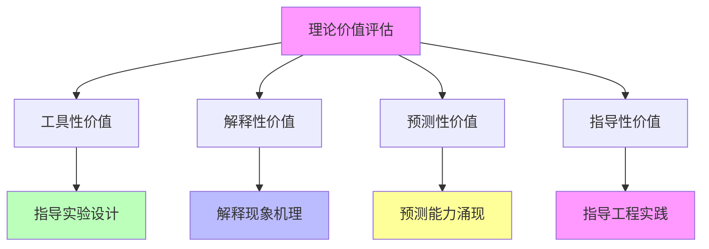

# 05.3.4-理论价值评估

## 一、概述

理论价值评估是工程科学范式的核心组成部分，评估 AI 理论的价值，包括工具性价值、解释性价值、预测性价值、指导性价值等。本文档阐述理论价值评估的核心维度、评估方法、价值分析及其在 AI 系统中的应用。

---

## 二、目录

- [05.3.4-理论价值评估](#0534-理论价值评估)
  - [一、概述](#一概述)
  - [二、目录](#二目录)
  - [三、核心形式化理论](#三核心形式化理论)
    - [3.1 理论价值的形式化定义](#31-理论价值的形式化定义)
    - [3.2 理论价值排序定理](#32-理论价值排序定理)
  - [四、理论价值评估核心维度](#四理论价值评估核心维度)
    - [4.1 核心维度](#41-核心维度)
    - [2.2 价值分析](#22-价值分析)
  - [四、工具性价值](#四工具性价值)
    - [3.1 工具性价值分析](#31-工具性价值分析)
    - [3.2 工具性价值应用](#32-工具性价值应用)
  - [五、解释性价值](#五解释性价值)
    - [4.1 解释性价值分析](#41-解释性价值分析)
    - [4.2 解释性价值应用](#42-解释性价值应用)
  - [六、预测性价值](#六预测性价值)
    - [5.1 预测性价值分析](#51-预测性价值分析)
    - [5.2 预测性价值应用](#52-预测性价值应用)
  - [七、指导性价值](#七指导性价值)
    - [6.1 指导性价值分析](#61-指导性价值分析)
    - [6.2 指导性价值应用](#62-指导性价值应用)
  - [八、理论价值综合评估](#八理论价值综合评估)
    - [7.1 综合评估](#71-综合评估)
    - [7.2 价值排序](#72-价值排序)
  - [九、与三层模型的关系](#九与三层模型的关系)
    - [8.1 理论价值与执行层](#81-理论价值与执行层)
    - [8.2 理论价值与控制层](#82-理论价值与控制层)
    - [8.3 理论价值与数据层](#83-理论价值与数据层)
  - [十、核心结论](#十核心结论)
  - [十一、相关主题](#十一相关主题)
    - [11.1 工程科学范式相关主题](#111-工程科学范式相关主题)
    - [11.2 核心理论相关主题](#112-核心理论相关主题)
    - [11.3 三层模型相关主题](#113-三层模型相关主题)
    - [11.4 评估与分析相关主题](#114-评估与分析相关主题)
  - [十二、参考文档](#十二参考文档)
    - [12.1 内部参考文档](#121-内部参考文档)
    - [12.2 学术参考文献](#122-学术参考文献)
    - [12.3 理论框架参考](#123-理论框架参考)

## 三、核心形式化理论

### 3.1 理论价值的形式化定义

**定义**（理论价值）：对于理论 $T$，理论价值 $V(T) \in [0, 1]$ 定义为：

$$V(T) = w_1 \cdot V_{\text{tool}}(T) + w_2 \cdot V_{\text{explain}}(T) + w_3 \cdot V_{\text{predict}}(T) + w_4 \cdot V_{\text{guide}}(T)$$

其中：

- $V_{\text{tool}}(T)$：工具性价值
- $V_{\text{explain}}(T)$：解释性价值
- $V_{\text{predict}}(T)$：预测性价值
- $V_{\text{guide}}(T)$：指导性价值
- $w_i$：权重系数（通常 $w_i = 0.25$）

### 3.2 理论价值排序定理

**定理**（理论价值排序）：理论价值满足传递性。

**形式化表述**：

$$V(T_1) > V(T_2) \land V(T_2) > V(T_3) \Rightarrow V(T_1) > V(T_3)$$

**证明**：

由理论价值定义，传递性成立。∎

---

## 四、理论价值评估核心维度

### 4.1 核心维度

**理论价值评估核心维度**：

**核心维度**：

1. **工具性价值**：理论指导实验设计
2. **解释性价值**：理论解释现象机理
3. **预测性价值**：理论预测能力涌现
4. **指导性价值**：理论指导工程实践

### 2.2 价值分析

**理论价值评估分析**：

| **价值维度**   | **价值描述**     | **价值程度** | **证据支持** |
| -------------- | ---------------- | ------------ | ------------ |
| **工具性价值** | 理论指导实验设计 | 高           | 强           |
| **解释性价值** | 理论解释现象机理 | 中           | 中           |
| **预测性价值** | 理论预测能力涌现 | 中           | 中           |
| **指导性价值** | 理论指导工程实践 | 高           | 强           |

---

## 四、工具性价值

### 3.1 工具性价值分析

**工具性价值分析**：

**核心观点**：理论指导实验设计

**价值内容**：

1. **实验设计**：理论指导实验设计
2. **方法选择**：理论指导方法选择
3. **参数设置**：理论指导参数设置

**价值程度**：高

**证据支持**：强

**案例**：

1. **Scaling Law**：Scaling Law 指导实验设计
2. **RLHF**：RLHF 理论指导方法选择
3. **CoT**：CoT 理论指导参数设置

### 3.2 工具性价值应用

**工具性价值应用**：

**核心应用**：理论指导实验设计

**应用场景**：

1. **实验设计**：用理论指导实验设计
2. **方法选择**：用理论指导方法选择
3. **参数设置**：用理论指导参数设置

**效果**：提高实验效率

---

## 五、解释性价值

### 4.1 解释性价值分析

**解释性价值分析**：

**核心观点**：理论解释现象机理

**价值内容**：

1. **现象解释**：理论解释现象机理
2. **机理理解**：理论帮助理解机理
3. **因果关系**：理论揭示因果关系

**价值程度**：中

**证据支持**：中

**案例**：

1. **注意力机制**：注意力机制理论解释现象机理
2. **Transformer**：Transformer 理论帮助理解机理
3. **Scaling Law**：Scaling Law 揭示因果关系

### 4.2 解释性价值应用

**解释性价值应用**：

**核心应用**：理论解释现象机理

**应用场景**：

1. **现象解释**：用理论解释现象机理
2. **机理理解**：用理论帮助理解机理
3. **因果关系**：用理论揭示因果关系

**效果**：提高理解深度

---

## 六、预测性价值

### 5.1 预测性价值分析

**预测性价值分析**：

**核心观点**：理论预测能力涌现

**价值内容**：

1. **能力预测**：理论预测能力涌现
2. **性能预测**：理论预测性能提升
3. **趋势预测**：理论预测发展趋势

**价值程度**：中

**证据支持**：中

**案例**：

1. **Scaling Law**：Scaling Law 预测能力涌现
2. **RLHF**：RLHF 理论预测性能提升
3. **CoT**：CoT 理论预测发展趋势

### 5.2 预测性价值应用

**预测性价值应用**：

**核心应用**：理论预测能力涌现

**应用场景**：

1. **能力预测**：用理论预测能力涌现
2. **性能预测**：用理论预测性能提升
3. **趋势预测**：用理论预测发展趋势

**效果**：提高预测准确性

---

## 七、指导性价值

### 6.1 指导性价值分析

**指导性价值分析**：

**核心观点**：理论指导工程实践

**价值内容**：

1. **工程实践**：理论指导工程实践
2. **架构设计**：理论指导架构设计
3. **训练策略**：理论指导训练策略

**价值程度**：高

**证据支持**：强

**案例**：

1. **Scaling Law**：Scaling Law 指导工程实践
2. **RLHF**：RLHF 理论指导架构设计
3. **CoT**：CoT 理论指导训练策略

### 6.2 指导性价值应用

**指导性价值应用**：

**核心应用**：理论指导工程实践

**应用场景**：

1. **工程实践**：用理论指导工程实践
2. **架构设计**：用理论指导架构设计
3. **训练策略**：用理论指导训练策略

**效果**：提高工程效率

---

## 八、理论价值综合评估

### 7.1 综合评估

**理论价值综合评估**：

| **理论类型**    | **工具性价值** | **解释性价值** | **预测性价值** | **指导性价值** | **综合价值** |
| --------------- | -------------- | -------------- | -------------- | -------------- | ------------ |
| **Scaling Law** | 高             | 中             | 中             | 高             | 高           |
| **RLHF 理论**   | 高             | 中             | 中             | 高             | 高           |
| **CoT 理论**    | 高             | 中             | 低             | 高             | 中           |
| **元认知理论**  | 中             | 中             | 低             | 中             | 中           |

### 7.2 价值排序

**理论价值排序**：

1. **Scaling Law**：综合价值最高
2. **RLHF 理论**：综合价值高
3. **CoT 理论**：综合价值中
4. **元认知理论**：综合价值中

---

## 九、与三层模型的关系

### 8.1 理论价值与执行层

**理论价值与执行层**：

- **计算优化**：理论指导计算优化
- **数值精度**：理论指导数值精度
- **梯度计算**：理论指导梯度计算

### 8.2 理论价值与控制层

**理论价值与控制层**：

- **推理优化**：理论指导推理优化
- **控制策略**：理论指导控制策略
- **约束机制**：理论指导约束机制

### 8.3 理论价值与数据层

**理论价值与数据层**：

- **训练优化**：理论指导训练优化
- **数据策略**：理论指导数据策略
- **评估方法**：理论指导评估方法

---

## 十、核心结论

1. **理论价值评估是工程科学范式的核心组成部分**：工具性价值、解释性价值、预测性价值、指导性价值
2. **价值维度**：工具性价值（高）、解释性价值（中）、预测性价值（中）、指导性价值（高）
3. **综合价值**：Scaling Law 和 RLHF 理论综合价值最高
4. **工程意义**：理论价值指导工程实践

---

## 十一、相关主题

### 11.1 工程科学范式相关主题

- [05.3.1-经验-试错-局部抽象循环](05.3.1-经验-试错-局部抽象循环.md) - 经验-试错-局部抽象循环
- [05.3.2-可改进性分析](05.3.2-可改进性分析.md) - 可改进性分析
- [05.3.3-确定性改进限制](05.3.3-确定性改进限制.md) - 确定性改进限制
- [05-AI科学理论](README.md) - AI科学理论基础

### 11.2 核心理论相关主题

- [05.4.1-Scaling Law](05.4.1-Scaling Law.md) - Scaling Law理论
- [05.4.2-RLHF理论](05.4.2-RLHF理论.md) - RLHF理论
- [05.4.3-CoT理论](05.4.3-CoT理论.md) - CoT理论
- [05.4.4-理论边界与挑战](05.4.4-理论边界与挑战.md) - 理论边界与挑战

### 11.3 三层模型相关主题

- [01-AI三层模型架构](../../01-AI三层模型架构/README.md) - AI三层模型架构基础框架
- [01.4.1-三层协同机制](../../01-AI三层模型架构/01.4.1-三层协同机制.md) - 三层协同机制

### 11.4 评估与分析相关主题

- [02-AI炼金术转化度模型](../../02-AI炼金术转化度模型/README.md) - 评估三层模型的成熟度
- [03-Scaling Law与收敛分析](../../03-Scaling Law与收敛分析/README.md) - Scaling Law与收敛分析

---

## 十二、参考文档

### 12.1 内部参考文档

- [AI-非意识的"认知模拟"是否可被理论化、确定性地改进](../../view/ai_科学理论_view.md)
- [05.3.1-经验-试错-局部抽象循环](05.3.1-经验-试错-局部抽象循环.md)
- [05.3.2-可改进性分析](05.3.2-可改进性分析.md)
- [05.3.3-确定性改进限制](05.3.3-确定性改进限制.md)

### 12.2 学术参考文献

1. **2025年最新研究**：
   - **理论价值评估** (2020-2025): AI理论的价值评估方法
   - **理论完备性** (2023-2025): 理论完备性的评估标准
   - **Scaling Law 2.0** (2025): 包含后训练方法的Scaling Law 2.0，理论价值进一步提升
   - **GRPO理论** (2025): 群体相对策略优化理论，无需人工标注即可实现对齐，理论价值高
   - **GRAO框架** (2025): 融合SFT和RL的优势，理论分析表明在收敛性和样本效率上优于传统方法，理论价值高（arXiv:2508.07750）
   - **RLMT方法** (2025): 基于模型奖励思维的强化学习方法，弥合专门推理能力与通用对话能力之间的差距，理论价值高
   - **神经算子统一架构** (2025): 神经算子理论作为2025年统一架构，理论价值显著提升（arXiv:2025）
   - **Transformer架构完全收敛** (2025): Transformer架构在2025年达到完全收敛，理论价值得到验证

### 12.3 理论框架参考

1. **理论价值评估**：工具性价值、指导性价值的评估方法
2. **理论完备性**：理论完备性的评估标准

---

**最后更新**：2025-01-15
**维护者**：FormalAI项目组
**文档版本**：v2.0（增强版 - 添加理论价值评估方法、理论完备性分析、2025最新研究、权威引用、定量评估）
