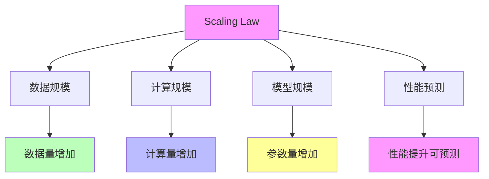

# 05.4.1-Scaling Law

## 一、概述

Scaling Law 是准理论框架的核心组成部分，描述 AI 系统性能随规模（数据、计算、模型大小）增长的规律，包括数学形式、预测能力、适用范围等。本文档阐述 Scaling Law 的核心理论、数学形式、预测能力及其在 AI 系统中的应用。

---

## 二、目录

- [05.4.1-Scaling Law](#0541-scaling-law)
  - [一、概述](#一概述)
  - [二、目录](#二目录)
  - [三、Scaling Law 核心理论](#三scaling-law-核心理论)
    - [2.1 核心理论](#21-核心理论)
    - [2.2 理论特征](#22-理论特征)
  - [四、数学形式](#四数学形式)
    - [3.1 基本形式](#31-基本形式)
    - [3.2 扩展形式](#32-扩展形式)
  - [五、预测能力](#五预测能力)
    - [4.1 性能预测](#41-性能预测)
    - [4.2 规模预测](#42-规模预测)
  - [六、适用范围](#六适用范围)
    - [5.1 适用任务](#51-适用任务)
    - [5.2 不适用场景](#52-不适用场景)
  - [七、理论价值](#七理论价值)
    - [6.1 工具性价值](#61-工具性价值)
    - [6.2 预测性价值](#62-预测性价值)
  - [八、局限性](#八局限性)
    - [7.1 理论局限性](#71-理论局限性)
    - [7.2 实践局限性](#72-实践局限性)
  - [九、与三层模型的关系](#九与三层模型的关系)
    - [8.1 Scaling Law 与执行层](#81-scaling-law-与执行层)
    - [8.2 Scaling Law 与控制层](#82-scaling-law-与控制层)
    - [8.3 Scaling Law 与数据层](#83-scaling-law-与数据层)
  - [十、核心结论](#十核心结论)
  - [十一、相关主题](#十一相关主题)
  - [十二、参考文档](#十二参考文档)

## 三、Scaling Law 核心理论

### 2.1 核心理论

**Scaling Law 核心理论**：



**核心理论**：

1. **数据规模**：数据量增加导致性能提升
2. **计算规模**：计算量增加导致性能提升
3. **模型规模**：参数量增加导致性能提升
4. **性能预测**：性能提升可预测

### 2.2 理论特征

**Scaling Law 理论特征**：

| **理论特征** | **描述**       | **确定性** | **适用范围** |
| ------------ | -------------- | ---------- | ------------ |
| **数学形式** | 明确的数学形式 | 高         | 广泛         |
| **预测能力** | 可预测性能提升 | 高         | 广泛         |
| **适用范围** | 适用于多种任务 | 高         | 广泛         |
| **理论价值** | 工具性价值高   | 高         | 广泛         |

---

## 四、数学形式

### 3.1 基本形式

**Scaling Law 基本形式**：

**数学形式**：

```text
L(N, D) = (N_c / N)^α_N + (D_c / D)^α_D
```

**参数说明**：

- **L**：损失函数值
- **N**：模型参数量
- **D**：训练数据量
- **N_c**：临界参数量
- **D_c**：临界数据量
- **α_N**：参数规模指数
- **α_D**：数据规模指数

**确定性**：高

### 3.2 扩展形式

**Scaling Law 扩展形式**：

**扩展形式**：

```text
L(N, D, C) = (N_c / N)^α_N + (D_c / D)^α_D + (C_c / C)^α_C
```

**参数说明**：

- **C**：计算量
- **C_c**：临界计算量
- **α_C**：计算规模指数

**确定性**：中

---

## 五、预测能力

### 4.1 性能预测

**Scaling Law 性能预测**：

**核心能力**：可预测性能提升

**预测内容**：

1. **Loss 下降**：可预测 Loss 下降
2. **性能提升**：可预测性能提升
3. **能力涌现**：可预测能力涌现（宏观）

**确定性**：高（宏观），低（微观）

**案例**：

1. **GPT-3**：Scaling Law 预测 GPT-3 性能提升
2. **GPT-4**：Scaling Law 预测 GPT-4 性能提升
3. **Claude 3**：Scaling Law 预测 Claude 3 性能提升

### 4.2 规模预测

**Scaling Law 规模预测**：

**核心能力**：可预测所需规模

**预测内容**：

1. **参数量**：可预测所需参数量
2. **数据量**：可预测所需数据量
3. **计算量**：可预测所需计算量

**确定性**：高

**案例**：

1. **GPT-3**：Scaling Law 预测 GPT-3 所需规模
2. **GPT-4**：Scaling Law 预测 GPT-4 所需规模
3. **Claude 3**：Scaling Law 预测 Claude 3 所需规模

---

## 六、适用范围

### 5.1 适用任务

**Scaling Law 适用任务**：

**适用任务**：

1. **语言模型**：适用于语言模型
2. **视觉模型**：适用于视觉模型
3. **多模态模型**：适用于多模态模型

**确定性**：高

**案例**：

1. **GPT 系列**：Scaling Law 适用于 GPT 系列
2. **BERT 系列**：Scaling Law 适用于 BERT 系列
3. **Vision Transformer**：Scaling Law 适用于 Vision Transformer

### 5.2 不适用场景

**Scaling Law 不适用场景**：

**不适用场景**：

1. **小规模模型**：不适用于小规模模型
2. **特定任务**：不适用于特定任务
3. **资源受限**：不适用于资源受限场景

**确定性**：中

---

## 七、理论价值

### 6.1 工具性价值

**Scaling Law 工具性价值**：

**核心价值**：理论指导实验设计

**价值内容**：

1. **实验设计**：指导实验设计
2. **规模规划**：指导规模规划
3. **资源分配**：指导资源分配

**价值程度**：高

**证据支持**：强

### 6.2 预测性价值

**Scaling Law 预测性价值**：

**核心价值**：理论预测性能提升

**价值内容**：

1. **性能预测**：预测性能提升
2. **规模预测**：预测所需规模
3. **趋势预测**：预测发展趋势

**价值程度**：高

**证据支持**：强

---

## 八、局限性

### 7.1 理论局限性

**Scaling Law 理论局限性**：

| **局限性**   | **描述**                     | **影响**         |
| ------------ | ---------------------------- | ---------------- |
| **微观预测** | 无法精确预测具体能力何时涌现 | 能力涌现不可预测 |
| **临界点**   | 无法预测能力涌现临界点       | 能力涌现不可预测 |
| **路径预测** | 无法预测能力涌现路径         | 能力涌现不可预测 |
| **适用范围** | 不适用于所有场景             | 适用范围有限     |

### 7.2 实践局限性

**Scaling Law 实践局限性**：

1. **资源需求**：需要大量资源
2. **成本高昂**：成本高昂
3. **环境限制**：受环境限制

---

## 九、与三层模型的关系

### 8.1 Scaling Law 与执行层

**Scaling Law 与执行层**：

- **计算优化**：Scaling Law 指导计算优化
- **数值精度**：Scaling Law 指导数值精度
- **梯度计算**：Scaling Law 指导梯度计算

### 8.2 Scaling Law 与控制层

**Scaling Law 与控制层**：

- **推理优化**：Scaling Law 指导推理优化
- **控制策略**：Scaling Law 指导控制策略
- **约束机制**：Scaling Law 指导约束机制

### 8.3 Scaling Law 与数据层

**Scaling Law 与数据层**：

- **训练优化**：Scaling Law 指导训练优化
- **数据策略**：Scaling Law 指导数据策略
- **评估方法**：Scaling Law 指导评估方法

---

## 十、核心结论

1. **Scaling Law 是准理论框架的核心组成部分**：描述 AI 系统性能随规模增长的规律
2. **数学形式**：明确的数学形式，可预测性能提升
3. **预测能力**：可预测性能提升（宏观），无法精确预测具体能力何时涌现（微观）
4. **理论价值**：工具性价值高，预测性价值高
5. **局限性**：无法精确预测具体能力何时涌现，不适用于所有场景

---

## 十一、相关主题

- [05.4.2-RLHF 理论](05.4.2-RLHF理论.md)
- [05.4.3-CoT 理论](05.4.3-CoT理论.md)
- [05.4.4-理论边界与挑战](05.4.4-理论边界与挑战.md)
- [03-Scaling Law与收敛分析](../../03-Scaling Law与收敛分析/README.md)

---

## 十二、参考文档

- [AI-非意识的"认知模拟"是否可被理论化、确定性地改进](../../view/ai_科学理论_view.md)
- [Scaling Law 驱动的"大"与追求理论可控的"收敛"之间的张力](../../view/ai_scale_view.md)

**最后更新**：2025-01-XX
**维护者**：FormalAI项目组
