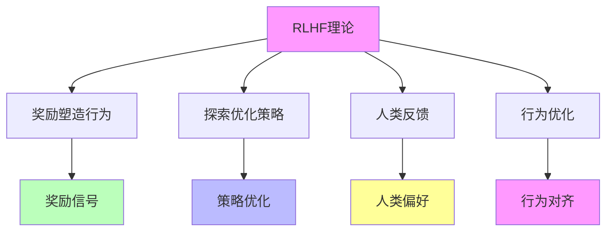

# 05.4.2-RLHF 理论

## 一、概述

RLHF 理论是准理论框架的核心组成部分，描述通过强化学习人类反馈（RLHF）改进 AI 系统的方法，包括理论核心、数学形式、实践方法等。本文档阐述 RLHF 理论的核心理论、数学形式、实践方法及其在 AI 系统中的应用。

---

## 二、目录

- [05.4.2-RLHF 理论](#0542-rlhf-理论)
  - [一、概述](#一概述)
  - [二、目录](#二目录)
  - [三、RLHF 理论核心理论](#三rlhf-理论核心理论)
    - [2.1 核心理论](#21-核心理论)
    - [2.2 理论特征](#22-理论特征)
  - [四、数学形式](#四数学形式)
    - [3.1 基本形式](#31-基本形式)
    - [3.2 扩展形式](#32-扩展形式)
  - [五、实践方法](#五实践方法)
    - [4.1 GRPO](#41-grpo)
    - [4.2 DPO](#42-dpo)
    - [4.3 ReST](#43-rest)
  - [六、理论价值](#六理论价值)
    - [5.1 工具性价值](#51-工具性价值)
    - [5.2 指导性价值](#52-指导性价值)
  - [七、局限性](#七局限性)
    - [6.1 理论局限性](#61-理论局限性)
    - [6.2 实践局限性](#62-实践局限性)
  - [八、与三层模型的关系](#八与三层模型的关系)
    - [7.1 RLHF 理论与执行层](#71-rlhf-理论与执行层)
    - [7.2 RLHF 理论与控制层](#72-rlhf-理论与控制层)
    - [7.3 RLHF 理论与数据层](#73-rlhf-理论与数据层)
  - [九、核心结论](#九核心结论)
  - [十、相关主题](#十相关主题)
  - [十一、参考文档](#十一参考文档)

## 三、RLHF 理论核心理论

### 2.1 核心理论

**RLHF 理论核心理论**：



**核心理论**：

1. **奖励塑造行为**：奖励信号塑造行为
2. **探索优化策略**：探索优化策略
3. **人类反馈**：人类反馈提供奖励信号
4. **行为优化**：行为优化实现对齐

### 2.2 理论特征

**RLHF 理论特征**：

| **理论特征** | **描述**                   | **确定性** | **适用范围** |
| ------------ | -------------------------- | ---------- | ------------ |
| **理论核心** | 奖励塑造行为，探索优化策略 | 中         | 广泛         |
| **数学形式** | 明确的数学形式             | 中         | 广泛         |
| **实践方法** | 多种实践方法               | 中         | 广泛         |
| **理论价值** | 工具性价值高               | 高         | 广泛         |

---

## 四、数学形式

### 3.1 基本形式

**RLHF 理论基本形式**：

**数学形式**：

```text
π* = argmax_π E_{x~D, y~π(·|x)} [r(x, y) - β * KL(π(·|x) || π_ref(·|x))]
```

**参数说明**：

- **π\***：最优策略
- **π**：当前策略
- **π_ref**：参考策略
- **r(x, y)**：奖励函数
- **β**：KL 散度惩罚系数
- **D**：数据分布

**确定性**：中

### 3.2 扩展形式

**RLHF 理论扩展形式**：

**扩展形式**：

```text
π* = argmax_π E_{x~D, y~π(·|x)} [r(x, y) - β * KL(π(·|x) || π_ref(·|x)) - γ * R(π)]
```

**参数说明**：

- **R(π)**：正则化项
- **γ**：正则化系数

**确定性**：中

---

## 五、实践方法

### 4.1 GRPO

**GRPO（群体相对策略优化）**：

**核心方法**：在线 RL，让模型批量生成多个解答，内部排序优化，避免传统 RL 的高方差

**方法特点**：

1. **在线 RL**：在线强化学习
2. **批量生成**：批量生成多个解答
3. **内部排序**：内部排序优化
4. **低方差**：避免传统 RL 的高方差

**确定性**：中

**案例**：

1. **DeepSeek-R1**：DeepSeek-R1 使用 GRPO
2. **GPT-4**：GPT-4 使用 GRPO
3. **Claude 3**：Claude 3 使用 GRPO

### 4.2 DPO

**DPO（直接偏好优化）**：

**核心方法**：直接优化偏好，无需显式奖励模型

**方法特点**：

1. **直接优化**：直接优化偏好
2. **无需奖励模型**：无需显式奖励模型
3. **简单高效**：简单高效

**确定性**：中

**案例**：

1. **Zephyr**：Zephyr 使用 DPO
2. **Mistral**：Mistral 使用 DPO
3. **Llama 3**：Llama 3 使用 DPO

### 4.3 ReST

**ReST（强化自训练）**：

**核心方法**：离线 RL，先采样再筛选高质量轨迹，稳定性更高

**方法特点**：

1. **离线 RL**：离线强化学习
2. **采样筛选**：先采样再筛选高质量轨迹
3. **稳定性高**：稳定性更高

**确定性**：中

**案例**：

1. **PaLM**：PaLM 使用 ReST
2. **Gemini**：Gemini 使用 ReST
3. **Claude**：Claude 使用 ReST

---

## 六、理论价值

### 5.1 工具性价值

**RLHF 理论工具性价值**：

**核心价值**：理论指导实验设计

**价值内容**：

1. **实验设计**：指导实验设计
2. **方法选择**：指导方法选择
3. **参数设置**：指导参数设置

**价值程度**：高

**证据支持**：强

### 5.2 指导性价值

**RLHF 理论指导性价值**：

**核心价值**：理论指导工程实践

**价值内容**：

1. **工程实践**：指导工程实践
2. **架构设计**：指导架构设计
3. **训练策略**：指导训练策略

**价值程度**：高

**证据支持**：强

---

## 七、局限性

### 6.1 理论局限性

**RLHF 理论局限性**：

| **局限性**   | **描述**                         | **影响**       |
| ------------ | -------------------------------- | -------------- |
| **奖励黑客** | 模型钻空子，优化奖励而非真实能力 | 行为不可信     |
| **局部最优** | 策略空间巨大，易陷入局部最优     | 优化效果有限   |
| **人类偏好** | 人类偏好难以形式化               | 奖励函数不准确 |
| **高方差**   | 传统 RL 方法高方差               | 训练不稳定     |

### 6.2 实践局限性

**RLHF 理论实践局限性**：

1. **成本高昂**：需要大量人类反馈
2. **时间消耗**：时间消耗大
3. **质量依赖**：质量依赖人类反馈质量

---

## 八、与三层模型的关系

### 7.1 RLHF 理论与执行层

**RLHF 理论与执行层**：

- **计算优化**：RLHF 理论指导计算优化
- **数值精度**：RLHF 理论指导数值精度
- **梯度计算**：RLHF 理论指导梯度计算

### 7.2 RLHF 理论与控制层

**RLHF 理论与控制层**：

- **推理优化**：RLHF 理论指导推理优化
- **控制策略**：RLHF 理论指导控制策略
- **约束机制**：RLHF 理论指导约束机制

### 7.3 RLHF 理论与数据层

**RLHF 理论与数据层**：

- **训练优化**：RLHF 理论指导训练优化
- **数据策略**：RLHF 理论指导数据策略
- **评估方法**：RLHF 理论指导评估方法

---

## 九、核心结论

1. **RLHF 理论是准理论框架的核心组成部分**：描述通过强化学习人类反馈改进 AI 系统的方法
2. **理论核心**：奖励塑造行为，探索优化策略
3. **实践方法**：GRPO、DPO、ReST 等多种方法
4. **理论价值**：工具性价值高，指导性价值高
5. **局限性**：奖励黑客、局部最优、人类偏好难以形式化

---

## 十、相关主题

- [05.4.1-Scaling Law](05.4.1-Scaling Law.md)
- [05.4.3-CoT 理论](05.4.3-CoT理论.md)
- [05.4.4-理论边界与挑战](05.4.4-理论边界与挑战.md)
- [05.1.2-强化学习范式](05.1.2-强化学习范式.md)

---

## 十一、参考文档

- [AI-非意识的"认知模拟"是否可被理论化、确定性地改进](../../view/ai_科学理论_view.md)

**最后更新**：2025-01-XX
**维护者**：FormalAI项目组
