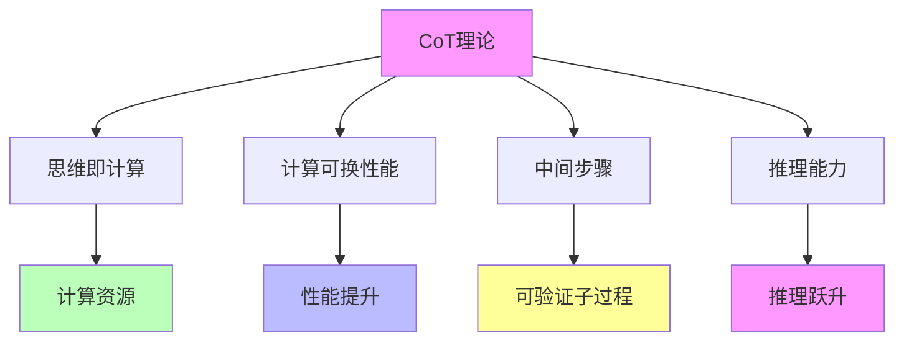

# 05.4.3-CoT 理论

## 一、概述

CoT 理论是准理论框架的核心组成部分，描述思维链（Chain of Thought）推理的理论基础，包括理论核心、数学形式、实践方法等。本文档阐述 CoT 理论的核心理论、数学形式、实践方法及其在 AI 系统中的应用。

---

## 二、目录

- [05.4.3-CoT 理论](#0543-cot-理论)
  - [一、概述](#一概述)
  - [二、目录](#二目录)
  - [三、CoT 理论核心理论](#三cot-理论核心理论)
    - [2.1 核心理论](#21-核心理论)
    - [2.2 理论特征](#22-理论特征)
  - [四、数学形式](#四数学形式)
    - [3.1 基本形式](#31-基本形式)
    - [3.2 扩展形式](#32-扩展形式)
  - [五、实践方法](#五实践方法)
    - [4.1 基础 CoT](#41-基础-cot)
    - [4.2 Self-Consistency](#42-self-consistency)
    - [4.3 PDR](#43-pdr)
  - [六、理论价值](#六理论价值)
    - [5.1 工具性价值](#51-工具性价值)
    - [5.2 指导性价值](#52-指导性价值)
  - [七、局限性](#七局限性)
    - [6.1 理论局限性](#61-理论局限性)
    - [6.2 实践局限性](#62-实践局限性)
  - [八、与三层模型的关系](#八与三层模型的关系)
    - [7.1 CoT 理论与执行层](#71-cot-理论与执行层)
    - [7.2 CoT 理论与控制层](#72-cot-理论与控制层)
    - [7.3 CoT 理论与数据层](#73-cot-理论与数据层)
  - [九、核心结论](#九核心结论)
  - [十、相关主题](#十相关主题)
  - [十一、参考文档](#十一参考文档)

## 三、CoT 理论核心理论

### 2.1 核心理论

**CoT 理论核心理论**：



**核心理论**：

1. **思维即计算**：思维即计算，计算可换性能
2. **计算可换性能**：通过增加计算资源提升性能
3. **中间步骤**：将单步决策拆分为可验证的子过程
4. **推理能力**：推理能力提升

### 2.2 理论特征

**CoT 理论特征**：

| **理论特征** | **描述**                 | **确定性** | **适用范围** |
| ------------ | ------------------------ | ---------- | ------------ |
| **理论核心** | 思维即计算，计算可换性能 | 中         | 广泛         |
| **数学形式** | 明确的数学形式           | 中         | 广泛         |
| **实践方法** | 多种实践方法             | 中         | 广泛         |
| **理论价值** | 工具性价值高             | 高         | 广泛         |

---

## 四、数学形式

### 3.1 基本形式

**CoT 理论基本形式**：

**数学形式**：

```text
P(y|x) = Σ_{z_1, ..., z_k} P(z_1, ..., z_k|x) * P(y|z_1, ..., z_k, x)
```

**参数说明**：

- **P(y|x)**：给定输入 x 输出 y 的概率
- **z_1, ..., z_k**：中间推理步骤
- **P(z_1, ..., z_k|x)**：中间步骤的概率
- **P(y|z_1, ..., z_k, x)**：给定中间步骤输出 y 的概率

**确定性**：中

### 3.2 扩展形式

**CoT 理论扩展形式**：

**扩展形式**：

```text
P(y|x) = Σ_{z_1, ..., z_k} P(z_1, ..., z_k|x) * P(y|z_1, ..., z_k, x) * w(z_1, ..., z_k)
```

**参数说明**：

- **w(z_1, ..., z_k)**：中间步骤权重

**确定性**：中

---

## 五、实践方法

### 4.1 基础 CoT

**基础 CoT（思维链）**：

**核心方法**：强制模型生成中间步骤，本质是将单步决策拆分为可验证的子过程

**方法特点**：

1. **中间步骤**：生成中间推理步骤
2. **可验证**：中间步骤可验证
3. **子过程**：将单步决策拆分为子过程

**确定性**：中

**案例**：

1. **GPT-3**：GPT-3 使用基础 CoT
2. **GPT-4**：GPT-4 使用基础 CoT
3. **Claude 3**：Claude 3 使用基础 CoT

### 4.2 Self-Consistency

**Self-Consistency（自我一致性）**：

**核心方法**：对同一问题采样多条推理路径，投票得最优解，利用随机性对冲不确定性

**方法特点**：

1. **多条路径**：采样多条推理路径
2. **投票机制**：投票得最优解
3. **随机性对冲**：利用随机性对冲不确定性

**确定性**：中

**案例**：

1. **GPT-4**：GPT-4 使用 Self-Consistency
2. **Claude 3**：Claude 3 使用 Self-Consistency
3. **Gemini**：Gemini 使用 Self-Consistency

### 4.3 PDR

**PDR（平行-提取-优化）**：

**核心方法**：多线程并行推理，再提取共识，突破单线程串行限制

**方法特点**：

1. **并行推理**：多线程并行推理
2. **提取共识**：提取共识
3. **突破限制**：突破单线程串行限制

**确定性**：中

**案例**：

1. **Meta PDR**：Meta 使用 PDR
2. **DeepSeek-R1**：DeepSeek-R1 使用 PDR
3. **GPT-4o**：GPT-4o 使用 PDR

---

## 六、理论价值

### 5.1 工具性价值

**CoT 理论工具性价值**：

**核心价值**：理论指导实验设计

**价值内容**：

1. **实验设计**：指导实验设计
2. **方法选择**：指导方法选择
3. **参数设置**：指导参数设置

**价值程度**：高

**证据支持**：强

### 5.2 指导性价值

**CoT 理论指导性价值**：

**核心价值**：理论指导工程实践

**价值内容**：

1. **工程实践**：指导工程实践
2. **架构设计**：指导架构设计
3. **训练策略**：指导训练策略

**价值程度**：高

**证据支持**：强

---

## 七、局限性

### 6.1 理论局限性

**CoT 理论局限性**：

| **局限性**     | **描述**                           | **影响**     |
| -------------- | ---------------------------------- | ------------ |
| **确定性弱**   | 更像"启发式策略"，效果依赖任务类型 | 效果不确定   |
| **无收敛保证** | 无严格收敛保证                     | 效果不稳定   |
| **计算成本**   | 需要更多计算资源                   | 成本增加     |
| **适用范围**   | 不适用于所有任务                   | 适用范围有限 |

### 6.2 实践局限性

**CoT 理论实践局限性**：

1. **计算成本**：需要更多计算资源
2. **时间消耗**：时间消耗大
3. **效果依赖**：效果依赖任务类型

---

## 八、与三层模型的关系

### 7.1 CoT 理论与执行层

**CoT 理论与执行层**：

- **计算优化**：CoT 理论指导计算优化
- **数值精度**：CoT 理论指导数值精度
- **梯度计算**：CoT 理论指导梯度计算

### 7.2 CoT 理论与控制层

**CoT 理论与控制层**：

- **推理优化**：CoT 理论指导推理优化
- **控制策略**：CoT 理论指导控制策略
- **约束机制**：CoT 理论指导约束机制

### 7.3 CoT 理论与数据层

**CoT 理论与数据层**：

- **训练优化**：CoT 理论指导训练优化
- **数据策略**：CoT 理论指导数据策略
- **评估方法**：CoT 理论指导评估方法

---

## 九、核心结论

1. **CoT 理论是准理论框架的核心组成部分**：描述思维链推理的理论基础
2. **理论核心**：思维即计算，计算可换性能
3. **实践方法**：基础 CoT、Self-Consistency、PDR 等多种方法
4. **理论价值**：工具性价值高，指导性价值高
5. **局限性**：确定性弱、无收敛保证、计算成本高

---

## 十、相关主题

- [05.4.1-Scaling Law](05.4.1-Scaling Law.md)
- [05.4.2-RLHF 理论](05.4.2-RLHF理论.md)
- [05.4.4-理论边界与挑战](05.4.4-理论边界与挑战.md)
- [05.1.1-推断时间计算增强](05.1.1-推断时间计算增强.md)

---

## 十一、参考文档

- [AI-非意识的"认知模拟"是否可被理论化、确定性地改进](../../view/ai_科学理论_view.md)
