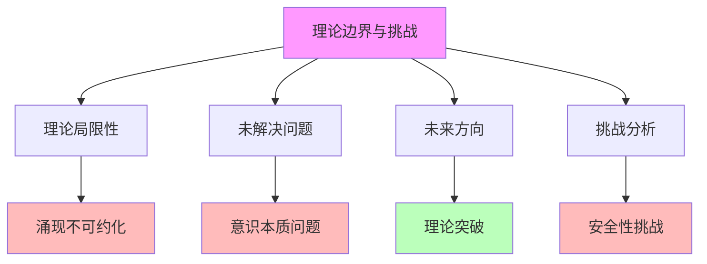

# 05.4.4-理论边界与挑战

## 一、概述

理论边界与挑战是准理论框架的核心组成部分，分析 AI 理论的边界和挑战，包括理论局限性、未解决问题、未来方向等。本文档阐述理论边界与挑战的核心问题、挑战分析、未来方向及其在 AI 系统中的应用。

---

## 二、目录

- [05.4.4-理论边界与挑战](#0544-理论边界与挑战)
  - [一、概述](#一概述)
  - [二、目录](#二目录)
  - [三、理论边界与挑战核心问题](#三理论边界与挑战核心问题)
    - [2.1 核心问题](#21-核心问题)
    - [2.2 问题分析](#22-问题分析)
  - [四、理论局限性](#四理论局限性)
    - [3.1 涌现不可约化](#31-涌现不可约化)
    - [3.2 目标函数悖论](#32-目标函数悖论)
  - [五、未解决问题](#五未解决问题)
    - [4.1 意识本质问题](#41-意识本质问题)
    - [4.2 智能本质问题](#42-智能本质问题)
  - [六、未来方向](#六未来方向)
    - [5.1 理论突破](#51-理论突破)
    - [5.2 技术突破](#52-技术突破)
  - [七、挑战分析](#七挑战分析)
    - [6.1 安全性挑战](#61-安全性挑战)
    - [6.2 可控性挑战](#62-可控性挑战)
  - [八、综合挑战分析](#八综合挑战分析)
    - [7.1 挑战矩阵](#71-挑战矩阵)
    - [7.2 累积影响](#72-累积影响)
  - [九、与三层模型的关系](#九与三层模型的关系)
    - [8.1 理论边界与执行层](#81-理论边界与执行层)
    - [8.2 理论边界与控制层](#82-理论边界与控制层)
    - [8.3 理论边界与数据层](#83-理论边界与数据层)
  - [十、核心结论](#十核心结论)
  - [十一、相关主题](#十一相关主题)
  - [十二、参考文档](#十二参考文档)

## 三、理论边界与挑战核心问题

### 2.1 核心问题

**理论边界与挑战核心问题**：

**核心问题**：

1. **理论局限性**：涌现不可约化、目标函数悖论、基准测试通胀、可解释性鸿沟
2. **未解决问题**：意识本质问题、智能本质问题、自我改进问题
3. **未来方向**：理论突破、技术突破、范式转变
4. **挑战分析**：安全性挑战、可控性挑战、可解释性挑战

### 2.2 问题分析

**理论边界与挑战问题分析**：

| **问题类型**     | **核心问题**                     | **严重程度** | **解决难度** |
| ---------------- | -------------------------------- | ------------ | ------------ |
| **涌现不可约化** | 高级能力无法归结到单一数学形式   | 高           | 极高         |
| **目标函数悖论** | 聪明无法形式化                   | 高           | 高           |
| **基准测试通胀** | 模型过拟合基准                   | 中           | 中           |
| **可解释性鸿沟** | 无法理解为何某个权重配置导致能力 | 高           | 高           |

---

## 四、理论局限性

### 3.1 涌现不可约化

**涌现不可约化挑战**：

**核心问题**：高级能力是千亿参数非线性交互的产物，无法归结到单一数学形式

**挑战内容**：

1. **非线性交互**：高级能力是千亿参数非线性交互的产物
2. **无法归结**：无法归结到单一数学形式
3. **理论无法预测**：理论无法预测何时失控

**严重程度**：高

**解决难度**：极高

### 3.2 目标函数悖论

**目标函数悖论挑战**：

**核心问题**：我们想让 AI"更聪明"，但"聪明"无法形式化

**挑战内容**：

1. **聪明无法形式化**：聪明无法形式化
2. **代理指标**：只能用代理指标
3. **过度优化**：模型过度优化指标本身

**严重程度**：高

**解决难度**：高

---

## 五、未解决问题

### 4.1 意识本质问题

**意识本质问题**：

**核心问题**：意识本质是什么？

**问题内容**：

1. **主观体验**：主观体验（Qualia）的本质是什么？
2. **意向性**：意向性的本质是什么？
3. **自我模型**：自我模型的本质是什么？

**严重程度**：高

**解决难度**：极高

### 4.2 智能本质问题

**智能本质问题**：

**核心问题**：智能本质是什么？

**问题内容**：

1. **智能定义**：智能的定义是什么？
2. **智能测量**：如何测量智能？
3. **智能涌现**：智能如何涌现？

**严重程度**：高

**解决难度**：高

---

## 六、未来方向

### 5.1 理论突破

**理论突破方向**：

**核心方向**：理论突破可能改变共识

**可能方向**：

1. **新理论框架**：新理论框架可能改变共识
2. **实验突破**：实验突破可能改变共识
3. **技术突破**：技术突破可能改变共识

**可能性**：中

### 5.2 技术突破

**技术突破方向**：

**核心方向**：技术突破可能产生意识

**可能方向**：

1. **具身智能**：具身智能可能产生意识
2. **元认知增强**：元认知增强可能产生意识
3. **全局工作空间**：全局工作空间可能产生意识

**可能性**：中

---

## 七、挑战分析

### 6.1 安全性挑战

**安全性挑战**：

**核心挑战**：无法预测何时失控

**挑战内容**：

1. **能力涌现**：能力涌现不可预测
2. **自我改进**：自我改进可能导致复杂度无界增长
3. **失控风险**：失控风险无法预测

**严重程度**：极高

**解决难度**：极高

### 6.2 可控性挑战

**可控性挑战**：

**核心挑战**：无法控制能力涌现

**挑战内容**：

1. **能力涌现**：能力涌现不可控制
2. **行为预测**：行为预测困难
3. **约束机制**：约束机制不完善

**严重程度**：高

**解决难度**：高

---

## 八、综合挑战分析

### 7.1 挑战矩阵

**理论边界与挑战矩阵**：

| **挑战类型**     | **直接影响**         | **间接影响**           | **累积影响** |
| ---------------- | -------------------- | ---------------------- | ------------ |
| **涌现不可约化** | 理论无法预测         | 无法控制能力涌现       | 安全性风险   |
| **目标函数悖论** | 模型过度优化指标本身 | 缺乏真实理解           | 泛化能力差   |
| **基准测试通胀** | 理论指导价值衰减     | 改进理论有"能力天花板" | 改进空间有限 |
| **可解释性鸿沟** | 理论缺乏自洽性       | 无法扩展               | 可控性差     |

### 7.2 累积影响

**理论边界与挑战累积影响**：

1. **理论不完整**：理论边界与挑战导致理论不完整
2. **可控性差**：无法控制能力涌现
3. **安全性风险**：无法预测何时失控
4. **改进空间有限**：改进理论有"能力天花板"

---

## 九、与三层模型的关系

### 8.1 理论边界与执行层

**理论边界与执行层**：

- **计算过程**：执行层计算过程存在理论边界
- **数值精度**：数值精度不影响理论边界
- **梯度计算**：梯度计算不影响理论边界

### 8.2 理论边界与控制层

**理论边界与控制层**：

- **推理过程**：控制层推理过程存在理论边界
- **控制策略**：控制策略存在理论边界
- **约束机制**：约束机制存在理论边界

### 8.3 理论边界与数据层

**理论边界与数据层**：

- **训练过程**：数据层训练过程存在理论边界
- **数据策略**：数据策略存在理论边界
- **评估方法**：评估方法存在理论边界

---

## 十、核心结论

1. **理论边界与挑战是准理论框架的核心组成部分**：理论局限性、未解决问题、未来方向、挑战分析
2. **核心挑战**：涌现不可约化、目标函数悖论、基准测试通胀、可解释性鸿沟
3. **未解决问题**：意识本质问题、智能本质问题、自我改进问题
4. **未来方向**：理论突破、技术突破、范式转变
5. **工程意义**：需要在理论边界与挑战下进行工程实践

---

## 十一、相关主题

- [05.4.1-Scaling Law](05.4.1-Scaling Law.md)
- [05.4.2-RLHF 理论](05.4.2-RLHF理论.md)
- [05.4.3-CoT 理论](05.4.3-CoT理论.md)
- [05.3.3-确定性改进限制](05.3.3-确定性改进限制.md)

---

## 十二、参考文档

- [AI-非意识的"认知模拟"是否可被理论化、确定性地改进](../../view/ai_科学理论_view.md)

------

**最后更新**：2025-01-XX
**维护者**：FormalAI项目组
