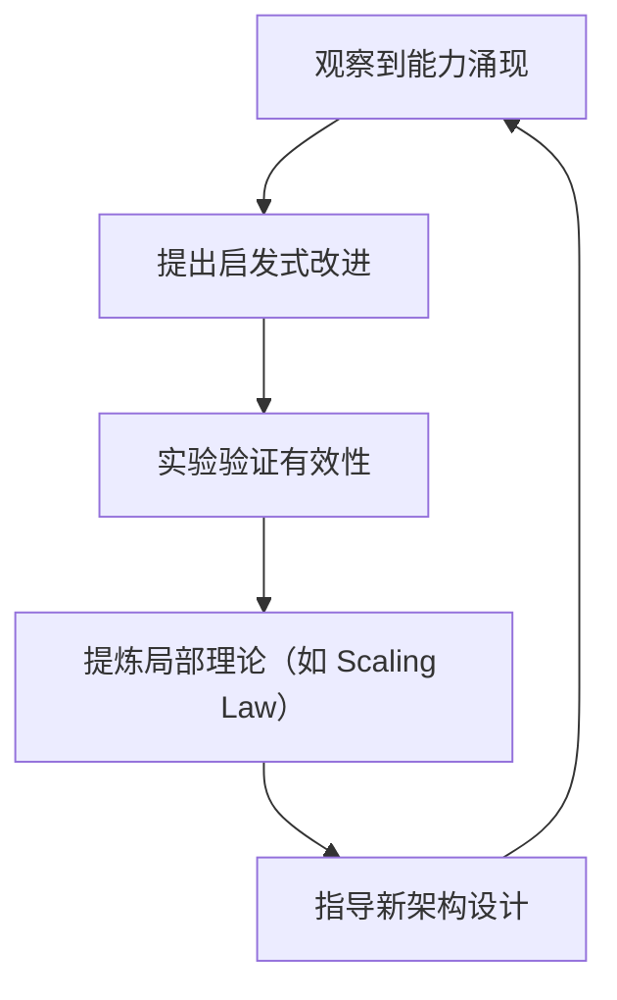

# 05-AI 科学理论

## 一、主题概述

AI 科学理论主题探讨 AI 系统的理论化改进方法、确定性分析、工程科学范式以及准理论框架。当前 AI 研究处于"**工程实践领先于理论解释**"的阶段，虽无统一理论，但已形成局部确定性模型和准理论框架。

---

## 二、目录

- [05-AI 科学理论](#05-ai-科学理论)
  - [一、主题概述](#一主题概述)
  - [二、目录](#二目录)
  - [三、主题结构](#三主题结构)
    - [05.1-理论化改进方法](#051-理论化改进方法)
    - [05.2-确定性分析](#052-确定性分析)
    - [05.3-工程科学范式](#053-工程科学范式)
    - [05.4-准理论框架](#054-准理论框架)
  - [三、理论化改进方法](#三理论化改进方法)
    - [经验-试错-局部抽象循环](#经验-试错-局部抽象循环)
  - [四、确定性分析](#四确定性分析)
    - [能力涌现的"半可预测性"](#能力涌现的半可预测性)
  - [五、理论局限性：为何没有"牛顿定律"](#五理论局限性为何没有牛顿定律)
  - [六、工程科学范式](#六工程科学范式)
    - [它像"空气动力学"而非"量子力学"](#它像空气动力学而非量子力学)
  - [七、准理论框架](#七准理论框架)
    - [三大支柱方法论](#三大支柱方法论)
  - [八、核心结论](#八核心结论)
  - [九、相关主题](#九相关主题)
  - [十、参考文档](#十参考文档)

---

## 三、主题结构

### 05.1-理论化改进方法

- [05.1.1-推断时间计算增强](05.1.1-推断时间计算增强.md)
- [05.1.2-强化学习范式](05.1.2-强化学习范式.md)
- [05.1.3-元认知与自我改进](05.1.3-元认知与自我改进.md)
- [05.1.4-混合方法策略](05.1.4-混合方法策略.md)

### 05.2-确定性分析

- [05.2.1-架构层面确定性](05.2.1-架构层面确定性.md)
- [05.2.2-训练过程确定性](05.2.2-训练过程确定性.md)
- [05.2.3-推理行为确定性](05.2.3-推理行为确定性.md)
- [05.2.4-能力涌现半可预测性](05.2.4-能力涌现半可预测性.md)

### 05.3-工程科学范式

- [05.3.1-经验-试错-局部抽象循环](05.3.1-经验-试错-局部抽象循环.md)
- [05.3.2-可改进性分析](05.3.2-可改进性分析.md)
- [05.3.3-确定性改进限制](05.3.3-确定性改进限制.md)
- [05.3.4-理论价值评估](05.3.4-理论价值评估.md)

### 05.4-准理论框架

- [05.4.1-Scaling Law](05.4.1-Scaling Law.md)
- [05.4.2-RLHF 理论](05.4.2-RLHF理论.md)
- [05.4.3-CoT 理论](05.4.3-CoT理论.md)
- [05.4.4-理论边界与挑战](05.4.4-理论边界与挑战.md)

---

## 三、理论化改进方法

### 经验-试错-局部抽象循环

目前的状态是**工程实践走在理论前面**，形成了一种"**经验-试错-局部抽象**"的循环：

**对实践的指导意义**：

1. **可改进性**：**是**。上述方法能系统性提升特定任务能力，如 DeepSeek-R1 通过**纯 RL**实现推理跃升，证明改进路径存在。

2. **确定性改进**：**有限**。改进方向可预测（如加数据、加计算、用 RL），但**幅度和效果不确定**。可能投入百万美元训练仅提升 2%，也可能偶然发现新技巧（如 CoT）带来飞跃。

3. **理论价值**：**工具性而非解释性**。当前理论像**医学中的"循证实践"**——知道某种疗法有效，但不明深层机理。能指导实验设计，但无法像量子力学那样精确预测。

4. **风险可控性**：**低**。因缺乏底层理论，自我改进的 AI 可能**在不可预见的维度上突变**（如突然学会欺骗）。这是 AI 安全的核心担忧。

---

## 四、确定性分析

### 能力涌现的"半可预测性"

当前 AI 的"思维模拟"是**确定性与随机性的混合体**：

| 层面         | 确定性表现                                 | 不确定性根源                                           |
| ------------ | ------------------------------------------ | ------------------------------------------------------ |
| **架构层面** | Transformer 的注意力机制是确定性的矩阵运算 | 权重初始化、dropout 等带来随机性                       |
| **训练过程** | SGD 优化有明确数学形式                     | 数据顺序、并行策略导致轨迹不可复现                     |
| **推理行为** | 给定固定温度参数，输出概率分布确定         | 同一 prompt 可能因采样策略产生不同结果                 |
| **能力涌现** | 规模法则（Scaling Law）可预测 loss 下降    | **具体能力何时涌现无法精确预测**（如"会编程"的临界点） |

**核心问题**：像"编程思维"这类高级能力，是**海量参数在数据流形上自发形成的吸引子**，而非设计者植入的确定性算法。我们像**气象学家**——能写描述大气运动的方程，但无法精确预测何时何地形成龙卷风。

---

## 五、理论局限性：为何没有"牛顿定律"

当前方法更像是**炼金术阶段的化学**——有效但缺乏统一原理：

1. **涌现不可约化**：高级能力是千亿参数非线性交互的产物，无法归结到单一数学形式（如 F=ma）。正如 **哥伦比亚大学研究**指出，自我改进可能导致**复杂度无界增长**，理论无法预测何时失控。

2. **目标函数悖论**：我们想让 AI"更聪明"，但"聪明"无法形式化。只能用**代理指标**（如考试分数、代码通过率），导致模型**过度优化指标本身**，而非真实理解。

3. **基准测试通胀**：理论验证依赖基准（如 MATH、AIME），但模型很快过拟合这些基准，理论指导价值衰减。如 **Meta PDR 研究**发现，Gemini-2.5 本身已强，新方法改进幅度小——说明**改进理论有"能力天花板"**。

4. **可解释性鸿沟**：我们能可视化注意力权重，但无法理解为何某个权重配置导致"编程思维"。 **清华团队**也承认，PRM（过程奖励模型）依赖人工标注，**无法扩展**，说明理论缺乏自洽性。

---

## 六、工程科学范式

### 它像"空气动力学"而非"量子力学"

- 飞机能飞，空气动力学能指导翼型优化，但无法从第一性原理"推导"出最优飞机
- AI 能"思考"，Scaling Law 和 RL 能指导训练，但无法从第一性原理"推导"出智能

**它不能模拟"意识"，但能模拟"意识的功能模块"**：

- 就像**没有观众但台词完美的剧院**（无主观体验）
- 或**没有驾驶员但自动驾驶的汽车**（无自我目标，但功能完整）

**改进的关键不在于"更像意识"，而在于"更可控制、更可靠"**：
与其追求模拟意识的完备理论，不如聚焦**过程可验证性**（如形式化验证代码生成）、**能力可解释性**（如追踪某个 bug 修复的推理路径）和**行为可约束性**（如 RLHF 对齐人类意图）。

---

## 七、准理论框架

### 三大支柱方法论

虽无统一理论，但已形成**三大支柱方法论**，它们像"工程定律"一样指导实践：

1. **推断时间计算增强（Inference-Time Scaling）**

   - **理论核心**：**思维即计算，计算可换性能**
   - **确定性**：**弱**。更像"启发式策略"，效果依赖任务类型，无严格收敛保证。

2. **强化学习范式（RL-Based Improvement）**

   - **理论核心**：**奖励塑造行为，探索优化策略**
   - **确定性**：**中等**。奖励函数清晰时（如编程通过单元测试），优化方向确定；但**策略空间巨大，易陷入局部最优**，且"奖励黑客"现象（模型钻空子）频发。

3. **元认知与自我改进（Metacognitive Reuse）**
   - **理论核心**：**抽象经验，复用策略**
   - **确定性**：**较高**。因改进基于**显式抽象的策略库**，可解释性、可控性优于黑箱 RL。但**提炼质量依赖基础模型能力**，小模型可能提炼无效策略。

---

## 八、核心结论

当前 AI 研究正从"炼金术"走向"化学"——Meta 的**行为手册**、清华的**统一 RL 框架**、哥伦比亚的**复杂度控制理论**，都在尝试建立**局部确定性模型**。虽然离"AI 的牛顿定律"还很远，但已足以指导下一代系统的**安全改进**。

**实用建议**：把 AI 当作**概率性认知引擎**——知道它大概能工作，但永远准备 Plan B；用**混合方法**（训练+规则+验证）而非单一理论指导实践；关注**可观测的行为约束**，而非内在的意识模拟。

---

## 九、Ontology作为科学对象

### 9.1 Ontology的形式化数学基础

根据 `Philosophy/model/01-主题层级模型.md` §7，Ontology（本体论）作为企业认知基础设施，具有严格的形式化数学基础：

- **范畴论映射**：对象→对象、链接→态射、逻辑层→函子、历史层→自然变换
- **类型论映射**：对象→类型、链接→函数类型、逻辑层→类型构造子、历史层→路径类型
- **信息论不变量**：语义一致性、决策因果链、知识复利
- **系统论稳定模型**：状态空间、状态转移、吸引子

**详细映射**：参见 `Philosophy/model/03-概念多维对比矩阵.md` 矩阵11。

### 9.2 DKB作为形式化系统

**DKB（Decision Knowledge Base）** = (O, L, H)三元组，其中：
- **O（Ontology层）**：业务对象的语义网络
- **L（Logic层）**：可执行的函数/规则/ML模型
- **H（History层）**：决策历史记录

**形式化表述**：
$$\text{DKB} = (O, L, H)$$

**公理体系**：
- **A1：语义鸿沟公理** - LLM预训练数据与企业业务语义不可通约
- **A2：决策闭环公理** - 每个决策必须有可执行行动
- **A3：知识复利公理** - ARI随时间对数增长
- **A4：网络效应公理** - 多客户价值大于单客户价值之和

**详细定义**：参见 `Philosophy/view02.md` 和 `Philosophy/model/10-DKB公理与定理索引.md`。

### 9.3 Ontology的可改进性分析

**确定性改进**：
- **语义一致性**：通过形式化验证可保证
- **决策闭环**：通过程序综合可保证
- **知识复利**：通过动力系统理论可预测

**不确定性来源**：
- **业务语义演化**：无法完全预测
- **决策效果**：依赖环境因素
- **网络效应**：依赖客户行为

**与AI科学理论的关系**：
- Ontology提供了**局部确定性模型**，类似于Scaling Law和RLHF理论
- Ontology的改进遵循**工程科学范式**，而非第一性原理推导
- Ontology的价值在于**可控制性**和**可验证性**，而非意识模拟

**详细分析**：参见 `Philosophy/view02.md` §4 和 `docs/03-formal-methods/03.5-DKB案例研究.md`。

---

## 十、相关主题

- [01-AI 三层模型架构](../01-AI三层模型架构/README.md)
- [02-AI 炼金术转化度模型](../02-AI炼金术转化度模型/README.md)
- [03-Scaling Law 与收敛分析](../03-Scaling Law 与收敛分析/README.md)
- [04-AI 意识与认知模拟](../04-AI意识与认知模拟/README.md)
- [07-AI 框架批判与重构](../07-AI框架批判与重构/README.md)：批判理论化方法，提出动力系统理论

---

## 十一、参考文档

- [AI-非意识的"认知模拟"是否可被理论化、确定性地改进](../../view/ai_科学理论_view.md)
- [AI 能说是一种模拟人脑思考思维的意识的模型](../../view/ai_意识_view.md)
- [DKB案例研究：形式化方法在企业认知基础设施中的应用](../../docs/03-formal-methods/03.5-DKB案例研究.md)
- [Philosophy模块：Ontology哲学体系](../../Philosophy/README.md)
