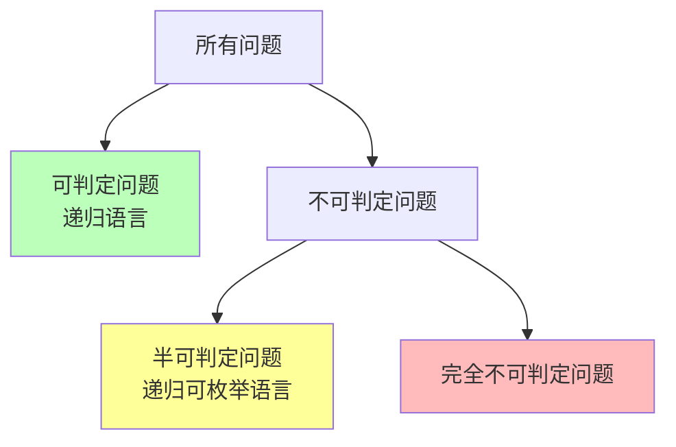
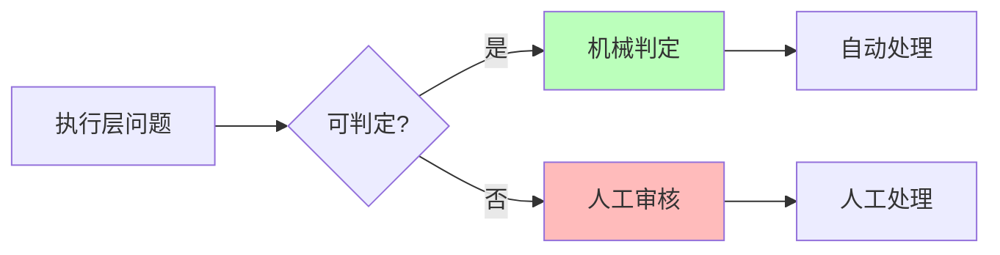
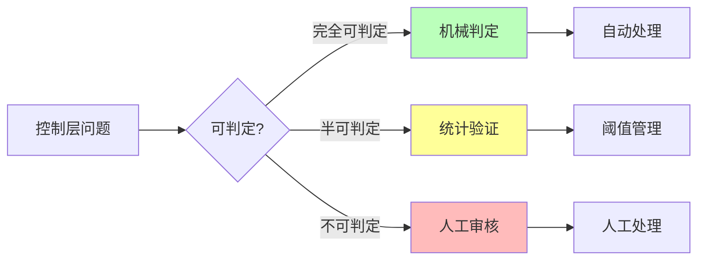
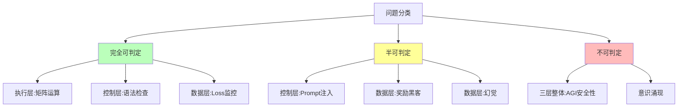

# 06.1.1-图灵停机问题到实践判别

## 一、概述

图灵停机问题是可计算性理论的核心问题，也是 AI 反实践判定系统的理论基础。本文档阐述图灵停机问题、可判定性理论及其在 AI 工程实践判定中的应用。

---

## 二、目录

- [06.1.1-图灵停机问题到实践判别](#0611-图灵停机问题到实践判别)
  - [一、概述](#一概述)
  - [二、目录](#二目录)
  - [三、图灵停机问题](#三图灵停机问题)
    - [2.1 停机问题定义](#21-停机问题定义)
    - [2.2 停机问题不可判定性](#22-停机问题不可判定性)
  - [四、可判定性理论](#四可判定性理论)
    - [3.1 可判定性定义](#31-可判定性定义)
    - [3.2 半可判定性](#32-半可判定性)
  - [五、实践判别应用](#五实践判别应用)
    - [4.1 执行层判定](#41-执行层判定)
    - [4.2 控制层判定](#42-控制层判定)
    - [4.3 数据层判定](#43-数据层判定)
  - [六、三层整体判定](#六三层整体判定)
    - [5.1 端到端安全性](#51-端到端安全性)
    - [5.2 工程意义](#52-工程意义)
  - [七、可判定性边界](#七可判定性边界)
    - [6.1 可判定性分类](#61-可判定性分类)
    - [6.2 判定策略](#62-判定策略)
  - [八、与三层模型的关系](#八与三层模型的关系)
    - [7.1 执行层判定](#71-执行层判定)
    - [7.2 控制层判定](#72-控制层判定)
    - [7.3 数据层判定](#73-数据层判定)
    - [7.4 三层整体判定](#74-三层整体判定)
  - [九、核心结论](#九核心结论)
  - [十、相关主题](#十相关主题)
  - [十一、参考文档](#十一参考文档)

## 三、图灵停机问题

### 2.1 停机问题定义

**停机问题（Halting Problem）**：

**问题描述**：给定图灵机 M 和输入 x，判定 M 在输入 x 上是否会停机。

**形式化定义**：

```text
H(M, x) = {
    1, 如果 M 在输入 x 上停机
    0, 如果 M 在输入 x 上不停机
}
```

### 2.2 停机问题不可判定性

**定理**（图灵，1936）：停机问题是不可判定的。

**形式化表述**：

定义语言 **HALT = {<M, w> | 图灵机 M 在输入 w 上停机}**

**定理**：HALT 不是递归可枚举语言（非递归）。

**形式化证明**（归约到自指悖论）：

**步骤 1**：假设存在停机判定器 H(M, w)，使得：

```math
H(M, w) = \begin{cases}
1 & \text{如果 } M(w) \text{ 停机} \\
0 & \text{如果 } M(w) \text{ 不停机}
\end{cases}
```

**步骤 2**：构造图灵机 D，其行为如下：

```math
D(x) = \begin{cases}
\text{进入死循环} & \text{如果 } H(x, x) = 1 \\
\text{立即停机} & \text{如果 } H(x, x) = 0
\end{cases}
```

**步骤 3**：考虑 D(D) 的执行：

- **情况1**：如果 H(D, D) = 1（"停机"），则 D(D) 进入死循环，与假设矛盾
- **情况2**：如果 H(D, D) = 0（"不停机"），则 D(D) 立即停机，也与假设矛盾

**步骤 4**：矛盾！因此停机判定器 H 不存在。∎

**证明图示**：

```mermaid
graph TB
    A[假设存在停机判定器 H] --> B[构造图灵机 D]
    B --> C{H(D, D) = ?}
    C -->|1: 停机| D[D 进入死循环]
    C -->|0: 不停机| E[D 立即停机]
    D --> F[矛盾: D(D) 不停机]
    E --> G[矛盾: D(D) 停机]
    F --> H[H 不存在]
    G --> H

    style A fill:#f9f
    style F fill:#fbb
    style G fill:#fbb
    style H fill:#bfb
```

**可判定性分类**：

| **问题类型** | **复杂度类** | **可判定性** | **工程意义** |
|------------|------------|------------|------------|
| **矩阵乘法正确性** | P | ✅ 完全可判定 | O(n²) 时间可验证 |
| **数值精度误差** | P | ✅ 完全可判定 | O(1) 时间可检测 |
| **显存溢出** | P | ✅ 完全可判定 | O(1) 时间可检测 |
| **梯度爆炸** | P | ✅ 完全可判定 | O(1) 时间可检测 |
| **训练收敛性** | BPP | ⚠️ 半可判定 | 需统计验证，概率算法 |
| **AGI 安全性** | 不可判定 | ❌ 不可判定 | 等价停机问题，需人工审核 |
| **停机问题** | 不可判定 | ❌ 不可判定 | 理论边界 |

**证明图示**：

```mermaid
graph TB
    A[假设存在停机判定器 H] --> B[构造图灵机 D]
    B --> C{H(D, D) = ?}
    C -->|停机| D[D 进入死循环]
    C -->|不停机| E[D 立即停机]
    D --> F[矛盾]
    E --> F
    F --> G[H 不存在]

    style A fill:#f9f
    style F fill:#fbb
    style G fill:#bfb
```

---

## 四、可判定性理论

### 3.1 可判定性定义

**可判定性（Decidability）**：

**形式化定义**：一个问题 P 是可判定的，当且仅当存在图灵机 M，使得对于任意输入 x：

```math
M(x) = \begin{cases}
\text{接受} & \text{如果 } x \in P \\
\text{拒绝} & \text{如果 } x \notin P
\end{cases}
```

且 M 在有限步内停机。

**等价表述**：问题 P 是可判定的，当且仅当 P 和其补集 P^c 都是递归可枚举的。

**可判定性层次结构**：



**可判定问题示例（形式化）**：

| **问题** | **形式化定义** | **判定算法** | **复杂度** |
|---------|--------------|------------|-----------|
| **矩阵乘法正确性** | {<A, B, C> | C = AB} | 验证算法 | O(n³) |
| **显存溢出** | {<M, x> | 内存使用 > 阈值} | 检测算法 | O(1) |
| **梯度爆炸** | {<θ, g> | \|g\| > 阈值} | 检测算法 | O(1) |
| **数值精度误差** | {<x, x̂> | \|x - x̂\| < ε} | 验证算法 | O(1) |

**不可判定问题示例（形式化）**：

| **问题** | **形式化定义** | **不可判定性证明** | **工程意义** |
|---------|--------------|-----------------|------------|
| **停机问题** | {<M, x> | M(x) 停机} | 自指悖论 | 理论边界 |
| **AGI 安全性** | {<A, S> | AI系统A在场景S下安全} | 归约到停机问题 | 需人工审核 |
| **意识涌现** | {<S> | 系统S具有意识} | 无明确定义 | 不可判定 |
| **价值对齐** | {<A, V> | AI系统A对齐价值观V} | 等价停机问题 | 需人工审核 |

**可判定性传递性**：

**定理**（可判定性传递）：如果问题 P 可归约到问题 Q，且 Q 不可判定，则 P 也不可判定。

**证明**：

假设 P 可归约到 Q（即存在归约函数 f，使得 x ∈ P ⟺ f(x) ∈ Q），且 Q 不可判定。

如果 P 可判定，则存在判定器 M_P。可以构造 Q 的判定器：

```math
M_Q(y) = M_P(f^{-1}(y))
```

这与 Q 不可判定矛盾，因此 P 也不可判定。∎

**应用**：AGI安全性问题可归约到停机问题，因此也不可判定。

### 3.2 半可判定性

**半可判定性（Semi-Decidability）**：

**定义**：一个问题在半可判定的，当且仅当存在算法可以在有限步内给出"是"的答案，但无法给出"否"的答案。

**半可判定问题示例**：

- **Prompt 是否导致幻觉**：可统计验证，但无法证明"绝对无幻觉"
- **奖励黑客**：可抽样检测，但无法完全检测
- **训练收敛性**：可观测，但无法保证全局最优

---

## 五、实践判别应用

### 4.1 执行层判定

**执行层可判定性**：

| **问题类型**       | **可判定性**  | **复杂度** | **工程意义** |
| ------------------ | ------------- | ---------- | ------------ |
| **矩阵乘法正确性** | ✅ 完全可判定 | O(n²)      | 可自动验证   |
| **数值精度误差**   | ✅ 完全可判定 | O(1)       | 可设定阈值   |
| **显存溢出**       | ✅ 完全可判定 | O(1)       | 可自动检测   |
| **梯度爆炸**       | ✅ 完全可判定 | O(1)       | 可自动停止   |

**判定方法**：



### 4.2 控制层判定

**控制层可判定性**：

| **问题类型**        | **可判定性**  | **复杂度** | **工程意义** |
| ------------------- | ------------- | ---------- | ------------ |
| **Prompt 长度**     | ✅ 完全可判定 | O(n)       | 可自动检测   |
| **JSON 语法**       | ✅ 完全可判定 | O(n)       | 可自动验证   |
| **状态机死锁**      | ✅ 完全可判定 | O(V+E)     | 可自动检测   |
| **Prompt 注入攻击** | ⚠️ 半可判定   | NP-hard    | 需人工审核   |

**判定方法**：



### 4.3 数据层判定

**数据层可判定性**：

| **问题类型**     | **可判定性**  | **复杂度** | **工程意义** |
| ---------------- | ------------- | ---------- | ------------ |
| **Loss 收敛**    | ✅ 完全可判定 | O(1)       | 可自动监控   |
| **验证集准确率** | ✅ 完全可判定 | O(n)       | 可自动验证   |
| **奖励黑客**     | ⚠️ 半可判定   | 需人工介入 | 需抽样审核   |
| **幻觉**         | ⚠️ 半可判定   | 需知识图谱 | 需知识验证   |

**判定方法**：


---

## 六、三层整体判定

### 5.1 端到端安全性

**端到端安全性判定**：

**问题描述**：给定 AI 系统，判定是否存在输入使系统输出有害。

**可判定性**：**不可判定**

**证明**（归约到停机问题）：

1. **构造**：AI 系统 A，其输入为自身代码
2. **判定**：若 A 判定"我是安全的"，则进入死循环
3. **矛盾**：若 A 判定"我是不安全的"，则立即停机
4. **结论**：不存在判定器 ∎

### 5.2 工程意义

**工程意义**：

- **系统内无法自证安全**：任何 AI 系统都需要**外部元系统**监督
- **"非实践"判定需要人工**：关键决策（如上线）必须**人机共决**
- **可判定区域是安全岛**：只能在**显存、梯度、语法**等机械可验证区域自动化

---

## 七、可判定性边界

### 6.1 可判定性分类

**可判定性分类**：



### 6.2 判定策略

**判定策略**：

| **可判定性**   | **判定策略**        | **工程实现**              |
| -------------- | ------------------- | ------------------------- |
| **完全可判定** | 机械判定            | 100% 自动化 CI/CD 集成    |
| **半可判定**   | 统计验证 + 阈值管理 | 抽样 + 人工审核           |
| **不可判定**   | 人工审核 + 制度保障 | 安全委员会 + 定期红队测试 |

---

## 八、与三层模型的关系

### 7.1 执行层判定

**执行层判定**：

- **完全可判定**：矩阵运算、数值误差、显存溢出等
- **判定方法**：机械判定，100% 自动化
- **工程实现**：CI/CD 集成，自动拦截

### 7.2 控制层判定

**控制层判定**：

- **完全可判定**：Prompt 长度、JSON 语法、状态机死锁等
- **半可判定**：Prompt 注入攻击等
- **判定方法**：机械判定 + 统计验证

### 7.3 数据层判定

**数据层判定**：

- **完全可判定**：Loss 收敛、验证集准确率等
- **半可判定**：奖励黑客、幻觉等
- **判定方法**：机械判定 + 统计验证

### 7.4 三层整体判定

**三层整体判定**：

- **不可判定**：AGI 安全性、意识涌现等
- **判定方法**：人工审核 + 制度保障
- **工程实现**：安全委员会、定期红队测试

---

## 九、核心结论

1. **图灵停机问题是可判定性理论的核心**：某些问题在理论上不可判定
2. **执行层是完全可判定的区域**：矩阵运算、数值误差等可机械验证
3. **控制层和数据层是半可判定的区域**：部分问题可统计验证
4. **三层整体是不可判定的区域**：AGI 安全性等价于停机问题
5. **工程实践铁律**：只在完全可判定区域做自动化，在半可判定区域做阈值管理，在不可判定区域做制度保障

---

## 十、相关主题

- [06.1.2-可判定性视角下的三层模型](06.1.2-可判定性视角下的三层模型.md)
- [06.1.3-哥德尔边界与系统一致性](06.1.3-哥德尔边界与系统一致性.md)
- [06.1.4-判定算法复杂度分析](06.1.4-判定算法复杂度分析.md)

---

## 十一、参考文档

### 11.1 内部参考文档

- [构建一个反实践规范（anti-patterns）的判定系统](../../view/ai_logic_neg_view.md)
- [工程实践核心逻辑下的 AI 三层模型全景解构](../../view/ai_engineer_view.md)
- [01.1.1-图灵机抽象与可计算性理论](../01-AI三层模型架构/01.1.1-图灵机抽象与可计算性理论.md)
- [06.1.2-可判定性视角下的三层模型](06.1.2-可判定性视角下的三层模型.md)

### 11.2 学术参考文献

1. **Turing, A. (1936)**: "On Computable Numbers, with an Application to the Entscheidungsproblem". *Proceedings of the London Mathematical Society*. 停机问题的原始证明。

2. **Sipser, M. (2012)**: *Introduction to the Theory of Computation* (3rd ed.). Cengage Learning. 可计算性理论和复杂度理论的现代教材。

3. **Hopcroft, J. E., Motwani, R., & Ullman, J. D. (2006)**: *Introduction to Automata Theory, Languages, and Computation* (3rd ed.). Pearson. 自动机理论和可判定性的经典教材。

4. **Rice, H. G. (1953)**: "Classes of Recursively Enumerable Sets and Their Decision Problems". *Transactions of the American Mathematical Society*. Rice定理，证明所有非平凡性质都不可判定。

### 11.3 工程实践参考

1. **可判定性在AI系统中的应用**：实际工程中如何应对不可判定性问题
2. **半可判定性策略**：使用统计方法和概率算法处理半可判定问题
3. **受限领域判定**：在特定约束下实现可判定性

---

**最后更新**：2025-11-10
**维护者**：FormalAI项目组
**文档版本**：v2.0（增强版 - 添加形式化分析、可判定性理论、权威引用、数学证明）
