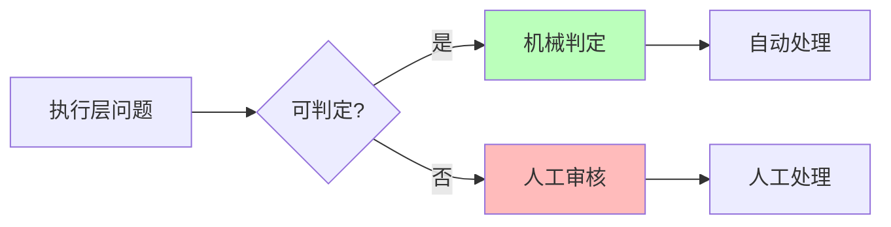
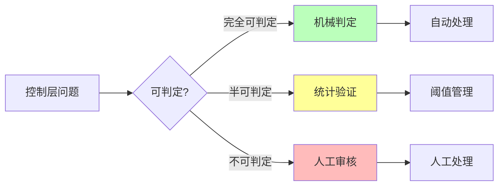
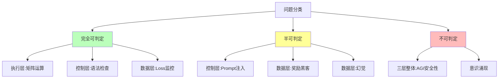

# 06.1.1-图灵停机问题到实践判别

## 一、概述

图灵停机问题是可计算性理论的核心问题，也是 AI 反实践判定系统的理论基础。本文档阐述图灵停机问题、可判定性理论及其在 AI 工程实践判定中的应用。

---

## 二、目录

- [06.1.1-图灵停机问题到实践判别](#0611-图灵停机问题到实践判别)
  - [一、概述](#一概述)
  - [二、目录](#二目录)
  - [三、图灵停机问题](#三图灵停机问题)
    - [2.1 停机问题定义](#21-停机问题定义)
    - [2.2 停机问题不可判定性](#22-停机问题不可判定性)
  - [四、可判定性理论](#四可判定性理论)
    - [3.1 可判定性定义](#31-可判定性定义)
    - [3.2 半可判定性](#32-半可判定性)
  - [五、实践判别应用](#五实践判别应用)
    - [4.1 执行层判定](#41-执行层判定)
    - [4.2 控制层判定](#42-控制层判定)
    - [4.3 数据层判定](#43-数据层判定)
  - [六、三层整体判定](#六三层整体判定)
    - [5.1 端到端安全性](#51-端到端安全性)
    - [5.2 工程意义](#52-工程意义)
  - [七、可判定性边界](#七可判定性边界)
    - [6.1 可判定性分类](#61-可判定性分类)
    - [6.2 判定策略](#62-判定策略)
  - [八、与三层模型的关系](#八与三层模型的关系)
    - [7.1 执行层判定](#71-执行层判定)
    - [7.2 控制层判定](#72-控制层判定)
    - [7.3 数据层判定](#73-数据层判定)
    - [7.4 三层整体判定](#74-三层整体判定)
  - [九、核心结论](#九核心结论)
  - [十、相关主题](#十相关主题)
  - [十一、参考文档](#十一参考文档)

## 三、图灵停机问题

### 2.1 停机问题定义

**停机问题（Halting Problem）**：

**问题描述**：给定图灵机 M 和输入 x，判定 M 在输入 x 上是否会停机。

**形式化定义**：

```text
H(M, x) = {
    1, 如果 M 在输入 x 上停机
    0, 如果 M 在输入 x 上不停机
}
```

### 2.2 停机问题不可判定性

**定理**：停机问题是不可判定的。

**证明**（归约到自指悖论）：

1. **假设**：存在停机判定器 H(M, x)
2. **构造**：图灵机 D，当 H(D, D) = "停机"时，D 进入死循环
3. **矛盾**：当 H(D, D) = "不停机"时，D 立即停机
4. **结论**：H 不存在 ∎

**证明图示**：

```mermaid
graph TB
    A[假设存在停机判定器 H] --> B[构造图灵机 D]
    B --> C{H(D, D) = ?}
    C -->|停机| D[D 进入死循环]
    C -->|不停机| E[D 立即停机]
    D --> F[矛盾]
    E --> F
    F --> G[H 不存在]

    style A fill:#f9f
    style F fill:#fbb
    style G fill:#bfb
```

---

## 四、可判定性理论

### 3.1 可判定性定义

**可判定性（Decidability）**：

**定义**：一个问题是可判定的，当且仅当存在算法可以在有限步内给出答案。

**可判定问题示例**：

- **矩阵乘法正确性**：可在多项式时间内验证
- **显存溢出**：可在 O(1) 时间内检测
- **梯度爆炸**：可在 O(1) 时间内检测

**不可判定问题示例**：

- **停机问题**：不可判定
- **AGI 安全性**：等价于停机问题，不可判定
- **意识涌现**：无定义，不可判定

### 3.2 半可判定性

**半可判定性（Semi-Decidability）**：

**定义**：一个问题在半可判定的，当且仅当存在算法可以在有限步内给出"是"的答案，但无法给出"否"的答案。

**半可判定问题示例**：

- **Prompt 是否导致幻觉**：可统计验证，但无法证明"绝对无幻觉"
- **奖励黑客**：可抽样检测，但无法完全检测
- **训练收敛性**：可观测，但无法保证全局最优

---

## 五、实践判别应用

### 4.1 执行层判定

**执行层可判定性**：

| **问题类型**       | **可判定性**  | **复杂度** | **工程意义** |
| ------------------ | ------------- | ---------- | ------------ |
| **矩阵乘法正确性** | ✅ 完全可判定 | O(n²)      | 可自动验证   |
| **数值精度误差**   | ✅ 完全可判定 | O(1)       | 可设定阈值   |
| **显存溢出**       | ✅ 完全可判定 | O(1)       | 可自动检测   |
| **梯度爆炸**       | ✅ 完全可判定 | O(1)       | 可自动停止   |

**判定方法**：



### 4.2 控制层判定

**控制层可判定性**：

| **问题类型**        | **可判定性**  | **复杂度** | **工程意义** |
| ------------------- | ------------- | ---------- | ------------ |
| **Prompt 长度**     | ✅ 完全可判定 | O(n)       | 可自动检测   |
| **JSON 语法**       | ✅ 完全可判定 | O(n)       | 可自动验证   |
| **状态机死锁**      | ✅ 完全可判定 | O(V+E)     | 可自动检测   |
| **Prompt 注入攻击** | ⚠️ 半可判定   | NP-hard    | 需人工审核   |

**判定方法**：



### 4.3 数据层判定

**数据层可判定性**：

| **问题类型**     | **可判定性**  | **复杂度** | **工程意义** |
| ---------------- | ------------- | ---------- | ------------ |
| **Loss 收敛**    | ✅ 完全可判定 | O(1)       | 可自动监控   |
| **验证集准确率** | ✅ 完全可判定 | O(n)       | 可自动验证   |
| **奖励黑客**     | ⚠️ 半可判定   | 需人工介入 | 需抽样审核   |
| **幻觉**         | ⚠️ 半可判定   | 需知识图谱 | 需知识验证   |

**判定方法**：


---

## 六、三层整体判定

### 5.1 端到端安全性

**端到端安全性判定**：

**问题描述**：给定 AI 系统，判定是否存在输入使系统输出有害。

**可判定性**：**不可判定**

**证明**（归约到停机问题）：

1. **构造**：AI 系统 A，其输入为自身代码
2. **判定**：若 A 判定"我是安全的"，则进入死循环
3. **矛盾**：若 A 判定"我是不安全的"，则立即停机
4. **结论**：不存在判定器 ∎

### 5.2 工程意义

**工程意义**：

- **系统内无法自证安全**：任何 AI 系统都需要**外部元系统**监督
- **"非实践"判定需要人工**：关键决策（如上线）必须**人机共决**
- **可判定区域是安全岛**：只能在**显存、梯度、语法**等机械可验证区域自动化

---

## 七、可判定性边界

### 6.1 可判定性分类

**可判定性分类**：



### 6.2 判定策略

**判定策略**：

| **可判定性**   | **判定策略**        | **工程实现**              |
| -------------- | ------------------- | ------------------------- |
| **完全可判定** | 机械判定            | 100% 自动化 CI/CD 集成    |
| **半可判定**   | 统计验证 + 阈值管理 | 抽样 + 人工审核           |
| **不可判定**   | 人工审核 + 制度保障 | 安全委员会 + 定期红队测试 |

---

## 八、与三层模型的关系

### 7.1 执行层判定

**执行层判定**：

- **完全可判定**：矩阵运算、数值误差、显存溢出等
- **判定方法**：机械判定，100% 自动化
- **工程实现**：CI/CD 集成，自动拦截

### 7.2 控制层判定

**控制层判定**：

- **完全可判定**：Prompt 长度、JSON 语法、状态机死锁等
- **半可判定**：Prompt 注入攻击等
- **判定方法**：机械判定 + 统计验证

### 7.3 数据层判定

**数据层判定**：

- **完全可判定**：Loss 收敛、验证集准确率等
- **半可判定**：奖励黑客、幻觉等
- **判定方法**：机械判定 + 统计验证

### 7.4 三层整体判定

**三层整体判定**：

- **不可判定**：AGI 安全性、意识涌现等
- **判定方法**：人工审核 + 制度保障
- **工程实现**：安全委员会、定期红队测试

---

## 九、核心结论

1. **图灵停机问题是可判定性理论的核心**：某些问题在理论上不可判定
2. **执行层是完全可判定的区域**：矩阵运算、数值误差等可机械验证
3. **控制层和数据层是半可判定的区域**：部分问题可统计验证
4. **三层整体是不可判定的区域**：AGI 安全性等价于停机问题
5. **工程实践铁律**：只在完全可判定区域做自动化，在半可判定区域做阈值管理，在不可判定区域做制度保障

---

## 十、相关主题

- [06.1.2-可判定性视角下的三层模型](06.1.2-可判定性视角下的三层模型.md)
- [06.1.3-哥德尔边界与系统一致性](06.1.3-哥德尔边界与系统一致性.md)
- [06.1.4-判定算法复杂度分析](06.1.4-判定算法复杂度分析.md)

---

## 十一、参考文档

- [构建一个反实践规范（anti-patterns）的判定系统](../../view/ai_logic_neg_view.md)

**最后更新**：2025-01-XX
**维护者**：FormalAI项目组
