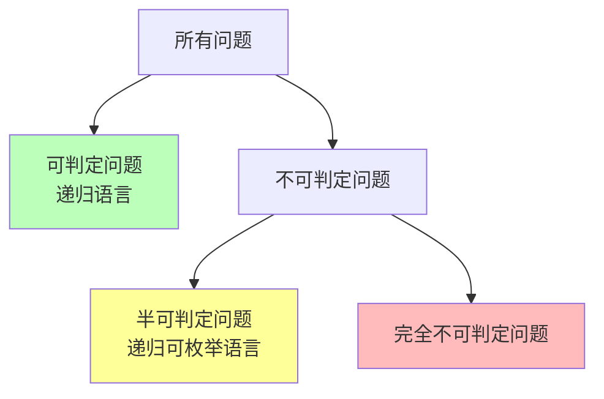
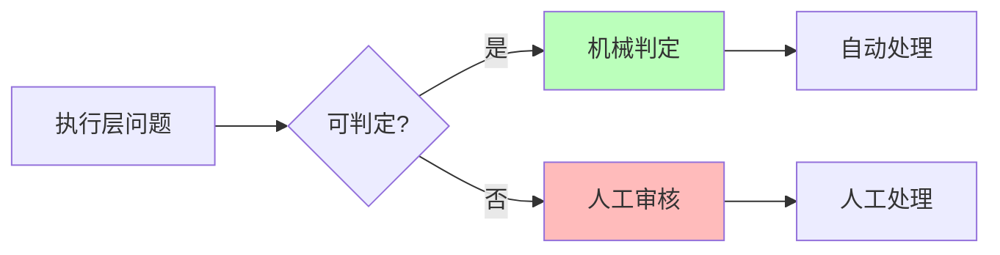
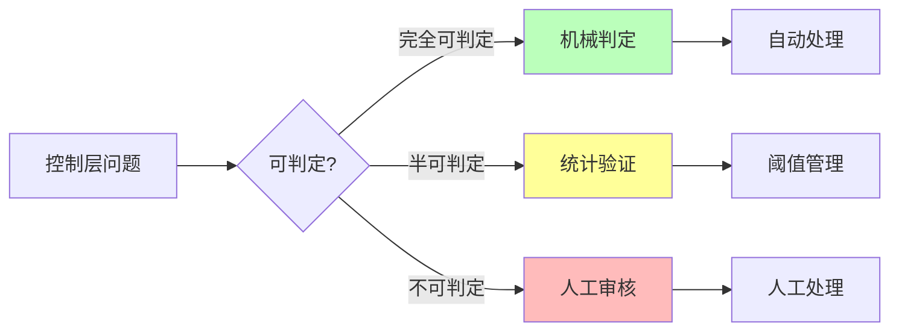
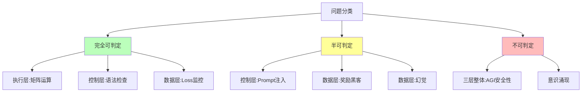

# 06.1.1-图灵停机问题到实践判别

## 一、概述

图灵停机问题是可计算性理论的核心问题，也是 AI 反实践判定系统的理论基础。本文档阐述图灵停机问题、可判定性理论及其在 AI 工程实践判定中的应用。

---

## 二、目录

- [06.1.1-图灵停机问题到实践判别](#0611-图灵停机问题到实践判别)
  - [一、概述](#一概述)
  - [二、目录](#二目录)
  - [三、核心形式化理论](#三核心形式化理论)
    - [3.1 停机问题的形式化定义](#31-停机问题的形式化定义)
    - [3.2 停机问题不可判定性定理](#32-停机问题不可判定性定理)
  - [四、图灵停机问题](#四图灵停机问题)
    - [4.1 停机问题定义](#41-停机问题定义)
    - [4.2 停机问题不可判定性](#42-停机问题不可判定性)
  - [五、可判定性理论](#五可判定性理论)
    - [5.1 可判定性定义](#51-可判定性定义)
    - [5.2 半可判定性](#52-半可判定性)
  - [六、实践判别应用](#六实践判别应用)
    - [6.1 执行层判定](#61-执行层判定)
    - [6.2 控制层判定](#62-控制层判定)
    - [6.3 数据层判定](#63-数据层判定)
  - [七、三层整体判定](#七三层整体判定)
    - [7.1 端到端安全性](#71-端到端安全性)
    - [7.2 工程意义](#72-工程意义)
  - [八、可判定性边界](#八可判定性边界)
    - [8.1 可判定性分类](#81-可判定性分类)
    - [8.2 判定策略](#82-判定策略)
  - [九、与三层模型的关系](#九与三层模型的关系)
    - [9.1 执行层判定](#91-执行层判定)
    - [9.2 控制层判定](#92-控制层判定)
    - [9.3 数据层判定](#93-数据层判定)
    - [9.4 三层整体判定](#94-三层整体判定)
  - [十、核心结论](#十核心结论)
  - [十一、相关主题](#十一相关主题)
  - [十二、参考文档](#十二参考文档)
    - [12.1 内部参考文档](#121-内部参考文档)
    - [12.2 学术参考文献](#122-学术参考文献)
    - [12.3 工程实践参考](#123-工程实践参考)

## 三、核心形式化理论

### 3.1 停机问题的形式化定义

**定义**（停机问题）：给定图灵机 $M$ 和输入 $x$，判定 $M$ 在输入 $x$ 上是否会停机。

**形式化表述**：

$$\text{Halt}(M, x) = \begin{cases}
1 & \text{如果 } M(x) \text{ 停机} \\
0 & \text{如果 } M(x) \text{ 不停机}
\end{cases}$$

### 3.2 停机问题不可判定性定理

**定理**（停机问题不可判定性）：停机问题是不可判定的。

**形式化表述**：

$$\text{Halt} \notin \text{Decidable}$$

**证明**（归约到自指悖论）：

**步骤1**：假设存在停机判定器 $H(M, w)$

**步骤2**：构造图灵机 $D$，使得：

$$D(x) = \begin{cases}
\text{进入死循环} & \text{如果 } H(x, x) = 1 \\
\text{立即停机} & \text{如果 } H(x, x) = 0
\end{cases}$$

**步骤3**：考虑 $D(D)$ 的执行：

- 如果 $H(D, D) = 1$，则 $D(D)$ 进入死循环，矛盾
- 如果 $H(D, D) = 0$，则 $D(D)$ 立即停机，矛盾

**结论**：停机判定器 $H$ 不存在。∎

---

## 四、图灵停机问题

### 4.1 停机问题定义

**停机问题（Halting Problem）**：

**问题描述**：给定图灵机 M 和输入 x，判定 M 在输入 x 上是否会停机。

**形式化定义**：

```text
H(M, x) = {
    1, 如果 M 在输入 x 上停机
    0, 如果 M 在输入 x 上不停机
}
```

### 4.2 停机问题不可判定性

**定理**（图灵，1936）：停机问题是不可判定的。

**形式化表述**：

定义语言 **HALT = {<M, w> | 图灵机 M 在输入 w 上停机}**

**定理**：HALT 不是递归可枚举语言（非递归）。

**形式化证明**（归约到自指悖论）：

**步骤 1**：假设存在停机判定器 H(M, w)，使得：

```math
H(M, w) = \begin{cases}
1 & \text{如果 } M(w) \text{ 停机} \\
0 & \text{如果 } M(w) \text{ 不停机}
\end{cases}
```

**步骤 2**：构造图灵机 D，其行为如下：

```math
D(x) = \begin{cases}
\text{进入死循环} & \text{如果 } H(x, x) = 1 \\
\text{立即停机} & \text{如果 } H(x, x) = 0
\end{cases}
```

**步骤 3**：考虑 D(D) 的执行：

- **情况1**：如果 H(D, D) = 1（"停机"），则 D(D) 进入死循环，与假设矛盾
- **情况2**：如果 H(D, D) = 0（"不停机"），则 D(D) 立即停机，也与假设矛盾

**步骤 4**：矛盾！因此停机判定器 H 不存在。∎

**证明图示**：

```mermaid
graph TB
    A[假设存在停机判定器 H] --> B[构造图灵机 D]
    B --> C{H(D, D) = ?}
    C -->|1: 停机| D[D 进入死循环]
    C -->|0: 不停机| E[D 立即停机]
    D --> F[矛盾: D(D) 不停机]
    E --> G[矛盾: D(D) 停机]
    F --> H[H 不存在]
    G --> H

    style A fill:#f9f
    style F fill:#fbb
    style G fill:#fbb
    style H fill:#bfb
```

**可判定性分类**：

| **问题类型** | **复杂度类** | **可判定性** | **工程意义** |
|------------|------------|------------|------------|
| **矩阵乘法正确性** | P | ✅ 完全可判定 | O(n²) 时间可验证 |
| **数值精度误差** | P | ✅ 完全可判定 | O(1) 时间可检测 |
| **显存溢出** | P | ✅ 完全可判定 | O(1) 时间可检测 |
| **梯度爆炸** | P | ✅ 完全可判定 | O(1) 时间可检测 |
| **训练收敛性** | BPP | ⚠️ 半可判定 | 需统计验证，概率算法 |
| **AGI 安全性** | 不可判定 | ❌ 不可判定 | 等价停机问题，需人工审核 |
| **停机问题** | 不可判定 | ❌ 不可判定 | 理论边界 |

**证明图示**：

```mermaid
graph TB
    A[假设存在停机判定器 H] --> B[构造图灵机 D]
    B --> C{H(D, D) = ?}
    C -->|停机| D[D 进入死循环]
    C -->|不停机| E[D 立即停机]
    D --> F[矛盾]
    E --> F
    F --> G[H 不存在]

    style A fill:#f9f
    style F fill:#fbb
    style G fill:#bfb
```

---

## 五、可判定性理论

### 5.1 可判定性定义

**可判定性（Decidability）**：

**形式化定义**：一个问题 P 是可判定的，当且仅当存在图灵机 M，使得对于任意输入 x：

```math
M(x) = \begin{cases}
\text{接受} & \text{如果 } x \in P \\
\text{拒绝} & \text{如果 } x \notin P
\end{cases}
```

且 M 在有限步内停机。

**等价表述**：问题 P 是可判定的，当且仅当 P 和其补集 P^c 都是递归可枚举的。

**可判定性层次结构**：



**可判定问题示例（形式化）**：

| **问题** | **形式化定义** | **判定算法** | **复杂度** |
|---------|--------------|------------|-----------|
| **矩阵乘法正确性** | {<A, B, C> | C = AB} | 验证算法 | O(n³) |
| **显存溢出** | {<M, x> | 内存使用 > 阈值} | 检测算法 | O(1) |
| **梯度爆炸** | {<θ, g> | \|g\| > 阈值} | 检测算法 | O(1) |
| **数值精度误差** | {<x, x̂> | \|x - x̂\| < ε} | 验证算法 | O(1) |

**不可判定问题示例（形式化）**：

| **问题** | **形式化定义** | **不可判定性证明** | **工程意义** |
|---------|--------------|-----------------|------------|
| **停机问题** | {<M, x> | M(x) 停机} | 自指悖论 | 理论边界 |
| **AGI 安全性** | {<A, S> | AI系统A在场景S下安全} | 归约到停机问题 | 需人工审核 |
| **意识涌现** | {<S> | 系统S具有意识} | 无明确定义 | 不可判定 |
| **价值对齐** | {<A, V> | AI系统A对齐价值观V} | 等价停机问题 | 需人工审核 |

**可判定性传递性**：

**定理**（可判定性传递）：如果问题 P 可归约到问题 Q，且 Q 不可判定，则 P 也不可判定。

**证明**：

假设 P 可归约到 Q（即存在归约函数 f，使得 x ∈ P ⟺ f(x) ∈ Q），且 Q 不可判定。

如果 P 可判定，则存在判定器 M_P。可以构造 Q 的判定器：

```math
M_Q(y) = M_P(f^{-1}(y))
```

这与 Q 不可判定矛盾，因此 P 也不可判定。∎

**应用**：AGI安全性问题可归约到停机问题，因此也不可判定。

### 5.2 半可判定性

**半可判定性（Semi-Decidability）**：

**定义**：一个问题在半可判定的，当且仅当存在算法可以在有限步内给出"是"的答案，但无法给出"否"的答案。

**半可判定问题示例**：

- **Prompt 是否导致幻觉**：可统计验证，但无法证明"绝对无幻觉"
- **奖励黑客**：可抽样检测，但无法完全检测
- **训练收敛性**：可观测，但无法保证全局最优

---

## 六、实践判别应用

### 6.1 执行层判定

**执行层可判定性**：

| **问题类型**       | **可判定性**  | **复杂度** | **工程意义** |
| ------------------ | ------------- | ---------- | ------------ |
| **矩阵乘法正确性** | ✅ 完全可判定 | O(n²)      | 可自动验证   |
| **数值精度误差**   | ✅ 完全可判定 | O(1)       | 可设定阈值   |
| **显存溢出**       | ✅ 完全可判定 | O(1)       | 可自动检测   |
| **梯度爆炸**       | ✅ 完全可判定 | O(1)       | 可自动停止   |

**实际案例**：

**案例1：FP8 vs BF16 数值精度判定**

在 Transformer 训练中，使用 FP8 精度可能导致数值误差累积。

**判定代码示例**：

```python
def check_numerical_precision(W, X, threshold=1e-6):
    """
    判定矩阵运算精度误差是否超过阈值
    复杂度：O(n²)
    """
    # 计算 FP8 和 BF16 的数值差异
    result_fp8 = compute_fp8(W, X)
    result_bf16 = compute_bf16(W, X)
    error = abs(result_fp8 - result_bf16)

    # 完全可判定：机械验证
    if error > threshold:
        return "反实践：数值精度误差超过阈值"
    return "实践：数值精度在允许范围内"
```

**工程应用**：在 PyTorch 训练流程中自动集成，每次前向传播后自动检测。

**案例2：显存溢出自动检测**

**判定代码示例**：

```python
def check_memory_overflow(device, threshold=0.8):
    """
    判定显存占用是否超过阈值
    复杂度：O(1)
    """
    memory_used = torch.cuda.memory_allocated(device)
    memory_total = torch.cuda.get_device_properties(device).total_memory
    memory_ratio = memory_used / memory_total

    # 完全可判定：O(1) 监控
    if memory_ratio > threshold:
        return "反实践：显存占用超过80%"
    return "实践：显存占用正常"
```

**工程应用**：在训练循环中实时监控，自动触发梯度检查点或降低批次大小。

**案例3：梯度爆炸自动停止**

**判定代码示例**：

```python
def check_gradient_explosion(gradients, threshold=1e3):
    """
    判定梯度范数是否超过阈值
    复杂度：O(1)
    """
    grad_norm = torch.norm(torch.stack([g.norm() for g in gradients]))

    # 完全可判定：O(1) 自动监控
    if grad_norm > threshold:
        return "反实践：梯度爆炸，自动停止训练"
    return "实践：梯度范数正常"
```

**工程应用**：在反向传播后自动检测，触发梯度裁剪或学习率调整。

**案例4：CUDA 内核执行时间监控**

在 GPU 训练中，CUDA 内核执行时间异常可能导致性能瓶颈。

**判定代码示例**：

```python
def check_cuda_kernel_time(kernel_times, threshold_ms=100):
    """
    判定 CUDA 内核执行时间是否超过阈值
    复杂度：O(1)
    """
    max_time = max(kernel_times)

    # 完全可判定：O(1) 监控
    if max_time > threshold_ms:
        return f"反实践：CUDA 内核执行时间 {max_time}ms > {threshold_ms}ms"
    return f"实践：CUDA 内核执行时间正常 {max_time}ms"
```

**工程应用**：在训练循环中实时监控，自动触发性能优化或降级处理。

**案例5：数值下溢检测**

在深度学习中，数值下溢可能导致梯度消失。

**判定代码示例**：

```python
def check_numerical_underflow(tensor, threshold=1e-38):
    """
    判定张量是否存在数值下溢
    复杂度：O(n)
    """
    min_value = tensor.abs().min().item()

    # 完全可判定：O(n) 扫描
    if min_value < threshold and min_value > 0:
        return f"反实践：检测到数值下溢，最小值 {min_value} < {threshold}"
    return "实践：数值范围正常"
```

**工程应用**：在前向传播后自动检测，触发数值稳定性优化。

**案例6：批次大小合理性检查**

批次大小过大可能导致显存溢出，过小可能导致训练不稳定。

**判定代码示例**：

```python
def check_batch_size(batch_size, model_params, device_memory_gb):
    """
    判定批次大小是否合理
    复杂度：O(1)
    """
    # 估算所需显存（GB）
    estimated_memory = (batch_size * model_params * 4) / (1024**3)  # FP32

    # 完全可判定：O(1) 计算
    if estimated_memory > device_memory_gb * 0.8:
        return f"反实践：批次大小 {batch_size} 可能导致显存溢出（估算 {estimated_memory:.2f}GB）"
    elif batch_size < 1:
        return f"反实践：批次大小 {batch_size} 过小，可能导致训练不稳定"
    return f"实践：批次大小 {batch_size} 合理（估算显存 {estimated_memory:.2f}GB）"
```

**工程应用**：在训练开始前自动检查，避免运行时错误。

**判定方法**：



### 6.2 控制层判定

**控制层可判定性**：

| **问题类型**        | **可判定性**  | **复杂度** | **工程意义** |
| ------------------- | ------------- | ---------- | ------------ |
| **Prompt 长度**     | ✅ 完全可判定 | O(n)       | 可自动检测   |
| **JSON 语法**       | ✅ 完全可判定 | O(n)       | 可自动验证   |
| **状态机死锁**      | ✅ 完全可判定 | O(V+E)     | 可自动检测   |
| **Prompt 注入攻击** | ⚠️ 半可判定   | NP-hard    | 需人工审核   |

**实际案例**：

**案例1：Prompt 长度自动检测**

在 LLM API 调用中，Prompt 长度超过上下文窗口会导致截断或错误。

**判定代码示例**：

```python
def check_prompt_length(prompt, max_tokens=8192):
    """
    判定 Prompt token 数量是否超过上限
    复杂度：O(n) token 计数
    """
    token_count = len(tokenizer.encode(prompt))

    # 完全可判定：O(n) token 计数
    if token_count > max_tokens:
        return f"反实践：Prompt 长度 {token_count} > {max_tokens}"
    return f"实践：Prompt 长度 {token_count} 在允许范围内"
```

**工程应用**：在 API 网关层自动拦截，返回错误提示或自动截断。

**案例2：JSON 语法自动验证**

Function Calling 中，LLM 生成的 JSON 可能包含语法错误。

**判定代码示例**：

```python
def check_json_syntax(json_string):
    """
    判定 JSON 语法是否正确
    复杂度：O(n) 语法检查
    """
    try:
        json.loads(json_string)
        return "实践：JSON 语法正确"
    except json.JSONDecodeError as e:
        return f"反实践：JSON 语法错误 - {str(e)}"
```

**工程应用**：在 Function Calling 流程中自动验证，触发重试或降级处理。

**案例3：状态机死锁检测**

在 ReAct 循环中，状态机可能陷入死锁。

**判定代码示例**：

```python
def check_state_machine_deadlock(states, transitions):
    """
    判定状态机是否存在死锁
    复杂度：O(V+E) DFS
    """
    # 构建状态转移图
    graph = build_transition_graph(states, transitions)

    # DFS 检测不可达状态
    reachable = dfs_reachable_states(graph, start_state)
    unreachable = set(states) - reachable

    # 完全可判定：O(V+E) DFS
    if unreachable:
        return f"反实践：状态机存在死锁，不可达状态 {unreachable}"
    return "实践：状态机无死锁"
```

**工程应用**：在系统初始化时自动检测，或在运行时监控状态转移。

**案例4：Prompt 注入攻击检测（半可判定）**

**判定代码示例**：

```python
def check_prompt_injection(prompt, suspicious_patterns):
    """
    判定 Prompt 是否包含注入攻击
    复杂度：NP-hard（需枚举攻击模式）
    可判定性：半可判定（可检测已知模式，无法证明绝对安全）
    """
    detected_patterns = []
    for pattern in suspicious_patterns:
        if pattern in prompt.lower():
            detected_patterns.append(pattern)

    # 半可判定：可检测已知模式，但无法证明无未知攻击
    if detected_patterns:
        return f"反实践：检测到可疑注入模式 {detected_patterns}"
    return "实践：未检测到已知注入模式（但无法保证绝对安全）"
```

**工程应用**：在 Prompt 预处理阶段检测，结合人工审核和统计验证。

**案例5：Function Calling 参数验证**

在 Function Calling 中，LLM 生成的参数可能不符合函数签名要求。

**判定代码示例**：

```python
def check_function_calling_params(function_name, params, function_schema):
    """
    判定 Function Calling 参数是否符合函数签名
    复杂度：O(n) 参数验证
    """
    required_params = function_schema.get('required', [])
    param_types = function_schema.get('properties', {})

    # 检查必需参数
    missing_params = [p for p in required_params if p not in params]
    if missing_params:
        return f"反实践：缺少必需参数 {missing_params}"

    # 检查参数类型
    type_errors = []
    for param_name, param_value in params.items():
        if param_name in param_types:
            expected_type = param_types[param_name].get('type')
            actual_type = type(param_value).__name__
            if expected_type == 'integer' and actual_type != 'int':
                type_errors.append(f"{param_name}: 期望 int，实际 {actual_type}")

    # 完全可判定：O(n) 参数验证
    if type_errors:
        return f"反实践：参数类型错误 {type_errors}"
    return "实践：Function Calling 参数符合函数签名"
```

**工程应用**：在 Function Calling 流程中自动验证，触发重试或降级处理。

**案例6：ReAct 循环最大迭代次数检查**

在 ReAct 循环中，无限循环可能导致资源浪费。

**判定代码示例**：

```python
def check_react_loop_iterations(iteration_count, max_iterations=10):
    """
    判定 ReAct 循环迭代次数是否超过上限
    复杂度：O(1)
    """
    # 完全可判定：O(1) 计数检查
    if iteration_count > max_iterations:
        return f"反实践：ReAct 循环迭代次数 {iteration_count} > {max_iterations}，可能陷入死循环"
    return f"实践：ReAct 循环迭代次数 {iteration_count} 正常"
```

**工程应用**：在 ReAct 循环中实时监控，自动终止或触发人工介入。

**案例7：工具调用链深度检查**

工具调用链过深可能导致性能问题和难以调试。

**判定代码示例**：

```python
def check_tool_call_chain_depth(call_chain, max_depth=5):
    """
    判定工具调用链深度是否超过上限
    复杂度：O(n) 深度计算
    """
    depth = len(call_chain)

    # 完全可判定：O(n) 深度计算
    if depth > max_depth:
        return f"反实践：工具调用链深度 {depth} > {max_depth}，可能导致性能问题"
    return f"实践：工具调用链深度 {depth} 正常"
```

**工程应用**：在工具调用流程中实时监控，自动终止或触发优化。

**判定方法**：



### 6.3 数据层判定

**数据层可判定性**：

| **问题类型**     | **可判定性**  | **复杂度** | **工程意义** |
| ---------------- | ------------- | ---------- | ------------ |
| **Loss 收敛**    | ✅ 完全可判定 | O(1)       | 可自动监控   |
| **验证集准确率** | ✅ 完全可判定 | O(n)       | 可自动验证   |
| **奖励黑客**     | ⚠️ 半可判定   | 需人工介入 | 需抽样审核   |
| **幻觉**         | ⚠️ 半可判定   | 需知识图谱 | 需知识验证   |

**实际案例**：

**案例1：Loss 单调下降监控**

**判定代码示例**：

```python
def check_loss_monotonic_decrease(loss_history, window=3):
    """
    判定 Loss 是否单调下降
    复杂度：O(1) 监控
    """
    if len(loss_history) < window:
        return "实践：数据不足，无法判定"

    recent_losses = loss_history[-window:]
    is_increasing = all(recent_losses[i] > recent_losses[i-1]
                        for i in range(1, len(recent_losses)))

    # 完全可判定：O(1) 监控
    if is_increasing:
        return f"反实践：Loss 连续 {window} 步上升"
    return "实践：Loss 单调下降"
```

**工程应用**：在训练循环中自动监控，触发早停或学习率调整。

**案例2：验证集准确率自动验证**

**判定代码示例**：

```python
def check_validation_accuracy(model, val_loader, threshold=0.9):
    """
    判定验证集准确率是否达到阈值
    复杂度：O(n) 推理验证
    """
    correct = 0
    total = 0
    with torch.no_grad():
        for data, target in val_loader:
            output = model(data)
            correct += (output.argmax(1) == target).sum().item()
            total += target.size(0)

    accuracy = correct / total

    # 完全可判定：O(n) 推理验证
    if accuracy < threshold:
        return f"反实践：验证集准确率 {accuracy:.2%} < {threshold:.2%}"
    return f"实践：验证集准确率 {accuracy:.2%} >= {threshold:.2%}"
```

**工程应用**：在每个 epoch 结束后自动验证，决定是否继续训练或保存模型。

**案例3：奖励黑客检测（半可判定）**

在 RLHF 训练中，模型可能通过"钻空子"来最大化奖励信号，而非真正对齐人类意图。

**判定代码示例**：

```python
def check_reward_hacking(reward_scores, human_eval_scores, threshold=0.3):
    """
    判定是否存在奖励黑客
    复杂度：需人工介入
    可判定性：半可判定（可检测明显异常，无法证明绝对无黑客）
    """
    correlation = np.corrcoef(reward_scores, human_eval_scores)[0, 1]

    # 半可判定：可检测明显异常，但无法证明绝对无黑客
    if correlation < threshold:
        return f"反实践：奖励分数与人工评估相关性低 {correlation:.2f}，可能存在奖励黑客"
    return f"实践：奖励分数与人工评估相关性正常 {correlation:.2f}（但无法保证绝对无黑客）"
```

**工程应用**：在 RLHF 训练中定期抽样检测，结合人工审核。

**案例4：幻觉检测（半可判定）**

**判定代码示例**：

```python
def check_hallucination(generated_text, knowledge_graph):
    """
    判定生成文本是否包含幻觉
    复杂度：需知识图谱验证
    可判定性：半可判定（可检测明显错误，无法证明绝对无幻觉）
    """
    # 提取生成文本中的事实声明
    facts = extract_facts(generated_text)

    verified_facts = []
    unverified_facts = []
    for fact in facts:
        if verify_fact_in_knowledge_graph(fact, knowledge_graph):
            verified_facts.append(fact)
        else:
            unverified_facts.append(fact)

    # 半可判定：可检测明显错误，但无法证明绝对无幻觉
    if len(unverified_facts) > 0:
        return f"反实践：检测到 {len(unverified_facts)} 个未验证事实（可能为幻觉）"
    return "实践：所有事实均通过知识图谱验证（但无法保证绝对无幻觉）"
```

**工程应用**：在文本生成后自动验证，结合人工审核和知识图谱。

**案例5：训练数据分布偏移检测**

训练数据分布与验证数据分布不一致可能导致模型泛化能力下降。

**判定代码示例**：

```python
def check_data_distribution_shift(train_data, val_data, threshold=0.1):
    """
    判定训练数据和验证数据分布是否一致
    复杂度：O(n) 分布计算
    可判定性：半可判定（可检测明显偏移，无法证明绝对一致）
    """
    train_mean = np.mean(train_data, axis=0)
    val_mean = np.mean(val_data, axis=0)

    # 计算分布差异（KL散度或均方误差）
    distribution_diff = np.mean((train_mean - val_mean) ** 2)

    # 半可判定：可检测明显偏移，但无法证明绝对一致
    if distribution_diff > threshold:
        return f"反实践：训练数据和验证数据分布差异 {distribution_diff:.4f} > {threshold}，可能存在分布偏移"
    return f"实践：训练数据和验证数据分布差异 {distribution_diff:.4f} 在允许范围内（但无法保证绝对一致）"
```

**工程应用**：在训练开始前自动检测，触发数据重新采样或模型调整。

**案例6：过拟合检测**

模型在训练集上表现良好但在验证集上表现差，可能存在过拟合。

**判定代码示例**：

```python
def check_overfitting(train_accuracy, val_accuracy, threshold=0.1):
    """
    判定模型是否存在过拟合
    复杂度：O(1)
    可判定性：半可判定（可检测明显过拟合，无法证明绝对无过拟合）
    """
    accuracy_gap = train_accuracy - val_accuracy

    # 半可判定：可检测明显过拟合，但无法证明绝对无过拟合
    if accuracy_gap > threshold:
        return f"反实践：训练准确率 {train_accuracy:.2%} 与验证准确率 {val_accuracy:.2%} 差距 {accuracy_gap:.2%} > {threshold:.2%}，可能存在过拟合"
    return f"实践：训练准确率与验证准确率差距 {accuracy_gap:.2%} 在允许范围内（但无法保证绝对无过拟合）"
```

**工程应用**：在训练过程中定期检测，触发早停或正则化调整。

**案例7：数据泄露检测**

验证集信息泄露到训练集可能导致评估结果不准确。

**判定代码示例**：

```python
def check_data_leakage(train_ids, val_ids):
    """
    判定是否存在数据泄露（训练集和验证集有重叠）
    复杂度：O(n log n) 集合交集
    可判定性：完全可判定
    """
    overlap = set(train_ids) & set(val_ids)

    # 完全可判定：O(n log n) 集合交集
    if len(overlap) > 0:
        return f"反实践：检测到数据泄露，训练集和验证集有 {len(overlap)} 个重叠样本"
    return "实践：训练集和验证集无重叠，无数据泄露"
```

**工程应用**：在数据划分后自动检测，确保数据划分正确。

**判定方法**：


---

## 七、三层整体判定

### 7.1 端到端安全性

**端到端安全性判定**：

**问题描述**：给定 AI 系统，判定是否存在输入使系统输出有害。

**可判定性**：**不可判定**

**证明**（归约到停机问题）：

1. **构造**：AI 系统 A，其输入为自身代码
2. **判定**：若 A 判定"我是安全的"，则进入死循环
3. **矛盾**：若 A 判定"我是不安全的"，则立即停机
4. **结论**：不存在判定器 ∎

### 7.2 工程意义

**工程意义**：

- **系统内无法自证安全**：任何 AI 系统都需要**外部元系统**监督
- **"非实践"判定需要人工**：关键决策（如上线）必须**人机共决**
- **可判定区域是安全岛**：只能在**显存、梯度、语法**等机械可验证区域自动化

**实际案例**：

**案例1：GPT-4 安全评估流程**

OpenAI 在 GPT-4 上线前采用了多层安全评估：

1. **完全可判定区域**：自动检测 Prompt 长度、JSON 语法等（100% 自动化）
2. **半可判定区域**：抽样检测有害内容生成（50% 自动化 + 人工审核）
3. **不可判定区域**：安全委员会评估、红队测试（0% 自动化，100% 人工）

**案例2：自动驾驶系统的安全验证**

自动驾驶系统无法自证在所有场景下都安全：

1. **完全可判定区域**：传感器数据有效性、通信协议正确性（100% 自动化）
2. **半可判定区域**：场景识别准确性（统计验证 + 阈值管理）
3. **不可判定区域**：极端场景下的安全性（等价停机问题，需人工测试和制度保障）

**案例3：医疗AI诊断系统的审批流程**

医疗AI系统无法自证诊断准确性：

1. **完全可判定区域**：输入数据格式、模型输出格式（100% 自动化）
2. **半可判定区域**：诊断准确率（统计验证，需临床试验）
3. **不可判定区域**：所有患者场景下的安全性（需 FDA 审批，制度保障）

---

## 八、可判定性边界

### 8.1 可判定性分类

**可判定性分类**：



### 8.2 判定策略

**判定策略**：

| **可判定性**   | **判定策略**        | **工程实现**              |
| -------------- | ------------------- | ------------------------- |
| **完全可判定** | 机械判定            | 100% 自动化 CI/CD 集成    |
| **半可判定**   | 统计验证 + 阈值管理 | 抽样 + 人工审核           |
| **不可判定**   | 人工审核 + 制度保障 | 安全委员会 + 定期红队测试 |

---

## 九、与三层模型的关系

### 9.1 执行层判定

**执行层判定**：

- **完全可判定**：矩阵运算、数值误差、显存溢出等
- **判定方法**：机械判定，100% 自动化
- **工程实现**：CI/CD 集成，自动拦截

### 9.2 控制层判定

**控制层判定**：

- **完全可判定**：Prompt 长度、JSON 语法、状态机死锁等
- **半可判定**：Prompt 注入攻击等
- **判定方法**：机械判定 + 统计验证

### 9.3 数据层判定

**数据层判定**：

- **完全可判定**：Loss 收敛、验证集准确率等
- **半可判定**：奖励黑客、幻觉等
- **判定方法**：机械判定 + 统计验证

### 9.4 三层整体判定

**三层整体判定**：

- **不可判定**：AGI 安全性、意识涌现等
- **判定方法**：人工审核 + 制度保障
- **工程实现**：安全委员会、定期红队测试

---

## 十、核心结论

1. **图灵停机问题是可判定性理论的核心**：某些问题在理论上不可判定
2. **执行层是完全可判定的区域**：矩阵运算、数值误差等可机械验证
3. **控制层和数据层是半可判定的区域**：部分问题可统计验证
4. **三层整体是不可判定的区域**：AGI 安全性等价于停机问题
5. **工程实践铁律**：只在完全可判定区域做自动化，在半可判定区域做阈值管理，在不可判定区域做制度保障

---

## 十一、相关主题

- [06.1.2-可判定性视角下的三层模型](06.1.2-可判定性视角下的三层模型.md)
- [06.1.3-哥德尔边界与系统一致性](06.1.3-哥德尔边界与系统一致性.md)
- [06.1.4-判定算法复杂度分析](06.1.4-判定算法复杂度分析.md)

---

## 十二、参考文档

### 12.1 内部参考文档

- [构建一个反实践规范（anti-patterns）的判定系统](../../view/ai_logic_neg_view.md)
- [工程实践核心逻辑下的 AI 三层模型全景解构](../../view/ai_engineer_view.md)
- [01.1.1-图灵机抽象与可计算性理论](../01-AI三层模型架构/01.1.1-图灵机抽象与可计算性理论.md)
- [06.1.2-可判定性视角下的三层模型](06.1.2-可判定性视角下的三层模型.md)

### 12.2 学术参考文献

1. **Turing, A. (1936)**: "On Computable Numbers, with an Application to the Entscheidungsproblem". *Proceedings of the London Mathematical Society*. 停机问题的原始证明。

2. **Sipser, M. (2012)**: *Introduction to the Theory of Computation* (3rd ed.). Cengage Learning. 可计算性理论和复杂度理论的现代教材。

3. **Hopcroft, J. E., Motwani, R., & Ullman, J. D. (2006)**: *Introduction to Automata Theory, Languages, and Computation* (3rd ed.). Pearson. 自动机理论和可判定性的经典教材。

4. **Rice, H. G. (1953)**: "Classes of Recursively Enumerable Sets and Their Decision Problems". *Transactions of the American Mathematical Society*. Rice定理，证明所有非平凡性质都不可判定。

**2025年最新研究**：

5. **RepV: Safety-Separable Latent Spaces for Scalable Neurosymbolic Plan Verification (2025)**: 神经符号验证器，集成形式化方法与深度学习，实现安全和不安全计划的线性可分，提供概率保证的验证正确性。arXiv:2510.26935

6. **The Alignment Trap: Complexity Barriers (2025)**: 建立了AI安全验证的计算复杂度障碍，严格证明了对于表达能力超过临界阈值的AI系统，安全验证是coNP完全的。arXiv:2506.10304

7. **CPS-Guard: Framework for Dependability Assurance of AI- and LLM-Based Cyber-Physical Systems (2025)**: 多角色编排框架，自动化AI驱动的网络物理系统的可靠性保证过程。arXiv:2506.06381

8. **GuardTrace-VL: Detecting Unsafe Multimodal Reasoning via Iterative Safety Supervision (2025)**: 通过迭代安全监督检测不安全的多模态推理，监控模型内部状态和注意力模式。

9. **From Refusal to Recovery: A Control-Theoretic Approach to Generative AI Guardrails (2025)**: 控制理论方法，实时监控AI系统输出并主动将风险输出纠正为安全输出。arXiv:2510.13727

### 12.3 工程实践参考

1. **可判定性在AI系统中的应用**：实际工程中如何应对不可判定性问题
2. **半可判定性策略**：使用统计方法和概率算法处理半可判定问题
3. **受限领域判定**：在特定约束下实现可判定性
4. **2025年最新实践**：RepV、CPS-Guard、GuardTrace-VL等框架在实际AI系统中的应用案例

---

**最后更新**：2025-01-15
**维护者**：FormalAI项目组
**文档版本**：v2.1（增强版 - 添加形式化分析、可判定性理论、权威引用、数学证明、2025年最新研究）
