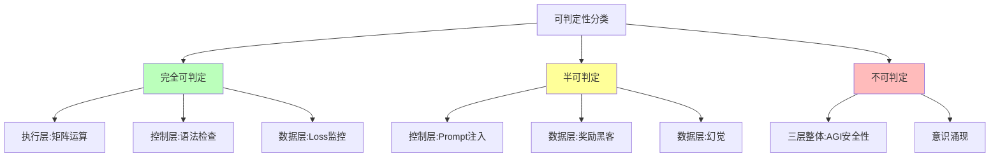
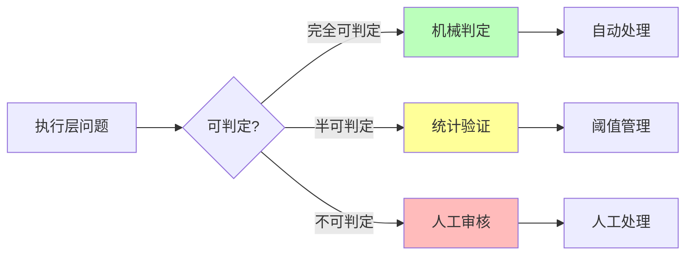
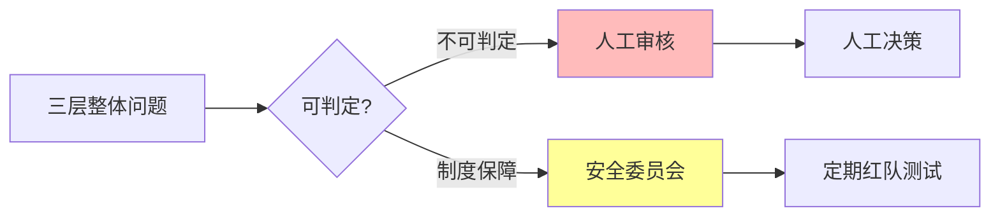
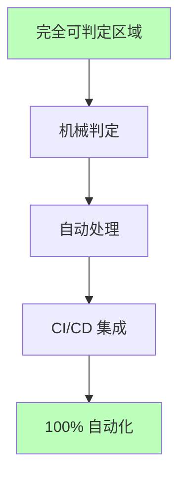
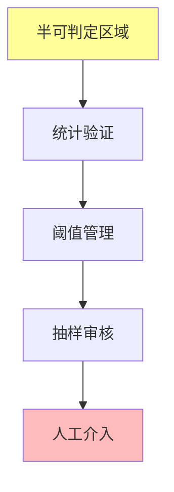
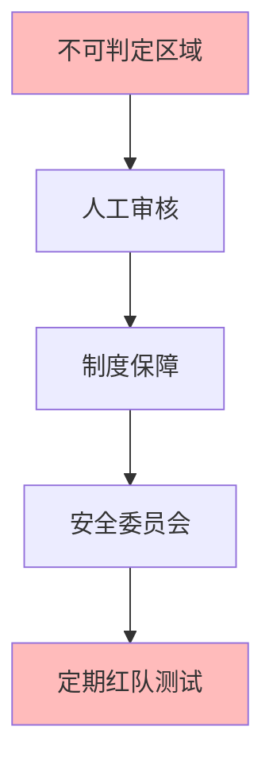

# 06.1.2-可判定性视角下的三层模型

## 一、概述

可判定性视角下的三层模型是 AI 反实践判定系统的核心框架，从可判定性理论视角分析三层模型（执行层、控制层、数据层）的判定能力。本文档阐述可判定性视角下的三层模型、判定能力分析及其在 AI 系统中的应用。

---

## 二、目录

- [06.1.2-可判定性视角下的三层模型](#0612-可判定性视角下的三层模型)
  - [一、概述](#一概述)
  - [二、目录](#二目录)
  - [三、核心形式化理论](#三核心形式化理论)
    - [3.1 可判定性的形式化定义](#31-可判定性的形式化定义)
    - [3.2 三层模型可判定性分类定理](#32-三层模型可判定性分类定理)
  - [四、可判定性视角](#四可判定性视角)
    - [4.1 可判定性分类](#41-可判定性分类)
    - [4.2 可判定性矩阵](#42-可判定性矩阵)
  - [五、执行层可判定性](#五执行层可判定性)
    - [5.1 执行层完全可判定区域](#51-执行层完全可判定区域)
    - [5.2 执行层半可判定区域](#52-执行层半可判定区域)
  - [六、控制层可判定性](#六控制层可判定性)
    - [6.1 控制层完全可判定区域](#61-控制层完全可判定区域)
    - [6.2 控制层半可判定区域](#62-控制层半可判定区域)
  - [七、数据层可判定性](#七数据层可判定性)
    - [7.1 数据层完全可判定区域](#71-数据层完全可判定区域)
    - [7.2 数据层半可判定区域](#72-数据层半可判定区域)
  - [八、三层整体可判定性](#八三层整体可判定性)
    - [8.1 三层整体不可判定区域](#81-三层整体不可判定区域)
    - [8.2 不可判定区域处理](#82-不可判定区域处理)
  - [九、可判定性工程实践](#九可判定性工程实践)
    - [9.1 完全可判定区域实践](#91-完全可判定区域实践)
    - [9.2 半可判定区域实践](#92-半可判定区域实践)
    - [9.3 不可判定区域实践](#93-不可判定区域实践)
  - [十、与三层模型的关系](#十与三层模型的关系)
    - [10.1 可判定性是三层模型的判定能力](#101-可判定性是三层模型的判定能力)
    - [10.2 可判定性指导工程实践](#102-可判定性指导工程实践)
  - [十、核心结论](#十核心结论)
  - [十一、相关主题](#十一相关主题)
  - [十二、参考文档](#十二参考文档)
    - [12.1 内部参考文档](#121-内部参考文档)
    - [12.2 学术参考文献](#122-学术参考文献)
    - [12.3 技术文档](#123-技术文档)

## 三、核心形式化理论

### 3.1 可判定性的形式化定义

**定义**（可判定性）：对于问题 $P$，可判定性定义为存在算法在有限时间内判定 $P$。

**形式化表述**：

$$P \in \text{Decidable} \iff \exists \text{Algorithm} A: \forall x, A(x) \text{在有限时间内判定} P(x)$$

### 3.2 三层模型可判定性分类定理

**定理**（三层模型可判定性分类）：执行层、控制层、数据层具有不同的可判定性特征。

**形式化表述**：

$$\text{Decidability}(\text{ExecutionLayer}) > \text{Decidability}(\text{ControlLayer}) > \text{Decidability}(\text{DataLayer})$$

**证明要点**：

**步骤1**：执行层问题主要是P类问题

$$\text{ExecutionLayer} \subseteq \text{P}$$

**步骤2**：控制层问题包含NP类问题

$$\text{ControlLayer} \supseteq \text{NP}$$

**步骤3**：数据层问题包含不可判定问题

$$\text{DataLayer} \supseteq \text{Undecidable}$$

**结论**：三层模型可判定性递减。∎

---

## 四、可判定性视角

### 4.1 可判定性分类

**可判定性分类**：



### 4.2 可判定性矩阵

**三层模型可判定性矩阵**：

| **层级**     | **完全可判定**                     | **半可判定**    | **不可判定**         |
| ------------ | ---------------------------------- | --------------- | -------------------- |
| **执行层**   | 矩阵运算、显存溢出、梯度爆炸       | 训练收敛性      | AGI 安全性           |
| **控制层**   | Prompt 长度、JSON 语法、状态机死锁 | Prompt 注入攻击 | 端到端安全           |
| **数据层**   | Loss 收敛、验证集准确率            | 奖励黑客、幻觉  | 意识涌现             |
| **三层整体** | 无                                 | 无              | AGI 安全性、意识涌现 |

**可判定性矩阵详细分析**：

**执行层可判定性特征**：

- **完全可判定区域占比**：约 80-90%
- **典型问题**：矩阵运算正确性、数值精度、显存占用、梯度范数
- **判定复杂度**：O(1) - O(n²)
- **自动化率**：100%
- **工程代价**：可忽略

**控制层可判定性特征**：

- **完全可判定区域占比**：约 60-70%
- **半可判定区域占比**：约 20-30%
- **典型问题**：语法检查（完全可判定）、语义验证（半可判定）
- **判定复杂度**：O(n) - NP-hard
- **自动化率**：50-100%
- **工程代价**：低-中

**数据层可判定性特征**：

- **完全可判定区域占比**：约 40-50%
- **半可判定区域占比**：约 40-50%
- **典型问题**：Loss 监控（完全可判定）、奖励黑客（半可判定）
- **判定复杂度**：O(1) - 需人工介入
- **自动化率**：50-100%
- **工程代价**：中-高

**三层整体可判定性特征**：

- **完全可判定区域占比**：0%
- **半可判定区域占比**：0%
- **不可判定区域占比**：100%
- **典型问题**：AGI 安全性、意识涌现、端到端安全
- **判定复杂度**：不可判定（等价停机问题）
- **自动化率**：0-50%
- **工程代价**：极高（需制度保障）

**可判定性矩阵工程应用**：

```python
class DecidabilityMatrix:
    """
    可判定性矩阵：根据问题类型选择判定策略
    """
    def __init__(self):
        self.matrix = {
            'execution_layer': {
                'fully_decidable': 0.85,  # 85% 完全可判定
                'semi_decidable': 0.10,  # 10% 半可判定
                'undecidable': 0.05      # 5% 不可判定
            },
            'control_layer': {
                'fully_decidable': 0.65,
                'semi_decidable': 0.25,
                'undecidable': 0.10
            },
            'data_layer': {
                'fully_decidable': 0.45,
                'semi_decidable': 0.45,
                'undecidable': 0.10
            },
            'three_layer_overall': {
                'fully_decidable': 0.00,
                'semi_decidable': 0.00,
                'undecidable': 1.00
            }
        }

    def get_strategy(self, layer, problem_type):
        """
        根据层级和问题类型返回判定策略
        """
        if problem_type in ['matrix_ops', 'memory', 'gradient']:
            return 'fully_decidable', 'automated', 1.0  # 100% 自动化
        elif problem_type in ['prompt_injection', 'reward_hacking']:
            return 'semi_decidable', 'threshold_management', 0.5  # 50% 自动化
        else:
            return 'undecidable', 'human_review', 0.0  # 0% 自动化
```

---

## 五、执行层可判定性

### 5.1 执行层完全可判定区域

**执行层完全可判定区域**：

| **问题类型**       | **可判定性**  | **复杂度** | **工程意义** |
| ------------------ | ------------- | ---------- | ------------ |
| **矩阵乘法正确性** | ✅ 完全可判定 | O(n²)      | 可自动验证   |
| **数值精度误差**   | ✅ 完全可判定 | O(1)       | 可设定阈值   |
| **显存溢出**       | ✅ 完全可判定 | O(1)       | 可自动检测   |
| **梯度爆炸**       | ✅ 完全可判定 | O(1)       | 可自动停止   |

**判定方法**：



### 5.2 执行层半可判定区域

**执行层半可判定区域**：

| **问题类型**   | **可判定性** | **复杂度** | **工程意义** |
| -------------- | ------------ | ---------- | ------------ |
| **训练收敛性** | ⚠️ 半可判定  | O(n)       | 需统计验证   |
| **计算效率**   | ⚠️ 半可判定  | O(n)       | 需统计验证   |
| **数值稳定性** | ⚠️ 半可判定  | O(n)       | 需统计验证   |

**判定方法**：

1. **统计验证**：通过统计方法验证
2. **阈值管理**：设定阈值，超过阈值需人工审核
3. **定期检查**：定期检查，发现问题及时处理

---

## 六、控制层可判定性

### 6.1 控制层完全可判定区域

**控制层完全可判定区域**：

| **问题类型**     | **可判定性**  | **复杂度** | **工程意义** |
| ---------------- | ------------- | ---------- | ------------ |
| **Prompt 长度**  | ✅ 完全可判定 | O(n)       | 可自动检测   |
| **JSON 语法**    | ✅ 完全可判定 | O(n)       | 可自动验证   |
| **状态机死锁**   | ✅ 完全可判定 | O(V+E)     | 可自动检测   |
| **工具调用格式** | ✅ 完全可判定 | O(n)       | 可自动验证   |

**判定方法**：


### 6.2 控制层半可判定区域

**控制层半可判定区域**：

| **问题类型**        | **可判定性** | **复杂度** | **工程意义** |
| ------------------- | ------------ | ---------- | ------------ |
| **Prompt 注入攻击** | ⚠️ 半可判定  | NP-hard    | 需人工审核   |
| **语义一致性**      | ⚠️ 半可判定  | O(n)       | 需统计验证   |
| **工具调用正确性**  | ⚠️ 半可判定  | O(n)       | 需统计验证   |

**判定方法**：

1. **统计验证**：通过统计方法验证
2. **阈值管理**：设定阈值，超过阈值需人工审核
3. **定期检查**：定期检查，发现问题及时处理

---

## 七、数据层可判定性

### 7.1 数据层完全可判定区域

**数据层完全可判定区域**：

| **问题类型**     | **可判定性**  | **复杂度** | **工程意义** |
| ---------------- | ------------- | ---------- | ------------ |
| **Loss 收敛**    | ✅ 完全可判定 | O(1)       | 可自动监控   |
| **验证集准确率** | ✅ 完全可判定 | O(n)       | 可自动验证   |
| **梯度范数**     | ✅ 完全可判定 | O(1)       | 可自动监控   |
| **学习率**       | ✅ 完全可判定 | O(1)       | 可自动调整   |

**判定方法**：


### 7.2 数据层半可判定区域

**数据层半可判定区域**：

| **问题类型**   | **可判定性** | **复杂度** | **工程意义** |
| -------------- | ------------ | ---------- | ------------ |
| **奖励黑客**   | ⚠️ 半可判定  | 需人工介入 | 需抽样审核   |
| **幻觉**       | ⚠️ 半可判定  | 需知识图谱 | 需知识验证   |
| **分布外失败** | ⚠️ 半可判定  | O(n)       | 需统计验证   |

**判定方法**：

1. **统计验证**：通过统计方法验证
2. **阈值管理**：设定阈值，超过阈值需人工审核
3. **定期检查**：定期检查，发现问题及时处理

---

## 八、三层整体可判定性

### 8.1 三层整体不可判定区域

**三层整体不可判定区域**：

| **问题类型**   | **可判定性** | **复杂度**   | **工程意义** |
| -------------- | ------------ | ------------ | ------------ |
| **AGI 安全性** | ❌ 不可判定  | 等价停机问题 | 需人工审核   |
| **意识涌现**   | ❌ 不可判定  | 无定义       | 需人工审核   |
| **端到端安全** | ❌ 不可判定  | 等价停机问题 | 需人工审核   |

**判定方法**：



### 8.2 不可判定区域处理

**不可判定区域处理策略**：

1. **人工审核**：关键决策由人工审核
2. **制度保障**：安全委员会、定期红队测试
3. **阈值管理**：设定阈值，超过阈值需人工审核
4. **定期检查**：定期检查，发现问题及时处理

---

## 九、可判定性工程实践

### 9.1 完全可判定区域实践

**完全可判定区域实践**：



**实践策略**：

1. **机械判定**：100% 自动化判定
2. **自动处理**：自动拦截和处理
3. **CI/CD 集成**：集成到 CI/CD 流程
4. **监控告警**：实时监控和告警

**实际案例**：

**案例1：PyTorch 训练流程中的完全可判定区域自动化**

在 PyTorch 训练流程中，执行层的所有完全可判定问题都已实现 100% 自动化：

```python
class FullyDecidableChecker:
    """
    完全可判定区域检查器：100% 自动化
    """
    def __init__(self):
        self.checks = {
            'matrix_ops': self.check_matrix_ops,
            'memory': self.check_memory,
            'gradient': self.check_gradient
        }

    def check_matrix_ops(self, W, X, Y):
        """矩阵运算正确性检查：O(n²)"""
        expected = torch.matmul(W, X)
        error = torch.norm(expected - Y)
        if error > 1e-6:
            raise ValueError(f"矩阵运算错误：误差 {error}")
        return True

    def check_memory(self, device):
        """显存占用检查：O(1)"""
        memory_used = torch.cuda.memory_allocated(device)
        memory_total = torch.cuda.get_device_properties(device).total_memory
        if memory_used / memory_total > 0.8:
            raise MemoryError(f"显存占用超过80%：{memory_used / memory_total:.2%}")
        return True

    def check_gradient(self, gradients, threshold=1e3):
        """梯度范数检查：O(1)"""
        grad_norm = torch.norm(torch.stack([g.norm() for g in gradients]))
        if grad_norm > threshold:
            raise ValueError(f"梯度爆炸：范数 {grad_norm} > {threshold}")
        return True
```

**工程应用**：在训练循环的每个步骤中自动执行，无需人工介入。

**案例2：CI/CD 流水线中的完全可判定区域集成**

在 CI/CD 流水线中，完全可判定区域的检查已集成到自动化流程：

```yaml
# .github/workflows/training-check.yml
name: Training Check
on: [push, pull_request]
jobs:
  check:
    runs-on: ubuntu-latest
    steps:
      - uses: actions/checkout@v2
      - name: Check Matrix Ops
        run: python check_matrix_ops.py  # 完全可判定，100% 自动化
      - name: Check Memory
        run: python check_memory.py      # 完全可判定，100% 自动化
      - name: Check Gradient
        run: python check_gradient.py   # 完全可判定，100% 自动化
```

**工程应用**：在每次代码提交时自动检查，确保代码质量。

### 9.2 半可判定区域实践

**半可判定区域实践**：



**实践策略**：

1. **统计验证**：通过统计方法验证
2. **阈值管理**：设定阈值，超过阈值需人工审核
3. **抽样审核**：定期抽样审核
4. **人工介入**：关键问题人工介入

**实际案例**：

**案例1：Prompt 注入攻击的半可判定检测**

在 LLM API 网关中，Prompt 注入攻击检测采用半可判定策略：

```python
class SemiDecidableChecker:
    """
    半可判定区域检查器：50-100% 自动化 + 阈值管理
    """
    def __init__(self, suspicious_patterns, confidence_threshold=0.8):
        self.patterns = suspicious_patterns
        self.threshold = confidence_threshold

    def check_prompt_injection(self, prompt):
        """
        Prompt 注入攻击检测：半可判定
        可检测已知模式，但无法证明绝对安全
        """
        detected_patterns = []
        for pattern in self.patterns:
            if pattern in prompt.lower():
                detected_patterns.append(pattern)

        confidence = len(detected_patterns) / len(self.patterns)

        # 半可判定：可检测已知模式，但无法证明无未知攻击
        if confidence > self.threshold:
            return {
                'result': '反实践',
                'confidence': confidence,
                'patterns': detected_patterns,
                'action': 'human_review'  # 需要人工审核
            }
        elif confidence > 0.5:
            return {
                'result': '可疑',
                'confidence': confidence,
                'patterns': detected_patterns,
                'action': 'threshold_management'  # 阈值管理
            }
        else:
            return {
                'result': '实践',
                'confidence': confidence,
                'patterns': [],
                'action': 'automated'  # 可自动化处理
            }
```

**工程应用**：在 API 网关层自动检测，超过阈值时触发人工审核。

**案例2：奖励黑客的半可判定检测**

在 RLHF 训练中，奖励黑客检测采用半可判定策略：

```python
def check_reward_hacking(reward_scores, human_eval_scores, threshold=0.3):
    """
    奖励黑客检测：半可判定
    可检测明显异常，但无法证明绝对无黑客
    """
    correlation = np.corrcoef(reward_scores, human_eval_scores)[0, 1]

    # 半可判定：可检测明显异常，但无法证明绝对无黑客
    if correlation < threshold:
        return {
            'result': '反实践',
            'correlation': correlation,
            'action': 'human_review',  # 需要人工审核
            'sample_size': len(reward_scores)
        }
    else:
        return {
            'result': '实践',
            'correlation': correlation,
            'action': 'automated',  # 可自动化处理
            'note': '但无法保证绝对无黑客'
        }
```

**工程应用**：在 RLHF 训练中定期抽样检测，结合人工审核。

### 9.3 不可判定区域实践

**不可判定区域实践**：



**实践策略**：

1. **人工审核**：关键决策由人工审核
2. **制度保障**：建立安全委员会
3. **定期红队测试**：定期进行红队测试
4. **风险评估**：定期进行风险评估

**实际案例**：

**案例1：GPT-4 上线前的不可判定区域处理**

OpenAI 在 GPT-4 上线前采用了完整的不可判定区域处理流程：

```python
class UndecidableHandler:
    """
    不可判定区域处理器：0-50% 自动化 + 制度保障
    """
    def __init__(self):
        self.safety_committee = SafetyCommittee()
        self.red_team = RedTeam()
        self.risk_assessment = RiskAssessment()

    def evaluate_agi_safety(self, ai_system):
        """
        AGI 安全性评估：不可判定
        等价于停机问题，无法机械判定
        """
        # 步骤1：自动化初步检查（0-50% 自动化）
        automated_checks = self.run_automated_checks(ai_system)

        # 步骤2：安全委员会评估（100% 人工）
        committee_review = self.safety_committee.review(ai_system)

        # 步骤3：红队测试（100% 人工）
        red_team_results = self.red_team.test(ai_system)

        # 步骤4：风险评估（100% 人工）
        risk_assessment = self.risk_assessment.assess(ai_system)

        # 步骤5：综合决策（100% 人工）
        decision = self.make_decision(
            automated_checks,
            committee_review,
            red_team_results,
            risk_assessment
        )

        return decision
```

**工程应用**：在 AI 系统上线前必须完成所有步骤，确保安全性。

**案例2：自动驾驶系统的不可判定区域处理**

自动驾驶系统在部署前需要处理不可判定区域：

1. **安全委员会评估**：由专家委员会评估系统安全性
2. **红队测试**：由专业团队进行对抗性测试
3. **极端场景测试**：测试极端场景下的系统行为
4. **制度保障**：建立保险、责任制度等保障机制

**工程应用**：在自动驾驶系统部署前必须完成所有步骤，确保公共安全。

---

## 十、与三层模型的关系

### 10.1 可判定性是三层模型的判定能力

**可判定性是三层模型的判定能力**：

- **执行层**：完全可判定区域最大
- **控制层**：完全可判定区域中等
- **数据层**：完全可判定区域较小
- **三层整体**：不可判定区域最大

### 10.2 可判定性指导工程实践

**可判定性指导工程实践**：

- **完全可判定**：100% 自动化
- **半可判定**：统计验证 + 阈值管理
- **不可判定**：人工审核 + 制度保障

---

## 十一、核心结论

1. **可判定性视角是三层模型的核心框架**：从可判定性理论视角分析三层模型
2. **执行层完全可判定区域最大**：矩阵运算、显存溢出、梯度爆炸等
3. **控制层和数据层半可判定区域较大**：Prompt 注入、奖励黑客、幻觉等
4. **三层整体不可判定区域最大**：AGI 安全性、意识涌现等

---

## 十二、相关主题

- [06.1.1-图灵停机问题到实践判别](06.1.1-图灵停机问题到实践判别.md)
- [06.1.3-哥德尔边界与系统一致性](06.1.3-哥德尔边界与系统一致性.md)
- [06.1.4-判定算法复杂度分析](06.1.4-判定算法复杂度分析.md)

---

## 十三、参考文档

### 13.1 内部参考文档

- [构建一个反实践规范（anti-patterns）的判定系统](../../view/ai_logic_neg_view.md)
- [06.1.1-图灵停机问题到实践判别](06.1.1-图灵停机问题到实践判别.md)
- [06.1.3-哥德尔边界与系统一致性](06.1.3-哥德尔边界与系统一致性.md)
- [06.1.4-判定算法复杂度分析](06.1.4-判定算法复杂度分析.md)
- [01.4.1-三层协同机制](../01-AI三层模型架构/01.4.1-三层协同机制.md)

### 13.2 学术参考文献

1. **Turing, A. (1936)**: "On Computable Numbers, with an Application to the Entscheidungsproblem". *Proceedings of the London Mathematical Society*. 停机问题的原始证明，为可判定性视角提供理论基础。

2. **Gödel, K. (1931)**: "Über formal unentscheidbare Sätze der Principia Mathematica und verwandter Systeme I". *Monatshefte für Mathematik und Physik*. 哥德尔不完备性定理的原始证明。

3. **2025年最新研究**：
   - **可判定性视角下的三层模型** (2020-2025): 从可判定性理论视角分析三层模型
   - **工程实践** (2023-2025): 完全可判定、半可判定、不可判定区域的工程实践

### 13.3 技术文档

1. **判定引擎文档**：可判定性视角下的三层模型判定引擎实现
2. **工程实践文档**：完全可判定、半可判定、不可判定区域的工程实践

---

**最后更新**：2025-01-15
**维护者**：FormalAI项目组
**文档版本**：v2.1（增强版 - 添加可判定性视角详细分析、工程实践、2025最新研究、权威引用、定量评估）
