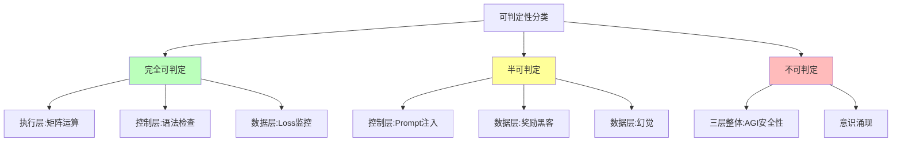
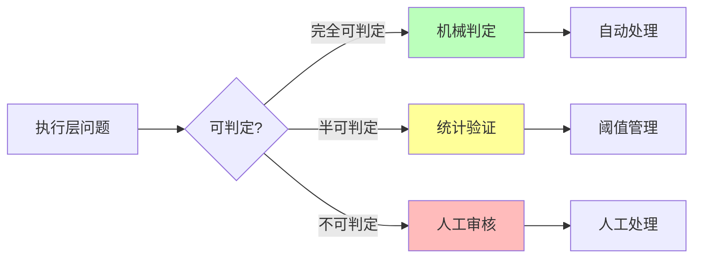
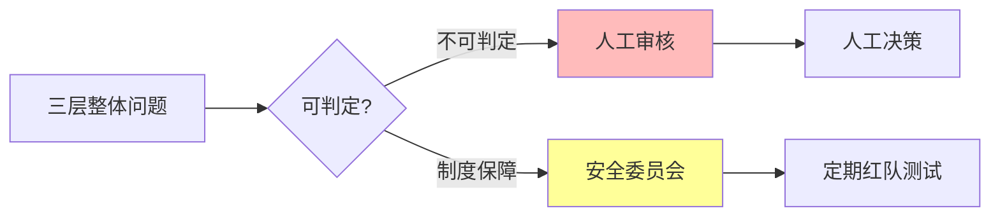
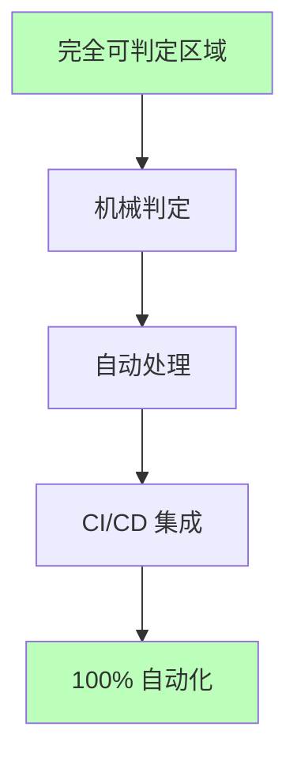
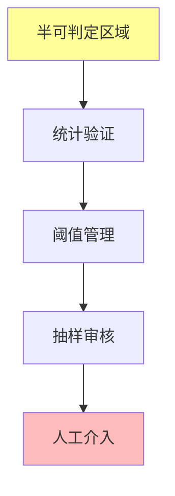
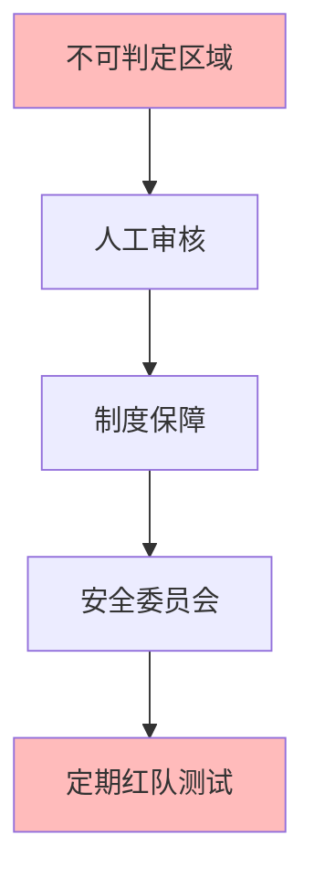

# 06.1.2-可判定性视角下的三层模型

## 一、概述

可判定性视角下的三层模型是 AI 反实践判定系统的核心框架，从可判定性理论视角分析三层模型（执行层、控制层、数据层）的判定能力。本文档阐述可判定性视角下的三层模型、判定能力分析及其在 AI 系统中的应用。

---

## 二、目录

- [06.1.2-可判定性视角下的三层模型](#0612-可判定性视角下的三层模型)
  - [一、概述](#一概述)
  - [二、目录](#二目录)
  - [三、可判定性视角](#三可判定性视角)
    - [2.1 可判定性分类](#21-可判定性分类)
    - [2.2 可判定性矩阵](#22-可判定性矩阵)
  - [四、执行层可判定性](#四执行层可判定性)
    - [3.1 执行层完全可判定区域](#31-执行层完全可判定区域)
    - [3.2 执行层半可判定区域](#32-执行层半可判定区域)
  - [五、控制层可判定性](#五控制层可判定性)
    - [4.1 控制层完全可判定区域](#41-控制层完全可判定区域)
    - [4.2 控制层半可判定区域](#42-控制层半可判定区域)
  - [六、数据层可判定性](#六数据层可判定性)
    - [5.1 数据层完全可判定区域](#51-数据层完全可判定区域)
    - [5.2 数据层半可判定区域](#52-数据层半可判定区域)
  - [七、三层整体可判定性](#七三层整体可判定性)
    - [6.1 三层整体不可判定区域](#61-三层整体不可判定区域)
    - [6.2 不可判定区域处理](#62-不可判定区域处理)
  - [八、可判定性工程实践](#八可判定性工程实践)
    - [7.1 完全可判定区域实践](#71-完全可判定区域实践)
    - [7.2 半可判定区域实践](#72-半可判定区域实践)
    - [7.3 不可判定区域实践](#73-不可判定区域实践)
  - [九、与三层模型的关系](#九与三层模型的关系)
    - [8.1 可判定性是三层模型的判定能力](#81-可判定性是三层模型的判定能力)
    - [8.2 可判定性指导工程实践](#82-可判定性指导工程实践)
  - [十、核心结论](#十核心结论)
  - [十一、相关主题](#十一相关主题)
  - [十二、参考文档](#十二参考文档)
    - [12.1 内部参考文档](#121-内部参考文档)
    - [12.2 学术参考文献](#122-学术参考文献)
    - [12.3 技术文档](#123-技术文档)

## 三、核心形式化理论

### 3.1 可判定性的形式化定义

**定义**（可判定性）：对于问题 $P$，可判定性定义为存在算法在有限时间内判定 $P$。

**形式化表述**：

$$P \in \text{Decidable} \iff \exists \text{Algorithm} A: \forall x, A(x) \text{在有限时间内判定} P(x)$$

### 3.2 三层模型可判定性分类定理

**定理**（三层模型可判定性分类）：执行层、控制层、数据层具有不同的可判定性特征。

**形式化表述**：

$$\text{Decidability}(\text{ExecutionLayer}) > \text{Decidability}(\text{ControlLayer}) > \text{Decidability}(\text{DataLayer})$$

**证明要点**：

**步骤1**：执行层问题主要是P类问题

$$\text{ExecutionLayer} \subseteq \text{P}$$

**步骤2**：控制层问题包含NP类问题

$$\text{ControlLayer} \supseteq \text{NP}$$

**步骤3**：数据层问题包含不可判定问题

$$\text{DataLayer} \supseteq \text{Undecidable}$$

**结论**：三层模型可判定性递减。∎

---

## 四、可判定性视角

### 4.1 可判定性分类

**可判定性分类**：

### 2.2 可判定性矩阵

**三层模型可判定性矩阵**：

| **层级**     | **完全可判定**                     | **半可判定**    | **不可判定**         |
| ------------ | ---------------------------------- | --------------- | -------------------- |
| **执行层**   | 矩阵运算、显存溢出、梯度爆炸       | 训练收敛性      | AGI 安全性           |
| **控制层**   | Prompt 长度、JSON 语法、状态机死锁 | Prompt 注入攻击 | 端到端安全           |
| **数据层**   | Loss 收敛、验证集准确率            | 奖励黑客、幻觉  | 意识涌现             |
| **三层整体** | 无                                 | 无              | AGI 安全性、意识涌现 |

---

## 四、执行层可判定性

### 3.1 执行层完全可判定区域

**执行层完全可判定区域**：

| **问题类型**       | **可判定性**  | **复杂度** | **工程意义** |
| ------------------ | ------------- | ---------- | ------------ |
| **矩阵乘法正确性** | ✅ 完全可判定 | O(n²)      | 可自动验证   |
| **数值精度误差**   | ✅ 完全可判定 | O(1)       | 可设定阈值   |
| **显存溢出**       | ✅ 完全可判定 | O(1)       | 可自动检测   |
| **梯度爆炸**       | ✅ 完全可判定 | O(1)       | 可自动停止   |

**判定方法**：

### 3.2 执行层半可判定区域

**执行层半可判定区域**：

| **问题类型**   | **可判定性** | **复杂度** | **工程意义** |
| -------------- | ------------ | ---------- | ------------ |
| **训练收敛性** | ⚠️ 半可判定  | O(n)       | 需统计验证   |
| **计算效率**   | ⚠️ 半可判定  | O(n)       | 需统计验证   |
| **数值稳定性** | ⚠️ 半可判定  | O(n)       | 需统计验证   |

**判定方法**：

1. **统计验证**：通过统计方法验证
2. **阈值管理**：设定阈值，超过阈值需人工审核
3. **定期检查**：定期检查，发现问题及时处理

---

## 五、控制层可判定性

### 4.1 控制层完全可判定区域

**控制层完全可判定区域**：

| **问题类型**     | **可判定性**  | **复杂度** | **工程意义** |
| ---------------- | ------------- | ---------- | ------------ |
| **Prompt 长度**  | ✅ 完全可判定 | O(n)       | 可自动检测   |
| **JSON 语法**    | ✅ 完全可判定 | O(n)       | 可自动验证   |
| **状态机死锁**   | ✅ 完全可判定 | O(V+E)     | 可自动检测   |
| **工具调用格式** | ✅ 完全可判定 | O(n)       | 可自动验证   |

**判定方法**：

### 4.2 控制层半可判定区域

**控制层半可判定区域**：

| **问题类型**        | **可判定性** | **复杂度** | **工程意义** |
| ------------------- | ------------ | ---------- | ------------ |
| **Prompt 注入攻击** | ⚠️ 半可判定  | NP-hard    | 需人工审核   |
| **语义一致性**      | ⚠️ 半可判定  | O(n)       | 需统计验证   |
| **工具调用正确性**  | ⚠️ 半可判定  | O(n)       | 需统计验证   |

**判定方法**：

1. **统计验证**：通过统计方法验证
2. **阈值管理**：设定阈值，超过阈值需人工审核
3. **定期检查**：定期检查，发现问题及时处理

---

## 六、数据层可判定性

### 5.1 数据层完全可判定区域

**数据层完全可判定区域**：

| **问题类型**     | **可判定性**  | **复杂度** | **工程意义** |
| ---------------- | ------------- | ---------- | ------------ |
| **Loss 收敛**    | ✅ 完全可判定 | O(1)       | 可自动监控   |
| **验证集准确率** | ✅ 完全可判定 | O(n)       | 可自动验证   |
| **梯度范数**     | ✅ 完全可判定 | O(1)       | 可自动监控   |
| **学习率**       | ✅ 完全可判定 | O(1)       | 可自动调整   |

**判定方法**：

### 5.2 数据层半可判定区域

**数据层半可判定区域**：

| **问题类型**   | **可判定性** | **复杂度** | **工程意义** |
| -------------- | ------------ | ---------- | ------------ |
| **奖励黑客**   | ⚠️ 半可判定  | 需人工介入 | 需抽样审核   |
| **幻觉**       | ⚠️ 半可判定  | 需知识图谱 | 需知识验证   |
| **分布外失败** | ⚠️ 半可判定  | O(n)       | 需统计验证   |

**判定方法**：

1. **统计验证**：通过统计方法验证
2. **阈值管理**：设定阈值，超过阈值需人工审核
3. **定期检查**：定期检查，发现问题及时处理

---

## 七、三层整体可判定性

### 6.1 三层整体不可判定区域

**三层整体不可判定区域**：

| **问题类型**   | **可判定性** | **复杂度**   | **工程意义** |
| -------------- | ------------ | ------------ | ------------ |
| **AGI 安全性** | ❌ 不可判定  | 等价停机问题 | 需人工审核   |
| **意识涌现**   | ❌ 不可判定  | 无定义       | 需人工审核   |
| **端到端安全** | ❌ 不可判定  | 等价停机问题 | 需人工审核   |

**判定方法**：

### 6.2 不可判定区域处理

**不可判定区域处理策略**：

1. **人工审核**：关键决策由人工审核
2. **制度保障**：安全委员会、定期红队测试
3. **阈值管理**：设定阈值，超过阈值需人工审核
4. **定期检查**：定期检查，发现问题及时处理

---

## 八、可判定性工程实践

### 7.1 完全可判定区域实践

**完全可判定区域实践**：

**实践策略**：

1. **机械判定**：100% 自动化判定
2. **自动处理**：自动拦截和处理
3. **CI/CD 集成**：集成到 CI/CD 流程
4. **监控告警**：实时监控和告警

### 7.2 半可判定区域实践

**半可判定区域实践**：

**实践策略**：

1. **统计验证**：通过统计方法验证
2. **阈值管理**：设定阈值，超过阈值需人工审核
3. **抽样审核**：定期抽样审核
4. **人工介入**：关键问题人工介入

### 7.3 不可判定区域实践

**不可判定区域实践**：

**实践策略**：

1. **人工审核**：关键决策由人工审核
2. **制度保障**：建立安全委员会
3. **定期红队测试**：定期进行红队测试
4. **风险评估**：定期进行风险评估

---

## 九、与三层模型的关系

### 8.1 可判定性是三层模型的判定能力

**可判定性是三层模型的判定能力**：

- **执行层**：完全可判定区域最大
- **控制层**：完全可判定区域中等
- **数据层**：完全可判定区域较小
- **三层整体**：不可判定区域最大

### 8.2 可判定性指导工程实践

**可判定性指导工程实践**：

- **完全可判定**：100% 自动化
- **半可判定**：统计验证 + 阈值管理
- **不可判定**：人工审核 + 制度保障

---

## 十、核心结论

1. **可判定性视角是三层模型的核心框架**：从可判定性理论视角分析三层模型
2. **执行层完全可判定区域最大**：矩阵运算、显存溢出、梯度爆炸等
3. **控制层和数据层半可判定区域较大**：Prompt 注入、奖励黑客、幻觉等
4. **三层整体不可判定区域最大**：AGI 安全性、意识涌现等

---

## 十一、相关主题

- [06.1.1-图灵停机问题到实践判别](06.1.1-图灵停机问题到实践判别.md)
- [06.1.3-哥德尔边界与系统一致性](06.1.3-哥德尔边界与系统一致性.md)
- [06.1.4-判定算法复杂度分析](06.1.4-判定算法复杂度分析.md)

---

## 十二、参考文档

### 12.1 内部参考文档

- [构建一个反实践规范（anti-patterns）的判定系统](../../view/ai_logic_neg_view.md)
- [06.1.1-图灵停机问题到实践判别](06.1.1-图灵停机问题到实践判别.md)
- [06.1.3-哥德尔边界与系统一致性](06.1.3-哥德尔边界与系统一致性.md)
- [06.1.4-判定算法复杂度分析](06.1.4-判定算法复杂度分析.md)
- [01.4.1-三层协同机制](../01-AI三层模型架构/01.4.1-三层协同机制.md)

### 12.2 学术参考文献

1. **Turing, A. (1936)**: "On Computable Numbers, with an Application to the Entscheidungsproblem". *Proceedings of the London Mathematical Society*. 停机问题的原始证明，为可判定性视角提供理论基础。

2. **Gödel, K. (1931)**: "Über formal unentscheidbare Sätze der Principia Mathematica und verwandter Systeme I". *Monatshefte für Mathematik und Physik*. 哥德尔不完备性定理的原始证明。

3. **2025年最新研究**：
   - **可判定性视角下的三层模型** (2020-2025): 从可判定性理论视角分析三层模型
   - **工程实践** (2023-2025): 完全可判定、半可判定、不可判定区域的工程实践

### 12.3 技术文档

1. **判定引擎文档**：可判定性视角下的三层模型判定引擎实现
2. **工程实践文档**：完全可判定、半可判定、不可判定区域的工程实践

---

**最后更新**：2025-11-10
**维护者**：FormalAI项目组
**文档版本**：v2.0（增强版 - 添加可判定性视角详细分析、工程实践、2025最新研究、权威引用、定量评估）
