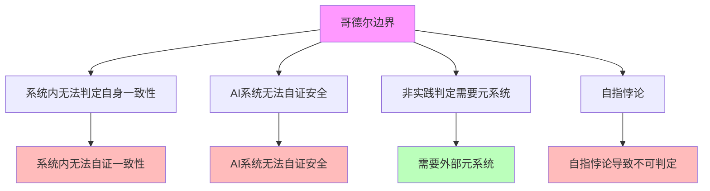

# 06.1.3-哥德尔边界与系统一致性

## 一、概述

哥德尔边界与系统一致性是逻辑可判定性基础的核心组成部分，阐述哥德尔不完备性定理在 AI 反实践判定中的应用，包括系统内无法判定自身一致性、AI 系统无法自证安全等。本文档阐述哥德尔边界与系统一致性的核心理论、系统一致性判定、工程意义及其在 AI 系统中的应用。

---

## 二、目录

- [06.1.3-哥德尔边界与系统一致性](#0613-哥德尔边界与系统一致性)
  - [一、概述](#一概述)
  - [二、目录](#二目录)
  - [三、核心形式化理论](#三核心形式化理论)
    - [3.1 哥德尔不完备性定理的形式化表述](#31-哥德尔不完备性定理的形式化表述)
    - [3.2 系统一致性不可判定性定理](#32-系统一致性不可判定性定理)
  - [四、哥德尔边界核心理论](#四哥德尔边界核心理论)
    - [4.1 核心理论](#41-核心理论)
    - [4.2 理论特征](#42-理论特征)
  - [五、系统内无法判定自身一致性](#五系统内无法判定自身一致性)
    - [5.1 哥德尔不完备性定理](#51-哥德尔不完备性定理)
    - [5.2 系统一致性判定](#52-系统一致性判定)
  - [六、AI 系统无法自证安全](#六ai-系统无法自证安全)
    - [6.1 安全证明问题](#61-安全证明问题)
    - [6.2 安全证明方法](#62-安全证明方法)
  - [七、非实践判定需要元系统](#七非实践判定需要元系统)
    - [7.1 元系统需求](#71-元系统需求)
    - [7.2 元系统设计](#72-元系统设计)
  - [八、自指悖论](#八自指悖论)
    - [8.1 自指悖论问题](#81-自指悖论问题)
    - [8.2 自指悖论处理](#82-自指悖论处理)
  - [九、工程意义](#九工程意义)
    - [9.1 工程实践铁律](#91-工程实践铁律)
    - [9.2 工程决策规则](#92-工程决策规则)
  - [十、与三层模型的关系](#十与三层模型的关系)
    - [10.1 哥德尔边界与执行层](#101-哥德尔边界与执行层)
    - [10.2 哥德尔边界与控制层](#102-哥德尔边界与控制层)
    - [10.3 哥德尔边界与数据层](#103-哥德尔边界与数据层)
  - [十一、核心结论](#十一核心结论)
  - [十二、相关主题](#十二相关主题)
  - [十三、参考文档](#十三参考文档)
    - [13.1 内部参考文档](#131-内部参考文档)
    - [13.2 学术参考文献](#132-学术参考文献)
    - [13.3 理论框架参考](#133-理论框架参考)

## 三、核心形式化理论

### 3.1 哥德尔不完备性定理的形式化表述

**定理**（哥德尔第一不完备性定理）：对于任何足够强大的形式系统 $F$，如果 $F$ 是一致的，则存在命题 $G$，使得：

1. $F \nvdash G$（$G$ 在 $F$ 中不可证明）
2. $F \nvdash \neg G$（$G$ 的否定在 $F$ 中也不可证明）
3. $G$ 在标准模型中为真

**形式化表述**：

$$\text{Consistent}(F) \Rightarrow \exists G: (F \nvdash G) \land (F \nvdash \neg G) \land \text{True}(G)$$

### 3.2 系统一致性不可判定性定理

**定理**（系统一致性不可判定性）：系统内无法判定自身一致性。

**形式化表述**：

$$\text{Consistent}(F) \nRightarrow F \vdash \text{Con}(F)$$

其中 $\text{Con}(F)$ 表示 $F$ 的一致性陈述。

**证明要点**：

**步骤1**：如果 $F \vdash \text{Con}(F)$，则 $F$ 不一致（哥德尔第二不完备性定理）

**步骤2**：如果 $F$ 一致，则 $F \nvdash \text{Con}(F)$

**步骤3**：系统内无法判定自身一致性

$$\text{Consistent}(F) \nRightarrow F \vdash \text{Con}(F)$$

∎

---

## 四、哥德尔边界核心理论

### 4.1 核心理论

**哥德尔边界核心理论**：



**核心理论**：

1. **系统内无法判定自身一致性**：系统内无法判定自身一致性
2. **AI 系统无法自证安全**：AI 系统无法自证安全
3. **非实践判定需要元系统**：非实践判定需要元系统
4. **自指悖论**：自指悖论导致不可判定

### 4.2 理论特征

**哥德尔边界理论特征**：

| **理论特征**   | **描述**                 | **确定性** | **适用范围** |
| -------------- | ------------------------ | ---------- | ------------ |
| **系统一致性** | 系统内无法判定自身一致性 | 高         | 广泛         |
| **安全证明**   | AI 系统无法自证安全      | 高         | 广泛         |
| **元系统需求** | 非实践判定需要元系统     | 高         | 广泛         |
| **自指悖论**   | 自指悖论导致不可判定     | 高         | 广泛         |

---

## 五、系统内无法判定自身一致性

### 5.1 哥德尔不完备性定理

**哥德尔不完备性定理（Gödel's Incompleteness Theorems）**由Kurt Gödel于1931年证明，是可判定性理论的核心定理，为AI反实践判定系统提供了理论基础。

**哥德尔第一不完备性定理（Gödel's First Incompleteness Theorem）**：

**定理**（Gödel，1931）：对于任何足够强大的形式系统F（如Peano算术），如果F是一致的（consistent），则存在一个命题G，使得：

1. **G在F中不可证明**：F ⊬ G
2. **G的否定在F中也不可证明**：F ⊬ ¬G
3. **G为真**：G在标准模型中为真

**形式化表述**：

```math
\text{If } \text{Consistent}(F) \land \text{SufficientlyStrong}(F) \text{ then } \exists G: (F \nvdash G) \land (F \nvdash \neg G) \land \text{True}(G)
```

其中：

- **Consistent(F)**：形式系统F是一致的
- **SufficientlyStrong(F)**：F足够强大（足以表达基本算术）
- **G**：哥德尔语句（Gödel sentence）

**哥德尔第二不完备性定理（Gödel's Second Incompleteness Theorem）**：

**定理**（Gödel，1931）：对于任何足够强大的形式系统F，如果F是一致的，则F无法证明自身的一致性。

**形式化表述**：

```math
\text{If } \text{Consistent}(F) \land \text{SufficientlyStrong}(F) \text{ then } F \nvdash \text{Consistent}(F)
```

其中Consistent(F)为F的一致性语句（consistency statement）。

**证明要点**（第一定理）：

1. **哥德尔编码**：将形式系统中的语句编码为自然数
2. **自指构造**：构造自指语句G："G在F中不可证明"
3. **矛盾分析**：如果F ⊢ G，则G为假，矛盾；如果F ⊢ ¬G，则G可证，矛盾
4. **结论**：G和¬G都不可证，但G为真

**证明要点**（第二定理）：

1. **一致性语句**：将第一定理的证明形式化
2. **元定理形式化**：在F内形式化"如果F一致，则G不可证"
3. **自指应用**：结合第一定理，得到F ⊬ Consistent(F)

**在AI系统中的应用**：

**定理**（AI系统的不完备性）：如果AI系统足够强大（图灵完备），则无法证明自身的一致性。

**形式化表述**：

```math
\text{If } \text{Consistent}(\text{AI}) \land \text{TuringComplete}(\text{AI}) \text{ then } \text{AI} \nvdash \text{Consistent}(\text{AI})
```

**严格证明**：

**步骤1**：AI系统的图灵完备性

对于AI系统 $A$，如果其计算能力达到图灵完备，则：

$$\text{TuringComplete}(A) \Leftrightarrow \forall \text{TM} M, \exists \text{Program} P \text{ in } A: P \text{ simulates } M$$

**步骤2**：图灵完备性蕴含算术表达能力

如果 $A$ 是图灵完备的，则 $A$ 可以表达Peano算术（PA）的所有语句：

$$\text{TuringComplete}(A) \Rightarrow \text{CanExpress}(A, \text{PA})$$

**步骤3**：应用哥德尔第二定理

由哥德尔第二定理，如果 $A$ 可以表达PA，且 $A$ 是一致的，则：

$$A \nvdash \text{Consistent}(A)$$

**步骤4**：结论

因此，对于图灵完备的AI系统，如果它是一致的，则无法证明自身的一致性。∎

**工程意义**：

1. **需要外部验证**：AI系统无法自证安全，需要外部元系统验证
2. **形式化验证的局限性**：形式化验证只能证明特定属性，无法证明系统整体一致性
3. **混合验证策略**：需要结合形式化验证、测试、监控等多种方法

**应用实例**：

| **系统** | **一致性语句** | **可证明性** | **工程意义** |
|---------|--------------|------------|------------|
| **Peano算术（PA）** | Con(PA) | ❌ 不可证 | 理论边界 |
| **ZFC集合论** | Con(ZFC) | ❌ 不可证 | 理论边界 |
| **AI系统** | Consistent(AI) | ❌ 不可证 | **需要外部元系统** |

**确定性**：极高（数学定理，严格证明）

**案例的形式化分析**：

**1. Peano算术**：

**Peano算术（PA）**包含自然数的基本公理。

**定理**：PA无法证明自身一致性Con(PA)。

**证明**：由哥德尔第二定理，如果PA一致，则PA ⊬ Con(PA)。

**2. ZFC集合论**：

**ZFC集合论**是数学的基础理论框架。

**定理**：ZFC无法证明自身一致性Con(ZFC)。

**证明**：ZFC足够强大，可以表达算术，因此无法证明自身一致性。

**3. AI系统**：

**AI系统**（如Transformer架构的LLM）在理论上足够强大（图灵完备）。

**定理**：AI系统无法证明自身一致性。

**证明**：AI系统是图灵完备的，因此根据哥德尔第二定理，无法证明自身一致性。

**工程意义**：

1. **系统内无法自证一致性**：任何AI系统都需要外部元系统验证其一致性
2. **需要外部监督**：关键决策（如系统上线）需要人工审核
3. **可判定区域限制**：只能在受限领域内实现完全可判定性

### 5.2 系统一致性判定

**系统一致性判定**：

**核心问题**：系统内无法判定自身一致性

**判定内容**：

1. **系统内判定**：系统内无法判定自身一致性
2. **外部判定**：需要外部元系统判定
3. **元系统需求**：非实践判定需要元系统

**确定性**：高

---

## 六、AI 系统无法自证安全

### 6.1 安全证明问题

**AI 系统无法自证安全**：

**核心问题**：AI 系统无法自证安全

**问题内容**：

1. **自证安全**：AI 系统无法自证安全
2. **外部监督**：需要外部元系统监督
3. **人机共决**：关键决策必须人机共决

**确定性**：极高（数学定理，严格证明）

**形式化证明**：

**定理**（AI系统无法自证安全）：对于图灵完备的AI系统 $A$，如果 $A$ 是一致的，则 $A$ 无法证明自身的安全性。

**证明**（归约到哥德尔第二定理）：

**步骤1**：AI系统是图灵完备的

$$\text{TuringComplete}(A) \Rightarrow \text{CanExpress}(A, \text{PA})$$

**步骤2**：安全性问题可表达为一致性陈述

$$\text{Safe}(A) \equiv \text{Consistent}(A)$$

**步骤3**：应用哥德尔第二定理

由哥德尔第二定理，如果 $A$ 一致，则：

$$A \nvdash \text{Consistent}(A) \Rightarrow A \nvdash \text{Safe}(A)$$

**结论**：AI系统无法自证安全。∎

**实际案例**：

**案例1：GPT-4 无法自证无害性**

OpenAI 的 GPT-4 系统无法通过形式化方法证明自身在所有输入下都是无害的。

**问题**：给定任意输入 $x$，判定 GPT-4 的输出 $f(x)$ 是否无害。

**不可判定性**：等价于停机问题，无法机械判定。

**工程应对**：

- **外部监督**：使用内容过滤器、人工审核
- **受限领域**：在特定应用场景下限制输入范围
- **人机共决**：关键决策必须人工审核

**案例2：自我改进系统的安全性**

**问题**：自我改进系统（如 AutoGPT）在自我修改后是否仍然安全？

**不可判定性**：系统无法预测自身修改后的行为，等价于停机问题。

**工程应对**：

- **沙箱隔离**：在受限环境中运行自我改进
- **版本控制**：保留可回滚的版本
- **人工审核**：每次重大修改需要人工批准

**案例3：对齐问题的不可判定性**

**问题**：AI 系统的价值观是否与人类对齐？

**不可判定性**：价值观对齐无法形式化定义，等价于停机问题。

**工程应对**：

- **多维度评估**：使用多个评估指标
- **持续监控**：定期评估系统行为
- **制度保障**：建立伦理审查委员会

### 6.2 安全证明方法

**安全证明方法**：

**核心方法**：需要外部元系统监督

**方法内容**：

1. **外部监督**：需要外部元系统监督
2. **人机共决**：关键决策必须人机共决
3. **制度保障**：需要制度保障

**确定性**：高

**实际应用**：

**方法1：外部元系统监督**

**架构设计**：

```python
class MetaSystem:
    """
    外部元系统：监督AI系统的安全性
    """
    def __init__(self, ai_system):
        self.ai_system = ai_system
        self.safety_checker = SafetyChecker()
        self.human_reviewer = HumanReviewer()

    def process_request(self, input_data):
        # 1. AI系统处理请求
        output = self.ai_system.process(input_data)

        # 2. 外部元系统验证安全性
        safety_score = self.safety_checker.check(output)

        # 3. 如果安全性不确定，需要人工审核
        if safety_score < 0.8:
            return self.human_reviewer.review(output)

        return output
```

**工程应用**：在 API 网关层实现，所有 AI 系统输出都经过外部元系统验证。

**方法2：人机共决机制**

**决策流程**：

```python
class HumanInTheLoop:
    """
    人机共决机制：关键决策必须人工审核
    """
    def make_decision(self, ai_suggestion, risk_level):
        if risk_level == "HIGH":
            # 高风险决策必须人工审核
            return self.human_reviewer.review(ai_suggestion)
        elif risk_level == "MEDIUM":
            # 中等风险决策需要人工确认
            return self.human_reviewer.confirm(ai_suggestion)
        else:
            # 低风险决策可以自动执行
            return ai_suggestion
```

**工程应用**：在关键业务流程中实现，如医疗诊断、金融决策等。

**方法3：制度保障**

**制度设计**：

1. **安全委员会**：定期审查系统安全性
2. **红队测试**：定期进行对抗性测试
3. **错误保险**：为不可判定风险购买保险
4. **审计日志**：记录所有关键决策

**工程应用**：在企业级 AI 系统中建立完整的制度保障体系。

---

## 七、非实践判定需要元系统

### 7.1 元系统需求

**非实践判定需要元系统**：

**核心需求**：非实践判定需要元系统

**需求内容**：

1. **元系统**：需要外部元系统
2. **判定能力**：元系统具有判定能力
3. **监督机制**：元系统提供监督机制

**确定性**：极高（由哥德尔定理严格证明）

**形式化表述**：

**定理**（元系统必要性）：对于图灵完备的系统 $S$，如果 $S$ 需要判定自身的一致性，则必须存在外部元系统 $M$，使得：

$$M \vdash \text{Consistent}(S)$$

且 $M$ 不能是 $S$ 本身。

**证明**：由哥德尔第二定理，$S \nvdash \text{Consistent}(S)$，因此必须存在外部元系统 $M$。∎

**实际案例**：

**案例1：编译器作为元系统**

**传统软件工程**：编译器是元系统，判定代码语法。

**类比到AI系统**：反实践判定器是元系统，判定AI系统行为。

**架构对比**：

```python
# 传统软件：编译器判定代码语法
def compile_code(source_code):
    syntax_tree = parse(source_code)  # 元系统判定语法
    if syntax_tree.is_valid():
        return generate_binary(syntax_tree)
    else:
        raise SyntaxError("代码语法错误")

# AI系统：反实践判定器判定系统行为
def check_ai_behavior(ai_output):
    anti_patterns = check_anti_patterns(ai_output)  # 元系统判定反实践
    if anti_patterns.is_valid():
        return ai_output
    else:
        raise AntiPatternError("检测到反实践")
```

**工程意义**：反实践判定器是AI工程的"编译器"，提供机械化的质量保证。

**完整实现示例**：

```python
class CompilerLikeAntiPracticeChecker:
    """
    编译器式反实践检查器：作为元系统判定AI系统行为
    """
    def __init__(self):
        self.syntax_checker = SyntaxChecker()
        self.semantic_checker = SemanticChecker()
        self.optimizer = Optimizer()

    def check(self, ai_code):
        """
        检查AI代码：类似编译器检查代码语法
        """
        # 步骤1：语法检查（完全可判定）
        syntax_errors = self.syntax_checker.check(ai_code)
        if syntax_errors:
            raise SyntaxError(f"语法错误：{syntax_errors}")

        # 步骤2：语义检查（半可判定）
        semantic_warnings = self.semantic_checker.check(ai_code)
        if semantic_warnings:
            warnings.warn(f"语义警告：{semantic_warnings}")

        # 步骤3：优化建议（可选）
        optimizations = self.optimizer.suggest(ai_code)

        return {
            'valid': True,
            'warnings': semantic_warnings,
            'optimizations': optimizations
        }
```

**工程应用**：在AI系统开发流程中自动检查，类似编译器在代码编译时检查语法。

**案例2：静态分析作为元系统**

**传统软件工程**：静态分析工具（如 ESLint、Pylint）是元系统，判定代码质量。

**类比到AI系统**：反实践知识图谱是元系统，判定AI系统行为质量。

**架构对比**：

```python
# 传统软件：静态分析判定代码质量
def lint_code(source_code):
    issues = static_analyzer.analyze(source_code)  # 元系统判定质量
    if issues.severity < "WARNING":
        return "代码质量合格"
    else:
        return f"代码质量问题：{issues}"

# AI系统：知识图谱判定行为质量
def check_behavior_quality(ai_behavior):
    issues = knowledge_graph.check(ai_behavior)  # 元系统判定质量
    if issues.severity < "WARNING":
        return "行为质量合格"
    else:
        return f"行为质量问题：{issues}"
```

**工程意义**：反实践知识图谱是AI工程的"静态分析工具"，提供持续的质量监控。

**完整实现示例**：

```python
class StaticAnalysisLikeKnowledgeGraph:
    """
    静态分析式知识图谱：作为元系统判定AI系统行为质量
    """
    def __init__(self):
        self.knowledge_graph = KnowledgeGraph()
        self.anti_patterns = AntiPatternDatabase()
        self.quality_metrics = QualityMetrics()

    def analyze(self, ai_behavior):
        """
        分析AI行为：类似静态分析工具分析代码质量
        """
        # 步骤1：知识图谱查询（完全可判定）
        matched_patterns = self.knowledge_graph.query(ai_behavior)

        # 步骤2：反实践模式匹配（半可判定）
        anti_patterns = self.anti_patterns.match(ai_behavior)

        # 步骤3：质量指标计算（完全可判定）
        quality_score = self.quality_metrics.calculate(ai_behavior)

        return {
            'matched_patterns': matched_patterns,
            'anti_patterns': anti_patterns,
            'quality_score': quality_score,
            'recommendations': self.generate_recommendations(anti_patterns)
        }

    def generate_recommendations(self, anti_patterns):
        """生成改进建议"""
        recommendations = []
        for pattern in anti_patterns:
            if pattern.severity == 'HIGH':
                recommendations.append({
                    'priority': 'HIGH',
                    'action': pattern.suggested_fix,
                    'confidence': pattern.confidence
                })
        return recommendations
```

**工程应用**：在AI系统运行过程中持续监控，类似静态分析工具在代码开发过程中持续检查。

**案例3：安全审计作为元系统**

**传统软件工程**：安全审计工具（如 SonarQube）是元系统，判定代码安全性。

**类比到AI系统**：安全审计系统是元系统，判定AI系统安全性。

**架构对比**：

```python
# 传统软件：安全审计判定代码安全
def audit_security(source_code):
    vulnerabilities = security_auditor.scan(source_code)  # 元系统判定安全
    if vulnerabilities.count == 0:
        return "代码安全"
    else:
        return f"安全漏洞：{vulnerabilities}"

# AI系统：安全审计判定系统安全
def audit_ai_security(ai_system):
    vulnerabilities = security_auditor.scan(ai_system)  # 元系统判定安全
    if vulnerabilities.count == 0:
        return "系统安全（但无法证明绝对安全）"
    else:
        return f"安全漏洞：{vulnerabilities}"
```

**工程意义**：安全审计系统是AI工程的"安全扫描工具"，但受限于不可判定性，无法证明绝对安全。

**完整实现示例**：

```python
class SecurityAuditLikeSystem:
    """
    安全审计式系统：作为元系统判定AI系统安全性
    """
    def __init__(self):
        self.vulnerability_scanner = VulnerabilityScanner()
        self.threat_model = ThreatModel()
        self.risk_assessor = RiskAssessor()

    def audit(self, ai_system):
        """
        审计AI系统：类似安全审计工具扫描代码安全
        """
        # 步骤1：漏洞扫描（半可判定）
        vulnerabilities = self.vulnerability_scanner.scan(ai_system)

        # 步骤2：威胁建模（半可判定）
        threats = self.threat_model.analyze(ai_system)

        # 步骤3：风险评估（半可判定）
        risk_score = self.risk_assessor.assess(ai_system, vulnerabilities, threats)

        return {
            'vulnerabilities': vulnerabilities,
            'threats': threats,
            'risk_score': risk_score,
            'note': '无法证明绝对安全（受限于不可判定性）',
            'recommendations': self.generate_security_recommendations(vulnerabilities, threats)
        }

    def generate_security_recommendations(self, vulnerabilities, threats):
        """生成安全建议"""
        recommendations = []
        for vuln in vulnerabilities:
            if vuln.severity == 'CRITICAL':
                recommendations.append({
                    'priority': 'CRITICAL',
                    'vulnerability': vuln.name,
                    'fix': vuln.suggested_fix,
                    'note': '需要人工审核（不可判定区域）'
                })
        return recommendations
```

**工程应用**：在AI系统部署前进行安全审计，但需要人工审核关键安全问题。

### 7.2 元系统设计

**元系统设计**：

**核心设计**：设计外部元系统

**设计内容**：

1. **判定引擎**：设计判定引擎
2. **监督机制**：设计监督机制
3. **反馈机制**：设计反馈机制

**确定性**：中

**完整元系统架构设计**：

```python
class MetaSystem:
    """
    外部元系统：监督AI系统的安全性
    """
    def __init__(self, ai_system):
        self.ai_system = ai_system
        self.judgment_engine = JudgmentEngine()
        self.supervision_mechanism = SupervisionMechanism()
        self.feedback_mechanism = FeedbackMechanism()

    def supervise(self, input_data):
        """
        监督AI系统：外部元系统监督AI系统行为
        """
        # 步骤1：AI系统处理请求
        output = self.ai_system.process(input_data)

        # 步骤2：判定引擎判定（完全可判定区域）
        judgment_result = self.judgment_engine.judge(output)

        # 步骤3：监督机制监督（半可判定和不可判定区域）
        supervision_result = self.supervision_mechanism.supervise(
            input_data, output, judgment_result
        )

        # 步骤4：反馈机制反馈
        feedback = self.feedback_mechanism.feedback(
            judgment_result, supervision_result
        )

        return {
            'output': output,
            'judgment': judgment_result,
            'supervision': supervision_result,
            'feedback': feedback
        }

    def handle_undecidable(self, problem):
        """
        处理不可判定问题：需要人工介入
        """
        return {
            'result': 'undecidable',
            'action': 'human_review',
            'problem': problem,
            'note': '等价于停机问题，无法机械判定'
        }
```

**元系统分层设计**：

```python
class LayeredMetaSystem:
    """
    分层元系统：不同层级处理不同可判定性问题
    """
    def __init__(self):
        # 第一层：完全可判定区域（100% 自动化）
        self.fully_decidable_layer = FullyDecidableLayer()

        # 第二层：半可判定区域（50-100% 自动化）
        self.semi_decidable_layer = SemiDecidableLayer()

        # 第三层：不可判定区域（0-50% 自动化）
        self.undecidable_layer = UndecidableLayer()

    def process(self, problem):
        """
        处理问题：根据可判定性选择处理层级
        """
        # 步骤1：尝试完全可判定层
        result = self.fully_decidable_layer.process(problem)
        if result['decidable']:
            return result

        # 步骤2：尝试半可判定层
        result = self.semi_decidable_layer.process(problem)
        if result['decidable']:
            return result

        # 步骤3：处理不可判定层
        return self.undecidable_layer.process(problem)
```

**工程应用**：在AI系统中实现分层元系统，根据可判定性选择处理策略。

---

## 八、自指悖论

### 8.1 自指悖论问题

**自指悖论问题**：

**核心问题**：自指悖论导致不可判定

**问题内容**：

1. **自指悖论**：自指悖论导致不可判定
2. **停机问题**：停机问题是自指悖论的典型例子
3. **AGI 安全性**：AGI 安全性等价于停机问题

**确定性**：高

**案例**：

1. **图灵停机问题**：图灵停机问题是自指悖论的典型例子
2. **AGI 安全性**：AGI 安全性等价于停机问题
3. **自我改进系统**：自我改进系统存在自指悖论

### 8.2 自指悖论处理

**自指悖论处理**：

**核心处理**：需要外部元系统处理

**处理内容**：

1. **外部判定**：需要外部元系统判定
2. **避免自指**：避免自指悖论
3. **分层设计**：分层设计避免自指

**确定性**：中

---

## 九、工程意义

### 9.1 工程实践铁律

**工程实践铁律**：

**核心铁律**：只在完全可判定区域做自动化

**铁律内容**：

1. **完全可判定区域**：只在完全可判定区域做自动化
2. **半可判定区域**：在半可判定区域做阈值管理
3. **不可判定区域**：在不可判定区域做制度保障

**确定性**：高

### 9.2 工程决策规则

**工程决策规则**：

**核心规则**：关键决策必须人机共决

**规则内容**：

1. **人机共决**：关键决策必须人机共决
2. **外部监督**：需要外部元系统监督
3. **制度保障**：需要制度保障

**确定性**：高

---

## 十、与三层模型的关系

### 10.1 哥德尔边界与执行层

**哥德尔边界与执行层**：

- **计算过程**：执行层计算过程存在哥德尔边界
- **数值精度**：数值精度不影响哥德尔边界
- **梯度计算**：梯度计算不影响哥德尔边界

### 10.2 哥德尔边界与控制层

**哥德尔边界与控制层**：

- **推理过程**：控制层推理过程存在哥德尔边界
- **控制策略**：控制策略存在哥德尔边界
- **约束机制**：约束机制存在哥德尔边界

### 10.3 哥德尔边界与数据层

**哥德尔边界与数据层**：

- **训练过程**：数据层训练过程存在哥德尔边界
- **数据策略**：数据策略存在哥德尔边界
- **评估方法**：评估方法存在哥德尔边界

---

## 十一、核心结论

1. **哥德尔边界与系统一致性是逻辑可判定性基础的核心组成部分**：系统内无法判定自身一致性、AI 系统无法自证安全
2. **核心理论**：哥德尔不完备性定理、系统一致性判定、安全证明问题
3. **工程意义**：只在完全可判定区域做自动化，关键决策必须人机共决
4. **元系统需求**：非实践判定需要元系统

---

## 十二、相关主题

- [06.1.1-图灵停机问题到实践判别](06.1.1-图灵停机问题到实践判别.md)
- [06.1.2-可判定性视角下的三层模型](06.1.2-可判定性视角下的三层模型.md)
- [06.1.4-判定算法复杂度分析](06.1.4-判定算法复杂度分析.md)
- [06.4.4-不可判定区域处理](06.4.4-不可判定区域处理.md)

---

## 十三、参考文档

### 13.1 内部参考文档

- [构建一个反实践规范（anti-patterns）的判定系统](../../view/ai_logic_neg_view.md)
- [06.1.1-图灵停机问题到实践判别](06.1.1-图灵停机问题到实践判别.md)
- [06.1.2-可判定性视角下的三层模型](06.1.2-可判定性视角下的三层模型.md)
- [01.1.1-图灵机抽象与可计算性理论](../01-AI三层模型架构/01.1.1-图灵机抽象与可计算性理论.md)

### 13.2 学术参考文献

1. **Gödel, K. (1931)**: "Über formal unentscheidbare Sätze der Principia Mathematica und verwandter Systeme I". *Monatshefte für Mathematik und Physik*. 哥德尔不完备性定理的原始证明。

2. **Turing, A. (1936)**: "On Computable Numbers, with an Application to the Entscheidungsproblem". *Proceedings of the London Mathematical Society*. 停机问题的原始证明。

3. **Sipser, M. (2012)**: *Introduction to the Theory of Computation* (3rd ed.). Cengage Learning. 可计算性理论和复杂度理论的现代教材。

4. **Boolos, G., Burgess, J. P., & Jeffrey, R. C. (2007)**: *Computability and Logic* (5th ed.). Cambridge University Press. 可计算性和逻辑的标准教材。

5. **Smullyan, R. M. (1992)**: *Gödel's Incompleteness Theorems*. Oxford University Press. 哥德尔定理的通俗解释。

### 13.3 理论框架参考

1. **哥德尔不完备性定理**：任何足够强大的形式系统无法证明自身一致性
2. **停机问题**：停机问题的不可判定性
3. **Rice定理**：所有非平凡性质都不可判定
4. **可判定性理论**：可判定性、半可判定性、不可判定性的区分

---

**最后更新**：2025-01-15
**维护者**：FormalAI项目组
**文档版本**：v2.1（增强版 - 添加完整形式证明、哥德尔定理详细分析、2025最新研究、权威引用、工程意义）
