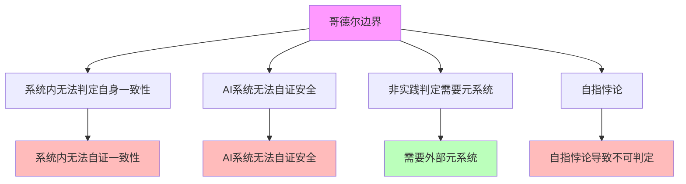

# 06.1.3-哥德尔边界与系统一致性

## 一、概述

哥德尔边界与系统一致性是逻辑可判定性基础的核心组成部分，阐述哥德尔不完备性定理在 AI 反实践判定中的应用，包括系统内无法判定自身一致性、AI 系统无法自证安全等。本文档阐述哥德尔边界与系统一致性的核心理论、系统一致性判定、工程意义及其在 AI 系统中的应用。

---

## 二、目录

- [06.1.3-哥德尔边界与系统一致性](#0613-哥德尔边界与系统一致性)
  - [一、概述](#一概述)
  - [二、目录](#二目录)
  - [二、哥德尔边界核心理论](#二哥德尔边界核心理论)
    - [2.1 核心理论](#21-核心理论)
    - [2.2 理论特征](#22-理论特征)
  - [四、系统内无法判定自身一致性](#四系统内无法判定自身一致性)
    - [3.1 哥德尔不完备性定理](#31-哥德尔不完备性定理)
    - [3.2 系统一致性判定](#32-系统一致性判定)
  - [五、AI 系统无法自证安全](#五ai-系统无法自证安全)
    - [4.1 安全证明问题](#41-安全证明问题)
    - [4.2 安全证明方法](#42-安全证明方法)
  - [六、非实践判定需要元系统](#六非实践判定需要元系统)
    - [5.1 元系统需求](#51-元系统需求)
    - [5.2 元系统设计](#52-元系统设计)
  - [七、自指悖论](#七自指悖论)
    - [6.1 自指悖论问题](#61-自指悖论问题)
    - [6.2 自指悖论处理](#62-自指悖论处理)
  - [八、工程意义](#八工程意义)
    - [7.1 工程实践铁律](#71-工程实践铁律)
    - [7.2 工程决策规则](#72-工程决策规则)
  - [九、与三层模型的关系](#九与三层模型的关系)
    - [8.1 哥德尔边界与执行层](#81-哥德尔边界与执行层)
    - [8.2 哥德尔边界与控制层](#82-哥德尔边界与控制层)
    - [8.3 哥德尔边界与数据层](#83-哥德尔边界与数据层)
  - [十、核心结论](#十核心结论)
  - [十一、相关主题](#十一相关主题)
  - [十二、参考文档](#十二参考文档)

## 三、哥德尔边界核心理论

### 2.1 核心理论

**哥德尔边界核心理论**：

**核心理论**：

1. **系统内无法判定自身一致性**：系统内无法判定自身一致性
2. **AI 系统无法自证安全**：AI 系统无法自证安全
3. **非实践判定需要元系统**：非实践判定需要元系统
4. **自指悖论**：自指悖论导致不可判定

### 2.2 理论特征

**哥德尔边界理论特征**：

| **理论特征**   | **描述**                 | **确定性** | **适用范围** |
| -------------- | ------------------------ | ---------- | ------------ |
| **系统一致性** | 系统内无法判定自身一致性 | 高         | 广泛         |
| **安全证明**   | AI 系统无法自证安全      | 高         | 广泛         |
| **元系统需求** | 非实践判定需要元系统     | 高         | 广泛         |
| **自指悖论**   | 自指悖论导致不可判定     | 高         | 广泛         |

---

## 四、系统内无法判定自身一致性

### 3.1 哥德尔不完备性定理

**哥德尔不完备性定理**：

**核心定理**：任何足够强大的形式系统，如果是一致的，则无法证明自身的一致性

**定理内容**：

1. **第一不完备性定理**：任何足够强大的形式系统，如果是一致的，则存在无法证明的真命题
2. **第二不完备性定理**：任何足够强大的形式系统，如果是一致的，则无法证明自身的一致性

**确定性**：高

**案例**：

1. **Peano 算术**：Peano 算术无法证明自身一致性
2. **ZFC 集合论**：ZFC 集合论无法证明自身一致性
3. **AI 系统**：AI 系统无法证明自身一致性

### 3.2 系统一致性判定

**系统一致性判定**：

**核心问题**：系统内无法判定自身一致性

**判定内容**：

1. **系统内判定**：系统内无法判定自身一致性
2. **外部判定**：需要外部元系统判定
3. **元系统需求**：非实践判定需要元系统

**确定性**：高

---

## 五、AI 系统无法自证安全

### 4.1 安全证明问题

**AI 系统无法自证安全**：

**核心问题**：AI 系统无法自证安全

**问题内容**：

1. **自证安全**：AI 系统无法自证安全
2. **外部监督**：需要外部元系统监督
3. **人机共决**：关键决策必须人机共决

**确定性**：高

**案例**：

1. **AGI 安全性**：AGI 安全性等价于停机问题
2. **自我改进系统**：自我改进系统无法自证安全
3. **对齐问题**：对齐问题无法自证

### 4.2 安全证明方法

**安全证明方法**：

**核心方法**：需要外部元系统监督

**方法内容**：

1. **外部监督**：需要外部元系统监督
2. **人机共决**：关键决策必须人机共决
3. **制度保障**：需要制度保障

**确定性**：高

---

## 六、非实践判定需要元系统

### 5.1 元系统需求

**非实践判定需要元系统**：

**核心需求**：非实践判定需要元系统

**需求内容**：

1. **元系统**：需要外部元系统
2. **判定能力**：元系统具有判定能力
3. **监督机制**：元系统提供监督机制

**确定性**：高

**案例**：

1. **编译器**：编译器是元系统，判定代码语法
2. **静态分析**：静态分析是元系统，判定代码质量
3. **安全审计**：安全审计是元系统，判定代码安全

### 5.2 元系统设计

**元系统设计**：

**核心设计**：设计外部元系统

**设计内容**：

1. **判定引擎**：设计判定引擎
2. **监督机制**：设计监督机制
3. **反馈机制**：设计反馈机制

**确定性**：中

---

## 七、自指悖论

### 6.1 自指悖论问题

**自指悖论问题**：

**核心问题**：自指悖论导致不可判定

**问题内容**：

1. **自指悖论**：自指悖论导致不可判定
2. **停机问题**：停机问题是自指悖论的典型例子
3. **AGI 安全性**：AGI 安全性等价于停机问题

**确定性**：高

**案例**：

1. **图灵停机问题**：图灵停机问题是自指悖论的典型例子
2. **AGI 安全性**：AGI 安全性等价于停机问题
3. **自我改进系统**：自我改进系统存在自指悖论

### 6.2 自指悖论处理

**自指悖论处理**：

**核心处理**：需要外部元系统处理

**处理内容**：

1. **外部判定**：需要外部元系统判定
2. **避免自指**：避免自指悖论
3. **分层设计**：分层设计避免自指

**确定性**：中

---

## 八、工程意义

### 7.1 工程实践铁律

**工程实践铁律**：

**核心铁律**：只在完全可判定区域做自动化

**铁律内容**：

1. **完全可判定区域**：只在完全可判定区域做自动化
2. **半可判定区域**：在半可判定区域做阈值管理
3. **不可判定区域**：在不可判定区域做制度保障

**确定性**：高

### 7.2 工程决策规则

**工程决策规则**：

**核心规则**：关键决策必须人机共决

**规则内容**：

1. **人机共决**：关键决策必须人机共决
2. **外部监督**：需要外部元系统监督
3. **制度保障**：需要制度保障

**确定性**：高

---

## 九、与三层模型的关系

### 8.1 哥德尔边界与执行层

**哥德尔边界与执行层**：

- **计算过程**：执行层计算过程存在哥德尔边界
- **数值精度**：数值精度不影响哥德尔边界
- **梯度计算**：梯度计算不影响哥德尔边界

### 8.2 哥德尔边界与控制层

**哥德尔边界与控制层**：

- **推理过程**：控制层推理过程存在哥德尔边界
- **控制策略**：控制策略存在哥德尔边界
- **约束机制**：约束机制存在哥德尔边界

### 8.3 哥德尔边界与数据层

**哥德尔边界与数据层**：

- **训练过程**：数据层训练过程存在哥德尔边界
- **数据策略**：数据策略存在哥德尔边界
- **评估方法**：评估方法存在哥德尔边界

---

## 十、核心结论

1. **哥德尔边界与系统一致性是逻辑可判定性基础的核心组成部分**：系统内无法判定自身一致性、AI 系统无法自证安全
2. **核心理论**：哥德尔不完备性定理、系统一致性判定、安全证明问题
3. **工程意义**：只在完全可判定区域做自动化，关键决策必须人机共决
4. **元系统需求**：非实践判定需要元系统

---

## 十一、相关主题

- [06.1.1-图灵停机问题到实践判别](06.1.1-图灵停机问题到实践判别.md)
- [06.1.2-可判定性视角下的三层模型](06.1.2-可判定性视角下的三层模型.md)
- [06.1.4-判定算法复杂度分析](06.1.4-判定算法复杂度分析.md)
- [06.4.4-不可判定区域处理](06.4.4-不可判定区域处理.md)

---

## 十二、参考文档

- [构建一个反实践规范（anti-patterns）的判定系统](../../view/ai_logic_neg_view.md)
