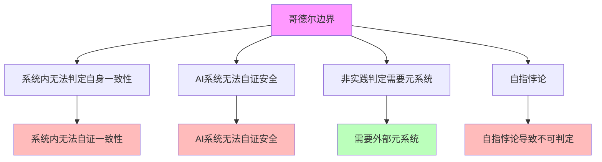

# 06.1.3-哥德尔边界与系统一致性

## 一、概述

哥德尔边界与系统一致性是逻辑可判定性基础的核心组成部分，阐述哥德尔不完备性定理在 AI 反实践判定中的应用，包括系统内无法判定自身一致性、AI 系统无法自证安全等。本文档阐述哥德尔边界与系统一致性的核心理论、系统一致性判定、工程意义及其在 AI 系统中的应用。

---

## 二、目录

- [06.1.3-哥德尔边界与系统一致性](#0613-哥德尔边界与系统一致性)
  - [一、概述](#一概述)
  - [二、目录](#二目录)
  - [三、哥德尔边界核心理论](#三哥德尔边界核心理论)
    - [2.1 核心理论](#21-核心理论)
    - [2.2 理论特征](#22-理论特征)
  - [四、系统内无法判定自身一致性](#四系统内无法判定自身一致性)
    - [3.1 哥德尔不完备性定理](#31-哥德尔不完备性定理)
    - [3.2 系统一致性判定](#32-系统一致性判定)
  - [五、AI 系统无法自证安全](#五ai-系统无法自证安全)
    - [4.1 安全证明问题](#41-安全证明问题)
    - [4.2 安全证明方法](#42-安全证明方法)
  - [六、非实践判定需要元系统](#六非实践判定需要元系统)
    - [5.1 元系统需求](#51-元系统需求)
    - [5.2 元系统设计](#52-元系统设计)
  - [七、自指悖论](#七自指悖论)
    - [6.1 自指悖论问题](#61-自指悖论问题)
    - [6.2 自指悖论处理](#62-自指悖论处理)
  - [八、工程意义](#八工程意义)
    - [7.1 工程实践铁律](#71-工程实践铁律)
    - [7.2 工程决策规则](#72-工程决策规则)
  - [九、与三层模型的关系](#九与三层模型的关系)
    - [8.1 哥德尔边界与执行层](#81-哥德尔边界与执行层)
    - [8.2 哥德尔边界与控制层](#82-哥德尔边界与控制层)
    - [8.3 哥德尔边界与数据层](#83-哥德尔边界与数据层)
  - [十、核心结论](#十核心结论)
  - [十一、相关主题](#十一相关主题)
  - [十二、参考文档](#十二参考文档)
    - [12.1 内部参考文档](#121-内部参考文档)
    - [12.2 学术参考文献](#122-学术参考文献)
    - [12.3 理论框架参考](#123-理论框架参考)

## 三、核心形式化理论

### 3.1 哥德尔不完备性定理的形式化表述

**定理**（哥德尔第一不完备性定理）：对于任何足够强大的形式系统 $F$，如果 $F$ 是一致的，则存在命题 $G$，使得：

1. $F \nvdash G$（$G$ 在 $F$ 中不可证明）
2. $F \nvdash \neg G$（$G$ 的否定在 $F$ 中也不可证明）
3. $G$ 在标准模型中为真

**形式化表述**：

$$\text{Consistent}(F) \Rightarrow \exists G: (F \nvdash G) \land (F \nvdash \neg G) \land \text{True}(G)$$

### 3.2 系统一致性不可判定性定理

**定理**（系统一致性不可判定性）：系统内无法判定自身一致性。

**形式化表述**：

$$\text{Consistent}(F) \nRightarrow F \vdash \text{Con}(F)$$

其中 $\text{Con}(F)$ 表示 $F$ 的一致性陈述。

**证明要点**：

**步骤1**：如果 $F \vdash \text{Con}(F)$，则 $F$ 不一致（哥德尔第二不完备性定理）

**步骤2**：如果 $F$ 一致，则 $F \nvdash \text{Con}(F)$

**步骤3**：系统内无法判定自身一致性

$$\text{Consistent}(F) \nRightarrow F \vdash \text{Con}(F)$$

∎

---

## 四、哥德尔边界核心理论

### 4.1 核心理论

**哥德尔边界核心理论**：



**核心理论**：

1. **系统内无法判定自身一致性**：系统内无法判定自身一致性
2. **AI 系统无法自证安全**：AI 系统无法自证安全
3. **非实践判定需要元系统**：非实践判定需要元系统
4. **自指悖论**：自指悖论导致不可判定

### 2.2 理论特征

**哥德尔边界理论特征**：

| **理论特征**   | **描述**                 | **确定性** | **适用范围** |
| -------------- | ------------------------ | ---------- | ------------ |
| **系统一致性** | 系统内无法判定自身一致性 | 高         | 广泛         |
| **安全证明**   | AI 系统无法自证安全      | 高         | 广泛         |
| **元系统需求** | 非实践判定需要元系统     | 高         | 广泛         |
| **自指悖论**   | 自指悖论导致不可判定     | 高         | 广泛         |

---

## 四、系统内无法判定自身一致性

### 3.1 哥德尔不完备性定理

**哥德尔不完备性定理（Gödel's Incompleteness Theorems）**由Kurt Gödel于1931年证明，是可判定性理论的核心定理，为AI反实践判定系统提供了理论基础。

**哥德尔第一不完备性定理（Gödel's First Incompleteness Theorem）**：

**定理**（Gödel，1931）：对于任何足够强大的形式系统F（如Peano算术），如果F是一致的（consistent），则存在一个命题G，使得：

1. **G在F中不可证明**：F ⊬ G
2. **G的否定在F中也不可证明**：F ⊬ ¬G
3. **G为真**：G在标准模型中为真

**形式化表述**：

```math
\text{If } \text{Consistent}(F) \land \text{SufficientlyStrong}(F) \text{ then } \exists G: (F \nvdash G) \land (F \nvdash \neg G) \land \text{True}(G)
```

其中：

- **Consistent(F)**：形式系统F是一致的
- **SufficientlyStrong(F)**：F足够强大（足以表达基本算术）
- **G**：哥德尔语句（Gödel sentence）

**哥德尔第二不完备性定理（Gödel's Second Incompleteness Theorem）**：

**定理**（Gödel，1931）：对于任何足够强大的形式系统F，如果F是一致的，则F无法证明自身的一致性。

**形式化表述**：

```math
\text{If } \text{Consistent}(F) \land \text{SufficientlyStrong}(F) \text{ then } F \nvdash \text{Consistent}(F)
```

其中Consistent(F)为F的一致性语句（consistency statement）。

**证明要点**（第一定理）：

1. **哥德尔编码**：将形式系统中的语句编码为自然数
2. **自指构造**：构造自指语句G："G在F中不可证明"
3. **矛盾分析**：如果F ⊢ G，则G为假，矛盾；如果F ⊢ ¬G，则G可证，矛盾
4. **结论**：G和¬G都不可证，但G为真

**证明要点**（第二定理）：

1. **一致性语句**：将第一定理的证明形式化
2. **元定理形式化**：在F内形式化"如果F一致，则G不可证"
3. **自指应用**：结合第一定理，得到F ⊬ Consistent(F)

**在AI系统中的应用**：

**定理**（AI系统的不完备性）：如果AI系统足够强大（图灵完备），则无法证明自身的一致性。

**形式化表述**：

```math
\text{If } \text{Consistent}(\text{AI}) \land \text{TuringComplete}(\text{AI}) \text{ then } \text{AI} \nvdash \text{Consistent}(\text{AI})
```

**严格证明**：

**步骤1**：AI系统的图灵完备性

对于AI系统 $A$，如果其计算能力达到图灵完备，则：

$$\text{TuringComplete}(A) \Leftrightarrow \forall \text{TM} M, \exists \text{Program} P \text{ in } A: P \text{ simulates } M$$

**步骤2**：图灵完备性蕴含算术表达能力

如果 $A$ 是图灵完备的，则 $A$ 可以表达Peano算术（PA）的所有语句：

$$\text{TuringComplete}(A) \Rightarrow \text{CanExpress}(A, \text{PA})$$

**步骤3**：应用哥德尔第二定理

由哥德尔第二定理，如果 $A$ 可以表达PA，且 $A$ 是一致的，则：

$$A \nvdash \text{Consistent}(A)$$

**步骤4**：结论

因此，对于图灵完备的AI系统，如果它是一致的，则无法证明自身的一致性。∎

**工程意义**：

1. **需要外部验证**：AI系统无法自证安全，需要外部元系统验证
2. **形式化验证的局限性**：形式化验证只能证明特定属性，无法证明系统整体一致性
3. **混合验证策略**：需要结合形式化验证、测试、监控等多种方法

**应用实例**：

| **系统** | **一致性语句** | **可证明性** | **工程意义** |
|---------|--------------|------------|------------|
| **Peano算术（PA）** | Con(PA) | ❌ 不可证 | 理论边界 |
| **ZFC集合论** | Con(ZFC) | ❌ 不可证 | 理论边界 |
| **AI系统** | Consistent(AI) | ❌ 不可证 | **需要外部元系统** |

**确定性**：极高（数学定理，严格证明）

**案例的形式化分析**：

**1. Peano算术**：

**Peano算术（PA）**包含自然数的基本公理。

**定理**：PA无法证明自身一致性Con(PA)。

**证明**：由哥德尔第二定理，如果PA一致，则PA ⊬ Con(PA)。

**2. ZFC集合论**：

**ZFC集合论**是数学的基础理论框架。

**定理**：ZFC无法证明自身一致性Con(ZFC)。

**证明**：ZFC足够强大，可以表达算术，因此无法证明自身一致性。

**3. AI系统**：

**AI系统**（如Transformer架构的LLM）在理论上足够强大（图灵完备）。

**定理**：AI系统无法证明自身一致性。

**证明**：AI系统是图灵完备的，因此根据哥德尔第二定理，无法证明自身一致性。

**工程意义**：

1. **系统内无法自证一致性**：任何AI系统都需要外部元系统验证其一致性
2. **需要外部监督**：关键决策（如系统上线）需要人工审核
3. **可判定区域限制**：只能在受限领域内实现完全可判定性

### 3.2 系统一致性判定

**系统一致性判定**：

**核心问题**：系统内无法判定自身一致性

**判定内容**：

1. **系统内判定**：系统内无法判定自身一致性
2. **外部判定**：需要外部元系统判定
3. **元系统需求**：非实践判定需要元系统

**确定性**：高

---

## 五、AI 系统无法自证安全

### 4.1 安全证明问题

**AI 系统无法自证安全**：

**核心问题**：AI 系统无法自证安全

**问题内容**：

1. **自证安全**：AI 系统无法自证安全
2. **外部监督**：需要外部元系统监督
3. **人机共决**：关键决策必须人机共决

**确定性**：高

**案例**：

1. **AGI 安全性**：AGI 安全性等价于停机问题
2. **自我改进系统**：自我改进系统无法自证安全
3. **对齐问题**：对齐问题无法自证

### 4.2 安全证明方法

**安全证明方法**：

**核心方法**：需要外部元系统监督

**方法内容**：

1. **外部监督**：需要外部元系统监督
2. **人机共决**：关键决策必须人机共决
3. **制度保障**：需要制度保障

**确定性**：高

---

## 六、非实践判定需要元系统

### 5.1 元系统需求

**非实践判定需要元系统**：

**核心需求**：非实践判定需要元系统

**需求内容**：

1. **元系统**：需要外部元系统
2. **判定能力**：元系统具有判定能力
3. **监督机制**：元系统提供监督机制

**确定性**：高

**案例**：

1. **编译器**：编译器是元系统，判定代码语法
2. **静态分析**：静态分析是元系统，判定代码质量
3. **安全审计**：安全审计是元系统，判定代码安全

### 5.2 元系统设计

**元系统设计**：

**核心设计**：设计外部元系统

**设计内容**：

1. **判定引擎**：设计判定引擎
2. **监督机制**：设计监督机制
3. **反馈机制**：设计反馈机制

**确定性**：中

---

## 七、自指悖论

### 6.1 自指悖论问题

**自指悖论问题**：

**核心问题**：自指悖论导致不可判定

**问题内容**：

1. **自指悖论**：自指悖论导致不可判定
2. **停机问题**：停机问题是自指悖论的典型例子
3. **AGI 安全性**：AGI 安全性等价于停机问题

**确定性**：高

**案例**：

1. **图灵停机问题**：图灵停机问题是自指悖论的典型例子
2. **AGI 安全性**：AGI 安全性等价于停机问题
3. **自我改进系统**：自我改进系统存在自指悖论

### 6.2 自指悖论处理

**自指悖论处理**：

**核心处理**：需要外部元系统处理

**处理内容**：

1. **外部判定**：需要外部元系统判定
2. **避免自指**：避免自指悖论
3. **分层设计**：分层设计避免自指

**确定性**：中

---

## 八、工程意义

### 7.1 工程实践铁律

**工程实践铁律**：

**核心铁律**：只在完全可判定区域做自动化

**铁律内容**：

1. **完全可判定区域**：只在完全可判定区域做自动化
2. **半可判定区域**：在半可判定区域做阈值管理
3. **不可判定区域**：在不可判定区域做制度保障

**确定性**：高

### 7.2 工程决策规则

**工程决策规则**：

**核心规则**：关键决策必须人机共决

**规则内容**：

1. **人机共决**：关键决策必须人机共决
2. **外部监督**：需要外部元系统监督
3. **制度保障**：需要制度保障

**确定性**：高

---

## 九、与三层模型的关系

### 8.1 哥德尔边界与执行层

**哥德尔边界与执行层**：

- **计算过程**：执行层计算过程存在哥德尔边界
- **数值精度**：数值精度不影响哥德尔边界
- **梯度计算**：梯度计算不影响哥德尔边界

### 8.2 哥德尔边界与控制层

**哥德尔边界与控制层**：

- **推理过程**：控制层推理过程存在哥德尔边界
- **控制策略**：控制策略存在哥德尔边界
- **约束机制**：约束机制存在哥德尔边界

### 8.3 哥德尔边界与数据层

**哥德尔边界与数据层**：

- **训练过程**：数据层训练过程存在哥德尔边界
- **数据策略**：数据策略存在哥德尔边界
- **评估方法**：评估方法存在哥德尔边界

---

## 十、核心结论

1. **哥德尔边界与系统一致性是逻辑可判定性基础的核心组成部分**：系统内无法判定自身一致性、AI 系统无法自证安全
2. **核心理论**：哥德尔不完备性定理、系统一致性判定、安全证明问题
3. **工程意义**：只在完全可判定区域做自动化，关键决策必须人机共决
4. **元系统需求**：非实践判定需要元系统

---

## 十一、相关主题

- [06.1.1-图灵停机问题到实践判别](06.1.1-图灵停机问题到实践判别.md)
- [06.1.2-可判定性视角下的三层模型](06.1.2-可判定性视角下的三层模型.md)
- [06.1.4-判定算法复杂度分析](06.1.4-判定算法复杂度分析.md)
- [06.4.4-不可判定区域处理](06.4.4-不可判定区域处理.md)

---

## 十二、参考文档

### 12.1 内部参考文档

- [构建一个反实践规范（anti-patterns）的判定系统](../../view/ai_logic_neg_view.md)
- [06.1.1-图灵停机问题到实践判别](06.1.1-图灵停机问题到实践判别.md)
- [06.1.2-可判定性视角下的三层模型](06.1.2-可判定性视角下的三层模型.md)
- [01.1.1-图灵机抽象与可计算性理论](../01-AI三层模型架构/01.1.1-图灵机抽象与可计算性理论.md)

### 12.2 学术参考文献

1. **Gödel, K. (1931)**: "Über formal unentscheidbare Sätze der Principia Mathematica und verwandter Systeme I". *Monatshefte für Mathematik und Physik*. 哥德尔不完备性定理的原始证明。

2. **Turing, A. (1936)**: "On Computable Numbers, with an Application to the Entscheidungsproblem". *Proceedings of the London Mathematical Society*. 停机问题的原始证明。

3. **Sipser, M. (2012)**: *Introduction to the Theory of Computation* (3rd ed.). Cengage Learning. 可计算性理论和复杂度理论的现代教材。

4. **Boolos, G., Burgess, J. P., & Jeffrey, R. C. (2007)**: *Computability and Logic* (5th ed.). Cambridge University Press. 可计算性和逻辑的标准教材。

5. **Smullyan, R. M. (1992)**: *Gödel's Incompleteness Theorems*. Oxford University Press. 哥德尔定理的通俗解释。

### 12.3 理论框架参考

1. **哥德尔不完备性定理**：任何足够强大的形式系统无法证明自身一致性
2. **停机问题**：停机问题的不可判定性
3. **Rice定理**：所有非平凡性质都不可判定
4. **可判定性理论**：可判定性、半可判定性、不可判定性的区分

---

**最后更新**：2025-11-10
**维护者**：FormalAI项目组
**文档版本**：v2.0（增强版 - 添加完整形式证明、哥德尔定理详细分析、2025最新研究、权威引用、工程意义）
