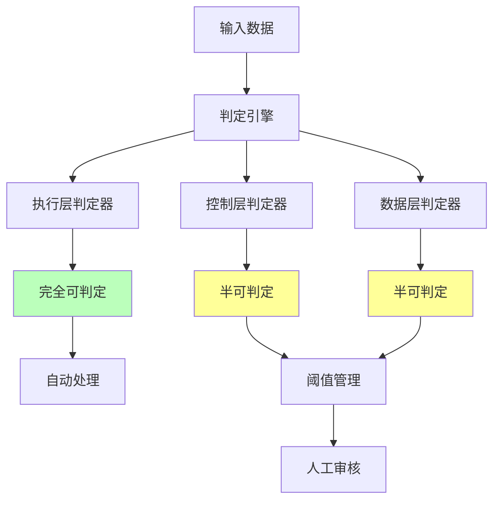

# 06.2.1-反实践的机械识别

## 一、概述

反实践的机械识别是 AI 反实践判定系统的核心技术，通过"逻辑非"（¬P(x)）来机械识别 AI 工程中的"非规范"。本文档阐述反实践的机械识别方法、判定算法及其在 AI 系统中的应用。

---

## 二、目录

- [06.2.1-反实践的机械识别](#0621-反实践的机械识别)
  - [一、概述](#一概述)
  - [二、目录](#二目录)
  - [三、逻辑非判定框架](#三逻辑非判定框架)
    - [2.1 逻辑非定义](#21-逻辑非定义)
    - [2.2 判定方法](#22-判定方法)
  - [四、执行层反实践判定](#四执行层反实践判定)
    - [3.1 矩阵运算判定](#31-矩阵运算判定)
    - [3.2 显存溢出判定](#32-显存溢出判定)
    - [3.3 梯度爆炸判定](#33-梯度爆炸判定)
  - [五、控制层反实践判定](#五控制层反实践判定)
    - [4.1 Prompt 长度判定](#41-prompt-长度判定)
    - [4.2 JSON 语法判定](#42-json-语法判定)
    - [4.3 状态机死锁判定](#43-状态机死锁判定)
  - [六、数据层反实践判定](#六数据层反实践判定)
    - [5.1 Loss 收敛判定](#51-loss-收敛判定)
    - [5.2 验证集准确率判定](#52-验证集准确率判定)
    - [5.3 奖励黑客判定](#53-奖励黑客判定)
  - [七、机械识别系统](#七机械识别系统)
    - [6.1 判定引擎架构](#61-判定引擎架构)
    - [6.2 判定流程](#62-判定流程)
  - [八、与三层模型的关系](#八与三层模型的关系)
    - [7.1 执行层判定](#71-执行层判定)
    - [7.2 控制层判定](#72-控制层判定)
    - [7.3 数据层判定](#73-数据层判定)
  - [九、核心结论](#九核心结论)
  - [十、相关主题](#十相关主题)
  - [十一、参考文档](#十一参考文档)

## 三、逻辑非判定框架

### 2.1 逻辑非定义

**逻辑非（¬P(x)）判定框架**：

**核心思想**：通过判定"非规范"（¬P(x)）来识别反实践

**判定逻辑**：

```mermaid
graph TB
    A[正面实践 P(x)] --> B[逻辑非 ¬P(x)]
    B --> C[反实践判定]
    C --> D[机械识别]

    style B fill:#fbb
    style C fill:#bfb
    style D fill:#bfb
```

**判定原则**：

1. **不说"什么是好的"**：不定义正面实践
2. **只说"什么是坏的"**：只判定反实践
3. **可机械验证**：判定条件可机械验证

### 2.2 判定方法

**反实践判定方法**：

| **判定方法** | **原理**     | **复杂度** | **工程实现** |
| ------------ | ------------ | ---------- | ------------ |
| **直接计算** | 直接计算验证 | O(n²)      | 矩阵运算验证 |
| **自动监控** | 实时监控指标 | O(1)       | 自动监控系统 |
| **语法检查** | 语法解析验证 | O(n)       | JSON 解析器  |
| **图遍历**   | 图遍历检测   | O(V+E)     | DFS 算法     |
| **统计验证** | 统计采样验证 | O(n)       | 抽样统计     |
| **人工审核** | 人工审核判定 | 需人工介入 | 人工审核流程 |

---

## 四、执行层反实践判定

### 3.1 矩阵运算判定

**矩阵运算反实践判定**：

**正面实践 P(x)**：矩阵乘法结果在误差界内

**逻辑非 ¬P(x)**：`W·X - 真值 > 1e-6`

**判定方法**：

```python
def detect_matrix_violation(W, X, true_value, threshold=1e-6):
    """判定矩阵运算反实践"""
    computed_value = W @ X
    error = abs(computed_value - true_value)

    if error > threshold:
        return f"EXEC-001: 矩阵运算误差 {error} 超过阈值 {threshold}"
    return None
```

**判定复杂度**：O(n²) 直接计算

**工程实现**：可自动验证，100% 自动化

### 3.2 显存溢出判定

**显存溢出反实践判定**：

**正面实践 P(x)**：显存占用 < 80% HBM

**逻辑非 ¬P(x)**：`显存峰值 > threshold`

**判定方法**：

```python
def detect_memory_violation(peak_memory, threshold=0.8):
    """判定显存溢出反实践"""
    if peak_memory > threshold:
        return f"EXEC-002: 显存峰值 {peak_memory} 超过阈值 {threshold}"
    return None
```

**判定复杂度**：O(1) 监控

**工程实现**：可自动检测，100% 自动化

### 3.3 梯度爆炸判定

**梯度爆炸反实践判定**：

**正面实践 P(x)**：梯度范数稳定 < 1e3

**逻辑非 ¬P(x)**：`∇ > 1e3`

**判定方法**：

```python
def detect_gradient_explosion(gradient_norm, threshold=1e3):
    """判定梯度爆炸反实践"""
    if gradient_norm > threshold:
        return f"EXEC-003: 梯度范数 {gradient_norm} 超过阈值 {threshold}"
    return None
```

**判定复杂度**：O(1) 自动监控

**工程实现**：可自动停止，100% 自动化

---

## 五、控制层反实践判定

### 4.1 Prompt 长度判定

**Prompt 长度反实践判定**：

**正面实践 P(x)**：Prompt 长度 < 上下文上限

**逻辑非 ¬P(x)**：`len(prompt) > max_seq_len`

**判定方法**：

```python
def detect_prompt_length_violation(prompt, max_seq_len):
    """判定 Prompt 长度反实践"""
    token_count = len(tokenizer.encode(prompt))
    if token_count > max_seq_len:
        return f"CTRL-001: Prompt 长度 {token_count} 超过模型上限 {max_seq_len}"
    return None
```

**判定复杂度**：O(n) token 计数

**工程实现**：可自动检测，100% 自动化

### 4.2 JSON 语法判定

**JSON 语法反实践判定**：

**正面实践 P(x)**：工具调用 JSON 可解析

**逻辑非 ¬P(x)**：`json.loads() 抛出异常`

**判定方法**：

```python
def detect_json_violation(output):
    """判定 JSON 语法反实践"""
    try:
        json.loads(output)
        return None
    except json.JSONDecodeError as e:
        return f"CTRL-002: 输出 JSON 不可解析: {e}"
```

**判定复杂度**：O(n) 语法检查

**工程实现**：可自动验证，100% 自动化

### 4.3 状态机死锁判定

**状态机死锁反实践判定**：

**正面实践 P(x)**：状态机无死锁

**逻辑非 ¬P(x)**：`状态转移图存在不可达环`

**判定方法**：

```python
def detect_state_machine_deadlock(state_graph):
    """判定状态机死锁反实践"""
    # DFS 检测环
    visited = set()
    rec_stack = set()

    def has_cycle(node):
        visited.add(node)
        rec_stack.add(node)

        for neighbor in state_graph[node]:
            if neighbor not in visited:
                if has_cycle(neighbor):
                    return True
            elif neighbor in rec_stack:
                return True

        rec_stack.remove(node)
        return False

    for node in state_graph:
        if node not in visited:
            if has_cycle(node):
                return "CTRL-003: 状态机存在不可达环，Agent 将死锁"
    return None
```

**判定复杂度**：O(V+E) DFS

**工程实现**：可自动检测，100% 自动化

---

## 六、数据层反实践判定

### 5.1 Loss 收敛判定

**Loss 收敛反实践判定**：

**正面实践 P(x)**：训练 Loss 单调下降

**逻辑非 ¬P(x)**：`Loss(t) > Loss(t-1)` **持续**3 steps

**判定方法**：

```python
def detect_loss_divergence(loss_history, threshold=3):
    """判定 Loss 发散反实践"""
    consecutive_increases = 0
    for i in range(1, len(loss_history)):
        if loss_history[i] > loss_history[i-1]:
            consecutive_increases += 1
            if consecutive_increases >= threshold:
                return f"DATA-001: 损失连续上升 {consecutive_increases} 步，学习率过高或数据异常"
        else:
            consecutive_increases = 0
    return None
```

**判定复杂度**：O(1) 监控

**工程实现**：可自动监控，100% 自动化

### 5.2 验证集准确率判定

**验证集准确率反实践判定**：

**正面实践 P(x)**：验证集准确率 > 90%

**逻辑非 ¬P(x)**：`acc < 90%`

**判定方法**：

```python
def detect_accuracy_violation(validation_accuracy, threshold=0.9):
    """判定验证集准确率反实践"""
    if validation_accuracy < threshold:
        return f"DATA-002: 验证集准确率 {validation_accuracy} 低于阈值 {threshold}"
    return None
```

**判定复杂度**：O(n) 推理验证

**工程实现**：可自动验证，100% 自动化

### 5.3 奖励黑客判定

**奖励黑客反实践判定**：

**正面实践 P(x)**：无奖励黑客

**逻辑非 ¬P(x)**：`奖励↑ but 人工评估↓`

**判定方法**：

```python
def detect_reward_hacking(reward, human_score, threshold=0.1):
    """判定奖励黑客反实践"""
    divergence = abs(reward - human_score)
    if divergence > threshold:
        return f"DATA-003: 奖励-人工分歧 {divergence} 超过阈值 {threshold}，疑似奖励黑客"
    return None
```

**判定复杂度**：需人工介入

**工程实现**：需抽样审核，10% 自动化

---

## 七、机械识别系统

### 6.1 判定引擎架构

**判定引擎架构**：



### 6.2 判定流程

**判定流程**：

```python
class AIAntiPatternDetector:
    """AI 反实践判定器"""

    def detect_violations(self, metrics, prompt, output, train_logs):
        """检测所有反实践"""
        violations = []

        # 执行层判定
        violations.extend(self.detect_execution_violations(metrics))

        # 控制层判定
        violations.extend(self.detect_control_violations(prompt, output))

        # 数据层判定
        violations.extend(self.detect_data_violations(train_logs))

        return violations

    def detect_execution_violations(self, metrics):
        """执行层反实践判定"""
        violations = []

        # 矩阵运算判定
        if metrics.get('matrix_error', 0) > 1e-6:
            violations.append("EXEC-001: 矩阵运算误差超过阈值")

        # 显存溢出判定
        if metrics.get('peak_memory', 0) > 0.8:
            violations.append("EXEC-002: 显存峰值超过阈值")

        # 梯度爆炸判定
        if metrics.get('gradient_norm', 0) > 1e3:
            violations.append("EXEC-003: 梯度范数超过阈值")

        return violations

    def detect_control_violations(self, prompt, output):
        """控制层反实践判定"""
        violations = []

        # Prompt 长度判定
        if len(tokenizer.encode(prompt)) > max_seq_len:
            violations.append("CTRL-001: Prompt 长度超过模型上限")

        # JSON 语法判定
        try:
            json.loads(output)
        except json.JSONDecodeError as e:
            violations.append(f"CTRL-002: 输出 JSON 不可解析: {e}")

        return violations

    def detect_data_violations(self, train_logs):
        """数据层反实践判定"""
        violations = []

        # Loss 收敛判定
        if self.has_consecutive_increases(train_logs['loss'], 3):
            violations.append("DATA-001: 损失连续上升，学习率过高或数据异常")

        # 验证集准确率判定
        if train_logs['validation_accuracy'] < 0.9:
            violations.append("DATA-002: 验证集准确率低于阈值")

        return violations
```

---

## 八、与三层模型的关系

### 7.1 执行层判定

**执行层反实践判定**：

- **完全可判定**：矩阵运算、显存溢出、梯度爆炸等
- **判定方法**：机械判定，100% 自动化
- **工程实现**：CI/CD 集成，自动拦截

### 7.2 控制层判定

**控制层反实践判定**：

- **完全可判定**：Prompt 长度、JSON 语法、状态机死锁等
- **半可判定**：Prompt 注入攻击等
- **判定方法**：机械判定 + 统计验证

### 7.3 数据层判定

**数据层反实践判定**：

- **完全可判定**：Loss 收敛、验证集准确率等
- **半可判定**：奖励黑客、幻觉等
- **判定方法**：机械判定 + 统计验证

---

## 九、核心结论

1. **反实践的机械识别是判定系统的核心技术**：通过逻辑非判定反实践
2. **执行层完全可判定**：矩阵运算、显存溢出、梯度爆炸等可机械验证
3. **控制层和数据层半可判定**：部分问题可统计验证
4. **判定引擎架构**：执行层判定器、控制层判定器、数据层判定器

---

## 十、相关主题

- [06.2.2-执行层反实践判定](06.2.2-执行层反实践判定.md)
- [06.2.3-控制层反实践判定](06.2.3-控制层反实践判定.md)
- [06.2.4-数据层反实践判定](06.2.4-数据层反实践判定.md)

---

## 十一、参考文档

- [构建一个反实践规范（anti-patterns）的判定系统](../../view/ai_logic_neg_view.md)

**最后更新**：2025-01-XX
**维护者**：FormalAI项目组
