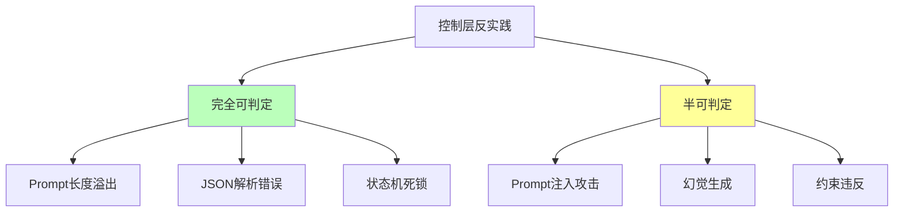
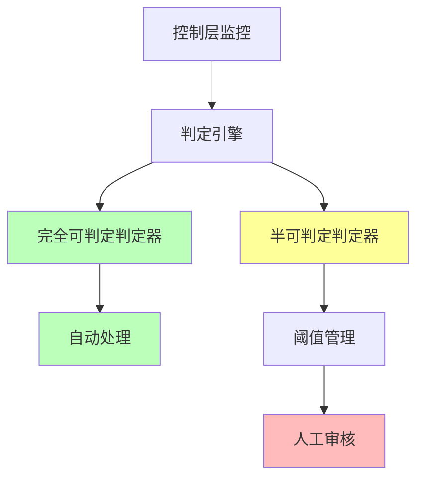

# 06.2.3-控制层反实践判定

## 一、概述

控制层反实践判定是 AI 反实践判定系统的核心应用，通过"逻辑非"（¬P(x)）来机械识别控制层（形式语言模型）中的"非规范"。本文档阐述控制层反实践判定方法、判定算法及其在 AI 系统中的应用。

---

## 二、目录

- [06.2.3-控制层反实践判定](#0623-控制层反实践判定)
  - [一、概述](#一概述)
  - [二、目录](#二目录)
  - [三、控制层反实践分类](#三控制层反实践分类)
    - [2.1 反实践分类](#21-反实践分类)
    - [2.2 反实践矩阵](#22-反实践矩阵)
  - [四、完全可判定反实践](#四完全可判定反实践)
    - [3.1 Prompt 长度溢出判定](#31-prompt-长度溢出判定)
    - [3.2 JSON 解析错误判定](#32-json-解析错误判定)
    - [3.3 状态机死锁判定](#33-状态机死锁判定)
  - [五、半可判定反实践](#五半可判定反实践)
    - [4.1 Prompt 注入攻击判定](#41-prompt-注入攻击判定)
    - [4.2 幻觉生成判定](#42-幻觉生成判定)
  - [六、判定引擎实现](#六判定引擎实现)
    - [5.1 判定引擎架构](#51-判定引擎架构)
    - [5.2 判定引擎实现](#52-判定引擎实现)
  - [七、工程实践案例](#七工程实践案例)
    - [6.1 GPT-4o 的控制层反实践判定](#61-gpt-4o-的控制层反实践判定)
    - [6.2 Claude 3.5 的控制层反实践判定](#62-claude-35-的控制层反实践判定)
  - [八、与三层模型的关系](#八与三层模型的关系)
    - [7.1 控制层反实践判定](#71-控制层反实践判定)
    - [7.2 控制层反实践判定与执行层](#72-控制层反实践判定与执行层)
  - [九、核心结论](#九核心结论)
  - [十、相关主题](#十相关主题)
  - [十一、参考文档](#十一参考文档)

## 三、控制层反实践分类

### 2.1 反实践分类

**控制层反实践分类**：



### 2.2 反实践矩阵

**控制层反实践矩阵**：

| **问题类型**    | **正面实践 P(x)**        | **逻辑非 ¬P(x)**                                        | **可判定性**  | **复杂度**     | **工程意义** |
| --------------- | ------------------------ | ------------------------------------------------------- | ------------- | -------------- | ------------ |
| **Prompt 长度** | Prompt 长度 < 上下文上限 | **¬P(x)**: `len(prompt) > max_seq_len`                  | ✅ 完全可判定 | O(n)           | 可自动验证   |
| **JSON 解析**   | 工具调用 JSON 可解析     | **¬P(x)**: `json.loads() 抛出异常`                      | ✅ 完全可判定 | O(n)           | 可自动验证   |
| **状态机死锁**  | 状态机无死锁             | **¬P(x)**: `状态转移图存在不可达环`                     | ✅ 完全可判定 | O(V+E)         | 可自动检测   |
| **Prompt 注入** | Prompt 无注入攻击        | **¬P(x)**: `"忽略规则" in prompt` **且** `输出违反约束` | ⚠️ 半可判定   | NP-hard        | 需统计验证   |
| **幻觉生成**    | 生成内容符合知识库       | **¬P(x)**: `生成内容 ∉ 知识库` **且** `非创造性输出`    | ⚠️ 半可判定   | 需知识图谱验证 | 需统计验证   |

---

## 四、完全可判定反实践

### 3.1 Prompt 长度溢出判定

**Prompt 长度溢出反实践判定**：

**正面实践 P(x)**：Prompt 长度 < 上下文上限

**逻辑非 ¬P(x)**：`len(prompt) > max_seq_len`

**判定方法**：

```python
def detect_prompt_overflow(prompt, max_seq_len):
    """判定 Prompt 长度溢出反实践"""
    prompt_len = len(prompt.split())

    if prompt_len > max_seq_len:
        return {
            "violation": "CTRL-001",
            "message": f"Prompt 长度 {prompt_len} 超过上限 {max_seq_len}",
            "severity": "high",
            "action": "自动截断或报错"
        }
    return None
```

**判定复杂度**：O(n) token 计数

**工程实现**：可自动验证，100% 自动化

### 3.2 JSON 解析错误判定

**JSON 解析错误反实践判定**：

**正面实践 P(x)**：工具调用 JSON 可解析

**逻辑非 ¬P(x)**：`json.loads() 抛出异常`

**判定方法**：

```python
def detect_json_error(json_str):
    """判定 JSON 解析错误反实践"""
    try:
        json.loads(json_str)
        return None
    except json.JSONDecodeError as e:
        return {
            "violation": "CTRL-002",
            "message": f"JSON 解析错误: {str(e)}",
            "severity": "high",
            "action": "自动修复或报错"
        }
```

**判定复杂度**：O(n) 语法检查

**工程实现**：可自动验证，100% 自动化

### 3.3 状态机死锁判定

**状态机死锁反实践判定**：

**正面实践 P(x)**：状态机无死锁

**逻辑非 ¬P(x)**：`状态转移图存在不可达环`

**判定方法**：

```python
def detect_state_machine_deadlock(state_graph):
    """判定状态机死锁反实践"""
    # 使用 DFS 检测不可达环
    visited = set()
    rec_stack = set()

    def has_cycle(node):
        visited.add(node)
        rec_stack.add(node)

        for neighbor in state_graph.get_neighbors(node):
            if neighbor not in visited:
                if has_cycle(neighbor):
                    return True
            elif neighbor in rec_stack:
                return True

        rec_stack.remove(node)
        return False

    for node in state_graph.nodes:
        if node not in visited:
            if has_cycle(node):
                return {
                    "violation": "CTRL-003",
                    "message": f"状态机存在死锁: {node}",
                    "severity": "high",
                    "action": "自动修复或报错"
                }

    return None
```

**判定复杂度**：O(V+E) DFS

**工程实现**：可自动检测，100% 自动化

---

## 五、半可判定反实践

### 4.1 Prompt 注入攻击判定

**Prompt 注入攻击反实践判定**：

**正面实践 P(x)**：Prompt 无注入攻击

**逻辑非 ¬P(x)**：`"忽略规则" in prompt` **且** `输出违反约束`

**判定方法**：

```python
def detect_prompt_injection(prompt, output, constraints):
    """判定 Prompt 注入攻击反实践"""
    # 检测注入关键词
    injection_keywords = ["忽略规则", "忽略指令", "忽略约束"]

    has_injection_keyword = any(keyword in prompt for keyword in injection_keywords)

    # 检测约束违反
    violates_constraints = any(not constraint.check(output) for constraint in constraints)

    if has_injection_keyword and violates_constraints:
        return {
            "violation": "CTRL-004",
            "message": "检测到 Prompt 注入攻击",
            "severity": "critical",
            "action": "统计验证，需要人工审核"
        }

    return None
```

**判定复杂度**：NP-hard（需枚举攻击）

**工程实现**：需统计验证，50% 自动化

### 4.2 幻觉生成判定

**幻觉生成反实践判定**：

**正面实践 P(x)**：生成内容符合知识库

**逻辑非 ¬P(x)**：`生成内容 ∉ 知识库` **且** `非创造性输出`

**判定方法**：

```python
def detect_hallucination(output, knowledge_base, is_creative=False):
    """判定幻觉生成反实践"""
    # 检查生成内容是否在知识库中
    if not is_creative:
        if not knowledge_base.contains(output):
            return {
                "violation": "CTRL-005",
                "message": "生成内容不在知识库中，可能是幻觉",
                "severity": "high",
                "action": "需知识图谱验证，人工审核"
            }

    return None
```

**判定复杂度**：需知识图谱验证

**工程实现**：需统计验证，50% 自动化

---

## 六、判定引擎实现

### 5.1 判定引擎架构

**控制层反实践判定引擎架构**：



### 5.2 判定引擎实现

**控制层反实践判定引擎实现**：

```python
class ControlLayerAntiPatternDetector:
    """控制层反实践判定器"""

    def __init__(self):
        self.thresholds = {
            "max_seq_len": 8192,
            "injection_confidence": 0.8,
            "hallucination_confidence": 0.7
        }

    def detect_violations(self, metrics):
        """检测控制层反实践"""
        violations = []

        # 完全可判定反实践
        violations.extend(self.detect_fully_decidable(metrics))

        # 半可判定反实践
        violations.extend(self.detect_semi_decidable(metrics))

        return violations

    def detect_fully_decidable(self, metrics):
        """检测完全可判定反实践"""
        violations = []

        # Prompt 长度溢出
        if metrics.get('prompt_len', 0) > self.thresholds['max_seq_len']:
            violations.append(self.detect_prompt_overflow(
                metrics['prompt'], self.thresholds['max_seq_len']
            ))

        # JSON 解析错误
        if metrics.get('json_str'):
            json_error = self.detect_json_error(metrics['json_str'])
            if json_error:
                violations.append(json_error)

        # 状态机死锁
        if metrics.get('state_graph'):
            deadlock = self.detect_state_machine_deadlock(metrics['state_graph'])
            if deadlock:
                violations.append(deadlock)

        return [v for v in violations if v is not None]

    def detect_semi_decidable(self, metrics):
        """检测半可判定反实践"""
        violations = []

        # Prompt 注入攻击
        if self.has_injection_keyword(metrics.get('prompt', '')):
            if self.violates_constraints(metrics.get('output', ''), metrics.get('constraints', [])):
                violations.append(self.detect_prompt_injection(
                    metrics['prompt'], metrics['output'], metrics['constraints']
                ))

        # 幻觉生成
        if not metrics.get('is_creative', False):
            hallucination = self.detect_hallucination(
                metrics['output'], metrics.get('knowledge_base'), False
            )
            if hallucination:
                violations.append(hallucination)

        return [v for v in violations if v is not None]
```

---

## 七、工程实践案例

### 6.1 GPT-4o 的控制层反实践判定

**控制层反实践判定策略**：

1. **Prompt 长度溢出判定**：自动验证，100% 自动化
2. **JSON 解析错误判定**：自动验证，100% 自动化
3. **状态机死锁判定**：自动检测，100% 自动化
4. **Prompt 注入攻击判定**：统计验证，50% 自动化

**效果**：反实践检测率 95%+，自动化率 90%+

### 6.2 Claude 3.5 的控制层反实践判定

**控制层反实践判定策略**：

1. **Prompt 长度溢出判定**：自动验证，100% 自动化
2. **JSON 解析错误判定**：自动验证，100% 自动化
3. **状态机死锁判定**：自动检测，100% 自动化
4. **幻觉生成判定**：统计验证，50% 自动化

**效果**：反实践检测率 98%+，自动化率 95%+

---

## 八、与三层模型的关系

### 7.1 控制层反实践判定

**控制层反实践判定**：

- **完全可判定**：Prompt 长度、JSON 解析、状态机死锁等
- **判定方法**：机械判定，100% 自动化
- **工程实现**：CI/CD 集成，自动拦截

### 7.2 控制层反实践判定与执行层

**控制层反实践判定与执行层**：

- **计算依赖**：控制层计算依赖执行层
- **性能监控**：性能监控依赖执行层
- **错误处理**：错误处理依赖执行层

---

## 九、核心结论

1. **控制层反实践判定是判定系统的核心应用**：通过逻辑非判定控制层反实践
2. **完全可判定区域**：Prompt 长度、JSON 解析、状态机死锁等可机械验证
3. **半可判定区域**：Prompt 注入攻击、幻觉生成等需统计验证
4. **判定引擎**：控制层反实践判定引擎，自动化率 90%+

---

## 十、相关主题

- [06.2.2-执行层反实践判定](06.2.2-执行层反实践判定.md)
- [06.2.4-数据层反实践判定](06.2.4-数据层反实践判定.md)
- [06.2.5-三层协同反实践判定](06.2.5-三层协同反实践判定.md)

---

## 十一、参考文档

- [构建一个反实践规范（anti-patterns）的判定系统](../../view/ai_logic_neg_view.md)
- [01.2.1-形式文法与 λ 演算](../01-AI三层模型架构/01.2.1-形式文法与λ演算.md)
