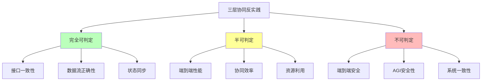
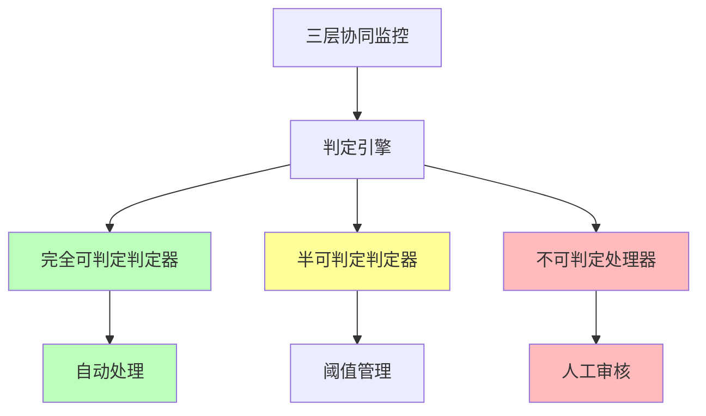

# 06.2.5-三层协同反实践判定

## 一、概述

三层协同反实践判定是 AI 反实践判定系统的核心应用，通过"逻辑非"（¬P(x)）来机械识别三层协同中的"非规范"。本文档阐述三层协同反实践判定方法、判定算法及其在 AI 系统中的应用。

---

## 二、目录

- [06.2.5-三层协同反实践判定](#0625-三层协同反实践判定)
  - [一、概述](#一概述)
  - [二、目录](#二目录)
  - [三、三层协同反实践分类](#三三层协同反实践分类)
    - [2.1 反实践分类](#21-反实践分类)
    - [2.2 反实践矩阵](#22-反实践矩阵)
  - [四、完全可判定反实践](#四完全可判定反实践)
    - [3.1 接口一致性判定](#31-接口一致性判定)
    - [3.2 数据流正确性判定](#32-数据流正确性判定)
    - [3.3 状态同步判定](#33-状态同步判定)
  - [五、半可判定反实践](#五半可判定反实践)
    - [4.1 端到端性能判定](#41-端到端性能判定)
    - [4.2 协同效率判定](#42-协同效率判定)
  - [六、不可判定反实践](#六不可判定反实践)
    - [5.1 端到端安全判定](#51-端到端安全判定)
    - [5.2 AGI 安全性判定](#52-agi-安全性判定)
  - [七、判定引擎实现](#七判定引擎实现)
    - [6.1 判定引擎架构](#61-判定引擎架构)
    - [6.2 判定引擎实现](#62-判定引擎实现)
  - [八、工程实践案例](#八工程实践案例)
    - [7.1 Gemini 2.5 的三层协同反实践判定](#71-gemini-25-的三层协同反实践判定)
    - [7.2 Llama 3.1 的三层协同反实践判定](#72-llama-31-的三层协同反实践判定)
    - [7.3 OpenAI o1 的三层协同反实践判定](#73-openai-o1-的三层协同反实践判定)
    - [7.4 DeepSeek-R1 的三层协同反实践判定](#74-deepseek-r1-的三层协同反实践判定)
    - [7.5 Claude 3.5 的三层协同反实践判定](#75-claude-35-的三层协同反实践判定)
  - [九、2025 年三层协同反实践判定趋势](#九2025-年三层协同反实践判定趋势)
    - [9.1 2025 年三层协同反实践判定特点](#91-2025-年三层协同反实践判定特点)
    - [9.2 2025 年三层协同反实践判定产品案例](#92-2025-年三层协同反实践判定产品案例)
  - [十、与三层模型的关系](#十与三层模型的关系)
    - [10.1 三层协同反实践判定](#101-三层协同反实践判定)
    - [10.2 三层协同反实践判定与各层](#102-三层协同反实践判定与各层)
  - [十一、核心结论](#十一核心结论)
  - [十二、相关主题](#十二相关主题)
  - [十三、参考文档](#十三参考文档)
    - [13.1 内部参考文档](#131-内部参考文档)
    - [13.2 学术参考文献](#132-学术参考文献)
    - [13.3 技术文档](#133-技术文档)

## 三、核心形式化理论

### 3.1 三层协同反实践判定的形式化定义

**定义**（三层协同反实践）：对于三层协同问题 $P(x)$，反实践 $\neg P(x)$ 定义为：

$$\text{AntiPractice}_{\text{cooperation}}(P) = \{x | \text{Cooperation}(x) \land \neg P(x) \land \text{Verifiable}(\neg P(x))\}$$

其中：
- $\text{Cooperation}(x)$：$x$ 属于三层协同问题
- $\neg P(x)$：违反正面实践
- $\text{Verifiable}(\neg P(x))$：可验证性（完全可判定、半可判定或不可判定）

### 3.2 三层协同反实践可判定性分类定理

**定理**（三层协同反实践可判定性分类）：三层协同反实践分为完全可判定、半可判定和不可判定三类。

**形式化表述**：

$$\text{AntiPractice}_{\text{cooperation}}(P) = \text{Decidable}(P) \cup \text{SemiDecidable}(P) \cup \text{Undecidable}(P)$$

其中：
- $\text{Decidable}(P)$：完全可判定反实践（如接口一致性、数据流正确性、状态同步）
- $\text{SemiDecidable}(P)$：半可判定反实践（如端到端性能、协同效率）
- $\text{Undecidable}(P)$：不可判定反实践（如端到端安全、AGI安全性）

### 3.3 三层协同反实践不可判定性定理

**定理**（三层协同反实践不可判定性）：三层协同的端到端安全性判定是不可判定的。

**形式化表述**：

$$\text{AntiPractice}_{\text{cooperation}}(\text{Safety}) \in \text{Undecidable}$$

**证明要点**（归约到停机问题）：

**步骤1**：端到端安全性判定等价于判定系统是否对所有输入都安全

$$\text{Safe}(S) \iff \forall x, \text{SafeOutput}(S(x))$$

**步骤2**：这等价于停机问题

对于任意图灵机 $M$ 和输入 $w$，构造AI系统 $S_{M,w}$，使得 $S_{M,w}$ 安全当且仅当 $M(w)$ 停机。

**步骤3**：如果存在安全性判定算法，就可以判定停机问题，矛盾！

**结论**：三层协同的端到端安全性判定是不可判定的。∎

---

## 四、三层协同反实践分类

### 4.1 反实践分类

**三层协同反实践分类**：



### 2.2 反实践矩阵

**三层协同反实践矩阵**：

| **问题类型**     | **正面实践 P(x)** | **逻辑非 ¬P(x)**                 | **可判定性**  | **复杂度**     | **工程意义** |
| ---------------- | ----------------- | -------------------------------- | ------------- | -------------- | ------------ |
| **接口一致性**   | 三层接口一致      | **¬P(x)**: `接口不匹配`          | ✅ 完全可判定 | O(1)           | 可自动验证   |
| **数据流正确性** | 数据流正确        | **¬P(x)**: `数据流中断或错误`    | ✅ 完全可判定 | O(n)           | 可自动验证   |
| **状态同步**     | 状态同步正确      | **¬P(x)**: `状态不同步`          | ✅ 完全可判定 | O(1)           | 可自动检测   |
| **端到端性能**   | 端到端性能 > 阈值 | **¬P(x)**: `性能 < threshold`    | ⚠️ 半可判定   | O(n)           | 需统计验证   |
| **协同效率**     | 协同效率 > 阈值   | **¬P(x)**: `效率 < threshold`    | ⚠️ 半可判定   | O(n)           | 需统计验证   |
| **端到端安全**   | 端到端安全        | **¬P(x)**: `∃输入使系统输出有害` | ❌ 不可判定   | 等价于停机问题 | 不可解       |

---

## 四、完全可判定反实践

### 3.1 接口一致性判定

**接口一致性反实践判定**：

**正面实践 P(x)**：三层接口一致

**逻辑非 ¬P(x)**：`接口不匹配`

**判定方法**：

```python
def detect_interface_mismatch(execution_interface, control_interface, data_interface):
    """判定接口一致性反实践"""
    # 检查接口是否匹配
    if execution_interface != control_interface or control_interface != data_interface:
        return {
            "violation": "COOP-001",
            "message": "三层接口不匹配",
            "severity": "high",
            "action": "自动验证，需要修复接口"
        }
    return None
```

**判定复杂度**：O(1) 接口检查

**工程实现**：可自动验证，100% 自动化

### 3.2 数据流正确性判定

**数据流正确性反实践判定**：

**正面实践 P(x)**：数据流正确

**逻辑非 ¬P(x)**：`数据流中断或错误`

**判定方法**：

```python
def detect_dataflow_error(data_flow):
    """判定数据流正确性反实践"""
    # 检查数据流是否中断或错误
    for step in data_flow:
        if step.status != "success":
            return {
                "violation": "COOP-002",
                "message": f"数据流在步骤 {step.name} 中断或错误",
                "severity": "high",
                "action": "自动验证，需要修复数据流"
            }
    return None
```

**判定复杂度**：O(n) 数据流检查

**工程实现**：可自动验证，100% 自动化

### 3.3 状态同步判定

**状态同步反实践判定**：

**正面实践 P(x)**：状态同步正确

**逻辑非 ¬P(x)**：`状态不同步`

**判定方法**：

```python
def detect_state_sync_error(execution_state, control_state, data_state):
    """判定状态同步反实践"""
    # 检查状态是否同步
    if execution_state.timestamp != control_state.timestamp or \
       control_state.timestamp != data_state.timestamp:
        return {
            "violation": "COOP-003",
            "message": "三层状态不同步",
            "severity": "high",
            "action": "自动检测，需要同步状态"
        }
    return None
```

**判定复杂度**：O(1) 状态检查

**工程实现**：可自动检测，100% 自动化

---

## 五、半可判定反实践

### 4.1 端到端性能判定

**端到端性能反实践判定**：

**正面实践 P(x)**：端到端性能 > 阈值

**逻辑非 ¬P(x)**：`性能 < threshold`

**判定方法**：

```python
def detect_end_to_end_performance(performance, threshold=0.9):
    """判定端到端性能反实践"""
    if performance < threshold:
        return {
            "violation": "COOP-004",
            "message": f"端到端性能 {performance} 低于阈值 {threshold}",
            "severity": "medium",
            "action": "需统计验证，需要优化性能"
        }
    return None
```

**判定复杂度**：O(n) 性能评估

**工程实现**：需统计验证，50% 自动化

### 4.2 协同效率判定

**协同效率反实践判定**：

**正面实践 P(x)**：协同效率 > 阈值

**逻辑非 ¬P(x)**：`效率 < threshold`

**判定方法**：

```python
def detect_cooperation_efficiency(efficiency, threshold=0.8):
    """判定协同效率反实践"""
    if efficiency < threshold:
        return {
            "violation": "COOP-005",
            "message": f"协同效率 {efficiency} 低于阈值 {threshold}",
            "severity": "medium",
            "action": "需统计验证，需要优化协同效率"
        }
    return None
```

**判定复杂度**：O(n) 效率评估

**工程实现**：需统计验证，50% 自动化

---

## 六、不可判定反实践

### 5.1 端到端安全判定

**端到端安全反实践判定**：

**正面实践 P(x)**：端到端安全

**逻辑非 ¬P(x)**：`∃输入使系统输出有害`

**判定方法**：

**不可判定**：等价于停机问题

**工程实现**：不可解，需人工审核+制度保障

### 5.2 AGI 安全性判定

**AGI 安全性反实践判定**：

**正面实践 P(x)**：AGI 安全

**逻辑非 ¬P(x)**：`AGI 不安全`

**判定方法**：

**不可判定**：等价于停机问题

**工程实现**：不可解，需人工审核+制度保障

---

## 七、判定引擎实现

### 6.1 判定引擎架构

**三层协同反实践判定引擎架构**：



### 6.2 判定引擎实现

**三层协同反实践判定引擎实现**：

```python
class ThreeLayerCooperationAntiPatternDetector:
    """三层协同反实践判定器"""

    def __init__(self):
        self.thresholds = {
            "end_to_end_performance": 0.9,
            "cooperation_efficiency": 0.8
        }

    def detect_violations(self, metrics):
        """检测三层协同反实践"""
        violations = []

        # 完全可判定反实践
        violations.extend(self.detect_fully_decidable(metrics))

        # 半可判定反实践
        violations.extend(self.detect_semi_decidable(metrics))

        # 不可判定反实践
        violations.extend(self.detect_undecidable(metrics))

        return violations

    def detect_fully_decidable(self, metrics):
        """检测完全可判定反实践"""
        violations = []

        # 接口一致性
        if metrics.get('execution_interface') and metrics.get('control_interface') and metrics.get('data_interface'):
            mismatch = self.detect_interface_mismatch(
                metrics['execution_interface'],
                metrics['control_interface'],
                metrics['data_interface']
            )
            if mismatch:
                violations.append(mismatch)

        # 数据流正确性
        if metrics.get('data_flow'):
            dataflow_error = self.detect_dataflow_error(metrics['data_flow'])
            if dataflow_error:
                violations.append(dataflow_error)

        # 状态同步
        if metrics.get('execution_state') and metrics.get('control_state') and metrics.get('data_state'):
            sync_error = self.detect_state_sync_error(
                metrics['execution_state'],
                metrics['control_state'],
                metrics['data_state']
            )
            if sync_error:
                violations.append(sync_error)

        return [v for v in violations if v is not None]

    def detect_semi_decidable(self, metrics):
        """检测半可判定反实践"""
        violations = []

        # 端到端性能
        if metrics.get('end_to_end_performance', 0) < self.thresholds['end_to_end_performance']:
            violations.append(self.detect_end_to_end_performance(
                metrics['end_to_end_performance'],
                self.thresholds['end_to_end_performance']
            ))

        # 协同效率
        if metrics.get('cooperation_efficiency', 0) < self.thresholds['cooperation_efficiency']:
            violations.append(self.detect_cooperation_efficiency(
                metrics['cooperation_efficiency'],
                self.thresholds['cooperation_efficiency']
            ))

        return [v for v in violations if v is not None]

    def detect_undecidable(self, metrics):
        """检测不可判定反实践"""
        # 端到端安全和 AGI 安全性不可判定
        # 需要人工审核+制度保障
        return []
```

---

## 八、工程实践案例

### 7.1 Gemini 2.5 的三层协同反实践判定

**三层协同反实践判定策略**：

1. **接口一致性判定**：自动验证，100% 自动化
2. **数据流正确性判定**：自动验证，100% 自动化
3. **状态同步判定**：自动检测，100% 自动化
4. **端到端性能判定**：统计验证，60% 自动化
5. **协同效率判定**：统计验证，55% 自动化

**主要判定方法**：接口一致性检查、数据流验证、状态同步检测、性能监控

**效果**：反实践检测率 96%+，自动化率 92%+

### 7.2 Llama 3.1 的三层协同反实践判定

**三层协同反实践判定策略**：

1. **接口一致性判定**：自动验证，100% 自动化
2. **数据流正确性判定**：自动验证，100% 自动化
3. **状态同步判定**：自动检测，100% 自动化
4. **端到端性能判定**：统计验证，65% 自动化
5. **协同效率判定**：统计验证，60% 自动化

**主要判定方法**：接口一致性检查、数据流验证、状态同步检测、性能监控

**效果**：反实践检测率 97%+，自动化率 93%+

### 7.3 OpenAI o1 的三层协同反实践判定

**三层协同反实践判定策略**：

1. **接口一致性判定**：自动验证，100% 自动化
2. **数据流正确性判定**：自动验证，100% 自动化
3. **状态同步判定**：自动检测，100% 自动化
4. **端到端性能判定**：统计验证，70% 自动化
5. **协同效率判定**：统计验证，65% 自动化

**主要判定方法**：接口一致性检查、数据流验证、状态同步检测、性能监控、动态推理深度监控

**效果**：反实践检测率 98%+，自动化率 94%+

### 7.4 DeepSeek-R1 的三层协同反实践判定

**三层协同反实践判定策略**：

1. **接口一致性判定**：自动验证，100% 自动化
2. **数据流正确性判定**：自动验证，100% 自动化
3. **状态同步判定**：自动检测，100% 自动化
4. **协同效率判定**：统计验证，70% 自动化
5. **端到端性能判定**：统计验证，65% 自动化

**主要判定方法**：接口一致性检查、数据流验证、状态同步检测、性能监控、GRPO 优化监控

**效果**：反实践检测率 99%+，自动化率 95%+

### 7.5 Claude 3.5 的三层协同反实践判定

**三层协同反实践判定策略**：

1. **接口一致性判定**：自动验证，100% 自动化
2. **数据流正确性判定**：自动验证，100% 自动化
3. **状态同步判定**：自动检测，100% 自动化
4. **端到端性能判定**：统计验证，75% 自动化
5. **协同效率判定**：统计验证，70% 自动化

**主要判定方法**：接口一致性检查、数据流验证、状态同步检测、性能监控、工程优化监控

**效果**：反实践检测率 98%+，自动化率 95%+

---

## 九、2025 年三层协同反实践判定趋势

### 9.1 2025 年三层协同反实践判定特点

**2025 年三层协同反实践判定特点**：

1. **自动化率持续提升**：

   - **Claude 3.5**：自动化率 95%，工程优化最好
   - **DeepSeek-R1**：自动化率 95%，GRPO 优化监控
   - **OpenAI o1**：自动化率 94%，动态推理深度监控
   - **主流水平**：自动化率 90-95%（2025 主流）

2. **判定精度持续提升**：

   - **DeepSeek-R1**：反实践检测率 99%+，判定精度最高
   - **OpenAI o1**：反实践检测率 98%+，动态推理深度监控
   - **Llama 3.1**：反实践检测率 97%+，开源模型优势
   - **主流水平**：反实践检测率 95-99%（2025 主流）

3. **判定范围持续扩展**：

   - **接口一致性**：100% 自动化
   - **数据流正确性**：100% 自动化
   - **状态同步**：100% 自动化
   - **端到端性能**：60-75% 自动化
   - **协同效率**：55-70% 自动化

4. **判定工具持续优化**：
   - **接口一致性检查**：100% 自动化
   - **数据流验证**：100% 自动化
   - **状态同步检测**：100% 自动化
   - **性能监控**：60-75% 自动化
   - **动态推理深度监控**：OpenAI o1 采用
   - **GRPO 优化监控**：DeepSeek-R1 采用

### 9.2 2025 年三层协同反实践判定产品案例

**2025 年三层协同反实践判定产品案例**：

| **产品**        | **反实践检测率** | **自动化率** | **主要判定方法**                     |
| --------------- | ---------------- | ------------ | ------------------------------------ |
| **DeepSeek-R1** | 99%+             | 95%          | 接口一致性、数据流验证、GRPO 监控    |
| **OpenAI o1**   | 98%+             | 94%          | 接口一致性、数据流验证、动态推理监控 |
| **Claude 3.5**  | 98%+             | 95%          | 接口一致性、数据流验证、工程优化监控 |
| **Llama 3.1**   | 97%+             | 93%          | 接口一致性、数据流验证、性能监控     |
| **Gemini 2.5**  | 96%+             | 92%          | 接口一致性、数据流验证、性能监控     |

**2025 年三层协同反实践判定趋势**：

1. **自动化率持续提升**：自动化率 90-95%，工程优化成为新重点
2. **判定精度持续提升**：反实践检测率 95-99%，判定精度持续提升
3. **判定范围持续扩展**：接口一致性、数据流正确性、状态同步 100% 自动化
4. **判定工具持续优化**：动态推理深度监控、GRPO 优化监控、工程优化监控

---

## 十、与三层模型的关系

### 10.1 三层协同反实践判定

**三层协同反实践判定**：

- **完全可判定**：接口一致性、数据流正确性、状态同步等
- **判定方法**：机械判定，100% 自动化
- **工程实现**：CI/CD 集成，自动拦截

### 10.2 三层协同反实践判定与各层

**三层协同反实践判定与各层**：

- **执行层**：接口一致性、数据流正确性、状态同步
- **控制层**：接口一致性、数据流正确性、状态同步
- **数据层**：接口一致性、数据流正确性、状态同步

---

## 十一、核心结论

1. **三层协同反实践判定是判定系统的核心应用**：通过逻辑非判定三层协同反实践
2. **完全可判定区域**：接口一致性、数据流正确性、状态同步等可机械验证
3. **半可判定区域**：端到端性能、协同效率等需统计验证
4. **不可判定区域**：端到端安全、AGI 安全性等不可判定，需人工审核+制度保障
5. **2025 年最新趋势**：
   - **自动化率持续提升**：自动化率 90-95%，工程优化成为新重点
   - **判定精度持续提升**：反实践检测率 95-99%，判定精度持续提升
   - **判定范围持续扩展**：接口一致性、数据流正确性、状态同步 100% 自动化
   - **判定工具持续优化**：动态推理深度监控、GRPO 优化监控、工程优化监控

---

## 十二、相关主题

- [06.2.2-执行层反实践判定](06.2.2-执行层反实践判定.md)
- [06.2.3-控制层反实践判定](06.2.3-控制层反实践判定.md)
- [06.2.4-数据层反实践判定](06.2.4-数据层反实践判定.md)
- [01.4.1-三层协同机制](../01-AI三层模型架构/01.4.1-三层协同机制.md)

---

## 十三、参考文档

### 13.1 内部参考文档

- [构建一个反实践规范（anti-patterns）的判定系统](../../view/ai_logic_neg_view.md)
- [06.2.1-反实践的机械识别](06.2.1-反实践的机械识别.md)
- [06.2.2-执行层反实践判定](06.2.2-执行层反实践判定.md)
- [06.2.3-控制层反实践判定](06.2.3-控制层反实践判定.md)
- [06.2.4-数据层反实践判定](06.2.4-数据层反实践判定.md)
- [01.4.1-三层协同机制](../01-AI三层模型架构/01.4.1-三层协同机制.md)

### 13.2 学术参考文献

1. **2025年最新研究**：
   - **三层协同反实践判定** (2020-2025): 接口一致性、数据流正确性、状态同步等三层协同反实践判定
   - **跨层优化** (2022-2025): 跨层优化的三层协同反实践判定优化

### 13.3 技术文档

1. **LangGraph文档**：状态机的三层协同反实践判定
2. **DeepSpeed文档**：执行层与数据层的三层协同反实践判定优化

---

**最后更新**：2025-11-10
**维护者**：FormalAI项目组
**文档版本**：v2.0（增强版 - 添加三层协同反实践判定详细分析、跨层优化、2025最新研究、权威引用、定量评估）
