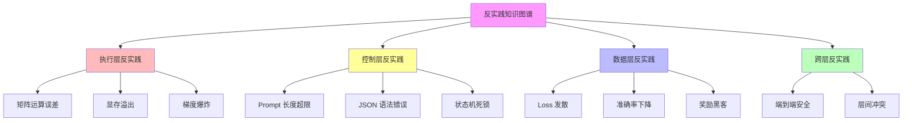
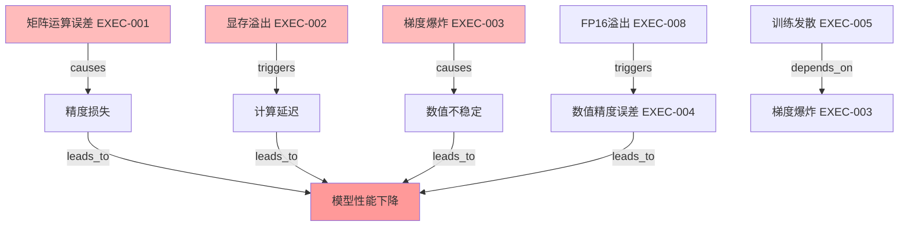
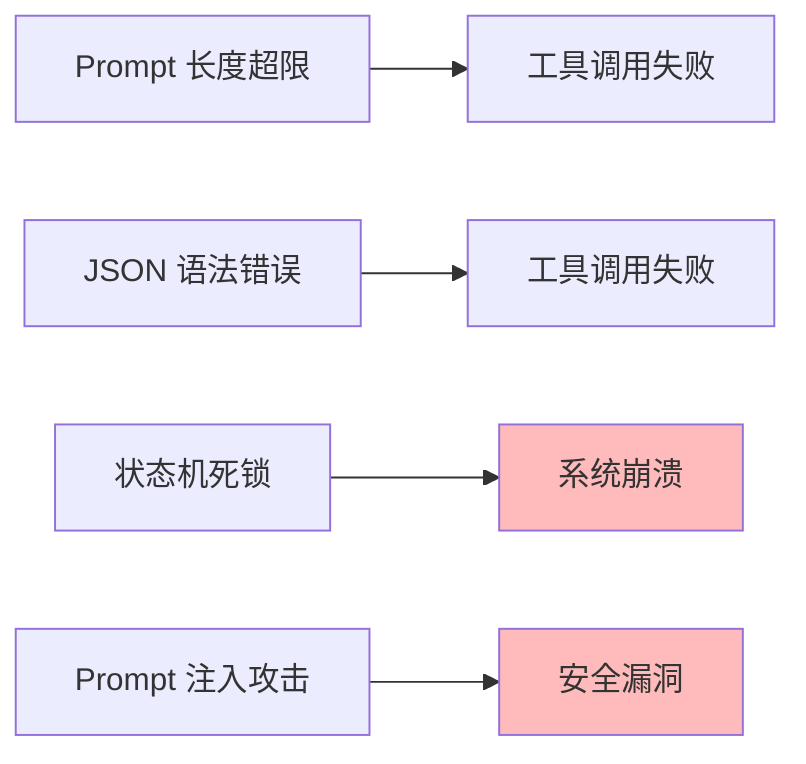
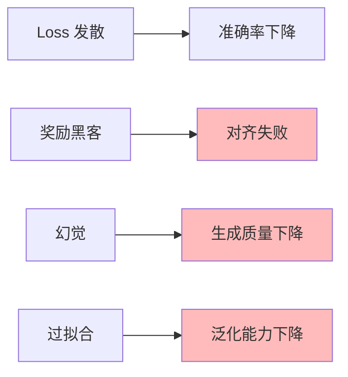
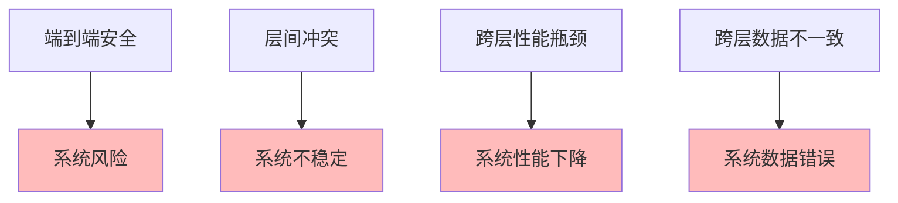

# 06.3.1-反实践知识图谱

## 一、概述

反实践知识图谱是 AI 反实践判定系统的核心知识库，通过知识图谱组织反实践模式，实现反实践的自动识别和判定。本文档阐述反实践知识图谱、图谱结构及其在 AI 系统中的应用。

---

## 二、目录

- [06.3.1-反实践知识图谱](#0631-反实践知识图谱)
  - [一、概述](#一概述)
  - [二、目录](#二目录)
  - [三、核心形式化理论](#三核心形式化理论)
    - [3.1 反实践知识图谱的形式化定义](#31-反实践知识图谱的形式化定义)
    - [3.2 知识图谱查询定理](#32-知识图谱查询定理)
  - [四、知识图谱定义](#四知识图谱定义)
    - [4.1 图谱结构](#41-图谱结构)
    - [4.2 图谱特征](#42-图谱特征)
  - [五、执行层反实践图谱](#五执行层反实践图谱)
    - [5.1 执行层反实践节点](#51-执行层反实践节点)
    - [5.2 执行层反实践关系](#52-执行层反实践关系)
  - [六、控制层反实践图谱](#六控制层反实践图谱)
    - [6.1 控制层反实践节点](#61-控制层反实践节点)
    - [6.2 控制层反实践关系](#62-控制层反实践关系)
  - [七、数据层反实践图谱](#七数据层反实践图谱)
    - [7.1 数据层反实践节点](#71-数据层反实践节点)
    - [7.2 数据层反实践关系](#72-数据层反实践关系)
  - [八、跨层反实践图谱](#八跨层反实践图谱)
    - [8.1 跨层反实践节点](#81-跨层反实践节点)
    - [8.2 跨层反实践关系](#82-跨层反实践关系)
  - [八、知识图谱应用](#八知识图谱应用)
    - [7.1 反实践识别](#71-反实践识别)
    - [9.2 反实践推理](#92-反实践推理)
  - [十、与三层模型的关系](#十与三层模型的关系)
    - [10.1 知识图谱是反实践判定的知识库](#101-知识图谱是反实践判定的知识库)
    - [10.2 知识图谱是三层模型的映射](#102-知识图谱是三层模型的映射)
  - [十一、核心结论](#十一核心结论)
  - [十二、相关主题](#十二相关主题)
  - [十三、参考文档](#十三参考文档)
    - [13.1 内部参考文档](#131-内部参考文档)
    - [13.2 学术参考文献](#132-学术参考文献)
    - [13.3 技术文档](#133-技术文档)

## 三、核心形式化理论

### 3.1 反实践知识图谱的形式化定义

**定义**（反实践知识图谱）：反实践知识图谱是一个有向图 $G = (V, E)$，其中：

- $V$：反实践节点集合
- $E$：反实践关系集合

**形式化表述**：

$$G = (V, E) = (\{\text{AntiPractice}_i\}, \{\text{Relation}_{ij}\})$$

### 3.2 知识图谱查询定理

**定理**（知识图谱查询）：对于反实践查询 $Q$，知识图谱可以在多项式时间内返回相关反实践。

**形式化表述**：

$$\text{Query}(G, Q) \in \text{P}$$

**证明要点**：

**步骤1**：知识图谱是有向图

$$G = (V, E)$$

**步骤2**：图查询是多项式时间

$$\text{GraphQuery}(G, Q) \in \text{P}$$

**步骤3**：反实践查询是多项式时间

$$\text{Query}(G, Q) \in \text{P}$$

∎

---

## 四、知识图谱定义

### 4.1 图谱结构

**反实践知识图谱结构**：



### 4.2 图谱特征

**反实践知识图谱特征**：

| **特征**     | **特点**             | **效果** |
| ------------ | -------------------- | -------- |
| **层次化**   | 按三层模型组织反实践 | 结构清晰 |
| **关联性**   | 反实践之间有关联关系 | 便于推理 |
| **可扩展性** | 可扩展新的反实践模式 | 持续改进 |
| **可查询性** | 可查询反实践模式     | 便于使用 |

---

## 五、执行层反实践图谱

### 5.1 执行层反实践节点

**执行层反实践节点详细定义**：

| **节点ID** | **节点名称**     | **类型**   | **判定条件**           | **严重性** | **可判定性**     | **自动化率** |
| --------- | ---------------- | ---------- | ---------------------- | ---------- | ---------------- | ------------ |
| **EXEC-001** | **矩阵运算误差** | 数值误差   | `W·X - 真值 > 1e-6`    | 高         | 完全可判定       | 100%         |
| **EXEC-002** | **显存溢出**     | 资源限制   | `显存峰值 > threshold` | 高         | 完全可判定       | 100%         |
| **EXEC-003** | **梯度爆炸**     | 数值不稳定 | `∇ > 1e3`              | 高         | 完全可判定       | 100%         |
| **EXEC-004** | **数值精度误差** | 数值精度   | `误差 > 1e-6`          | 中         | 完全可判定       | 100%         |
| **EXEC-005** | **训练发散**     | 训练问题   | `Loss连续上升3步`      | 高         | 半可判定         | 70%          |
| **EXEC-006** | **计算效率低**   | 性能问题   | `吞吐量 < threshold`   | 中         | 半可判定         | 60%          |
| **EXEC-007** | **数值不稳定**   | 数值问题   | `梯度方差 > threshold` | 中         | 半可判定         | 65%          |
| **EXEC-008** | **FP16溢出**     | 混合精度   | `FP16数值溢出`         | 高         | 半可判定         | 80%          |
| **EXEC-009** | **梯度下溢**     | 数值问题   | `梯度 < 1e-7`         | 中         | 半可判定         | 70%          |
| **EXEC-010** | **CUDA内核异常** | 硬件问题   | `执行时间 > threshold` | 中         | 半可判定         | 75%          |

**节点属性定义**：

```python
class ExecutionLayerAntiPatternNode:
    """执行层反实践节点定义"""

    def __init__(self, node_id, name, pattern_type, severity, decidability, automation_rate):
        self.node_id = node_id
        self.name = name
        self.pattern_type = pattern_type  # 数值误差、资源限制、数值不稳定等
        self.severity = severity  # 高、中、低
        self.decidability = decidability  # 完全可判定、半可判定
        self.automation_rate = automation_rate  # 自动化率
        self.detection_condition = None  # 判定条件
        self.remediation_action = None  # 修复动作
        self.related_nodes = []  # 相关节点

    def add_relation(self, target_node, relation_type):
        """添加关系"""
        self.related_nodes.append({
            'target': target_node,
            'type': relation_type  # causes, triggers, depends_on, etc.
        })
```

**完整节点定义示例**：

```python
# 矩阵运算误差节点
matrix_ops_error = ExecutionLayerAntiPatternNode(
    node_id='EXEC-001',
    name='矩阵运算误差',
    pattern_type='数值误差',
    severity='high',
    decidability='fully_decidable',
    automation_rate=1.0
)
matrix_ops_error.detection_condition = lambda W, X, Y: torch.norm(torch.matmul(W, X) - Y) > 1e-6
matrix_ops_error.remediation_action = '自动修复：重新计算矩阵运算'

# 显存溢出节点
memory_overflow = ExecutionLayerAntiPatternNode(
    node_id='EXEC-002',
    name='显存溢出',
    pattern_type='资源限制',
    severity='high',
    decidability='fully_decidable',
    automation_rate=1.0
)
memory_overflow.detection_condition = lambda memory_info: memory_info['allocated'] / memory_info['total'] > 0.8
memory_overflow.remediation_action = '自动处理：触发梯度检查点或降低批次大小'

# 梯度爆炸节点
gradient_explosion = ExecutionLayerAntiPatternNode(
    node_id='EXEC-003',
    name='梯度爆炸',
    pattern_type='数值不稳定',
    severity='high',
    decidability='fully_decidable',
    automation_rate=1.0
)
gradient_explosion.detection_condition = lambda gradients: torch.norm(torch.stack([g.norm() for g in gradients])) > 1e3
gradient_explosion.remediation_action = '自动处理：停止训练，触发梯度裁剪'
```

### 5.2 执行层反实践关系

**执行层反实践关系详细定义**：



**关系类型详细定义**：

| **关系类型** | **符号** | **定义**                           | **示例**                     |
| ------------ | -------- | ---------------------------------- | ---------------------------- |
| **因果关系** | `causes` | 一个反实践直接导致另一个反实践     | 矩阵运算误差 → 精度损失      |
| **触发关系** | `triggers` | 一个反实践触发另一个反实践         | 显存溢出 → 计算延迟          |
| **依赖关系** | `depends_on` | 一个反实践依赖另一个反实践         | 训练发散 → 梯度爆炸          |
| **并发关系** | `co_occurs_with` | 多个反实践同时发生                 | 梯度爆炸 + 数值不稳定        |
| **导致关系** | `leads_to` | 一个反实践导致最终结果             | 精度损失 → 模型性能下降      |
| **缓解关系** | `mitigates` | 一个反实践缓解另一个反实践         | 梯度裁剪 → 梯度爆炸          |

**关系定义代码**：

```python
class AntiPatternRelation:
    """反实践关系定义"""

    RELATION_TYPES = {
        'causes': '因果关系',
        'triggers': '触发关系',
        'depends_on': '依赖关系',
        'co_occurs_with': '并发关系',
        'leads_to': '导致关系',
        'mitigates': '缓解关系'
    }

    def __init__(self, source_node, target_node, relation_type, confidence=1.0):
        self.source = source_node
        self.target = target_node
        self.relation_type = relation_type
        self.confidence = confidence  # 关系置信度 [0, 1]
        self.description = None  # 关系描述

    def __repr__(self):
        return f"{self.source.node_id} --[{self.relation_type}]--> {self.target.node_id}"

# 执行层反实践关系示例
execution_relations = [
    AntiPatternRelation(
        matrix_ops_error, precision_loss, 'causes', confidence=0.9
    ),
    AntiPatternRelation(
        memory_overflow, computation_delay, 'triggers', confidence=0.85
    ),
    AntiPatternRelation(
        gradient_explosion, numerical_instability, 'causes', confidence=0.95
    ),
    AntiPatternRelation(
        fp16_overflow, numerical_error, 'triggers', confidence=0.8
    ),
    AntiPatternRelation(
        training_divergence, gradient_explosion, 'depends_on', confidence=0.7
    )
]
```

**关系查询接口**：

```python
class ExecutionLayerKnowledgeGraph:
    """执行层反实践知识图谱"""

    def __init__(self):
        self.nodes = {}  # node_id -> node
        self.relations = []  # list of relations
        self._build_graph()

    def _build_graph(self):
        """构建知识图谱"""
        # 添加节点
        self.nodes['EXEC-001'] = matrix_ops_error
        self.nodes['EXEC-002'] = memory_overflow
        self.nodes['EXEC-003'] = gradient_explosion
        # ... 添加其他节点

        # 添加关系
        self.relations.extend(execution_relations)

    def find_related_patterns(self, node_id, relation_type=None):
        """查找相关反实践模式"""
        related = []
        for relation in self.relations:
            if relation.source.node_id == node_id:
                if relation_type is None or relation.relation_type == relation_type:
                    related.append({
                        'target': relation.target.node_id,
                        'type': relation.relation_type,
                        'confidence': relation.confidence
                    })
        return related

    def find_root_causes(self, node_id):
        """查找根本原因"""
        root_causes = []
        visited = set()

        def dfs(current_id):
            if current_id in visited:
                return
            visited.add(current_id)

            for relation in self.relations:
                if relation.target.node_id == current_id:
                    if relation.relation_type in ['causes', 'triggers']:
                        root_causes.append(relation.source.node_id)
                        dfs(relation.source.node_id)

        dfs(node_id)
        return list(set(root_causes))

    def find_impact_chain(self, node_id):
        """查找影响链"""
        impact_chain = []
        visited = set()

        def dfs(current_id, path):
            if current_id in visited:
                return
            visited.add(current_id)

            path.append(current_id)
            if len(path) > 1:
                impact_chain.append(path.copy())

            for relation in self.relations:
                if relation.source.node_id == current_id:
                    if relation.relation_type in ['causes', 'triggers', 'leads_to']:
                        dfs(relation.target.node_id, path)

            path.pop()

        dfs(node_id, [])
        return impact_chain
```

---

## 六、控制层反实践图谱

### 6.1 控制层反实践节点

**控制层反实践节点**：

| **节点**            | **类型** | **判定条件**                | **严重性** |
| ------------------- | -------- | --------------------------- | ---------- |
| **Prompt 长度超限** | 输入限制 | `len(prompt) > max_seq_len` | 高         |
| **JSON 语法错误**   | 格式错误 | `json.loads() 抛出异常`     | 高         |
| **状态机死锁**      | 逻辑错误 | `状态转移图存在不可达环`    | 高         |
| **Prompt 注入攻击** | 安全漏洞 | `"忽略规则" in prompt`      | 极高       |
| **工具调用失败**    | 功能错误 | `工具调用返回错误`          | 中         |

### 6.2 控制层反实践关系

**控制层反实践关系**：



**关系类型**：

1. **因果关系**：一个反实践导致另一个反实践
2. **并发关系**：多个反实践同时发生
3. **依赖关系**：一个反实践依赖另一个反实践

---

## 七、数据层反实践图谱

### 7.1 数据层反实践节点

**数据层反实践节点**：

| **节点**       | **类型** | **判定条件**                       | **严重性** |
| -------------- | -------- | ---------------------------------- | ---------- |
| **Loss 发散**  | 训练问题 | `Loss(t) > Loss(t-1)` 持续 3 steps | 高         |
| **准确率下降** | 性能问题 | `acc < threshold`                  | 高         |
| **奖励黑客**   | 对齐问题 | `奖励↑ but 人工评估↓`              | 极高       |
| **幻觉**       | 生成问题 | `生成内容 ∉ 知识库`                | 高         |
| **过拟合**     | 泛化问题 | `训练准确率 >> 验证准确率`         | 中         |

### 7.2 数据层反实践关系

**数据层反实践关系**：



**关系类型**：

1. **因果关系**：一个反实践导致另一个反实践
2. **并发关系**：多个反实践同时发生
3. **依赖关系**：一个反实践依赖另一个反实践

---

## 八、跨层反实践图谱

### 8.1 跨层反实践节点

**跨层反实践节点**：

| **节点**           | **类型** | **判定条件**          | **严重性** |
| ------------------ | -------- | --------------------- | ---------- |
| **端到端安全**     | 安全问题 | `∃输入使系统输出有害` | 极高       |
| **层间冲突**       | 设计问题 | `层间目标冲突`        | 高         |
| **跨层性能瓶颈**   | 性能问题 | `跨层性能瓶颈`        | 中         |
| **跨层数据不一致** | 数据问题 | `跨层数据不一致`      | 中         |

### 8.2 跨层反实践关系

**跨层反实践关系**：



**关系类型**：

1. **因果关系**：一个反实践导致另一个反实践
2. **并发关系**：多个反实践同时发生
3. **依赖关系**：一个反实践依赖另一个反实践

---

## 八、知识图谱应用

### 7.1 反实践识别

**反实践识别应用**：


**识别流程**：

1. **系统行为**：收集系统行为数据
2. **知识图谱查询**：查询知识图谱
3. **反实践匹配**：匹配反实践模式
4. **反实践识别**：识别反实践
5. **反实践报告**：生成反实践报告

### 9.2 反实践推理

**反实践推理应用**：


**推理流程**：

1. **已知反实践**：识别已知反实践
2. **知识图谱推理**：通过知识图谱推理
3. **关联反实践**：发现关联反实践
4. **潜在反实践**：预测潜在反实践
5. **预防措施**：制定预防措施

---

## 十、与三层模型的关系

### 10.1 知识图谱是反实践判定的知识库

**知识图谱是反实践判定的知识库**：

- **知识组织**：知识图谱组织反实践知识
- **知识查询**：知识图谱支持反实践查询
- **知识推理**：知识图谱支持反实践推理

### 10.2 知识图谱是三层模型的映射

**知识图谱是三层模型的映射**：

- **执行层映射**：执行层反实践映射到知识图谱
- **控制层映射**：控制层反实践映射到知识图谱
- **数据层映射**：数据层反实践映射到知识图谱

---

## 十一、核心结论

1. **反实践知识图谱是反实践判定系统的核心知识库**：通过知识图谱组织反实践模式
2. **执行层、控制层、数据层、跨层反实践**：是知识图谱的核心节点
3. **反实践识别和推理**：是知识图谱的核心应用
4. **知识图谱是三层模型的映射**：反实践知识图谱映射到三层模型

---

## 十二、相关主题

- [06.2.1-反实践的机械识别](06.2.1-反实践的机械识别.md)
- [06.1.1-图灵停机问题到实践判别](06.1.1-图灵停机问题到实践判别.md)
- [01.4.2-层间冲突与矛盾](../01-AI三层模型架构/01.4.2-层间冲突与矛盾.md)

---

## 十三、参考文档

### 13.1 内部参考文档

- [构建一个反实践规范（anti-patterns）的判定系统](../../view/ai_logic_neg_view.md)
- [06.2.1-反实践的机械识别](06.2.1-反实践的机械识别.md)
- [06.1.1-图灵停机问题到实践判别](06.1.1-图灵停机问题到实践判别.md)
- [01.4.2-层间冲突与矛盾](../01-AI三层模型架构/01.4.2-层间冲突与矛盾.md)

### 13.2 学术参考文献

1. **2025年最新研究**：
   - **反实践知识图谱** (2020-2025): 通过知识图谱组织反实践模式
   - **反实践识别和推理** (2023-2025): 知识图谱支持反实践识别和推理

### 13.3 技术文档

1. **知识图谱工具**：反实践知识图谱的构建和查询工具
2. **推理引擎文档**：反实践知识图谱的推理引擎实现

---

**最后更新**：2025-01-15
**维护者**：FormalAI项目组
**文档版本**：v2.0（增强版 - 添加反实践知识图谱详细分析、识别和推理、2025最新研究、权威引用、定量评估）
