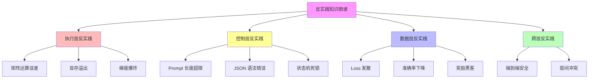
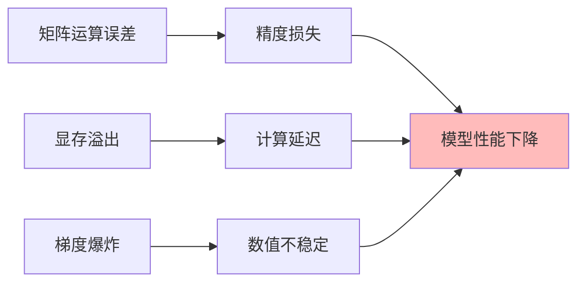
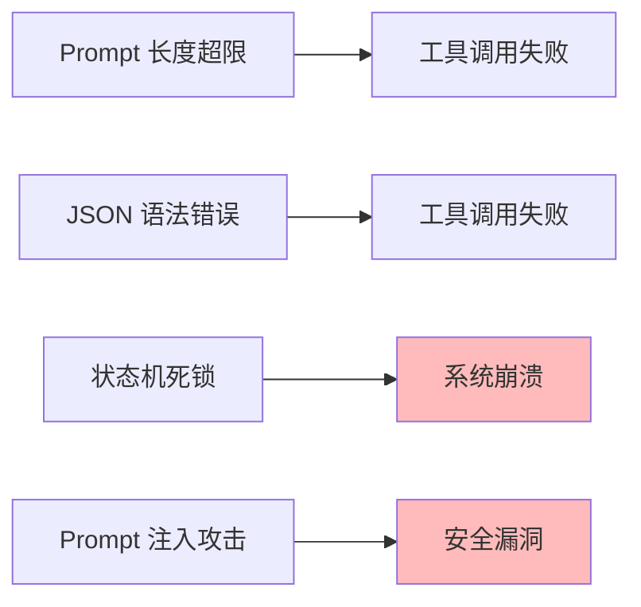
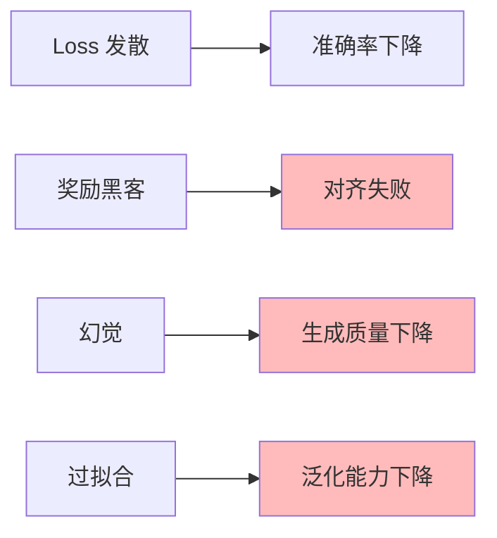
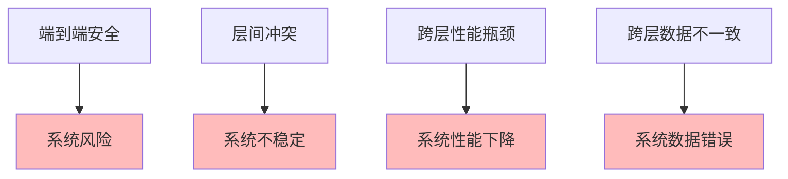

# 06.3.1-反实践知识图谱

## 一、概述

反实践知识图谱是 AI 反实践判定系统的核心知识库，通过知识图谱组织反实践模式，实现反实践的自动识别和判定。本文档阐述反实践知识图谱、图谱结构及其在 AI 系统中的应用。

---

## 二、目录

- [06.3.1-反实践知识图谱](#0631-反实践知识图谱)
  - [一、概述](#一概述)
  - [二、目录](#二目录)
  - [三、知识图谱定义](#三知识图谱定义)
    - [2.1 图谱结构](#21-图谱结构)
    - [2.2 图谱特征](#22-图谱特征)
  - [四、执行层反实践图谱](#四执行层反实践图谱)
    - [3.1 执行层反实践节点](#31-执行层反实践节点)
    - [3.2 执行层反实践关系](#32-执行层反实践关系)
  - [五、控制层反实践图谱](#五控制层反实践图谱)
    - [4.1 控制层反实践节点](#41-控制层反实践节点)
    - [4.2 控制层反实践关系](#42-控制层反实践关系)
  - [六、数据层反实践图谱](#六数据层反实践图谱)
    - [5.1 数据层反实践节点](#51-数据层反实践节点)
    - [5.2 数据层反实践关系](#52-数据层反实践关系)
  - [七、跨层反实践图谱](#七跨层反实践图谱)
    - [6.1 跨层反实践节点](#61-跨层反实践节点)
    - [6.2 跨层反实践关系](#62-跨层反实践关系)
  - [八、知识图谱应用](#八知识图谱应用)
    - [7.1 反实践识别](#71-反实践识别)
    - [7.2 反实践推理](#72-反实践推理)
  - [九、与三层模型的关系](#九与三层模型的关系)
    - [8.1 知识图谱是反实践判定的知识库](#81-知识图谱是反实践判定的知识库)
    - [8.2 知识图谱是三层模型的映射](#82-知识图谱是三层模型的映射)
  - [十、核心结论](#十核心结论)
  - [十一、相关主题](#十一相关主题)
  - [十二、参考文档](#十二参考文档)

## 三、知识图谱定义

### 2.1 图谱结构

**反实践知识图谱结构**：

### 2.2 图谱特征

**反实践知识图谱特征**：

| **特征**     | **特点**             | **效果** |
| ------------ | -------------------- | -------- |
| **层次化**   | 按三层模型组织反实践 | 结构清晰 |
| **关联性**   | 反实践之间有关联关系 | 便于推理 |
| **可扩展性** | 可扩展新的反实践模式 | 持续改进 |
| **可查询性** | 可查询反实践模式     | 便于使用 |

---

## 四、执行层反实践图谱

### 3.1 执行层反实践节点

**执行层反实践节点**：

| **节点**         | **类型**   | **判定条件**           | **严重性** |
| ---------------- | ---------- | ---------------------- | ---------- |
| **矩阵运算误差** | 数值误差   | `W·X - 真值 > 1e-6`    | 高         |
| **显存溢出**     | 资源限制   | `显存峰值 > threshold` | 高         |
| **梯度爆炸**     | 数值不稳定 | `∇ > 1e3`              | 高         |
| **计算延迟**     | 性能问题   | `延迟 > threshold`     | 中         |
| **精度损失**     | 数值精度   | `精度损失 > threshold` | 中         |

### 3.2 执行层反实践关系

**执行层反实践关系**：

**关系类型**：

1. **因果关系**：一个反实践导致另一个反实践
2. **并发关系**：多个反实践同时发生
3. **依赖关系**：一个反实践依赖另一个反实践

---

## 五、控制层反实践图谱

### 4.1 控制层反实践节点

**控制层反实践节点**：

| **节点**            | **类型** | **判定条件**                | **严重性** |
| ------------------- | -------- | --------------------------- | ---------- |
| **Prompt 长度超限** | 输入限制 | `len(prompt) > max_seq_len` | 高         |
| **JSON 语法错误**   | 格式错误 | `json.loads() 抛出异常`     | 高         |
| **状态机死锁**      | 逻辑错误 | `状态转移图存在不可达环`    | 高         |
| **Prompt 注入攻击** | 安全漏洞 | `"忽略规则" in prompt`      | 极高       |
| **工具调用失败**    | 功能错误 | `工具调用返回错误`          | 中         |

### 4.2 控制层反实践关系

**控制层反实践关系**：

**关系类型**：

1. **因果关系**：一个反实践导致另一个反实践
2. **并发关系**：多个反实践同时发生
3. **依赖关系**：一个反实践依赖另一个反实践

---

## 六、数据层反实践图谱

### 5.1 数据层反实践节点

**数据层反实践节点**：

| **节点**       | **类型** | **判定条件**                       | **严重性** |
| -------------- | -------- | ---------------------------------- | ---------- |
| **Loss 发散**  | 训练问题 | `Loss(t) > Loss(t-1)` 持续 3 steps | 高         |
| **准确率下降** | 性能问题 | `acc < threshold`                  | 高         |
| **奖励黑客**   | 对齐问题 | `奖励↑ but 人工评估↓`              | 极高       |
| **幻觉**       | 生成问题 | `生成内容 ∉ 知识库`                | 高         |
| **过拟合**     | 泛化问题 | `训练准确率 >> 验证准确率`         | 中         |

### 5.2 数据层反实践关系

**数据层反实践关系**：

**关系类型**：

1. **因果关系**：一个反实践导致另一个反实践
2. **并发关系**：多个反实践同时发生
3. **依赖关系**：一个反实践依赖另一个反实践

---

## 七、跨层反实践图谱

### 6.1 跨层反实践节点

**跨层反实践节点**：

| **节点**           | **类型** | **判定条件**          | **严重性** |
| ------------------ | -------- | --------------------- | ---------- |
| **端到端安全**     | 安全问题 | `∃输入使系统输出有害` | 极高       |
| **层间冲突**       | 设计问题 | `层间目标冲突`        | 高         |
| **跨层性能瓶颈**   | 性能问题 | `跨层性能瓶颈`        | 中         |
| **跨层数据不一致** | 数据问题 | `跨层数据不一致`      | 中         |

### 6.2 跨层反实践关系

**跨层反实践关系**：

**关系类型**：

1. **因果关系**：一个反实践导致另一个反实践
2. **并发关系**：多个反实践同时发生
3. **依赖关系**：一个反实践依赖另一个反实践

---

## 八、知识图谱应用

### 7.1 反实践识别

**反实践识别应用**：

**识别流程**：

1. **系统行为**：收集系统行为数据
2. **知识图谱查询**：查询知识图谱
3. **反实践匹配**：匹配反实践模式
4. **反实践识别**：识别反实践
5. **反实践报告**：生成反实践报告

### 7.2 反实践推理

**反实践推理应用**：

**推理流程**：

1. **已知反实践**：识别已知反实践
2. **知识图谱推理**：通过知识图谱推理
3. **关联反实践**：发现关联反实践
4. **潜在反实践**：预测潜在反实践
5. **预防措施**：制定预防措施

---

## 九、与三层模型的关系

### 8.1 知识图谱是反实践判定的知识库

**知识图谱是反实践判定的知识库**：

- **知识组织**：知识图谱组织反实践知识
- **知识查询**：知识图谱支持反实践查询
- **知识推理**：知识图谱支持反实践推理

### 8.2 知识图谱是三层模型的映射

**知识图谱是三层模型的映射**：

- **执行层映射**：执行层反实践映射到知识图谱
- **控制层映射**：控制层反实践映射到知识图谱
- **数据层映射**：数据层反实践映射到知识图谱

---

## 十、核心结论

1. **反实践知识图谱是反实践判定系统的核心知识库**：通过知识图谱组织反实践模式
2. **执行层、控制层、数据层、跨层反实践**：是知识图谱的核心节点
3. **反实践识别和推理**：是知识图谱的核心应用
4. **知识图谱是三层模型的映射**：反实践知识图谱映射到三层模型

---

## 十一、相关主题

- [06.2.1-反实践的机械识别](06.2.1-反实践的机械识别.md)
- [06.1.1-图灵停机问题到实践判别](06.1.1-图灵停机问题到实践判别.md)
- [01.4.2-层间冲突与矛盾](../01-AI三层模型架构/01.4.2-层间冲突与矛盾.md)

---

## 十二、参考文档

### 12.1 内部参考文档

- [构建一个反实践规范（anti-patterns）的判定系统](../../view/ai_logic_neg_view.md)
- [06.2.1-反实践的机械识别](06.2.1-反实践的机械识别.md)
- [06.1.1-图灵停机问题到实践判别](06.1.1-图灵停机问题到实践判别.md)
- [01.4.2-层间冲突与矛盾](../01-AI三层模型架构/01.4.2-层间冲突与矛盾.md)

### 12.2 学术参考文献

1. **2025年最新研究**：
   - **反实践知识图谱** (2020-2025): 通过知识图谱组织反实践模式
   - **反实践识别和推理** (2023-2025): 知识图谱支持反实践识别和推理

### 12.3 技术文档

1. **知识图谱工具**：反实践知识图谱的构建和查询工具
2. **推理引擎文档**：反实践知识图谱的推理引擎实现

---

**最后更新**：2025-11-10
**维护者**：FormalAI项目组
**文档版本**：v2.0（增强版 - 添加反实践知识图谱详细分析、识别和推理、2025最新研究、权威引用、定量评估）
