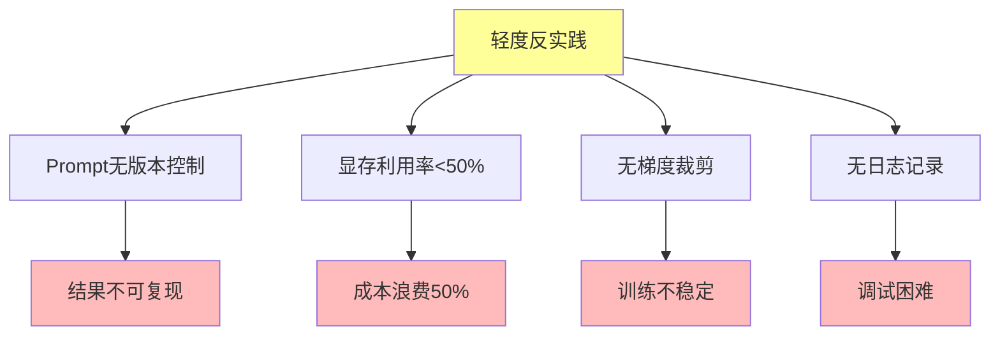

# 06.3.2-轻度反实践分析

## 一、概述

轻度反实践分析是反实践知识图谱的核心组成部分，分析轻度反实践的特征、判定方法、影响及其在 AI 系统中的应用。本文档阐述轻度反实践的核心特征、判定方法、影响分析及其在 AI 系统中的应用。

---

## 二、目录

- [06.3.2-轻度反实践分析](#0632-轻度反实践分析)
  - [一、概述](#一概述)
  - [二、目录](#二目录)
  - [三、轻度反实践核心特征](#三轻度反实践核心特征)
    - [2.1 核心特征](#21-核心特征)
    - [2.2 特征分析](#22-特征分析)
  - [四、Prompt 无版本控制](#四prompt-无版本控制)
    - [3.1 反实践特征](#31-反实践特征)
    - [3.2 判定方法](#32-判定方法)
  - [五、显存利用率\<50%](#五显存利用率50)
    - [4.1 反实践特征](#41-反实践特征)
    - [4.2 判定方法](#42-判定方法)
  - [六、无梯度裁剪](#六无梯度裁剪)
    - [5.1 反实践特征](#51-反实践特征)
    - [5.2 判定方法](#52-判定方法)
  - [七、无日志记录](#七无日志记录)
    - [6.1 反实践特征](#61-反实践特征)
    - [6.2 判定方法](#62-判定方法)
  - [八、轻度反实践影响分析](#八轻度反实践影响分析)
    - [7.1 影响评估](#71-影响评估)
    - [7.2 累积影响](#72-累积影响)
  - [九、与三层模型的关系](#九与三层模型的关系)
    - [8.1 轻度反实践与执行层](#81-轻度反实践与执行层)
    - [8.2 轻度反实践与控制层](#82-轻度反实践与控制层)
    - [8.3 轻度反实践与数据层](#83-轻度反实践与数据层)
  - [十、核心结论](#十核心结论)
  - [十一、相关主题](#十一相关主题)
  - [十二、参考文档](#十二参考文档)

## 三、轻度反实践核心特征

### 2.1 核心特征

**轻度反实践核心特征**：



**核心特征**：

1. **Prompt 无版本控制**：Prompt 无版本控制导致结果不可复现
2. **显存利用率<50%**：显存利用率低导致成本浪费
3. **无梯度裁剪**：无梯度裁剪导致训练不稳定
4. **无日志记录**：无日志记录导致调试困难

### 2.2 特征分析

**轻度反实践特征分析**：

| **反实践类型**        | **特征描述**      | **影响**     | **严重程度** |
| --------------------- | ----------------- | ------------ | ------------ |
| **Prompt 无版本控制** | Prompt 无版本控制 | 结果不可复现 | 低           |
| **显存利用率<50%**    | 显存利用率低      | 成本浪费 50% | 低           |
| **无梯度裁剪**        | 无梯度裁剪        | 训练不稳定   | 中           |
| **无日志记录**        | 无日志记录        | 调试困难     | 低           |

---

## 四、Prompt 无版本控制

### 3.1 反实践特征

**Prompt 无版本控制反实践**：

**核心问题**：Prompt 无版本控制导致结果不可复现

**特征**：

1. **无版本控制**：Prompt 无版本控制
2. **结果不可复现**：结果不可复现
3. **调试困难**：调试困难

**影响**：

1. **结果不可复现**：结果不可复现
2. **调试困难**：调试困难
3. **技术债累积**：技术债累积

### 3.2 判定方法

**Prompt 无版本控制判定方法**：

```python
def detect_prompt_version_control(prompt_history):
    """判定 Prompt 无版本控制反实践"""
    if not prompt_history or len(prompt_history) == 0:
        return {
            "violation": "MINOR-001",
            "message": "Prompt 无版本控制，结果不可复现",
            "severity": "low",
            "action": "建议使用版本控制系统管理 Prompt"
        }
    return None
```

**判定复杂度**：O(1) 检查

**工程实现**：可自动检测，100% 自动化

---

## 五、显存利用率<50%

### 4.1 反实践特征

**显存利用率<50%反实践**：

**核心问题**：显存利用率低导致成本浪费

**特征**：

1. **显存利用率低**：显存利用率<50%
2. **成本浪费**：成本浪费 50%
3. **资源浪费**：资源浪费

**影响**：

1. **成本浪费**：成本浪费 50%
2. **资源浪费**：资源浪费
3. **效率低下**：效率低下

### 4.2 判定方法

**显存利用率<50%判定方法**：

```python
def detect_low_memory_utilization(memory_usage, threshold=0.5):
    """判定显存利用率<50%反实践"""
    if memory_usage < threshold:
        return {
            "violation": "MINOR-002",
            "message": f"显存利用率 {memory_usage} 低于阈值 {threshold}，成本浪费",
            "severity": "low",
            "action": "建议优化显存利用率，减少成本浪费"
        }
    return None
```

**判定复杂度**：O(1) 监控

**工程实现**：可自动监控，100% 自动化

---

## 六、无梯度裁剪

### 5.1 反实践特征

**无梯度裁剪反实践**：

**核心问题**：无梯度裁剪导致训练不稳定

**特征**：

1. **无梯度裁剪**：无梯度裁剪
2. **训练不稳定**：训练不稳定
3. **梯度爆炸**：梯度爆炸风险

**影响**：

1. **训练不稳定**：训练不稳定
2. **梯度爆炸**：梯度爆炸风险
3. **模型发散**：模型发散风险

### 5.2 判定方法

**无梯度裁剪判定方法**：

```python
def detect_no_gradient_clipping(training_config):
    """判定无梯度裁剪反实践"""
    if not training_config.get('gradient_clip_value'):
        return {
            "violation": "MINOR-003",
            "message": "无梯度裁剪，训练不稳定",
            "severity": "medium",
            "action": "建议添加梯度裁剪，防止梯度爆炸"
        }
    return None
```

**判定复杂度**：O(1) 检查

**工程实现**：可自动检测，100% 自动化

---

## 七、无日志记录

### 6.1 反实践特征

**无日志记录反实践**：

**核心问题**：无日志记录导致调试困难

**特征**：

1. **无日志记录**：无日志记录
2. **调试困难**：调试困难
3. **问题追踪困难**：问题追踪困难

**影响**：

1. **调试困难**：调试困难
2. **问题追踪困难**：问题追踪困难
3. **技术债累积**：技术债累积

### 6.2 判定方法

**无日志记录判定方法**：

```python
def detect_no_logging(logging_config):
    """判定无日志记录反实践"""
    if not logging_config or not logging_config.get('enabled'):
        return {
            "violation": "MINOR-004",
            "message": "无日志记录，调试困难",
            "severity": "low",
            "action": "建议添加日志记录，便于调试和问题追踪"
        }
    return None
```

**判定复杂度**：O(1) 检查

**工程实现**：可自动检测，100% 自动化

---

## 八、轻度反实践影响分析

### 7.1 影响评估

**轻度反实践影响评估**：

| **反实践类型**        | **直接影响** | **间接影响** | **累积影响** |
| --------------------- | ------------ | ------------ | ------------ |
| **Prompt 无版本控制** | 结果不可复现 | 调试困难     | 技术债累积   |
| **显存利用率<50%**    | 成本浪费 50% | 资源浪费     | 效率低下     |
| **无梯度裁剪**        | 训练不稳定   | 梯度爆炸风险 | 模型发散风险 |
| **无日志记录**        | 调试困难     | 问题追踪困难 | 技术债累积   |

### 7.2 累积影响

**轻度反实践累积影响**：

1. **技术债累积**：轻度反实践累积导致技术债累积
2. **调试时间增加**：调试时间增加 3x
3. **成本浪费**：成本浪费持续增加
4. **效率低下**：效率持续低下

---

## 九、与三层模型的关系

### 8.1 轻度反实践与执行层

**轻度反实践与执行层**：

- **显存利用率**：显存利用率影响执行层
- **梯度裁剪**：梯度裁剪影响执行层
- **日志记录**：日志记录影响执行层

### 8.2 轻度反实践与控制层

**轻度反实践与控制层**：

- **Prompt 版本控制**：Prompt 版本控制影响控制层
- **日志记录**：日志记录影响控制层

### 8.3 轻度反实践与数据层

**轻度反实践与数据层**：

- **梯度裁剪**：梯度裁剪影响数据层
- **日志记录**：日志记录影响数据层

---

## 十、核心结论

1. **轻度反实践是反实践知识图谱的核心组成部分**：Prompt 无版本控制、显存利用率<50%、无梯度裁剪、无日志记录
2. **特征**：结果不可复现、成本浪费、训练不稳定、调试困难
3. **影响**：技术债累积、调试时间增加、成本浪费、效率低下
4. **判定方法**：可自动检测，100% 自动化

---

## 十一、相关主题

- [06.3.1-反实践分类体系](06.3.1-反实践分类体系.md)
- [06.3.3-中度反实践分析](06.3.3-中度反实践分析.md)
- [06.3.4-严重反实践分析](06.3.4-严重反实践分析.md)

---

## 十二、参考文档

- [构建一个反实践规范（anti-patterns）的判定系统](../../view/ai_logic_neg_view.md)

**最后更新**：2025-01-XX
**维护者**：FormalAI项目组
