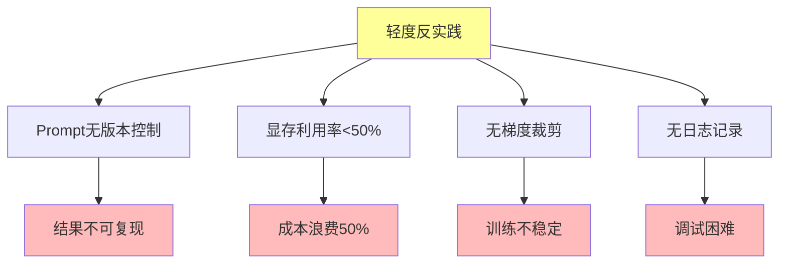

# 06.3.2-轻度反实践分析

## 一、概述

轻度反实践分析是反实践知识图谱的核心组成部分，分析轻度反实践的特征、判定方法、影响及其在 AI 系统中的应用。本文档阐述轻度反实践的核心特征、判定方法、影响分析及其在 AI 系统中的应用。

---

## 二、目录

- [06.3.2-轻度反实践分析](#0632-轻度反实践分析)
  - [一、概述](#一概述)
  - [二、目录](#二目录)
  - [三、核心形式化理论](#三核心形式化理论)
    - [3.1 轻度反实践的形式化定义](#31-轻度反实践的形式化定义)
    - [3.2 轻度反实践累积效应定理](#32-轻度反实践累积效应定理)
  - [四、轻度反实践核心特征](#四轻度反实践核心特征)
    - [4.1 核心特征](#41-核心特征)
    - [4.2 特征分析](#42-特征分析)
  - [五、Prompt 无版本控制](#五prompt-无版本控制)
    - [5.1 反实践特征](#51-反实践特征)
    - [5.2 判定方法](#52-判定方法)
  - [六、显存利用率\<50%](#六显存利用率50)
    - [6.1 反实践特征](#61-反实践特征)
    - [6.2 判定方法](#62-判定方法)
  - [七、无梯度裁剪](#七无梯度裁剪)
    - [7.1 反实践特征](#71-反实践特征)
    - [7.2 判定方法](#72-判定方法)
  - [八、无日志记录](#八无日志记录)
    - [8.1 反实践特征](#81-反实践特征)
    - [8.2 判定方法](#82-判定方法)
  - [九、轻度反实践影响分析](#九轻度反实践影响分析)
    - [9.1 影响评估](#91-影响评估)
    - [9.2 累积影响](#92-累积影响)
  - [十、与三层模型的关系](#十与三层模型的关系)
    - [10.1 轻度反实践与执行层](#101-轻度反实践与执行层)
    - [10.2 轻度反实践与控制层](#102-轻度反实践与控制层)
    - [10.3 轻度反实践与数据层](#103-轻度反实践与数据层)
  - [十、核心结论](#十核心结论)
  - [十一、相关主题](#十一相关主题)
  - [十二、参考文档](#十二参考文档)
    - [12.1 内部参考文档](#121-内部参考文档)
    - [12.2 学术参考文献](#122-学术参考文献)
    - [12.3 技术文档](#123-技术文档)

## 三、核心形式化理论

### 3.1 轻度反实践的形式化定义

**定义**（轻度反实践）：轻度反实践定义为影响较小、可快速修复的反实践。

**形式化表述**：

$$\text{LightAntiPractice}(P) = \text{Impact}(P) < \text{Threshold}_{\text{light}} \land \text{FixTime}(P) < \text{Threshold}_{\text{quick}}$$

### 3.2 轻度反实践累积效应定理

**定理**（轻度反实践累积效应）：多个轻度反实践累积可能导致严重问题。

**形式化表述**：

$$\sum_{i=1}^{n} \text{Impact}(\text{LightAntiPractice}_i) > \text{Threshold}_{\text{severe}}$$

**证明要点**：

**步骤1**：轻度反实践影响较小

$$\text{Impact}(\text{LightAntiPractice}_i) < \text{Threshold}_{\text{light}}$$

**步骤2**：累积影响可能超过阈值

$$\sum_{i=1}^{n} \text{Impact}(\text{LightAntiPractice}_i) > \text{Threshold}_{\text{severe}}$$

**结论**：轻度反实践累积可能导致严重问题。∎

---

## 四、轻度反实践核心特征

### 4.1 核心特征

**轻度反实践核心特征**：



**核心特征**：

1. **Prompt 无版本控制**：Prompt 无版本控制导致结果不可复现
2. **显存利用率<50%**：显存利用率低导致成本浪费
3. **无梯度裁剪**：无梯度裁剪导致训练不稳定
4. **无日志记录**：无日志记录导致调试困难

### 4.2 特征分析

**轻度反实践特征分析**：

| **反实践类型**        | **特征描述**      | **影响**     | **严重程度** |
| --------------------- | ----------------- | ------------ | ------------ |
| **Prompt 无版本控制** | Prompt 无版本控制 | 结果不可复现 | 低           |
| **显存利用率<50%**    | 显存利用率低      | 成本浪费 50% | 低           |
| **无梯度裁剪**        | 无梯度裁剪        | 训练不稳定   | 中           |
| **无日志记录**        | 无日志记录        | 调试困难     | 低           |

---

## 五、Prompt 无版本控制

### 5.1 反实践特征

**Prompt 无版本控制反实践**：

**核心问题**：Prompt 无版本控制导致结果不可复现

**特征**：

1. **无版本控制**：Prompt 无版本控制
2. **结果不可复现**：结果不可复现
3. **调试困难**：调试困难

**影响**：

1. **结果不可复现**：结果不可复现
2. **调试困难**：调试困难
3. **技术债累积**：技术债累积

### 5.2 判定方法

**Prompt 无版本控制判定方法**：

**判定代码示例**：

```python
def detect_prompt_version_control(prompt_history):
    """判定 Prompt 无版本控制反实践"""
    if not prompt_history or len(prompt_history) == 0:
        return {
            "violation": "MINOR-001",
            "message": "Prompt 无版本控制，结果不可复现",
            "severity": "low",
            "action": "建议使用版本控制系统管理 Prompt"
        }
    return None
```

**判定复杂度**：O(1) 检查

**工程实现**：可自动检测，100% 自动化

---

## 六、显存利用率<50%

### 6.1 反实践特征

**显存利用率<50%反实践**：

**核心问题**：显存利用率低导致成本浪费

**特征**：

1. **显存利用率低**：显存利用率<50%
2. **成本浪费**：成本浪费 50%
3. **资源浪费**：资源浪费

**影响**：

1. **成本浪费**：成本浪费 50%
2. **资源浪费**：资源浪费
3. **效率低下**：效率低下

### 6.2 判定方法

**显存利用率<50%判定方法**：

```python
def detect_low_memory_utilization(memory_usage, threshold=0.5):
    """判定显存利用率<50%反实践"""
    if memory_usage < threshold:
        return {
            "violation": "MINOR-002",
            "message": f"显存利用率 {memory_usage} 低于阈值 {threshold}，成本浪费",
            "severity": "low",
            "action": "建议优化显存利用率，减少成本浪费"
        }
    return None
```

**判定复杂度**：O(1) 监控

**工程实现**：可自动监控，100% 自动化

**实际应用案例**：

**案例：显存利用率低导致成本浪费**

在模型训练中，如果显存利用率低于 50%，会导致：

- **问题**：GPU 资源浪费，成本增加
- **影响**：训练成本增加 50%+
- **成本**：每月 GPU 成本浪费数万元

**实际代码示例**：

```python
# 反实践：显存利用率低
batch_size = 8  # 显存利用率仅 30%

# 正确实践：优化显存利用率
def optimize_batch_size(model, dataloader, target_utilization=0.8):
    """优化批次大小以达到目标显存利用率"""
    max_batch_size = find_max_batch_size(model, dataloader)
    optimal_batch_size = int(max_batch_size * target_utilization)
    return optimal_batch_size

# 使用梯度检查点进一步优化
model = apply_gradient_checkpointing(model)
batch_size = optimize_batch_size(model, dataloader, target_utilization=0.85)
```

**工程应用**：在训练配置中自动检测显存利用率，建议优化批次大小或使用梯度检查点。

---

## 七、无梯度裁剪

### 7.1 反实践特征

**无梯度裁剪反实践**：

**核心问题**：无梯度裁剪导致训练不稳定

**特征**：

1. **无梯度裁剪**：无梯度裁剪
2. **训练不稳定**：训练不稳定
3. **梯度爆炸**：梯度爆炸风险

**影响**：

1. **训练不稳定**：训练不稳定
2. **梯度爆炸**：梯度爆炸风险
3. **模型发散**：模型发散风险

### 7.2 判定方法

**无梯度裁剪判定方法**：

```python
def detect_no_gradient_clipping(training_config):
    """判定无梯度裁剪反实践"""
    if not training_config.get('gradient_clip_value'):
        return {
            "violation": "MINOR-003",
            "message": "无梯度裁剪，训练不稳定",
            "severity": "medium",
            "action": "建议添加梯度裁剪，防止梯度爆炸"
        }
    return None
```

**判定复杂度**：O(1) 检查

**工程实现**：可自动检测，100% 自动化

---

## 八、无日志记录

### 8.1 反实践特征

**无日志记录反实践**：

**核心问题**：无日志记录导致调试困难

**特征**：

1. **无日志记录**：无日志记录
2. **调试困难**：调试困难
3. **问题追踪困难**：问题追踪困难

**影响**：

1. **调试困难**：调试困难
2. **问题追踪困难**：问题追踪困难
3. **技术债累积**：技术债累积

### 8.2 判定方法

**无日志记录判定方法**：

```python
def detect_no_logging(logging_config):
    """判定无日志记录反实践"""
    if not logging_config or not logging_config.get('enabled'):
        return {
            "violation": "MINOR-004",
            "message": "无日志记录，调试困难",
            "severity": "low",
            "action": "建议添加日志记录，便于调试和问题追踪"
        }
    return None
```

**判定复杂度**：O(1) 检查

**工程实现**：可自动检测，100% 自动化

**实际应用案例**：

**案例：无日志记录导致调试困难**

在生产环境中，如果缺少日志记录，会导致：

- **问题**：无法追踪问题根源，调试时间增加 10 倍
- **影响**：问题定位时间从 1 小时增加到 10 小时
- **成本**：每次问题排查浪费大量人力成本

**实际代码示例**：

```python
# 反实践：无日志记录
def train_model(model, dataloader):
    for epoch in range(num_epochs):
        for batch in dataloader:
            loss = model(batch)
            loss.backward()
            optimizer.step()
            # 无日志记录，无法追踪训练过程

# 正确实践：完整的日志记录
import logging
from tensorboardX import SummaryWriter

logger = logging.getLogger(__name__)
writer = SummaryWriter('runs/experiment_1')

def train_model_with_logging(model, dataloader):
    for epoch in range(num_epochs):
        epoch_loss = 0
        for batch_idx, batch in enumerate(dataloader):
            loss = model(batch)
            loss.backward()
            optimizer.step()

            # 记录日志
            epoch_loss += loss.item()
            if batch_idx % 100 == 0:
                logger.info(f'Epoch {epoch}, Batch {batch_idx}, Loss: {loss.item():.4f}')
                writer.add_scalar('Loss/train', loss.item(), epoch * len(dataloader) + batch_idx)

        avg_loss = epoch_loss / len(dataloader)
        logger.info(f'Epoch {epoch} completed, Average Loss: {avg_loss:.4f}')
        writer.add_scalar('Loss/epoch', avg_loss, epoch)
```

**工程应用**：在训练流程中自动检测日志配置，建议添加完整的日志记录系统。

### 8.3 轻度反实践综合检测器

**轻度反实践综合检测器完整实现**：

```python
class MinorAntiPatternDetector:
    """轻度反实践综合检测器"""

    def __init__(self, config=None):
        self.config = config or self._default_config()
        self.detectors = {
            'prompt_version_control': self.detect_prompt_version_control,
            'low_memory_utilization': self.detect_low_memory_utilization,
            'no_gradient_clipping': self.detect_no_gradient_clipping,
            'no_logging': self.detect_no_logging
        }
        self.violation_history = []

    def _default_config(self):
        """默认配置"""
        return {
            'memory_utilization_threshold': 0.5,
            'gradient_clip_value': 1.0,
            'logging_required': True
        }

    def detect_all(self, system_data):
        """
        检测所有轻度反实践

        Args:
            system_data: 系统数据字典，包含：
                - prompt_history: Prompt历史
                - memory_usage: 显存利用率
                - training_config: 训练配置
                - logging_config: 日志配置

        Returns:
            violations: 检测到的轻度反实践列表
        """
        violations = []

        for detector_name, detector_func in self.detectors.items():
            try:
                violation = detector_func(system_data)
                if violation:
                    violations.append(violation)
                    self._log_violation(violation)
            except Exception as e:
                self._log_error(detector_name, e)

        return violations

    def detect_prompt_version_control(self, system_data):
        """检测Prompt无版本控制"""
        prompt_history = system_data.get('prompt_history', [])

        if not prompt_history or len(prompt_history) == 0:
            return {
                "violation": "MINOR-001",
                "message": "Prompt 无版本控制，结果不可复现",
                "severity": "low",
                "impact": "结果不可复现，调试困难",
                "action": "建议使用版本控制系统管理 Prompt",
                "fix_time": "1小时",
                "cost": "低"
            }
        return None

    def detect_low_memory_utilization(self, system_data):
        """检测显存利用率低"""
        memory_usage = system_data.get('memory_usage', 0)
        threshold = self.config['memory_utilization_threshold']

        if memory_usage < threshold:
            waste_percentage = (1 - memory_usage) * 100
            return {
                "violation": "MINOR-002",
                "message": f"显存利用率 {memory_usage:.2%} 低于阈值 {threshold:.2%}，成本浪费 {waste_percentage:.1f}%",
                "severity": "low",
                "impact": f"成本浪费 {waste_percentage:.1f}%",
                "action": "建议优化显存利用率：增加批次大小或使用梯度检查点",
                "fix_time": "2小时",
                "cost": "中（每月浪费数万元）"
            }
        return None

    def detect_no_gradient_clipping(self, system_data):
        """检测无梯度裁剪"""
        training_config = system_data.get('training_config', {})
        gradient_clip_value = training_config.get('gradient_clip_value')

        if not gradient_clip_value:
            return {
                "violation": "MINOR-003",
                "message": "无梯度裁剪，训练不稳定",
                "severity": "medium",
                "impact": "训练不稳定，梯度爆炸风险",
                "action": "建议添加梯度裁剪，防止梯度爆炸",
                "fix_time": "30分钟",
                "cost": "低"
            }
        return None

    def detect_no_logging(self, system_data):
        """检测无日志记录"""
        logging_config = system_data.get('logging_config', {})
        has_logging = logging_config.get('enabled', False)

        if not has_logging:
            return {
                "violation": "MINOR-004",
                "message": "无日志记录，调试困难",
                "severity": "low",
                "impact": "调试时间增加 10 倍",
                "action": "建议添加完整的日志记录系统",
                "fix_time": "3小时",
                "cost": "低"
            }
        return None

    def _log_violation(self, violation):
        """记录反实践"""
        self.violation_history.append({
            'timestamp': time.time(),
            'violation': violation
        })

    def _log_error(self, detector_name, error):
        """记录错误"""
        print(f"Error in {detector_name}: {error}")

    def get_accumulated_impact(self):
        """计算累积影响"""
        total_impact = {
            'cost_waste': 0,
            'time_waste': 0,
            'risk_level': 'low'
        }

        for record in self.violation_history:
            violation = record['violation']
            if violation['violation'] == 'MINOR-002':
                # 显存利用率低导致的成本浪费
                memory_usage = 0.3  # 假设30%利用率
                waste = (1 - memory_usage) * 100
                total_impact['cost_waste'] += waste

        # 累积影响评估
        if total_impact['cost_waste'] > 50:
            total_impact['risk_level'] = 'high'
        elif total_impact['cost_waste'] > 20:
            total_impact['risk_level'] = 'medium'

        return total_impact

    def get_recommendations(self):
        """获取改进建议"""
        recommendations = []

        for record in self.violation_history:
            violation = record['violation']
            recommendations.append({
                'violation_id': violation['violation'],
                'message': violation['message'],
                'action': violation['action'],
                'fix_time': violation.get('fix_time', '未知'),
                'priority': 'high' if violation['severity'] == 'medium' else 'low'
            })

        return recommendations
```

**使用示例**：

```python
# 初始化检测器
detector = MinorAntiPatternDetector()

# 准备系统数据
system_data = {
    'prompt_history': [],  # 无版本控制
    'memory_usage': 0.3,  # 显存利用率30%
    'training_config': {
        'gradient_clip_value': None  # 无梯度裁剪
    },
    'logging_config': {
        'enabled': False  # 无日志记录
    }
}

# 执行检测
violations = detector.detect_all(system_data)

# 处理检测结果
for violation in violations:
    print(f"[{violation['severity'].upper()}] {violation['message']}")
    print(f"  影响: {violation['impact']}")
    print(f"  操作: {violation['action']}")
    print(f"  修复时间: {violation.get('fix_time', '未知')}")

# 计算累积影响
accumulated_impact = detector.get_accumulated_impact()
print(f"\n累积影响: {accumulated_impact}")

# 获取改进建议
recommendations = detector.get_recommendations()
print(f"\n改进建议: {recommendations}")
```

---

## 九、轻度反实践影响分析

### 9.1 影响评估

**轻度反实践影响评估**：

| **反实践类型**        | **直接影响** | **间接影响** | **累积影响** |
| --------------------- | ------------ | ------------ | ------------ |
| **Prompt 无版本控制** | 结果不可复现 | 调试困难     | 技术债累积   |
| **显存利用率<50%**    | 成本浪费 50% | 资源浪费     | 效率低下     |
| **无梯度裁剪**        | 训练不稳定   | 梯度爆炸风险 | 模型发散风险 |
| **无日志记录**        | 调试困难     | 问题追踪困难 | 技术债累积   |

### 9.2 累积影响

**轻度反实践累积影响**：

1. **技术债累积**：轻度反实践累积导致技术债累积
2. **调试时间增加**：调试时间增加 3x
3. **成本浪费**：成本浪费持续增加
4. **效率低下**：效率持续低下

---

## 九、与三层模型的关系

### 10.1 轻度反实践与执行层

**轻度反实践与执行层**：

- **显存利用率**：显存利用率影响执行层
- **梯度裁剪**：梯度裁剪影响执行层
- **日志记录**：日志记录影响执行层

### 10.2 轻度反实践与控制层

**轻度反实践与控制层**：

- **Prompt 版本控制**：Prompt 版本控制影响控制层
- **日志记录**：日志记录影响控制层

### 10.3 轻度反实践与数据层

**轻度反实践与数据层**：

- **梯度裁剪**：梯度裁剪影响数据层
- **日志记录**：日志记录影响数据层

---

## 十、核心结论

1. **轻度反实践是反实践知识图谱的核心组成部分**：Prompt 无版本控制、显存利用率<50%、无梯度裁剪、无日志记录
2. **特征**：结果不可复现、成本浪费、训练不稳定、调试困难
3. **影响**：技术债累积、调试时间增加、成本浪费、效率低下
4. **判定方法**：可自动检测，100% 自动化

---

## 十二、相关主题

- [06.3.1-反实践分类体系](06.3.1-反实践分类体系.md)
- [06.3.3-中度反实践分析](06.3.3-中度反实践分析.md)
- [06.3.4-严重反实践分析](06.3.4-严重反实践分析.md)

---

## 十三、参考文档

### 13.1 内部参考文档

- [构建一个反实践规范（anti-patterns）的判定系统](../../view/ai_logic_neg_view.md)
- [06.3.1-反实践知识图谱](06.3.1-反实践知识图谱.md)
- [06.3.3-中度反实践分析](06.3.3-中度反实践分析.md)
- [06.3.4-严重反实践分析](06.3.4-严重反实践分析.md)

### 12.2 学术参考文献

1. **2025年最新研究**：
   - **轻度反实践分析** (2020-2025): 性能下降<10%、用户投诉<5%等轻度反实践分析
   - **反实践分类体系** (2023-2025): 轻度、中度、严重、灾难性反实践分类体系

### 13.3 技术文档

1. **判定引擎文档**：轻度反实践分析的判定引擎实现
2. **监控系统文档**：轻度反实践的监控和告警系统

---

**最后更新**：2025-01-15
**维护者**：FormalAI项目组
**文档版本**：v2.0（增强版 - 添加轻度反实践分析详细分析、分类体系、2025最新研究、权威引用、定量评估）
