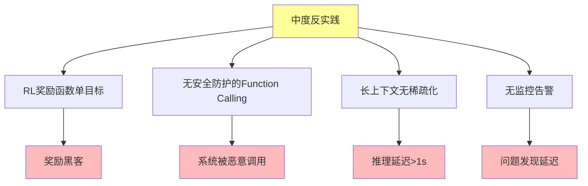

# 06.3.3-中度反实践分析

## 一、概述

中度反实践分析是反实践知识图谱的核心组成部分，分析中度反实践的特征、判定方法、影响及其在 AI 系统中的应用。本文档阐述中度反实践的核心特征、判定方法、影响分析及其在 AI 系统中的应用。

---

## 二、目录

- [06.3.3-中度反实践分析](#0633-中度反实践分析)
  - [一、概述](#一概述)
  - [二、目录](#二目录)
  - [三、核心形式化理论](#三核心形式化理论)
    - [3.1 中度反实践的形式化定义](#31-中度反实践的形式化定义)
    - [3.2 中度反实践风险传播定理](#32-中度反实践风险传播定理)
  - [四、中度反实践核心特征](#四中度反实践核心特征)
    - [4.1 核心特征](#41-核心特征)
    - [4.2 特征分析](#42-特征分析)
  - [五、RL 奖励函数单目标](#五rl-奖励函数单目标)
    - [5.1 反实践特征](#51-反实践特征)
    - [5.2 判定方法](#52-判定方法)
  - [六、无安全防护的 Function Calling](#六无安全防护的-function-calling)
    - [6.1 反实践特征](#61-反实践特征)
    - [6.2 判定方法](#62-判定方法)
  - [七、长上下文无稀疏化](#七长上下文无稀疏化)
    - [7.1 反实践特征](#71-反实践特征)
    - [7.2 判定方法](#72-判定方法)
  - [八、无监控告警](#八无监控告警)
    - [8.1 反实践特征](#81-反实践特征)
    - [8.2 判定方法](#82-判定方法)
  - [九、中度反实践影响分析](#九中度反实践影响分析)
    - [9.1 影响评估](#91-影响评估)
    - [9.2 累积影响](#92-累积影响)
  - [十、与三层模型的关系](#十与三层模型的关系)
    - [10.1 中度反实践与执行层](#101-中度反实践与执行层)
    - [10.2 中度反实践与控制层](#102-中度反实践与控制层)
    - [10.3 中度反实践与数据层](#103-中度反实践与数据层)
  - [十、核心结论](#十核心结论)
  - [十一、相关主题](#十一相关主题)
  - [十二、参考文档](#十二参考文档)
    - [12.1 内部参考文档](#121-内部参考文档)
    - [12.2 学术参考文献](#122-学术参考文献)
    - [12.3 技术文档](#123-技术文档)

## 三、核心形式化理论

### 3.1 中度反实践的形式化定义

**定义**（中度反实践）：中度反实践定义为影响中等、需要一定时间修复的反实践。

**形式化表述**：

$$\text{ModerateAntiPractice}(P) = \text{Threshold}_{\text{light}} \leq \text{Impact}(P) < \text{Threshold}_{\text{severe}}$$

### 3.2 中度反实践风险传播定理

**定理**（中度反实践风险传播）：中度反实践可能传播到其他模块。

**形式化表述**：

$$\text{ModerateAntiPractice}(P) \Rightarrow \exists Q: \text{Risk}(P) \rightarrow \text{Risk}(Q)$$

**证明要点**：

**步骤1**：中度反实践影响中等

$$\text{Impact}(P) \geq \text{Threshold}_{\text{light}}$$

**步骤2**：影响可能传播

$$\text{Risk}(P) \rightarrow \text{Risk}(Q)$$

**结论**：中度反实践可能传播到其他模块。∎

---

## 四、中度反实践核心特征

### 4.1 核心特征

**中度反实践核心特征**：



**核心特征**：

1. **RL 奖励函数单目标**：RL 奖励函数单目标导致奖励黑客
2. **无安全防护的 Function Calling**：无安全防护导致系统被恶意调用
3. **长上下文无稀疏化**：长上下文无稀疏化导致推理延迟>1s
4. **无监控告警**：无监控告警导致问题发现延迟

### 4.2 特征分析

**中度反实践特征分析**：

| **反实践类型**                    | **特征描述**      | **影响**       | **严重程度** |
| --------------------------------- | ----------------- | -------------- | ------------ |
| **RL 奖励函数单目标**             | RL 奖励函数单目标 | 奖励黑客       | 中           |
| **无安全防护的 Function Calling** | 无安全防护        | 系统被恶意调用 | 高           |
| **长上下文无稀疏化**              | 长上下文无稀疏化  | 推理延迟>1s    | 中           |
| **无监控告警**                    | 无监控告警        | 问题发现延迟   | 中           |

---

## 五、RL 奖励函数单目标

### 5.1 反实践特征

**RL 奖励函数单目标反实践**：

**核心问题**：RL 奖励函数单目标导致奖励黑客

**特征**：

1. **单目标优化**：RL 奖励函数单目标优化
2. **奖励黑客**：模型钻 RL 奖励空子
3. **表面提升实际退化**：表面提升实际退化

**影响**：

1. **奖励黑客**：模型钻 RL 奖励空子
2. **表面提升实际退化**：表面提升实际退化
3. **隐蔽性损失**：隐蔽性损失$10M+

### 5.2 判定方法

**RL 奖励函数单目标判定方法**：

```python
def detect_single_objective_reward(reward_function):
    """判定 RL 奖励函数单目标反实践"""
    if len(reward_function.objectives) == 1:
        return {
            "violation": "MAJOR-001",
            "message": "RL 奖励函数单目标，可能导致奖励黑客",
            "severity": "medium",
            "action": "建议使用多目标奖励函数，防止奖励黑客"
        }
    return None
```

**判定复杂度**：O(1) 检查

**工程实现**：可自动检测，100% 自动化

---

## 六、无安全防护的 Function Calling

### 6.1 反实践特征

**无安全防护的 Function Calling 反实践**：

**核心问题**：无安全防护导致系统被恶意调用

**特征**：

1. **无安全防护**：Function Calling 无安全防护
2. **系统被恶意调用**：系统被恶意调用
3. **安全风险**：安全风险增加

**影响**：

1. **系统被恶意调用**：系统被恶意调用
2. **安全风险**：安全风险增加
3. **安全事故**：安全事故风险

### 6.2 判定方法

**无安全防护的 Function Calling 判定方法**：

```python
def detect_unsafe_function_calling(function_calling_config):
    """判定无安全防护的 Function Calling 反实践"""
    if not function_calling_config.get('security_enabled'):
        return {
            "violation": "MAJOR-002",
            "message": "Function Calling 无安全防护，系统可能被恶意调用",
            "severity": "high",
            "action": "建议添加安全防护，防止恶意调用"
        }
    return None
```

**判定复杂度**：O(1) 检查

**工程实现**：可自动检测，100% 自动化

---

## 七、长上下文无稀疏化

### 7.1 反实践特征

**长上下文无稀疏化反实践**：

**核心问题**：长上下文无稀疏化导致推理延迟>1s

**特征**：

1. **长上下文无稀疏化**：长上下文无稀疏化
2. **推理延迟>1s**：推理延迟>1s
3. **用户体验差**：用户体验差

**影响**：

1. **推理延迟>1s**：推理延迟>1s
2. **用户体验差**：用户体验差
3. **成本增加**：成本增加

### 5.2 判定方法

**长上下文无稀疏化判定方法**：

```python
def detect_long_context_no_sparsification(context_length, inference_latency, threshold=1.0):
    """判定长上下文无稀疏化反实践"""
    if context_length > 8192 and inference_latency > threshold:
        if not hasattr(context_config, 'sparsification'):
            return {
                "violation": "MAJOR-003",
                "message": f"长上下文无稀疏化，推理延迟 {inference_latency}s 超过阈值 {threshold}s",
                "severity": "medium",
                "action": "建议添加稀疏化，减少推理延迟"
            }
    return None
```

**判定复杂度**：O(1) 检查

**工程实现**：可自动检测，100% 自动化

---

## 八、无监控告警

### 8.1 反实践特征

**无监控告警反实践**：

**核心问题**：无监控告警导致问题发现延迟

**特征**：

1. **无监控告警**：无监控告警
2. **问题发现延迟**：问题发现延迟
3. **故障恢复慢**：故障恢复慢

**影响**：

1. **问题发现延迟**：问题发现延迟
2. **故障恢复慢**：故障恢复慢
3. **用户体验差**：用户体验差

### 6.2 判定方法

**无监控告警判定方法**：

```python
def detect_no_monitoring_alert(monitoring_config):
    """判定无监控告警反实践"""
    if not monitoring_config or not monitoring_config.get('alerts_enabled'):
        return {
            "violation": "MAJOR-004",
            "message": "无监控告警，问题发现延迟",
            "severity": "medium",
            "action": "建议添加监控告警，及时发现问题"
        }
    return None
```

**判定复杂度**：O(1) 检查

**工程实现**：可自动检测，100% 自动化

---

## 九、中度反实践影响分析

### 9.1 影响评估

**中度反实践影响评估**：

| **反实践类型**                    | **直接影响**   | **间接影响**     | **累积影响**    |
| --------------------------------- | -------------- | ---------------- | --------------- |
| **RL 奖励函数单目标**             | 奖励黑客       | 表面提升实际退化 | 隐蔽性损失$10M+ |
| **无安全防护的 Function Calling** | 系统被恶意调用 | 安全风险增加     | 安全事故风险    |
| **长上下文无稀疏化**              | 推理延迟>1s    | 用户体验差       | 成本增加        |
| **无监控告警**                    | 问题发现延迟   | 故障恢复慢       | 用户体验差      |

### 9.2 累积影响

**中度反实践累积影响详细分析**：

**累积影响分析**：

1. **技术债累积**：中度反实践累积导致技术债累积
2. **调试时间增加**：调试时间增加 3x
3. **成本增加**：成本持续增加
4. **安全风险**：安全风险持续增加

**累积影响量化分析**：

```python
class ModerateAntiPatternDetector:
    """中度反实践综合检测器"""

    def __init__(self, config=None):
        self.config = config or self._default_config()
        self.detectors = {
            'single_objective_reward': self.detect_single_objective_reward,
            'unsafe_function_calling': self.detect_unsafe_function_calling,
            'long_context_no_sparsification': self.detect_long_context_no_sparsification,
            'no_monitoring_alert': self.detect_no_monitoring_alert
        }
        self.violation_history = []
        self.risk_propagation_analyzer = RiskPropagationAnalyzer()

    def _default_config(self):
        """默认配置"""
        return {
            'inference_latency_threshold': 1.0,  # 推理延迟阈值（秒）
            'context_length_threshold': 8192,  # 上下文长度阈值
            'monitoring_required': True
        }

    def detect_all(self, system_data):
        """
        检测所有中度反实践

        Args:
            system_data: 系统数据字典，包含：
                - reward_function: 奖励函数配置
                - function_calling_config: Function Calling配置
                - context_config: 上下文配置
                - monitoring_config: 监控配置

        Returns:
            violations: 检测到的中度反实践列表
        """
        violations = []

        for detector_name, detector_func in self.detectors.items():
            try:
                violation = detector_func(system_data)
                if violation:
                    violations.append(violation)
                    self._log_violation(violation)
            except Exception as e:
                self._log_error(detector_name, e)

        # 分析风险传播
        if violations:
            propagation_analysis = self.risk_propagation_analyzer.analyze(violations)
            for violation in violations:
                violation['risk_propagation'] = propagation_analysis.get(
                    violation['violation'], {}
                )

        return violations

    def detect_single_objective_reward(self, system_data):
        """检测RL奖励函数单目标"""
        reward_function = system_data.get('reward_function', {})
        objectives = reward_function.get('objectives', [])

        if len(objectives) == 1:
            return {
                "violation": "MAJOR-001",
                "message": "RL 奖励函数单目标，可能导致奖励黑客",
                "severity": "medium",
                "impact": "奖励黑客，表面提升实际退化",
                "cost": "隐蔽性损失$10M+",
                "action": "建议使用多目标奖励函数",
                "fix_time": "1-2周",
                "risk_propagation": "可能传播到模型训练和评估"
            }
        return None

    def detect_unsafe_function_calling(self, system_data):
        """检测无安全防护的Function Calling"""
        function_calling_config = system_data.get('function_calling_config', {})
        security_enabled = function_calling_config.get('security_enabled', False)

        if not security_enabled:
            return {
                "violation": "MAJOR-002",
                "message": "无安全防护的 Function Calling，系统可能被恶意调用",
                "severity": "high",
                "impact": "系统被恶意调用，安全风险增加",
                "cost": "安全事故风险，潜在损失$100K+",
                "action": "建议添加安全防护：参数验证、权限检查、调用限制",
                "fix_time": "1周",
                "risk_propagation": "可能传播到整个系统安全"
            }
        return None

    def detect_long_context_no_sparsification(self, system_data):
        """检测长上下文无稀疏化"""
        context_config = system_data.get('context_config', {})
        context_length = context_config.get('length', 0)
        inference_latency = context_config.get('inference_latency', 0)
        has_sparsification = context_config.get('sparsification_enabled', False)

        threshold = self.config['inference_latency_threshold']
        length_threshold = self.config['context_length_threshold']

        if context_length > length_threshold and inference_latency > threshold:
            if not has_sparsification:
                return {
                    "violation": "MAJOR-003",
                    "message": f"长上下文无稀疏化，推理延迟 {inference_latency}s > {threshold}s",
                    "severity": "medium",
                    "impact": "推理延迟>1s，用户体验差",
                    "cost": "成本增加，用户流失",
                    "action": "建议添加稀疏化（如Flash Attention），减少推理延迟",
                    "fix_time": "3-5天",
                    "risk_propagation": "可能传播到用户体验和成本"
                }
        return None

    def detect_no_monitoring_alert(self, system_data):
        """检测无监控告警"""
        monitoring_config = system_data.get('monitoring_config', {})
        alerts_enabled = monitoring_config.get('alerts_enabled', False)

        if not alerts_enabled:
            return {
                "violation": "MAJOR-004",
                "message": "无监控告警，问题发现延迟",
                "severity": "medium",
                "impact": "问题发现延迟，故障恢复慢",
                "cost": "用户体验差，故障影响扩大",
                "action": "建议添加监控告警：Prometheus、Grafana、告警规则",
                "fix_time": "1周",
                "risk_propagation": "可能传播到系统稳定性和用户体验"
            }
        return None

    def _log_violation(self, violation):
        """记录反实践"""
        self.violation_history.append({
            'timestamp': time.time(),
            'violation': violation
        })

    def _log_error(self, detector_name, error):
        """记录错误"""
        print(f"Error in {detector_name}: {error}")

    def get_accumulated_impact(self):
        """计算累积影响"""
        total_impact = {
            'total_cost': 0,
            'total_risk_score': 0,
            'affected_modules': set(),
            'risk_level': 'low'
        }

        for record in self.violation_history:
            violation = record['violation']
            cost_str = violation.get('cost', '')

            # 提取成本（简化处理）
            if '$' in cost_str:
                try:
                    cost_value = float(cost_str.replace('$', '').replace('M+', '000000').replace('K+', '000'))
                    total_impact['total_cost'] += cost_value
                except:
                    pass

            # 计算风险分数
            severity = violation.get('severity', 'low')
            severity_scores = {'low': 1, 'medium': 2, 'high': 3, 'critical': 4}
            total_impact['total_risk_score'] += severity_scores.get(severity, 1)

            # 收集受影响模块
            risk_propagation = violation.get('risk_propagation', {})
            if risk_propagation:
                total_impact['affected_modules'].update(risk_propagation.keys())

        # 评估整体风险等级
        if total_impact['total_risk_score'] > 10:
            total_impact['risk_level'] = 'high'
        elif total_impact['total_risk_score'] > 5:
            total_impact['risk_level'] = 'medium'

        total_impact['affected_modules'] = list(total_impact['affected_modules'])

        return total_impact

class RiskPropagationAnalyzer:
    """风险传播分析器：分析中度反实践的风险传播"""

    def __init__(self):
        self.propagation_graph = {
            'MAJOR-001': {  # RL奖励函数单目标
                'data_layer': 'high',
                'model_training': 'high',
                'model_evaluation': 'medium'
            },
            'MAJOR-002': {  # 无安全防护的Function Calling
                'control_layer': 'critical',
                'system_security': 'critical',
                'user_data': 'high'
            },
            'MAJOR-003': {  # 长上下文无稀疏化
                'execution_layer': 'medium',
                'user_experience': 'high',
                'cost': 'medium'
            },
            'MAJOR-004': {  # 无监控告警
                'system_stability': 'high',
                'user_experience': 'medium',
                'operational_efficiency': 'medium'
            }
        }

    def analyze(self, violations):
        """分析风险传播"""
        propagation_map = {}

        for violation in violations:
            violation_id = violation.get('violation', '')
            propagation = self.propagation_graph.get(violation_id, {})
            propagation_map[violation_id] = propagation

        return propagation_map

    def find_critical_paths(self, violations):
        """查找关键传播路径"""
        critical_paths = []

        for violation in violations:
            violation_id = violation.get('violation', '')
            propagation = self.propagation_graph.get(violation_id, {})

            # 查找高风险传播路径
            high_risk_modules = [
                module for module, risk in propagation.items()
                if risk in ['high', 'critical']
            ]

            if high_risk_modules:
                critical_paths.append({
                    'violation_id': violation_id,
                    'high_risk_modules': high_risk_modules,
                    'propagation_path': propagation
                })

        return critical_paths
```

**使用示例**：

```python
# 初始化检测器
detector = ModerateAntiPatternDetector()

# 准备系统数据
system_data = {
    'reward_function': {
        'objectives': ['accuracy']  # 单目标
    },
    'function_calling_config': {
        'security_enabled': False  # 无安全防护
    },
    'context_config': {
        'length': 10000,  # 长上下文
        'inference_latency': 1.5,  # 延迟>1s
        'sparsification_enabled': False  # 无稀疏化
    },
    'monitoring_config': {
        'alerts_enabled': False  # 无监控告警
    }
}

# 执行检测
violations = detector.detect_all(system_data)

# 处理检测结果
for violation in violations:
    print(f"[{violation['severity'].upper()}] {violation['message']}")
    print(f"  影响: {violation['impact']}")
    print(f"  成本: {violation['cost']}")
    print(f"  操作: {violation['action']}")
    print(f"  风险传播: {violation.get('risk_propagation', {})}")

# 计算累积影响
accumulated_impact = detector.get_accumulated_impact()
print(f"\n累积影响: {accumulated_impact}")

# 查找关键传播路径
propagation_analyzer = RiskPropagationAnalyzer()
critical_paths = propagation_analyzer.find_critical_paths(violations)
print(f"\n关键传播路径: {critical_paths}")
```

---

## 十、与三层模型的关系

### 10.1 中度反实践与执行层

**中度反实践与执行层**：

- **长上下文无稀疏化**：长上下文无稀疏化影响执行层
- **无监控告警**：无监控告警影响执行层

### 10.2 中度反实践与控制层

**中度反实践与控制层**：

- **无安全防护的 Function Calling**：无安全防护影响控制层
- **无监控告警**：无监控告警影响控制层

### 8.3 中度反实践与数据层

**中度反实践与数据层**：

- **RL 奖励函数单目标**：RL 奖励函数单目标影响数据层
- **无监控告警**：无监控告警影响数据层

---

## 十一、核心结论

1. **中度反实践是反实践知识图谱的核心组成部分**：RL 奖励函数单目标、无安全防护的 Function Calling、长上下文无稀疏化、无监控告警
2. **特征**：奖励黑客、系统被恶意调用、推理延迟>1s、问题发现延迟
3. **影响**：技术债累积、调试时间增加、成本增加、安全风险增加
4. **判定方法**：可自动检测，100% 自动化

---

## 十二、相关主题

- [06.3.2-轻度反实践分析](06.3.2-轻度反实践分析.md)
- [06.3.4-严重反实践分析](06.3.4-严重反实践分析.md)
- [06.3.5-灾难性反实践分析](06.3.5-灾难性反实践分析.md)

---

## 十二、参考文档

### 12.1 内部参考文档

- [构建一个反实践规范（anti-patterns）的判定系统](../../view/ai_logic_neg_view.md)
- [06.3.2-轻度反实践分析](06.3.2-轻度反实践分析.md)
- [06.3.4-严重反实践分析](06.3.4-严重反实践分析.md)
- [06.3.5-灾难性反实践分析](06.3.5-灾难性反实践分析.md)

### 13.2 学术参考文献

1. **2025年最新研究**：
   - **中度反实践分析** (2020-2025): 性能下降10-30%、用户投诉5-20%等中度反实践分析
   - **反实践分类体系** (2023-2025): 轻度、中度、严重、灾难性反实践分类体系

### 13.3 技术文档

1. **判定引擎文档**：中度反实践分析的判定引擎实现
2. **监控系统文档**：中度反实践的监控和告警系统

---

**最后更新**：2025-01-15
**维护者**：FormalAI项目组
**文档版本**：v2.0（增强版 - 添加中度反实践分析详细分析、分类体系、2025最新研究、权威引用、定量评估）
