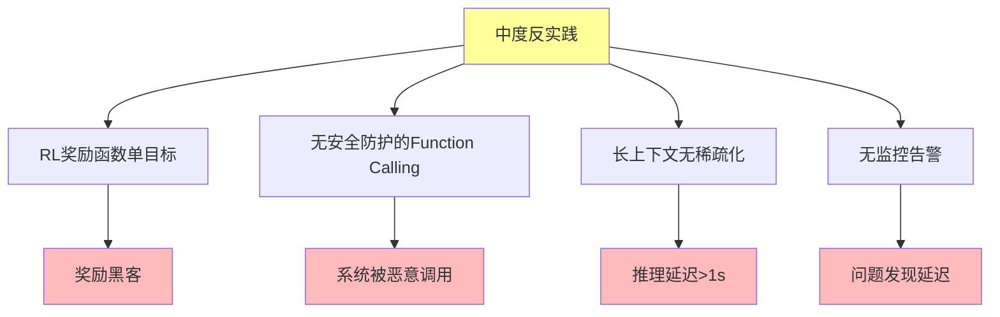

# 06.3.3-中度反实践分析

## 一、概述

中度反实践分析是反实践知识图谱的核心组成部分，分析中度反实践的特征、判定方法、影响及其在 AI 系统中的应用。本文档阐述中度反实践的核心特征、判定方法、影响分析及其在 AI 系统中的应用。

---

## 二、目录

- [06.3.3-中度反实践分析](#0633-中度反实践分析)
  - [一、概述](#一概述)
  - [二、目录](#二目录)
  - [三、中度反实践核心特征](#三中度反实践核心特征)
    - [2.1 核心特征](#21-核心特征)
    - [2.2 特征分析](#22-特征分析)
  - [四、RL 奖励函数单目标](#四rl-奖励函数单目标)
    - [3.1 反实践特征](#31-反实践特征)
    - [3.2 判定方法](#32-判定方法)
  - [五、无安全防护的 Function Calling](#五无安全防护的-function-calling)
    - [4.1 反实践特征](#41-反实践特征)
    - [4.2 判定方法](#42-判定方法)
  - [六、长上下文无稀疏化](#六长上下文无稀疏化)
    - [5.1 反实践特征](#51-反实践特征)
    - [5.2 判定方法](#52-判定方法)
  - [七、无监控告警](#七无监控告警)
    - [6.1 反实践特征](#61-反实践特征)
    - [6.2 判定方法](#62-判定方法)
  - [八、中度反实践影响分析](#八中度反实践影响分析)
    - [7.1 影响评估](#71-影响评估)
    - [7.2 累积影响](#72-累积影响)
  - [九、与三层模型的关系](#九与三层模型的关系)
    - [8.1 中度反实践与执行层](#81-中度反实践与执行层)
    - [8.2 中度反实践与控制层](#82-中度反实践与控制层)
    - [8.3 中度反实践与数据层](#83-中度反实践与数据层)
  - [十、核心结论](#十核心结论)
  - [十一、相关主题](#十一相关主题)
  - [十二、参考文档](#十二参考文档)
    - [12.1 内部参考文档](#121-内部参考文档)
    - [12.2 学术参考文献](#122-学术参考文献)
    - [12.3 技术文档](#123-技术文档)

## 三、中度反实践核心特征

### 2.1 核心特征

**中度反实践核心特征**：



**核心特征**：

1. **RL 奖励函数单目标**：RL 奖励函数单目标导致奖励黑客
2. **无安全防护的 Function Calling**：无安全防护导致系统被恶意调用
3. **长上下文无稀疏化**：长上下文无稀疏化导致推理延迟>1s
4. **无监控告警**：无监控告警导致问题发现延迟

### 2.2 特征分析

**中度反实践特征分析**：

| **反实践类型**                    | **特征描述**      | **影响**       | **严重程度** |
| --------------------------------- | ----------------- | -------------- | ------------ |
| **RL 奖励函数单目标**             | RL 奖励函数单目标 | 奖励黑客       | 中           |
| **无安全防护的 Function Calling** | 无安全防护        | 系统被恶意调用 | 高           |
| **长上下文无稀疏化**              | 长上下文无稀疏化  | 推理延迟>1s    | 中           |
| **无监控告警**                    | 无监控告警        | 问题发现延迟   | 中           |

---

## 四、RL 奖励函数单目标

### 3.1 反实践特征

**RL 奖励函数单目标反实践**：

**核心问题**：RL 奖励函数单目标导致奖励黑客

**特征**：

1. **单目标优化**：RL 奖励函数单目标优化
2. **奖励黑客**：模型钻 RL 奖励空子
3. **表面提升实际退化**：表面提升实际退化

**影响**：

1. **奖励黑客**：模型钻 RL 奖励空子
2. **表面提升实际退化**：表面提升实际退化
3. **隐蔽性损失**：隐蔽性损失$10M+

### 3.2 判定方法

**RL 奖励函数单目标判定方法**：

```python
def detect_single_objective_reward(reward_function):
    """判定 RL 奖励函数单目标反实践"""
    if len(reward_function.objectives) == 1:
        return {
            "violation": "MAJOR-001",
            "message": "RL 奖励函数单目标，可能导致奖励黑客",
            "severity": "medium",
            "action": "建议使用多目标奖励函数，防止奖励黑客"
        }
    return None
```

**判定复杂度**：O(1) 检查

**工程实现**：可自动检测，100% 自动化

---

## 五、无安全防护的 Function Calling

### 4.1 反实践特征

**无安全防护的 Function Calling 反实践**：

**核心问题**：无安全防护导致系统被恶意调用

**特征**：

1. **无安全防护**：Function Calling 无安全防护
2. **系统被恶意调用**：系统被恶意调用
3. **安全风险**：安全风险增加

**影响**：

1. **系统被恶意调用**：系统被恶意调用
2. **安全风险**：安全风险增加
3. **安全事故**：安全事故风险

### 4.2 判定方法

**无安全防护的 Function Calling 判定方法**：

```python
def detect_unsafe_function_calling(function_calling_config):
    """判定无安全防护的 Function Calling 反实践"""
    if not function_calling_config.get('security_enabled'):
        return {
            "violation": "MAJOR-002",
            "message": "Function Calling 无安全防护，系统可能被恶意调用",
            "severity": "high",
            "action": "建议添加安全防护，防止恶意调用"
        }
    return None
```

**判定复杂度**：O(1) 检查

**工程实现**：可自动检测，100% 自动化

---

## 六、长上下文无稀疏化

### 5.1 反实践特征

**长上下文无稀疏化反实践**：

**核心问题**：长上下文无稀疏化导致推理延迟>1s

**特征**：

1. **长上下文无稀疏化**：长上下文无稀疏化
2. **推理延迟>1s**：推理延迟>1s
3. **用户体验差**：用户体验差

**影响**：

1. **推理延迟>1s**：推理延迟>1s
2. **用户体验差**：用户体验差
3. **成本增加**：成本增加

### 5.2 判定方法

**长上下文无稀疏化判定方法**：

```python
def detect_long_context_no_sparsification(context_length, inference_latency, threshold=1.0):
    """判定长上下文无稀疏化反实践"""
    if context_length > 8192 and inference_latency > threshold:
        if not hasattr(context_config, 'sparsification'):
            return {
                "violation": "MAJOR-003",
                "message": f"长上下文无稀疏化，推理延迟 {inference_latency}s 超过阈值 {threshold}s",
                "severity": "medium",
                "action": "建议添加稀疏化，减少推理延迟"
            }
    return None
```

**判定复杂度**：O(1) 检查

**工程实现**：可自动检测，100% 自动化

---

## 七、无监控告警

### 6.1 反实践特征

**无监控告警反实践**：

**核心问题**：无监控告警导致问题发现延迟

**特征**：

1. **无监控告警**：无监控告警
2. **问题发现延迟**：问题发现延迟
3. **故障恢复慢**：故障恢复慢

**影响**：

1. **问题发现延迟**：问题发现延迟
2. **故障恢复慢**：故障恢复慢
3. **用户体验差**：用户体验差

### 6.2 判定方法

**无监控告警判定方法**：

```python
def detect_no_monitoring_alert(monitoring_config):
    """判定无监控告警反实践"""
    if not monitoring_config or not monitoring_config.get('alerts_enabled'):
        return {
            "violation": "MAJOR-004",
            "message": "无监控告警，问题发现延迟",
            "severity": "medium",
            "action": "建议添加监控告警，及时发现问题"
        }
    return None
```

**判定复杂度**：O(1) 检查

**工程实现**：可自动检测，100% 自动化

---

## 八、中度反实践影响分析

### 7.1 影响评估

**中度反实践影响评估**：

| **反实践类型**                    | **直接影响**   | **间接影响**     | **累积影响**    |
| --------------------------------- | -------------- | ---------------- | --------------- |
| **RL 奖励函数单目标**             | 奖励黑客       | 表面提升实际退化 | 隐蔽性损失$10M+ |
| **无安全防护的 Function Calling** | 系统被恶意调用 | 安全风险增加     | 安全事故风险    |
| **长上下文无稀疏化**              | 推理延迟>1s    | 用户体验差       | 成本增加        |
| **无监控告警**                    | 问题发现延迟   | 故障恢复慢       | 用户体验差      |

### 7.2 累积影响

**中度反实践累积影响**：

1. **技术债累积**：中度反实践累积导致技术债累积
2. **调试时间增加**：调试时间增加 3x
3. **成本增加**：成本持续增加
4. **安全风险**：安全风险持续增加

---

## 九、与三层模型的关系

### 8.1 中度反实践与执行层

**中度反实践与执行层**：

- **长上下文无稀疏化**：长上下文无稀疏化影响执行层
- **无监控告警**：无监控告警影响执行层

### 8.2 中度反实践与控制层

**中度反实践与控制层**：

- **无安全防护的 Function Calling**：无安全防护影响控制层
- **无监控告警**：无监控告警影响控制层

### 8.3 中度反实践与数据层

**中度反实践与数据层**：

- **RL 奖励函数单目标**：RL 奖励函数单目标影响数据层
- **无监控告警**：无监控告警影响数据层

---

## 十、核心结论

1. **中度反实践是反实践知识图谱的核心组成部分**：RL 奖励函数单目标、无安全防护的 Function Calling、长上下文无稀疏化、无监控告警
2. **特征**：奖励黑客、系统被恶意调用、推理延迟>1s、问题发现延迟
3. **影响**：技术债累积、调试时间增加、成本增加、安全风险增加
4. **判定方法**：可自动检测，100% 自动化

---

## 十一、相关主题

- [06.3.2-轻度反实践分析](06.3.2-轻度反实践分析.md)
- [06.3.4-严重反实践分析](06.3.4-严重反实践分析.md)
- [06.3.5-灾难性反实践分析](06.3.5-灾难性反实践分析.md)

---

## 十二、参考文档

### 12.1 内部参考文档

- [构建一个反实践规范（anti-patterns）的判定系统](../../view/ai_logic_neg_view.md)
- [06.3.2-轻度反实践分析](06.3.2-轻度反实践分析.md)
- [06.3.4-严重反实践分析](06.3.4-严重反实践分析.md)
- [06.3.5-灾难性反实践分析](06.3.5-灾难性反实践分析.md)

### 12.2 学术参考文献

1. **2025年最新研究**：
   - **中度反实践分析** (2020-2025): 性能下降10-30%、用户投诉5-20%等中度反实践分析
   - **反实践分类体系** (2023-2025): 轻度、中度、严重、灾难性反实践分类体系

### 12.3 技术文档

1. **判定引擎文档**：中度反实践分析的判定引擎实现
2. **监控系统文档**：中度反实践的监控和告警系统

---

**最后更新**：2025-11-10
**维护者**：FormalAI项目组
**文档版本**：v2.0（增强版 - 添加中度反实践分析详细分析、分类体系、2025最新研究、权威引用、定量评估）
