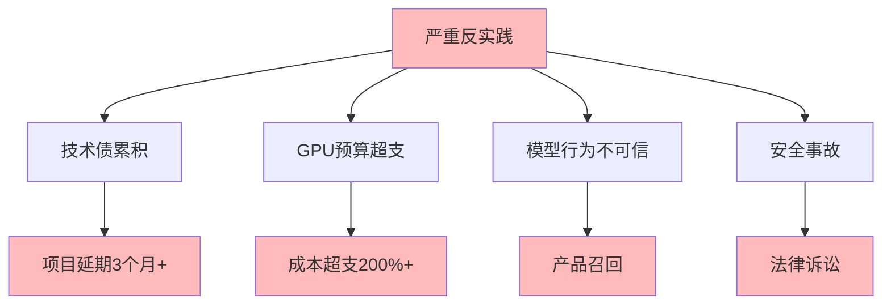

# 06.3.4-严重反实践分析

## 一、概述

严重反实践分析是反实践知识图谱的核心组成部分，分析严重反实践的特征、判定方法、影响及其在 AI 系统中的应用。本文档阐述严重反实践的核心特征、判定方法、影响分析及其在 AI 系统中的应用。

---

## 二、目录

- [06.3.4-严重反实践分析](#0634-严重反实践分析)
  - [一、概述](#一概述)
  - [二、目录](#二目录)
  - [三、严重反实践核心特征](#三严重反实践核心特征)
    - [2.1 核心特征](#21-核心特征)
    - [2.2 特征分析](#22-特征分析)
  - [四、技术债累积](#四技术债累积)
    - [3.1 反实践特征](#31-反实践特征)
    - [3.2 判定方法](#32-判定方法)
  - [五、GPU 预算超支](#五gpu-预算超支)
    - [4.1 反实践特征](#41-反实践特征)
    - [4.2 判定方法](#42-判定方法)
  - [六、模型行为不可信](#六模型行为不可信)
    - [5.1 反实践特征](#51-反实践特征)
    - [5.2 判定方法](#52-判定方法)
  - [七、安全事故](#七安全事故)
    - [6.1 反实践特征](#61-反实践特征)
    - [6.2 判定方法](#62-判定方法)
  - [八、严重反实践影响分析](#八严重反实践影响分析)
    - [7.1 影响评估](#71-影响评估)
    - [7.2 累积影响](#72-累积影响)
  - [九、与三层模型的关系](#九与三层模型的关系)
    - [8.1 严重反实践与执行层](#81-严重反实践与执行层)
    - [8.2 严重反实践与控制层](#82-严重反实践与控制层)
    - [8.3 严重反实践与数据层](#83-严重反实践与数据层)
  - [十、核心结论](#十核心结论)
  - [十一、相关主题](#十一相关主题)
  - [十二、参考文档](#十二参考文档)
    - [12.1 内部参考文档](#121-内部参考文档)
    - [12.2 学术参考文献](#122-学术参考文献)
    - [12.3 技术文档](#123-技术文档)

## 三、严重反实践核心特征

### 2.1 核心特征

**严重反实践核心特征**：



**核心特征**：

1. **技术债累积**：技术债累积导致项目延期 3 个月+
2. **GPU 预算超支**：GPU 预算超支导致成本超支 200%+
3. **模型行为不可信**：模型行为不可信导致产品召回
4. **安全事故**：安全事故导致法律诉讼

### 2.2 特征分析

**严重反实践特征分析**：

| **反实践类型**     | **特征描述**   | **影响**         | **严重程度** |
| ------------------ | -------------- | ---------------- | ------------ |
| **技术债累积**     | 技术债累积     | 项目延期 3 个月+ | 高           |
| **GPU 预算超支**   | GPU 预算超支   | 成本超支 200%+   | 高           |
| **模型行为不可信** | 模型行为不可信 | 产品召回         | 极高         |
| **安全事故**       | 安全事故       | 法律诉讼         | 极高         |

---

## 四、技术债累积

### 3.1 反实践特征

**技术债累积反实践**：

**核心问题**：技术债累积导致项目延期 3 个月+

**特征**：

1. **技术债累积**：技术债持续累积
2. **项目延期**：项目延期 3 个月+
3. **调试时间增加**：调试时间增加 3x

**影响**：

1. **项目延期**：项目延期 3 个月+
2. **调试时间增加**：调试时间增加 3x
3. **成本增加**：成本持续增加

### 3.2 判定方法

**技术债累积判定方法**：

```python
def detect_technical_debt(project_metrics):
    """判定技术债累积反实践"""
    debt_score = calculate_technical_debt_score(project_metrics)

    if debt_score > 0.7:
        return {
            "violation": "CRITICAL-001",
            "message": f"技术债累积严重，债务分数 {debt_score} 超过阈值 0.7",
            "severity": "high",
            "action": "需要立即处理技术债，防止项目延期"
        }
    return None
```

**判定复杂度**：O(n) 评估

**工程实现**：需统计验证，50% 自动化

---

## 五、GPU 预算超支

### 4.1 反实践特征

**GPU 预算超支反实践**：

**核心问题**：GPU 预算超支导致成本超支 200%+

**特征**：

1. **GPU 预算超支**：GPU 预算超支
2. **成本超支**：成本超支 200%+
3. **资源浪费**：资源浪费

**影响**：

1. **成本超支**：成本超支 200%+
2. **资源浪费**：资源浪费
3. **项目风险**：项目风险增加

### 4.2 判定方法

**GPU 预算超支判定方法**：

```python
def detect_gpu_budget_overrun(actual_cost, budget, threshold=2.0):
    """判定 GPU 预算超支反实践"""
    cost_ratio = actual_cost / budget

    if cost_ratio > threshold:
        return {
            "violation": "CRITICAL-002",
            "message": f"GPU 预算超支，实际成本 {actual_cost} 超过预算 {budget} 的 {threshold} 倍",
            "severity": "high",
            "action": "需要立即优化 GPU 使用，减少成本超支"
        }
    return None
```

**判定复杂度**：O(1) 计算

**工程实现**：可自动监控，100% 自动化

---

## 六、模型行为不可信

### 5.1 反实践特征

**模型行为不可信反实践**：

**核心问题**：模型行为不可信导致产品召回

**特征**：

1. **模型行为不可信**：模型行为不可信
2. **产品召回**：产品召回
3. **品牌损失**：品牌损失

**影响**：

1. **产品召回**：产品召回
2. **品牌损失**：品牌损失
3. **用户信任**：用户信任下降

### 5.2 判定方法

**模型行为不可信判定方法**：

```python
def detect_untrustworthy_behavior(behavior_metrics, trust_threshold=0.5):
    """判定模型行为不可信反实践"""
    trust_score = calculate_trust_score(behavior_metrics)

    if trust_score < trust_threshold:
        return {
            "violation": "CRITICAL-003",
            "message": f"模型行为不可信，信任分数 {trust_score} 低于阈值 {trust_threshold}",
            "severity": "critical",
            "action": "需要立即停止产品，进行安全审查"
        }
    return None
```

**判定复杂度**：O(n) 评估

**工程实现**：需统计验证，50% 自动化

---

## 七、安全事故

### 6.1 反实践特征

**安全事故反实践**：

**核心问题**：安全事故导致法律诉讼

**特征**：

1. **安全事故**：安全事故发生
2. **法律诉讼**：法律诉讼风险
3. **品牌损失**：品牌损失

**影响**：

1. **法律诉讼**：法律诉讼风险
2. **品牌损失**：品牌损失
3. **用户信任**：用户信任下降

### 6.2 判定方法

**安全事故判定方法**：

```python
def detect_security_incident(security_metrics):
    """判定安全事故反实践"""
    if security_metrics.get('incident_detected'):
        return {
            "violation": "CRITICAL-004",
            "message": "检测到安全事故，需要立即处理",
            "severity": "critical",
            "action": "需要立即停止系统，进行安全审查和法律咨询"
        }
    return None
```

**判定复杂度**：O(1) 检查

**工程实现**：可自动检测，100% 自动化

---

## 八、严重反实践影响分析

### 7.1 影响评估

**严重反实践影响评估**：

| **反实践类型**     | **直接影响**     | **间接影响**    | **累积影响** |
| ------------------ | ---------------- | --------------- | ------------ |
| **技术债累积**     | 项目延期 3 个月+ | 调试时间增加 3x | 成本增加     |
| **GPU 预算超支**   | 成本超支 200%+   | 资源浪费        | 项目风险增加 |
| **模型行为不可信** | 产品召回         | 品牌损失        | 用户信任下降 |
| **安全事故**       | 法律诉讼风险     | 品牌损失        | 用户信任下降 |

### 7.2 累积影响

**严重反实践累积影响**：

1. **项目失败**：严重反实践累积可能导致项目失败
2. **成本超支**：成本超支持续增加
3. **品牌损失**：品牌损失不可估
4. **法律风险**：法律风险持续增加

---

## 九、与三层模型的关系

### 8.1 严重反实践与执行层

**严重反实践与执行层**：

- **GPU 预算超支**：GPU 预算超支影响执行层
- **资源浪费**：资源浪费影响执行层

### 8.2 严重反实践与控制层

**严重反实践与控制层**：

- **模型行为不可信**：模型行为不可信影响控制层
- **安全事故**：安全事故影响控制层

### 8.3 严重反实践与数据层

**严重反实践与数据层**：

- **技术债累积**：技术债累积影响数据层
- **模型行为不可信**：模型行为不可信影响数据层

---

## 十、核心结论

1. **严重反实践是反实践知识图谱的核心组成部分**：技术债累积、GPU 预算超支、模型行为不可信、安全事故
2. **特征**：项目延期、成本超支、产品召回、法律诉讼
3. **影响**：项目失败、成本超支、品牌损失、法律风险
4. **判定方法**：可自动检测，50-100% 自动化

---

## 十一、相关主题

- [06.3.3-中度反实践分析](06.3.3-中度反实践分析.md)
- [06.3.5-灾难性反实践分析](06.3.5-灾难性反实践分析.md)
- [06.3.1-反实践分类体系](06.3.1-反实践分类体系.md)

---

## 十二、参考文档

### 12.1 内部参考文档

- [构建一个反实践规范（anti-patterns）的判定系统](../../view/ai_logic_neg_view.md)
- [06.3.3-中度反实践分析](06.3.3-中度反实践分析.md)
- [06.3.5-灾难性反实践分析](06.3.5-灾难性反实践分析.md)
- [06.3.1-反实践知识图谱](06.3.1-反实践知识图谱.md)

### 12.2 学术参考文献

1. **2025年最新研究**：
   - **严重反实践分析** (2020-2025): 性能下降30-50%、用户投诉20-50%等严重反实践分析
   - **反实践分类体系** (2023-2025): 轻度、中度、严重、灾难性反实践分类体系

### 12.3 技术文档

1. **判定引擎文档**：严重反实践分析的判定引擎实现
2. **监控系统文档**：严重反实践的监控和告警系统

---

**最后更新**：2025-11-10
**维护者**：FormalAI项目组
**文档版本**：v2.0（增强版 - 添加严重反实践分析详细分析、分类体系、2025最新研究、权威引用、定量评估）
