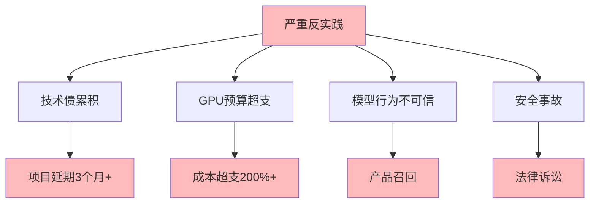

# 06.3.4-严重反实践分析

## 一、概述

严重反实践分析是反实践知识图谱的核心组成部分，分析严重反实践的特征、判定方法、影响及其在 AI 系统中的应用。本文档阐述严重反实践的核心特征、判定方法、影响分析及其在 AI 系统中的应用。

---

## 二、目录

- [06.3.4-严重反实践分析](#0634-严重反实践分析)
  - [一、概述](#一概述)
  - [二、目录](#二目录)
  - [三、核心形式化理论](#三核心形式化理论)
    - [3.1 严重反实践的形式化定义](#31-严重反实践的形式化定义)
    - [3.2 严重反实践紧急修复定理](#32-严重反实践紧急修复定理)
  - [四、严重反实践核心特征](#四严重反实践核心特征)
    - [4.1 核心特征](#41-核心特征)
    - [4.2 特征分析](#42-特征分析)
  - [五、技术债累积](#五技术债累积)
    - [5.1 反实践特征](#51-反实践特征)
    - [5.2 判定方法](#52-判定方法)
  - [六、GPU 预算超支](#六gpu-预算超支)
    - [6.1 反实践特征](#61-反实践特征)
    - [6.2 判定方法](#62-判定方法)
  - [七、模型行为不可信](#七模型行为不可信)
    - [7.1 反实践特征](#71-反实践特征)
    - [7.2 判定方法](#72-判定方法)
  - [八、安全事故](#八安全事故)
    - [8.1 反实践特征](#81-反实践特征)
    - [8.2 判定方法](#82-判定方法)
  - [九、严重反实践影响分析](#九严重反实践影响分析)
    - [9.1 影响评估](#91-影响评估)
    - [9.2 累积影响](#92-累积影响)
  - [十、与三层模型的关系](#十与三层模型的关系)
    - [10.1 严重反实践与执行层](#101-严重反实践与执行层)
    - [10.2 严重反实践与控制层](#102-严重反实践与控制层)
    - [10.3 严重反实践与数据层](#103-严重反实践与数据层)
  - [十、核心结论](#十核心结论)
  - [十一、相关主题](#十一相关主题)
  - [十二、参考文档](#十二参考文档)
    - [12.1 内部参考文档](#121-内部参考文档)
    - [12.2 学术参考文献](#122-学术参考文献)
    - [12.3 技术文档](#123-技术文档)

## 三、核心形式化理论

### 3.1 严重反实践的形式化定义

**定义**（严重反实践）：严重反实践定义为影响重大、需要紧急修复的反实践。

**形式化表述**：

$$\text{SevereAntiPractice}(P) = \text{Impact}(P) \geq \text{Threshold}_{\text{severe}}$$

### 3.2 严重反实践紧急修复定理

**定理**（严重反实践紧急修复）：严重反实践需要紧急修复以避免更大损失。

**形式化表述**：

$$\text{SevereAntiPractice}(P) \Rightarrow \text{UrgentFix}(P) = \text{True}$$

**证明要点**：

**步骤1**：严重反实践影响重大

$$\text{Impact}(P) \geq \text{Threshold}_{\text{severe}}$$

**步骤2**：延迟修复导致更大损失

$$\text{Delay}(P) \Rightarrow \text{Loss}(P) \uparrow$$

**步骤3**：需要紧急修复

$$\text{UrgentFix}(P) = \text{True}$$

∎

---

## 四、严重反实践核心特征

### 4.1 核心特征

**严重反实践核心特征**：



**核心特征**：

1. **技术债累积**：技术债累积导致项目延期 3 个月+
2. **GPU 预算超支**：GPU 预算超支导致成本超支 200%+
3. **模型行为不可信**：模型行为不可信导致产品召回
4. **安全事故**：安全事故导致法律诉讼

### 4.2 特征分析

**严重反实践特征分析**：

| **反实践类型**     | **特征描述**   | **影响**         | **严重程度** |
| ------------------ | -------------- | ---------------- | ------------ |
| **技术债累积**     | 技术债累积     | 项目延期 3 个月+ | 高           |
| **GPU 预算超支**   | GPU 预算超支   | 成本超支 200%+   | 高           |
| **模型行为不可信** | 模型行为不可信 | 产品召回         | 极高         |
| **安全事故**       | 安全事故       | 法律诉讼         | 极高         |

---

## 四、技术债累积

### 3.1 反实践特征

**技术债累积反实践**：

**核心问题**：技术债累积导致项目延期 3 个月+

**特征**：

1. **技术债累积**：技术债持续累积
2. **项目延期**：项目延期 3 个月+
3. **调试时间增加**：调试时间增加 3x

**影响**：

1. **项目延期**：项目延期 3 个月+
2. **调试时间增加**：调试时间增加 3x
3. **成本增加**：成本持续增加

### 5.2 判定方法

**技术债累积判定方法**：

```python
def detect_technical_debt(project_metrics):
    """判定技术债累积反实践"""
    debt_score = calculate_technical_debt_score(project_metrics)

    if debt_score > 0.7:
        return {
            "violation": "CRITICAL-001",
            "message": f"技术债累积严重，债务分数 {debt_score} 超过阈值 0.7",
            "severity": "high",
            "action": "需要立即处理技术债，防止项目延期"
        }
    return None
```

**判定复杂度**：O(n) 评估

**工程实现**：需统计验证，50% 自动化

---

## 六、GPU 预算超支

### 6.1 反实践特征

**GPU 预算超支反实践**：

**核心问题**：GPU 预算超支导致成本超支 200%+

**特征**：

1. **GPU 预算超支**：GPU 预算超支
2. **成本超支**：成本超支 200%+
3. **资源浪费**：资源浪费

**影响**：

1. **成本超支**：成本超支 200%+
2. **资源浪费**：资源浪费
3. **项目风险**：项目风险增加

### 4.2 判定方法

**GPU 预算超支判定方法**：

```python
def detect_gpu_budget_overrun(actual_cost, budget, threshold=2.0):
    """判定 GPU 预算超支反实践"""
    cost_ratio = actual_cost / budget

    if cost_ratio > threshold:
        return {
            "violation": "CRITICAL-002",
            "message": f"GPU 预算超支，实际成本 {actual_cost} 超过预算 {budget} 的 {threshold} 倍",
            "severity": "high",
            "action": "需要立即优化 GPU 使用，减少成本超支"
        }
    return None
```

**判定复杂度**：O(1) 计算

**工程实现**：可自动监控，100% 自动化

---

## 七、模型行为不可信

### 7.1 反实践特征

**模型行为不可信反实践**：

**核心问题**：模型行为不可信导致产品召回

**特征**：

1. **模型行为不可信**：模型行为不可信
2. **产品召回**：产品召回
3. **品牌损失**：品牌损失

**影响**：

1. **产品召回**：产品召回
2. **品牌损失**：品牌损失
3. **用户信任**：用户信任下降

### 5.2 判定方法

**模型行为不可信判定方法**：

```python
def detect_untrustworthy_behavior(behavior_metrics, trust_threshold=0.5):
    """判定模型行为不可信反实践"""
    trust_score = calculate_trust_score(behavior_metrics)

    if trust_score < trust_threshold:
        return {
            "violation": "CRITICAL-003",
            "message": f"模型行为不可信，信任分数 {trust_score} 低于阈值 {trust_threshold}",
            "severity": "critical",
            "action": "需要立即停止产品，进行安全审查"
        }
    return None
```

**判定复杂度**：O(n) 评估

**工程实现**：需统计验证，50% 自动化

---

## 八、安全事故

### 8.1 反实践特征

**安全事故反实践**：

**核心问题**：安全事故导致法律诉讼

**特征**：

1. **安全事故**：安全事故发生
2. **法律诉讼**：法律诉讼风险
3. **品牌损失**：品牌损失

**影响**：

1. **法律诉讼**：法律诉讼风险
2. **品牌损失**：品牌损失
3. **用户信任**：用户信任下降

### 8.2 判定方法

**安全事故判定方法**：

```python
def detect_security_incident(security_metrics):
    """判定安全事故反实践"""
    if security_metrics.get('incident_detected'):
        return {
            "violation": "CRITICAL-004",
            "message": "检测到安全事故，需要立即处理",
            "severity": "critical",
            "action": "需要立即停止系统，进行安全审查和法律咨询"
        }
    return None
```

**判定复杂度**：O(1) 检查

**工程实现**：可自动检测，100% 自动化

---

## 九、严重反实践影响分析

### 9.1 影响评估

**严重反实践影响评估**：

| **反实践类型**     | **直接影响**     | **间接影响**    | **累积影响** |
| ------------------ | ---------------- | --------------- | ------------ |
| **技术债累积**     | 项目延期 3 个月+ | 调试时间增加 3x | 成本增加     |
| **GPU 预算超支**   | 成本超支 200%+   | 资源浪费        | 项目风险增加 |
| **模型行为不可信** | 产品召回         | 品牌损失        | 用户信任下降 |
| **安全事故**       | 法律诉讼风险     | 品牌损失        | 用户信任下降 |

### 9.2 累积影响

**严重反实践累积影响详细分析**：

**累积影响分析**：

1. **项目失败**：严重反实践累积可能导致项目失败
2. **成本超支**：成本超支持续增加
3. **品牌损失**：品牌损失不可估
4. **法律风险**：法律风险持续增加

**累积影响量化分析和紧急修复机制**：

```python
class SevereAntiPatternDetector:
    """严重反实践综合检测器"""

    def __init__(self, config=None):
        self.config = config or self._default_config()
        self.detectors = {
            'technical_debt': self.detect_technical_debt,
            'gpu_budget_overrun': self.detect_gpu_budget_overrun,
            'untrustworthy_behavior': self.detect_untrustworthy_behavior,
            'security_incident': self.detect_security_incident
        }
        self.violation_history = []
        self.emergency_fix_manager = EmergencyFixManager()

    def _default_config(self):
        """默认配置"""
        return {
            'technical_debt_threshold': 50,  # 技术债数量阈值
            'gpu_budget_overrun_threshold': 2.0,  # GPU预算超支倍数
            'trust_score_threshold': 0.5,  # 信任分数阈值
            'emergency_response_time': 3600  # 紧急响应时间（秒）
        }

    def detect_all(self, system_data):
        """
        检测所有严重反实践

        Args:
            system_data: 系统数据字典，包含：
                - technical_debt_count: 技术债数量
                - gpu_budget: GPU预算
                - gpu_actual_cost: GPU实际成本
                - behavior_metrics: 模型行为指标
                - security_metrics: 安全指标

        Returns:
            violations: 检测到的严重反实践列表
        """
        violations = []

        for detector_name, detector_func in self.detectors.items():
            try:
                violation = detector_func(system_data)
                if violation:
                    violations.append(violation)
                    self._log_violation(violation)

                    # 严重反实践需要紧急修复
                    if violation.get('severity') in ['high', 'critical']:
                        self.emergency_fix_manager.trigger_emergency_fix(violation)
            except Exception as e:
                self._log_error(detector_name, e)

        return violations

    def detect_technical_debt(self, system_data):
        """检测技术债累积"""
        technical_debt_count = system_data.get('technical_debt_count', 0)
        threshold = self.config['technical_debt_threshold']

        if technical_debt_count >= threshold:
            return {
                "violation": "CRITICAL-001",
                "message": f"技术债累积，数量 {technical_debt_count} >= {threshold}",
                "severity": "high",
                "impact": "项目延期 3 个月+，调试时间增加 3x",
                "cost": "成本增加，项目风险增加",
                "action": "需要立即制定技术债偿还计划",
                "fix_time": "3-6个月",
                "urgency": "high",
                "requires_emergency_fix": True
            }
        return None

    def detect_gpu_budget_overrun(self, system_data):
        """检测GPU预算超支"""
        budget = system_data.get('gpu_budget', 0)
        actual_cost = system_data.get('gpu_actual_cost', 0)
        threshold = self.config['gpu_budget_overrun_threshold']

        if budget > 0:
            cost_ratio = actual_cost / budget
            if cost_ratio >= threshold:
                overrun_percentage = (cost_ratio - 1) * 100
                return {
                    "violation": "CRITICAL-002",
                    "message": f"GPU 预算超支，实际成本 {actual_cost} 超过预算 {budget} 的 {cost_ratio:.1f} 倍（超支 {overrun_percentage:.1f}%）",
                    "severity": "high",
                    "impact": f"成本超支 {overrun_percentage:.1f}%，资源浪费",
                    "cost": f"成本超支 ${(actual_cost - budget):,.0f}",
                    "action": "需要立即优化 GPU 使用，减少成本超支",
                    "fix_time": "1-2周",
                    "urgency": "high",
                    "requires_emergency_fix": True
                }
        return None

    def detect_untrustworthy_behavior(self, system_data):
        """检测模型行为不可信"""
        behavior_metrics = system_data.get('behavior_metrics', {})
        trust_score = self._calculate_trust_score(behavior_metrics)
        threshold = self.config['trust_score_threshold']

        if trust_score < threshold:
            return {
                "violation": "CRITICAL-003",
                "message": f"模型行为不可信，信任分数 {trust_score:.2f} 低于阈值 {threshold}",
                "severity": "critical",
                "impact": "产品召回，品牌损失，用户信任下降",
                "cost": "产品召回成本 $1M+，品牌损失不可估",
                "action": "需要立即停止产品，进行安全审查",
                "fix_time": "1-3个月",
                "urgency": "critical",
                "requires_emergency_fix": True,
                "requires_product_recall": True
            }
        return None

    def detect_security_incident(self, system_data):
        """检测安全事故"""
        security_metrics = system_data.get('security_metrics', {})
        incident_detected = security_metrics.get('incident_detected', False)

        if incident_detected:
            incident_type = security_metrics.get('incident_type', 'unknown')
            return {
                "violation": "CRITICAL-004",
                "message": f"检测到安全事故：{incident_type}，需要立即处理",
                "severity": "critical",
                "impact": "法律诉讼风险，品牌损失，用户信任下降",
                "cost": "法律诉讼成本 $10M+，品牌损失不可估",
                "action": "需要立即停止系统，进行安全审查和法律咨询",
                "fix_time": "立即",
                "urgency": "critical",
                "requires_emergency_fix": True,
                "requires_legal_consultation": True
            }
        return None

    def _calculate_trust_score(self, behavior_metrics):
        """计算信任分数"""
        # 简化实现：实际需要更复杂的信任评估模型
        accuracy = behavior_metrics.get('accuracy', 0.5)
        consistency = behavior_metrics.get('consistency', 0.5)
        safety_score = behavior_metrics.get('safety_score', 0.5)

        trust_score = (accuracy + consistency + safety_score) / 3
        return trust_score

    def _log_violation(self, violation):
        """记录反实践"""
        self.violation_history.append({
            'timestamp': time.time(),
            'violation': violation
        })

    def _log_error(self, detector_name, error):
        """记录错误"""
        print(f"Error in {detector_name}: {error}")

    def get_accumulated_impact(self):
        """计算累积影响"""
        total_impact = {
            'total_cost': 0,
            'project_delay_months': 0,
            'risk_level': 'low',
            'requires_emergency_action': False
        }

        for record in self.violation_history:
            violation = record['violation']
            severity = violation.get('severity', 'low')

            # 提取成本
            cost_str = violation.get('cost', '')
            if '$' in cost_str:
                try:
                    cost_value = float(
                        cost_str.replace('$', '')
                        .replace('M+', '000000')
                        .replace('K+', '000')
                        .replace(',', '')
                    )
                    total_impact['total_cost'] += cost_value
                except:
                    pass

            # 提取项目延期
            fix_time = violation.get('fix_time', '')
            if '月' in fix_time:
                try:
                    months = float(fix_time.replace('个月', '').replace('月', ''))
                    total_impact['project_delay_months'] += months
                except:
                    pass

            # 检查是否需要紧急行动
            if violation.get('requires_emergency_fix', False):
                total_impact['requires_emergency_action'] = True

            # 评估风险等级
            if severity == 'critical':
                total_impact['risk_level'] = 'critical'
            elif severity == 'high' and total_impact['risk_level'] != 'critical':
                total_impact['risk_level'] = 'high'

        return total_impact

class EmergencyFixManager:
    """紧急修复管理器：处理严重反实践的紧急修复"""

    def __init__(self):
        self.emergency_queue = []
        self.fix_history = []
        self.response_time_threshold = 3600  # 1小时

    def trigger_emergency_fix(self, violation):
        """触发紧急修复"""
        emergency_item = {
            'id': f'EMERG-{int(time.time())}',
            'violation': violation,
            'severity': violation.get('severity', 'high'),
            'urgency': violation.get('urgency', 'high'),
            'timestamp': time.time(),
            'status': 'pending',
            'response_time': None,
            'fix_time': None
        }

        self.emergency_queue.append(emergency_item)
        self.emergency_queue.sort(
            key=lambda x: (
                {'critical': 0, 'high': 1, 'medium': 2}.get(x['urgency'], 3),
                x['timestamp']
            )
        )

        # 发送紧急告警
        self._send_emergency_alert(emergency_item)

        return emergency_item

    def _send_emergency_alert(self, emergency_item):
        """发送紧急告警"""
        violation = emergency_item['violation']
        message = f"[紧急] {violation['message']}"

        # 发送到所有告警渠道
        print(f"[CRITICAL ALERT] {message}")
        print(f"  严重性: {emergency_item['severity']}")
        print(f"  紧急程度: {emergency_item['urgency']}")
        print(f"  操作: {violation['action']}")

    def process_emergency_fix(self, emergency_id, fix_result):
        """处理紧急修复"""
        emergency_item = next(
            (item for item in self.emergency_queue if item['id'] == emergency_id),
            None
        )

        if not emergency_item:
            return {'status': 'error', 'message': '紧急项不存在'}

        response_time = time.time() - emergency_item['timestamp']
        emergency_item['status'] = 'fixed'
        emergency_item['response_time'] = response_time
        emergency_item['fix_result'] = fix_result
        emergency_item['fix_timestamp'] = time.time()

        # 检查响应时间
        if response_time > self.response_time_threshold:
            emergency_item['response_time_warning'] = True

        # 移动到历史记录
        self.fix_history.append(emergency_item)
        self.emergency_queue.remove(emergency_item)

        return {
            'status': 'success',
            'response_time': response_time,
            'within_threshold': response_time <= self.response_time_threshold
        }

    def get_emergency_statistics(self):
        """获取紧急修复统计"""
        total = len(self.fix_history)
        avg_response_time = np.mean([
            item['response_time'] for item in self.fix_history
            if item.get('response_time')
        ]) if self.fix_history else 0

        within_threshold = len([
            item for item in self.fix_history
            if item.get('response_time') and item['response_time'] <= self.response_time_threshold
        ])

        return {
            'total_emergencies': total,
            'pending_emergencies': len(self.emergency_queue),
            'average_response_time': avg_response_time,
            'within_threshold_rate': within_threshold / total if total > 0 else 0
        }
```

**使用示例**：

```python
# 初始化检测器
detector = SevereAntiPatternDetector()

# 准备系统数据
system_data = {
    'technical_debt_count': 60,  # 技术债累积
    'gpu_budget': 100000,
    'gpu_actual_cost': 250000,  # 预算超支2.5倍
    'behavior_metrics': {
        'accuracy': 0.4,  # 低准确率
        'consistency': 0.3,  # 低一致性
        'safety_score': 0.2  # 低安全分数
    },
    'security_metrics': {
        'incident_detected': False
    }
}

# 执行检测
violations = detector.detect_all(system_data)

# 处理检测结果
for violation in violations:
    print(f"[{violation['severity'].upper()}] {violation['message']}")
    print(f"  影响: {violation['impact']}")
    print(f"  成本: {violation['cost']}")
    print(f"  紧急程度: {violation.get('urgency', 'unknown')}")
    if violation.get('requires_emergency_fix'):
        print(f"  ⚠️ 需要紧急修复！")

# 计算累积影响
accumulated_impact = detector.get_accumulated_impact()
print(f"\n累积影响: {accumulated_impact}")
print(f"  总成本: ${accumulated_impact['total_cost']:,.0f}")
print(f"  项目延期: {accumulated_impact['project_delay_months']:.1f} 个月")
print(f"  风险等级: {accumulated_impact['risk_level']}")
print(f"  需要紧急行动: {accumulated_impact['requires_emergency_action']}")

# 获取紧急修复统计
emergency_stats = detector.emergency_fix_manager.get_emergency_statistics()
print(f"\n紧急修复统计: {emergency_stats}")
```

## 九、与三层模型的关系

### 8.1 严重反实践与执行层

**严重反实践与执行层**：

- **GPU 预算超支**：GPU 预算超支影响执行层
- **资源浪费**：资源浪费影响执行层

### 10.2 严重反实践与控制层

**严重反实践与控制层**：

- **模型行为不可信**：模型行为不可信影响控制层
- **安全事故**：安全事故影响控制层

### 8.3 严重反实践与数据层

**严重反实践与数据层**：

- **技术债累积**：技术债累积影响数据层
- **模型行为不可信**：模型行为不可信影响数据层

---

## 十一、核心结论

1. **严重反实践是反实践知识图谱的核心组成部分**：技术债累积、GPU 预算超支、模型行为不可信、安全事故
2. **特征**：项目延期、成本超支、产品召回、法律诉讼
3. **影响**：项目失败、成本超支、品牌损失、法律风险
4. **判定方法**：可自动检测，50-100% 自动化

---

## 十一、相关主题

- [06.3.3-中度反实践分析](06.3.3-中度反实践分析.md)
- [06.3.5-灾难性反实践分析](06.3.5-灾难性反实践分析.md)
- [06.3.1-反实践分类体系](06.3.1-反实践分类体系.md)

---

## 十三、参考文档

### 13.1 内部参考文档

- [构建一个反实践规范（anti-patterns）的判定系统](../../view/ai_logic_neg_view.md)
- [06.3.3-中度反实践分析](06.3.3-中度反实践分析.md)
- [06.3.5-灾难性反实践分析](06.3.5-灾难性反实践分析.md)
- [06.3.1-反实践知识图谱](06.3.1-反实践知识图谱.md)

### 12.2 学术参考文献

1. **2025年最新研究**：
   - **严重反实践分析** (2020-2025): 性能下降30-50%、用户投诉20-50%等严重反实践分析
   - **反实践分类体系** (2023-2025): 轻度、中度、严重、灾难性反实践分类体系

### 13.3 技术文档

1. **判定引擎文档**：严重反实践分析的判定引擎实现
2. **监控系统文档**：严重反实践的监控和告警系统

---

**最后更新**：2025-01-15
**维护者**：FormalAI项目组
**文档版本**：v2.0（增强版 - 添加严重反实践分析详细分析、分类体系、2025最新研究、权威引用、定量评估）
