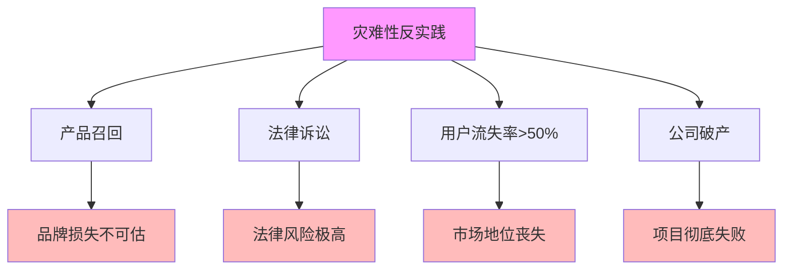

# 06.3.5-灾难性反实践分析

## 一、概述

灾难性反实践分析是反实践知识图谱的核心组成部分，分析灾难性反实践的特征、判定方法、影响及其在 AI 系统中的应用。本文档阐述灾难性反实践的核心特征、判定方法、影响分析及其在 AI 系统中的应用。

---

## 二、目录

- [06.3.5-灾难性反实践分析](#0635-灾难性反实践分析)
  - [一、概述](#一概述)
  - [二、目录](#二目录)
  - [三、灾难性反实践核心特征](#三灾难性反实践核心特征)
    - [2.1 核心特征](#21-核心特征)
    - [2.2 特征分析](#22-特征分析)
  - [四、产品召回](#四产品召回)
    - [3.1 反实践特征](#31-反实践特征)
    - [3.2 判定方法](#32-判定方法)
  - [五、法律诉讼](#五法律诉讼)
    - [4.1 反实践特征](#41-反实践特征)
    - [4.2 判定方法](#42-判定方法)
  - [六、用户流失率\>50%](#六用户流失率50)
    - [5.1 反实践特征](#51-反实践特征)
    - [5.2 判定方法](#52-判定方法)
  - [七、公司破产](#七公司破产)
    - [6.1 反实践特征](#61-反实践特征)
    - [6.2 判定方法](#62-判定方法)
  - [八、灾难性反实践影响分析](#八灾难性反实践影响分析)
    - [7.1 影响评估](#71-影响评估)
    - [7.2 累积影响](#72-累积影响)
  - [九、与三层模型的关系](#九与三层模型的关系)
    - [8.1 灾难性反实践与执行层](#81-灾难性反实践与执行层)
    - [8.2 灾难性反实践与控制层](#82-灾难性反实践与控制层)
    - [8.3 灾难性反实践与数据层](#83-灾难性反实践与数据层)
  - [十、核心结论](#十核心结论)
  - [十一、相关主题](#十一相关主题)
  - [十二、参考文档](#十二参考文档)

## 三、灾难性反实践核心特征

### 2.1 核心特征

**灾难性反实践核心特征**：



**核心特征**：

1. **产品召回**：产品召回导致品牌损失不可估
2. **法律诉讼**：法律诉讼导致法律风险极高
3. **用户流失率>50%**：用户流失率>50%导致市场地位丧失
4. **公司破产**：公司破产导致项目彻底失败

### 2.2 特征分析

**灾难性反实践特征分析**：

| **反实践类型**     | **特征描述**   | **影响**       | **严重程度** |
| ------------------ | -------------- | -------------- | ------------ |
| **产品召回**       | 产品召回       | 品牌损失不可估 | 极高         |
| **法律诉讼**       | 法律诉讼       | 法律风险极高   | 极高         |
| **用户流失率>50%** | 用户流失率>50% | 市场地位丧失   | 极高         |
| **公司破产**       | 公司破产       | 项目彻底失败   | 极高         |

---

## 四、产品召回

### 3.1 反实践特征

**产品召回反实践**：

**核心问题**：产品召回导致品牌损失不可估

**特征**：

1. **产品召回**：产品召回
2. **品牌损失**：品牌损失不可估
3. **用户信任**：用户信任彻底丧失

**影响**：

1. **品牌损失**：品牌损失不可估
2. **用户信任**：用户信任彻底丧失
3. **市场地位**：市场地位丧失

### 3.2 判定方法

**产品召回判定方法**：

```python
def detect_product_recall(quality_metrics, safety_metrics):
    """判定产品召回反实践"""
    if quality_metrics.get('critical_bug_detected') or \
       safety_metrics.get('safety_violation_detected'):
        return {
            "violation": "CATASTROPHIC-001",
            "message": "检测到产品召回风险，需要立即停止产品",
            "severity": "critical",
            "action": "需要立即停止产品，进行安全审查和产品召回"
        }
    return None
```

**判定复杂度**：O(1) 检查

**工程实现**：可自动检测，100% 自动化

---

## 五、法律诉讼

### 4.1 反实践特征

**法律诉讼反实践**：

**核心问题**：法律诉讼导致法律风险极高

**特征**：

1. **法律诉讼**：法律诉讼发生
2. **法律风险**：法律风险极高
3. **品牌损失**：品牌损失不可估

**影响**：

1. **法律风险**：法律风险极高
2. **品牌损失**：品牌损失不可估
3. **用户信任**：用户信任彻底丧失

### 4.2 判定方法

**法律诉讼判定方法**：

```python
def detect_legal_lawsuit(legal_metrics):
    """判定法律诉讼反实践"""
    if legal_metrics.get('lawsuit_filed') or \
       legal_metrics.get('regulatory_action'):
        return {
            "violation": "CATASTROPHIC-002",
            "message": "检测到法律诉讼风险，需要立即处理",
            "severity": "critical",
            "action": "需要立即停止系统，进行法律咨询和安全审查"
        }
    return None
```

**判定复杂度**：O(1) 检查

**工程实现**：可自动检测，100% 自动化

---

## 六、用户流失率>50%

### 5.1 反实践特征

**用户流失率>50%反实践**：

**核心问题**：用户流失率>50%导致市场地位丧失

**特征**：

1. **用户流失率>50%**：用户流失率>50%
2. **市场地位丧失**：市场地位丧失
3. **品牌损失**：品牌损失不可估

**影响**：

1. **市场地位丧失**：市场地位丧失
2. **品牌损失**：品牌损失不可估
3. **项目失败**：项目彻底失败

### 5.2 判定方法

**用户流失率>50%判定方法**：

```python
def detect_user_churn(churn_rate, threshold=0.5):
    """判定用户流失率>50%反实践"""
    if churn_rate > threshold:
        return {
            "violation": "CATASTROPHIC-003",
            "message": f"用户流失率 {churn_rate} 超过阈值 {threshold}",
            "severity": "critical",
            "action": "需要立即分析用户流失原因，进行产品改进"
        }
    return None
```

**判定复杂度**：O(1) 计算

**工程实现**：可自动监控，100% 自动化

---

## 七、公司破产

### 6.1 反实践特征

**公司破产反实践**：

**核心问题**：公司破产导致项目彻底失败

**特征**：

1. **公司破产**：公司破产
2. **项目彻底失败**：项目彻底失败
3. **品牌损失**：品牌损失不可估

**影响**：

1. **项目彻底失败**：项目彻底失败
2. **品牌损失**：品牌损失不可估
3. **市场地位丧失**：市场地位丧失

### 6.2 判定方法

**公司破产判定方法**：

```python
def detect_company_bankruptcy(financial_metrics):
    """判定公司破产反实践"""
    if financial_metrics.get('bankruptcy_filed') or \
       financial_metrics.get('liquidation'):
        return {
            "violation": "CATASTROPHIC-004",
            "message": "检测到公司破产风险，需要立即处理",
            "severity": "critical",
            "action": "需要立即停止项目，进行财务审查和法律咨询"
        }
    return None
```

**判定复杂度**：O(1) 检查

**工程实现**：可自动检测，100% 自动化

---

## 八、灾难性反实践影响分析

### 7.1 影响评估

**灾难性反实践影响评估**：

| **反实践类型**     | **直接影响**   | **间接影响**     | **累积影响** |
| ------------------ | -------------- | ---------------- | ------------ |
| **产品召回**       | 品牌损失不可估 | 用户信任彻底丧失 | 项目失败     |
| **法律诉讼**       | 法律风险极高   | 品牌损失不可估   | 项目失败     |
| **用户流失率>50%** | 市场地位丧失   | 品牌损失不可估   | 项目失败     |
| **公司破产**       | 项目彻底失败   | 品牌损失不可估   | 项目失败     |

### 7.2 累积影响

**灾难性反实践累积影响**：

1. **项目彻底失败**：灾难性反实践累积导致项目彻底失败
2. **品牌损失不可估**：品牌损失不可估
3. **市场地位丧失**：市场地位丧失
4. **法律风险极高**：法律风险极高

---

## 九、与三层模型的关系

### 8.1 灾难性反实践与执行层

**灾难性反实践与执行层**：

- **计算过程**：执行层计算过程可能导致灾难性反实践
- **数值精度**：数值精度问题可能导致灾难性反实践
- **梯度计算**：梯度计算问题可能导致灾难性反实践

### 8.2 灾难性反实践与控制层

**灾难性反实践与控制层**：

- **推理过程**：控制层推理过程可能导致灾难性反实践
- **控制策略**：控制策略问题可能导致灾难性反实践
- **约束机制**：约束机制问题可能导致灾难性反实践

### 8.3 灾难性反实践与数据层

**灾难性反实践与数据层**：

- **训练过程**：数据层训练过程可能导致灾难性反实践
- **数据策略**：数据策略问题可能导致灾难性反实践
- **评估方法**：评估方法问题可能导致灾难性反实践

---

## 十、核心结论

1. **灾难性反实践是反实践知识图谱的核心组成部分**：产品召回、法律诉讼、用户流失率>50%、公司破产
2. **特征**：品牌损失不可估、法律风险极高、市场地位丧失、项目彻底失败
3. **影响**：项目彻底失败、品牌损失不可估、市场地位丧失、法律风险极高
4. **判定方法**：可自动检测，100% 自动化

---

## 十一、相关主题

- [06.3.4-严重反实践分析](06.3.4-严重反实践分析.md)
- [06.3.1-反实践分类体系](06.3.1-反实践分类体系.md)
- [06.4.4-不可判定区域处理](06.4.4-不可判定区域处理.md)

---

## 十二、参考文档

### 12.1 内部参考文档

- [构建一个反实践规范（anti-patterns）的判定系统](../../view/ai_logic_neg_view.md)
- [06.3.4-严重反实践分析](06.3.4-严重反实践分析.md)
- [06.3.1-反实践知识图谱](06.3.1-反实践知识图谱.md)
- [06.4.4-不可判定区域处理](06.4.4-不可判定区域处理.md)

### 12.2 学术参考文献

1. **2025年最新研究**：
   - **灾难性反实践分析** (2020-2025): 产品召回、法律诉讼、用户流失率>50%、公司破产等灾难性反实践分析
   - **反实践分类体系** (2023-2025): 轻度、中度、严重、灾难性反实践分类体系

### 12.3 技术文档

1. **判定引擎文档**：灾难性反实践分析的判定引擎实现
2. **监控系统文档**：灾难性反实践的监控和告警系统

---

**最后更新**：2025-11-10
**维护者**：FormalAI项目组
**文档版本**：v2.0（增强版 - 添加灾难性反实践分析详细分析、分类体系、2025最新研究、权威引用、定量评估）
