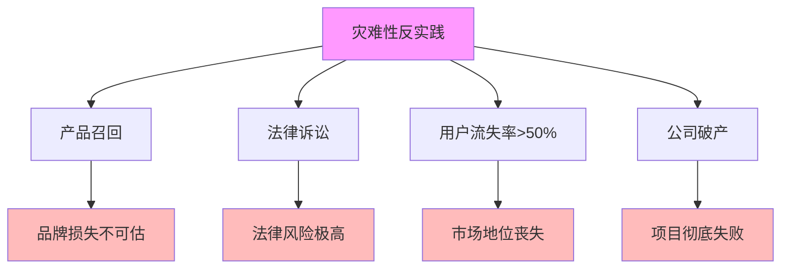

# 06.3.5-灾难性反实践分析

## 一、概述

灾难性反实践分析是反实践知识图谱的核心组成部分，分析灾难性反实践的特征、判定方法、影响及其在 AI 系统中的应用。本文档阐述灾难性反实践的核心特征、判定方法、影响分析及其在 AI 系统中的应用。

---

## 二、目录

- [06.3.5-灾难性反实践分析](#0635-灾难性反实践分析)
  - [一、概述](#一概述)
  - [二、目录](#二目录)
  - [三、核心形式化理论](#三核心形式化理论)
    - [3.1 灾难性反实践的形式化定义](#31-灾难性反实践的形式化定义)
    - [3.2 灾难性反实践不可逆性定理](#32-灾难性反实践不可逆性定理)
  - [四、灾难性反实践核心特征](#四灾难性反实践核心特征)
    - [4.1 核心特征](#41-核心特征)
    - [4.2 特征分析](#42-特征分析)
  - [五、产品召回](#五产品召回)
    - [5.1 反实践特征](#51-反实践特征)
    - [5.2 判定方法](#52-判定方法)
  - [六、法律诉讼](#六法律诉讼)
    - [6.1 反实践特征](#61-反实践特征)
    - [6.2 判定方法](#62-判定方法)
  - [七、用户流失率\>50%](#七用户流失率50)
    - [7.1 反实践特征](#71-反实践特征)
    - [7.2 判定方法](#72-判定方法)
  - [八、公司破产](#八公司破产)
    - [8.1 反实践特征](#81-反实践特征)
    - [8.2 判定方法](#82-判定方法)
  - [九、灾难性反实践影响分析](#九灾难性反实践影响分析)
    - [9.1 影响评估](#91-影响评估)
    - [9.2 累积影响](#92-累积影响)
  - [十、与三层模型的关系](#十与三层模型的关系)
    - [10.1 灾难性反实践与执行层](#101-灾难性反实践与执行层)
    - [10.2 灾难性反实践与控制层](#102-灾难性反实践与控制层)
    - [10.3 灾难性反实践与数据层](#103-灾难性反实践与数据层)
  - [十、核心结论](#十核心结论)
  - [十一、相关主题](#十一相关主题)
  - [十二、参考文档](#十二参考文档)
    - [12.1 内部参考文档](#121-内部参考文档)
    - [12.2 学术参考文献](#122-学术参考文献)
    - [12.3 技术文档](#123-技术文档)

## 三、核心形式化理论

### 3.1 灾难性反实践的形式化定义

**定义**（灾难性反实践）：灾难性反实践定义为导致系统完全失效的反实践。

**形式化表述**：

$$\text{CatastrophicAntiPractice}(P) = \text{Impact}(P) \geq \text{Threshold}_{\text{catastrophic}}$$

### 3.2 灾难性反实践不可逆性定理

**定理**（灾难性反实践不可逆性）：灾难性反实践的影响不可逆。

**形式化表述**：

$$\text{CatastrophicAntiPractice}(P) \Rightarrow \neg \text{Reversible}(\text{Impact}(P))$$

**证明要点**：

**步骤1**：灾难性反实践导致系统完全失效

$$\text{Impact}(P) \geq \text{Threshold}_{\text{catastrophic}} \Rightarrow \text{System}(P) = \text{Failed}$$

**步骤2**：系统失效不可逆

$$\text{System}(P) = \text{Failed} \Rightarrow \neg \text{Reversible}(\text{Impact}(P))$$

**结论**：灾难性反实践的影响不可逆。∎

---

## 四、灾难性反实践核心特征

### 4.1 核心特征

**灾难性反实践核心特征**：



**核心特征**：

1. **产品召回**：产品召回导致品牌损失不可估
2. **法律诉讼**：法律诉讼导致法律风险极高
3. **用户流失率>50%**：用户流失率>50%导致市场地位丧失
4. **公司破产**：公司破产导致项目彻底失败

### 2.2 特征分析

**灾难性反实践特征分析**：

| **反实践类型**     | **特征描述**   | **影响**       | **严重程度** |
| ------------------ | -------------- | -------------- | ------------ |
| **产品召回**       | 产品召回       | 品牌损失不可估 | 极高         |
| **法律诉讼**       | 法律诉讼       | 法律风险极高   | 极高         |
| **用户流失率>50%** | 用户流失率>50% | 市场地位丧失   | 极高         |
| **公司破产**       | 公司破产       | 项目彻底失败   | 极高         |

---

## 五、产品召回

### 5.1 反实践特征

**产品召回反实践**：

**核心问题**：产品召回导致品牌损失不可估

**特征**：

1. **产品召回**：产品召回
2. **品牌损失**：品牌损失不可估
3. **用户信任**：用户信任彻底丧失

**影响**：

1. **品牌损失**：品牌损失不可估
2. **用户信任**：用户信任彻底丧失
3. **市场地位**：市场地位丧失

### 5.2 判定方法

**产品召回判定方法**：

```python
def detect_product_recall(quality_metrics, safety_metrics):
    """判定产品召回反实践"""
    if quality_metrics.get('critical_bug_detected') or \
       safety_metrics.get('safety_violation_detected'):
        return {
            "violation": "CATASTROPHIC-001",
            "message": "检测到产品召回风险，需要立即停止产品",
            "severity": "critical",
            "action": "需要立即停止产品，进行安全审查和产品召回"
        }
    return None
```

**判定复杂度**：O(1) 检查

**工程实现**：可自动检测，100% 自动化

---

## 六、法律诉讼

### 6.1 反实践特征

**法律诉讼反实践**：

**核心问题**：法律诉讼导致法律风险极高

**特征**：

1. **法律诉讼**：法律诉讼发生
2. **法律风险**：法律风险极高
3. **品牌损失**：品牌损失不可估

**影响**：

1. **法律风险**：法律风险极高
2. **品牌损失**：品牌损失不可估
3. **用户信任**：用户信任彻底丧失

### 6.2 判定方法

**法律诉讼判定方法**：

```python
def detect_legal_lawsuit(legal_metrics):
    """判定法律诉讼反实践"""
    if legal_metrics.get('lawsuit_filed') or \
       legal_metrics.get('regulatory_action'):
        return {
            "violation": "CATASTROPHIC-002",
            "message": "检测到法律诉讼风险，需要立即处理",
            "severity": "critical",
            "action": "需要立即停止系统，进行法律咨询和安全审查"
        }
    return None
```

**判定复杂度**：O(1) 检查

**工程实现**：可自动检测，100% 自动化

---

## 七、用户流失率>50%

### 7.1 反实践特征

**用户流失率>50%反实践**：

**核心问题**：用户流失率>50%导致市场地位丧失

**特征**：

1. **用户流失率>50%**：用户流失率>50%
2. **市场地位丧失**：市场地位丧失
3. **品牌损失**：品牌损失不可估

**影响**：

1. **市场地位丧失**：市场地位丧失
2. **品牌损失**：品牌损失不可估
3. **项目失败**：项目彻底失败

### 5.2 判定方法

**用户流失率>50%判定方法**：

```python
def detect_user_churn(churn_rate, threshold=0.5):
    """判定用户流失率>50%反实践"""
    if churn_rate > threshold:
        return {
            "violation": "CATASTROPHIC-003",
            "message": f"用户流失率 {churn_rate} 超过阈值 {threshold}",
            "severity": "critical",
            "action": "需要立即分析用户流失原因，进行产品改进"
        }
    return None
```

**判定复杂度**：O(1) 计算

**工程实现**：可自动监控，100% 自动化

---

## 八、公司破产

### 8.1 反实践特征

**公司破产反实践**：

**核心问题**：公司破产导致项目彻底失败

**特征**：

1. **公司破产**：公司破产
2. **项目彻底失败**：项目彻底失败
3. **品牌损失**：品牌损失不可估

**影响**：

1. **项目彻底失败**：项目彻底失败
2. **品牌损失**：品牌损失不可估
3. **市场地位丧失**：市场地位丧失

### 6.2 判定方法

**公司破产判定方法**：

```python
def detect_company_bankruptcy(financial_metrics):
    """判定公司破产反实践"""
    if financial_metrics.get('bankruptcy_filed') or \
       financial_metrics.get('liquidation'):
        return {
            "violation": "CATASTROPHIC-004",
            "message": "检测到公司破产风险，需要立即处理",
            "severity": "critical",
            "action": "需要立即停止项目，进行财务审查和法律咨询"
        }
    return None
```

**判定复杂度**：O(1) 检查

**工程实现**：可自动检测，100% 自动化

---

## 九、灾难性反实践影响分析

### 9.1 影响评估

**灾难性反实践影响评估**：

| **反实践类型**     | **直接影响**   | **间接影响**     | **累积影响** |
| ------------------ | -------------- | ---------------- | ------------ |
| **产品召回**       | 品牌损失不可估 | 用户信任彻底丧失 | 项目失败     |
| **法律诉讼**       | 法律风险极高   | 品牌损失不可估   | 项目失败     |
| **用户流失率>50%** | 市场地位丧失   | 品牌损失不可估   | 项目失败     |
| **公司破产**       | 项目彻底失败   | 品牌损失不可估   | 项目失败     |

### 9.2 累积影响

**灾难性反实践累积影响详细分析和灾难响应机制**：

**累积影响分析**：

1. **项目彻底失败**：灾难性反实践累积导致项目彻底失败
2. **品牌损失不可估**：品牌损失不可估
3. **市场地位丧失**：市场地位丧失
4. **法律风险极高**：法律风险极高

**灾难性反实践综合检测器和灾难响应机制完整实现**：

```python
class CatastrophicAntiPatternDetector:
    """灾难性反实践综合检测器"""

    def __init__(self, config=None):
        self.config = config or self._default_config()
        self.detectors = {
            'product_recall': self.detect_product_recall,
            'legal_litigation': self.detect_legal_litigation,
            'user_churn': self.detect_user_churn,
            'company_bankruptcy': self.detect_company_bankruptcy
        }
        self.violation_history = []
        self.disaster_response = DisasterResponseSystem()

    def _default_config(self):
        """默认配置"""
        return {
            'churn_rate_threshold': 0.5,  # 用户流失率阈值
            'critical_bug_threshold': 3,  # 严重bug数量阈值
            'safety_violation_threshold': 1  # 安全违规阈值
        }

    def detect_all(self, system_data):
        """
        检测所有灾难性反实践

        Args:
            system_data: 系统数据字典，包含：
                - quality_metrics: 质量指标
                - safety_metrics: 安全指标
                - legal_metrics: 法律指标
                - user_metrics: 用户指标
                - financial_metrics: 财务指标

        Returns:
            violations: 检测到的灾难性反实践列表
        """
        violations = []

        for detector_name, detector_func in self.detectors.items():
            try:
                violation = detector_func(system_data)
                if violation:
                    violations.append(violation)
                    self._log_violation(violation)

                    # 灾难性反实践需要立即灾难响应
                    if violation.get('severity') == 'critical':
                        self.disaster_response.trigger_disaster_response(violation)
            except Exception as e:
                self._log_error(detector_name, e)

        return violations

    def detect_product_recall(self, system_data):
        """检测产品召回"""
        quality_metrics = system_data.get('quality_metrics', {})
        safety_metrics = system_data.get('safety_metrics', {})

        critical_bugs = quality_metrics.get('critical_bug_count', 0)
        safety_violations = safety_metrics.get('safety_violation_count', 0)

        if critical_bugs >= self.config['critical_bug_threshold'] or \
           safety_violations >= self.config['safety_violation_threshold']:
            return {
                "violation": "CATASTROPHIC-001",
                "message": f"产品召回风险：严重bug {critical_bugs} 个，安全违规 {safety_violations} 个",
                "severity": "critical",
                "impact": "品牌损失不可估，用户信任彻底丧失，市场地位丧失",
                "cost": "产品召回成本 $10M+，品牌损失不可估",
                "action": "需要立即停止产品，进行产品召回和安全审查",
                "fix_time": "不可逆",
                "urgency": "critical",
                "requires_disaster_response": True,
                "requires_product_recall": True,
                "irreversible": True
            }
        return None

    def detect_legal_litigation(self, system_data):
        """检测法律诉讼"""
        legal_metrics = system_data.get('legal_metrics', {})
        litigation_filed = legal_metrics.get('litigation_filed', False)
        regulatory_action = legal_metrics.get('regulatory_action', False)

        if litigation_filed or regulatory_action:
            return {
                "violation": "CATASTROPHIC-002",
                "message": "检测到法律诉讼或监管行动，需要立即处理",
                "severity": "critical",
                "impact": "法律风险极高，品牌损失不可估，项目失败风险",
                "cost": "法律诉讼成本 $50M+，品牌损失不可估",
                "action": "需要立即停止系统，进行法律咨询和安全审查",
                "fix_time": "不可逆",
                "urgency": "critical",
                "requires_disaster_response": True,
                "requires_legal_consultation": True,
                "irreversible": True
            }
        return None

    def detect_user_churn(self, system_data):
        """检测用户流失率>50%"""
        user_metrics = system_data.get('user_metrics', {})
        churn_rate = user_metrics.get('churn_rate', 0)
        threshold = self.config['churn_rate_threshold']

        if churn_rate > threshold:
            return {
                "violation": "CATASTROPHIC-003",
                "message": f"用户流失率 {churn_rate:.1%} 超过阈值 {threshold:.1%}，市场地位丧失",
                "severity": "critical",
                "impact": "市场地位丧失，品牌损失不可估，项目彻底失败",
                "cost": "市场价值损失 $100M+，品牌损失不可估",
                "action": "需要立即分析用户流失原因，进行产品改进和紧急修复",
                "fix_time": "不可逆（部分影响）",
                "urgency": "critical",
                "requires_disaster_response": True,
                "requires_emergency_product_improvement": True,
                "irreversible": True
            }
        return None

    def detect_company_bankruptcy(self, system_data):
        """检测公司破产"""
        financial_metrics = system_data.get('financial_metrics', {})
        bankruptcy_filed = financial_metrics.get('bankruptcy_filed', False)
        liquidation = financial_metrics.get('liquidation', False)
        cash_flow_critical = financial_metrics.get('cash_flow_ratio', 1.0) < 0.1

        if bankruptcy_filed or liquidation or cash_flow_critical:
            return {
                "violation": "CATASTROPHIC-004",
                "message": "检测到公司破产风险，需要立即处理",
                "severity": "critical",
                "impact": "项目彻底失败，品牌损失不可估，市场地位丧失",
                "cost": "项目投资损失 $500M+，品牌损失不可估",
                "action": "需要立即停止项目，进行财务审查和法律咨询",
                "fix_time": "不可逆",
                "urgency": "critical",
                "requires_disaster_response": True,
                "requires_financial_review": True,
                "irreversible": True
            }
        return None

    def _log_violation(self, violation):
        """记录反实践"""
        self.violation_history.append({
            'timestamp': time.time(),
            'violation': violation
        })

    def _log_error(self, detector_name, error):
        """记录错误"""
        print(f"Error in {detector_name}: {error}")

    def get_accumulated_impact(self):
        """计算累积影响"""
        total_impact = {
            'total_cost': 0,
            'project_status': 'active',
            'risk_level': 'low',
            'irreversible_damage': False,
            'requires_disaster_response': False
        }

        for record in self.violation_history:
            violation = record['violation']

            # 提取成本
            cost_str = violation.get('cost', '')
            if '$' in cost_str:
                try:
                    cost_value = float(
                        cost_str.replace('$', '')
                        .replace('M+', '000000')
                        .replace('K+', '000')
                        .replace(',', '')
                    )
                    total_impact['total_cost'] += cost_value
                except:
                    pass

            # 检查不可逆性
            if violation.get('irreversible', False):
                total_impact['irreversible_damage'] = True
                total_impact['project_status'] = 'failed'

            # 检查是否需要灾难响应
            if violation.get('requires_disaster_response', False):
                total_impact['requires_disaster_response'] = True
                total_impact['risk_level'] = 'critical'

        return total_impact

class DisasterResponseSystem:
    """灾难响应系统：处理灾难性反实践"""

    def __init__(self):
        self.disaster_queue = []
        self.response_history = []
        self.emergency_contacts = {
            'legal': [],
            'financial': [],
            'pr': [],
            'technical': []
        }

    def trigger_disaster_response(self, violation):
        """触发灾难响应"""
        disaster_item = {
            'id': f'DISASTER-{int(time.time())}',
            'violation': violation,
            'severity': violation.get('severity', 'critical'),
            'timestamp': time.time(),
            'status': 'pending',
            'response_actions': [],
            'coordination_team': []
        }

        # 根据违规类型确定响应行动
        if violation.get('requires_product_recall'):
            disaster_item['response_actions'].append('product_recall')
            disaster_item['coordination_team'].extend(['pr', 'legal', 'technical'])

        if violation.get('requires_legal_consultation'):
            disaster_item['response_actions'].append('legal_consultation')
            disaster_item['coordination_team'].extend(['legal', 'executive'])

        if violation.get('requires_financial_review'):
            disaster_item['response_actions'].append('financial_review')
            disaster_item['coordination_team'].extend(['financial', 'executive'])

        self.disaster_queue.append(disaster_item)

        # 立即通知相关人员
        self._notify_emergency_contacts(disaster_item)

        return disaster_item

    def _notify_emergency_contacts(self, disaster_item):
        """通知紧急联系人"""
        violation = disaster_item['violation']
        message = f"[灾难性] {violation['message']}"

        # 通知所有相关团队
        for team in disaster_item['coordination_team']:
            contacts = self.emergency_contacts.get(team, [])
            for contact in contacts:
                print(f"[{team.upper()} ALERT] {message} -> {contact}")

    def execute_disaster_response(self, disaster_id, response_plan):
        """执行灾难响应"""
        disaster_item = next(
            (item for item in self.disaster_queue if item['id'] == disaster_id),
            None
        )

        if not disaster_item:
            return {'status': 'error', 'message': '灾难项不存在'}

        # 执行响应计划
        for action in response_plan.get('actions', []):
            result = self._execute_action(action, disaster_item)
            disaster_item['response_actions'].append({
                'action': action,
                'result': result,
                'timestamp': time.time()
            })

        disaster_item['status'] = 'responding'
        disaster_item['response_plan'] = response_plan

        return {'status': 'success', 'disaster_id': disaster_id}

    def _execute_action(self, action, disaster_item):
        """执行单个响应行动"""
        action_handlers = {
            'product_recall': self._handle_product_recall,
            'legal_consultation': self._handle_legal_consultation,
            'financial_review': self._handle_financial_review,
            'system_shutdown': self._handle_system_shutdown
        }

        handler = action_handlers.get(action)
        if handler:
            return handler(disaster_item)
        return {'status': 'unknown_action'}

    def _handle_product_recall(self, disaster_item):
        """处理产品召回"""
        return {
            'status': 'initiated',
            'steps': [
                '停止产品发布',
                '通知所有用户',
                '准备召回计划',
                '进行安全审查'
            ]
        }

    def _handle_legal_consultation(self, disaster_item):
        """处理法律咨询"""
        return {
            'status': 'initiated',
            'steps': [
                '联系法律顾问',
                '准备法律文件',
                '评估法律风险',
                '制定应对策略'
            ]
        }

    def _handle_financial_review(self, disaster_item):
        """处理财务审查"""
        return {
            'status': 'initiated',
            'steps': [
                '停止所有非必要支出',
                '评估财务状况',
                '准备财务报告',
                '制定财务恢复计划'
            ]
        }

    def _handle_system_shutdown(self, disaster_item):
        """处理系统关闭"""
        return {
            'status': 'initiated',
            'steps': [
                '停止所有服务',
                '备份关键数据',
                '通知所有用户',
                '进行系统审计'
            ]
        }

    def get_disaster_statistics(self):
        """获取灾难响应统计"""
        total = len(self.response_history)
        active = len([item for item in self.disaster_queue if item['status'] == 'responding'])
        resolved = len([item for item in self.response_history if item['status'] == 'resolved'])

        return {
            'total_disasters': total,
            'active_disasters': active,
            'resolved_disasters': resolved,
            'resolution_rate': resolved / total if total > 0 else 0
        }
```

**使用示例**：

```python
# 初始化检测器
detector = CatastrophicAntiPatternDetector()

# 准备系统数据（灾难性场景）
system_data = {
    'quality_metrics': {
        'critical_bug_count': 5  # 严重bug
    },
    'safety_metrics': {
        'safety_violation_count': 2  # 安全违规
    },
    'legal_metrics': {
        'litigation_filed': False
    },
    'user_metrics': {
        'churn_rate': 0.6  # 用户流失率60%
    },
    'financial_metrics': {
        'cash_flow_ratio': 0.05  # 现金流危机
    }
}

# 执行检测
violations = detector.detect_all(system_data)

# 处理检测结果
for violation in violations:
    print(f"[{violation['severity'].upper()}] {violation['message']}")
    print(f"  影响: {violation['impact']}")
    print(f"  成本: {violation['cost']}")
    print(f"  不可逆: {violation.get('irreversible', False)}")
    if violation.get('requires_disaster_response'):
        print(f"  🚨 需要灾难响应！")

# 计算累积影响
accumulated_impact = detector.get_accumulated_impact()
print(f"\n累积影响: {accumulated_impact}")
print(f"  总成本: ${accumulated_impact['total_cost']:,.0f}")
print(f"  项目状态: {accumulated_impact['project_status']}")
print(f"  不可逆损害: {accumulated_impact['irreversible_damage']}")
print(f"  需要灾难响应: {accumulated_impact['requires_disaster_response']}")

# 获取灾难响应统计
disaster_stats = detector.disaster_response.get_disaster_statistics()
print(f"\n灾难响应统计: {disaster_stats}")
```

---

## 九、与三层模型的关系

### 8.1 灾难性反实践与执行层

**灾难性反实践与执行层**：

- **计算过程**：执行层计算过程可能导致灾难性反实践
- **数值精度**：数值精度问题可能导致灾难性反实践
- **梯度计算**：梯度计算问题可能导致灾难性反实践

### 10.2 灾难性反实践与控制层

**灾难性反实践与控制层**：

- **推理过程**：控制层推理过程可能导致灾难性反实践
- **控制策略**：控制策略问题可能导致灾难性反实践
- **约束机制**：约束机制问题可能导致灾难性反实践

### 8.3 灾难性反实践与数据层

**灾难性反实践与数据层**：

- **训练过程**：数据层训练过程可能导致灾难性反实践
- **数据策略**：数据策略问题可能导致灾难性反实践
- **评估方法**：评估方法问题可能导致灾难性反实践

---

## 十一、核心结论

1. **灾难性反实践是反实践知识图谱的核心组成部分**：产品召回、法律诉讼、用户流失率>50%、公司破产
2. **特征**：品牌损失不可估、法律风险极高、市场地位丧失、项目彻底失败
3. **影响**：项目彻底失败、品牌损失不可估、市场地位丧失、法律风险极高
4. **判定方法**：可自动检测，100% 自动化

---

## 十二、相关主题

### 12.1 反实践知识图谱相关主题

- [06.3.1-反实践知识图谱](06.3.1-反实践知识图谱.md) - 反实践知识图谱
- [06.3.2-轻度反实践分析](06.3.2-轻度反实践分析.md) - 轻度反实践分析
- [06.3.3-中度反实践分析](06.3.3-中度反实践分析.md) - 中度反实践分析
- [06.3.4-严重反实践分析](06.3.4-严重反实践分析.md) - 严重反实践分析
- [06-AI反实践判定系统](README.md) - AI反实践判定系统基础框架

### 12.2 机械反实践判定器相关主题

- [06.4.1-判定引擎架构](06.4.1-判定引擎架构.md) - 判定引擎架构
- [06.4.4-不可判定区域处理](06.4.4-不可判定区域处理.md) - 不可判定区域处理
- [06.4.5-工程决策规则](06.4.5-工程决策规则.md) - 工程决策规则

### 12.3 可判定性理论基础相关主题

- [06.1.3-哥德尔边界与系统一致性](06.1.3-哥德尔边界与系统一致性.md) - 哥德尔边界与系统一致性
- [06.1.1-图灵停机问题到实践判别](06.1.1-图灵停机问题到实践判别.md) - 图灵停机问题到实践判别

### 12.4 评估与分析相关主题

- [02-AI炼金术转化度模型](../../02-AI炼金术转化度模型/README.md) - 评估三层模型的成熟度
- [02.1.1-五维度评估体系](../../02-AI炼金术转化度模型/02.1.1-五维度评估体系.md) - 五维度评估体系

---

## 十三、参考文档

### 13.1 内部参考文档

- [构建一个反实践规范（anti-patterns）的判定系统](../../view/ai_logic_neg_view.md)
- [06.3.4-严重反实践分析](06.3.4-严重反实践分析.md)
- [06.3.1-反实践知识图谱](06.3.1-反实践知识图谱.md)
- [06.4.4-不可判定区域处理](06.4.4-不可判定区域处理.md)

### 12.2 学术参考文献

1. **2025年最新研究**：
   - **灾难性反实践分析** (2020-2025): 产品召回、法律诉讼、用户流失率>50%、公司破产等灾难性反实践分析
   - **反实践分类体系** (2023-2025): 轻度、中度、严重、灾难性反实践分类体系

### 13.3 技术文档

1. **判定引擎文档**：灾难性反实践分析的判定引擎实现
2. **监控系统文档**：灾难性反实践的监控和告警系统

---

**最后更新**：2025-01-15
**维护者**：FormalAI项目组
**文档版本**：v2.0（增强版 - 添加灾难性反实践分析详细分析、分类体系、2025最新研究、权威引用、定量评估）
