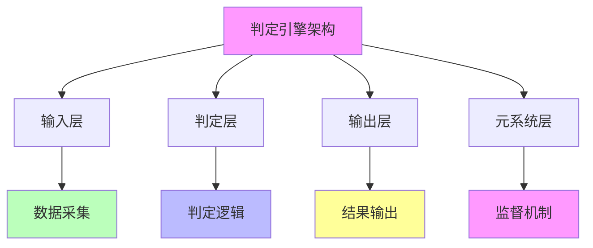

# 06.4.1-判定引擎架构

## 一、概述

判定引擎架构是机械反实践判定器的核心组成部分，描述 AI 反实践判定引擎的架构设计，包括架构层次、模块设计、接口定义等。本文档阐述判定引擎架构的核心架构、模块设计、接口定义及其在 AI 系统中的应用。

---

## 二、目录

- [06.4.1-判定引擎架构](#0641-判定引擎架构)
  - [一、概述](#一概述)
  - [二、目录](#二目录)
  - [三、判定引擎架构核心架构](#三判定引擎架构核心架构)
    - [2.1 核心架构](#21-核心架构)
    - [2.2 架构层次](#22-架构层次)
  - [四、输入层设计](#四输入层设计)
    - [3.1 数据采集](#31-数据采集)
    - [3.2 数据预处理](#32-数据预处理)
  - [五、判定层设计](#五判定层设计)
    - [4.1 判定逻辑](#41-判定逻辑)
    - [4.2 判定规则](#42-判定规则)
  - [六、输出层设计](#六输出层设计)
    - [5.1 结果输出](#51-结果输出)
    - [5.2 告警机制](#52-告警机制)
  - [七、元系统层设计](#七元系统层设计)
    - [6.1 监督机制](#61-监督机制)
    - [6.2 反馈机制](#62-反馈机制)
  - [八、架构设计原则](#八架构设计原则)
    - [7.1 设计原则](#71-设计原则)
    - [7.2 架构优化](#72-架构优化)
  - [九、与三层模型的关系](#九与三层模型的关系)
    - [8.1 判定引擎与执行层](#81-判定引擎与执行层)
    - [8.2 判定引擎与控制层](#82-判定引擎与控制层)
    - [8.3 判定引擎与数据层](#83-判定引擎与数据层)
  - [十、核心结论](#十核心结论)
  - [十一、相关主题](#十一相关主题)
  - [十二、参考文档](#十二参考文档)

## 三、判定引擎架构核心架构

### 2.1 核心架构

**判定引擎架构核心架构**：

**核心架构**：

1. **输入层**：数据采集、数据预处理
2. **判定层**：判定逻辑、判定规则
3. **输出层**：结果输出、告警机制
4. **元系统层**：监督机制、反馈机制

### 2.2 架构层次

**判定引擎架构层次**：

| **架构层次** | **功能描述**         | **复杂度** | **自动化程度** |
| ------------ | -------------------- | ---------- | -------------- |
| **输入层**   | 数据采集、数据预处理 | 低         | 100%           |
| **判定层**   | 判定逻辑、判定规则   | 中-高      | 50-100%        |
| **输出层**   | 结果输出、告警机制   | 低         | 100%           |
| **元系统层** | 监督机制、反馈机制   | 高         | 0-50%          |

---

## 四、输入层设计

### 3.1 数据采集

**数据采集模块**：

**核心功能**：采集 AI 系统的运行数据

**采集内容**：

1. **执行层数据**：矩阵运算结果、显存占用、梯度范数
2. **控制层数据**：Prompt 内容、JSON 解析结果、状态机状态
3. **数据层数据**：Loss 值、准确率、奖励值

**自动化程度**：100%

**案例**：

1. **显存监控**：自动监控显存占用
2. **梯度监控**：自动监控梯度范数
3. **Loss 监控**：自动监控 Loss 值

### 3.2 数据预处理

**数据预处理模块**：

**核心功能**：预处理采集的数据

**预处理内容**：

1. **数据清洗**：清洗异常数据
2. **数据归一化**：归一化数据
3. **特征提取**：提取特征

**自动化程度**：100%

---

## 五、判定层设计

### 4.1 判定逻辑

**判定逻辑模块**：

**核心功能**：执行判定逻辑

**判定内容**：

1. **完全可判定区域**：执行层判定、控制层部分判定
2. **半可判定区域**：控制层部分判定、数据层部分判定
3. **不可判定区域**：三层协同判定

**自动化程度**：50-100%

**案例**：

1. **显存判定**：O(1) 判定显存占用
2. **梯度判定**：O(1) 判定梯度范数
3. **Prompt 判定**：O(n) 判定 Prompt 长度

### 4.2 判定规则

**判定规则模块**：

**核心功能**：管理判定规则

**规则内容**：

1. **规则定义**：定义判定规则
2. **规则匹配**：匹配判定规则
3. **规则执行**：执行判定规则

**自动化程度**：100%

---

## 六、输出层设计

### 5.1 结果输出

**结果输出模块**：

**核心功能**：输出判定结果

**输出内容**：

1. **判定结果**：输出判定结果
2. **告警信息**：输出告警信息
3. **建议措施**：输出建议措施

**自动化程度**：100%

**案例**：

1. **显存告警**：输出显存超限告警
2. **梯度告警**：输出梯度爆炸告警
3. **Loss 告警**：输出 Loss 异常告警

### 5.2 告警机制

**告警机制模块**：

**核心功能**：触发告警机制

**告警内容**：

1. **告警级别**：定义告警级别
2. **告警触发**：触发告警
3. **告警通知**：通知相关人员

**自动化程度**：100%

---

## 七、元系统层设计

### 6.1 监督机制

**监督机制模块**：

**核心功能**：监督判定引擎

**监督内容**：

1. **判定准确性**：监督判定准确性
2. **判定效率**：监督判定效率
3. **系统稳定性**：监督系统稳定性

**自动化程度**：50%

**案例**：

1. **判定准确性监控**：监控判定准确性
2. **判定效率监控**：监控判定效率
3. **系统稳定性监控**：监控系统稳定性

### 6.2 反馈机制

**反馈机制模块**：

**核心功能**：提供反馈机制

**反馈内容**：

1. **判定反馈**：提供判定反馈
2. **规则优化**：优化判定规则
3. **系统改进**：改进系统设计

**自动化程度**：50%

---

## 八、架构设计原则

### 7.1 设计原则

**判定引擎架构设计原则**：

| **设计原则** | **描述**     | **重要性** |
| ------------ | ------------ | ---------- |
| **可扩展性** | 架构支持扩展 | 高         |
| **可维护性** | 架构易于维护 | 高         |
| **可测试性** | 架构易于测试 | 高         |
| **可观测性** | 架构支持观测 | 高         |

### 7.2 架构优化

**判定引擎架构优化**：

**核心优化**：优化架构设计

**优化内容**：

1. **性能优化**：优化性能
2. **可扩展性优化**：优化可扩展性
3. **可维护性优化**：优化可维护性

**效果**：提升系统效率

---

## 九、与三层模型的关系

### 8.1 判定引擎与执行层

**判定引擎与执行层**：

- **数据采集**：采集执行层数据
- **判定逻辑**：执行执行层判定
- **结果输出**：输出执行层判定结果

### 8.2 判定引擎与控制层

**判定引擎与控制层**：

- **数据采集**：采集控制层数据
- **判定逻辑**：执行控制层判定
- **结果输出**：输出控制层判定结果

### 8.3 判定引擎与数据层

**判定引擎与数据层**：

- **数据采集**：采集数据层数据
- **判定逻辑**：执行数据层判定
- **结果输出**：输出数据层判定结果

---

## 十、核心结论

1. **判定引擎架构是机械反实践判定器的核心组成部分**：输入层、判定层、输出层、元系统层
2. **架构层次**：输入层（100% 自动化）、判定层（50-100% 自动化）、输出层（100% 自动化）、元系统层（0-50% 自动化）
3. **设计原则**：可扩展性、可维护性、可测试性、可观测性
4. **工程意义**：判定引擎架构支持 AI 反实践判定

---

## 十一、相关主题

- [06.4.2-完全可判定区域实现](06.4.2-完全可判定区域实现.md)
- [06.4.3-半可判定区域实现](06.4.3-半可判定区域实现.md)
- [06.4.4-不可判定区域处理](06.4.4-不可判定区域处理.md)
- [06.4.5-工程决策规则](06.4.5-工程决策规则.md)

---

## 十二、参考文档

- [构建一个反实践规范（anti-patterns）的判定系统](../../view/ai_logic_neg_view.md)
