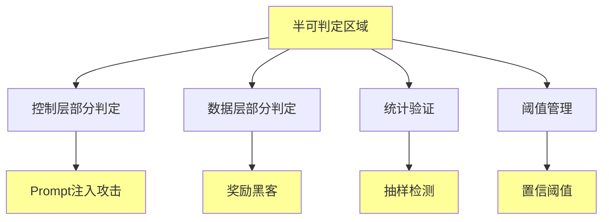

# 06.4.3-半可判定区域实现

## 一、概述

半可判定区域实现是机械反实践判定器的核心组成部分，实现半可判定区域的判定逻辑，包括控制层部分判定、数据层部分判定等。本文档阐述半可判定区域实现的核心实现、判定逻辑、工程实践及其在 AI 系统中的应用。

---

## 二、目录

- [06.4.3-半可判定区域实现](#0643-半可判定区域实现)
  - [一、概述](#一概述)
  - [二、目录](#二目录)
  - [三、半可判定区域核心实现](#三半可判定区域核心实现)
    - [2.1 核心实现](#21-核心实现)
    - [2.2 实现特征](#22-实现特征)
  - [四、控制层部分判定实现](#四控制层部分判定实现)
    - [3.1 Prompt 注入攻击检测](#31-prompt-注入攻击检测)
    - [3.2 统计验证](#32-统计验证)
  - [五、数据层部分判定实现](#五数据层部分判定实现)
    - [4.1 奖励黑客检测](#41-奖励黑客检测)
    - [4.2 幻觉检测](#42-幻觉检测)
  - [六、统计验证实现](#六统计验证实现)
    - [5.1 抽样检测](#51-抽样检测)
    - [5.2 阈值管理](#52-阈值管理)
  - [七、工程实践](#七工程实践)
    - [6.1 阈值管理](#61-阈值管理)
    - [6.2 人工介入](#62-人工介入)
  - [八、与三层模型的关系](#八与三层模型的关系)
    - [7.1 半可判定区域与执行层](#71-半可判定区域与执行层)
    - [7.2 半可判定区域与控制层](#72-半可判定区域与控制层)
    - [7.3 半可判定区域与数据层](#73-半可判定区域与数据层)
  - [九、核心结论](#九核心结论)
  - [十、相关主题](#十相关主题)
  - [十一、参考文档](#十一参考文档)

## 三、半可判定区域核心实现

### 2.1 核心实现

**半可判定区域核心实现**：



**核心实现**：

1. **控制层部分判定**：Prompt 注入攻击检测
2. **数据层部分判定**：奖励黑客检测、幻觉检测
3. **统计验证**：抽样检测、统计验证
4. **阈值管理**：置信阈值、假阴性容忍

### 2.2 实现特征

**半可判定区域实现特征**：

| **实现特征**       | **描述**               | **复杂度** | **自动化程度** |
| ------------------ | ---------------------- | ---------- | -------------- |
| **控制层部分判定** | Prompt 注入攻击检测    | NP-hard    | 50%            |
| **数据层部分判定** | 奖励黑客检测、幻觉检测 | 需人工介入 | 50%            |
| **统计验证**       | 抽样检测、统计验证     | O(n)       | 50-100%        |
| **工程代价**       | 中-高                  | 中-高      | 50-100%        |

---

## 四、控制层部分判定实现

### 3.1 Prompt 注入攻击检测

**Prompt 注入攻击检测实现**：

```python
def check_prompt_injection(prompt, output, constraint):
    """判定 Prompt 注入攻击"""
    # 检测常见注入模式
    injection_patterns = [
        "忽略规则",
        "忽略之前的指令",
        "你现在是",
        "忘记之前的对话"
    ]

    has_injection = any(pattern in prompt.lower() for pattern in injection_patterns)
    violates_constraint = not check_constraint(output, constraint)

    if has_injection and violates_constraint:
        return {
            "violation": "CTRL-004",
            "message": "检测到 Prompt 注入攻击",
            "severity": "high",
            "action": "需要加强 Prompt 防护"
        }
    return None
```

**复杂度**：NP-hard（需枚举攻击）

**自动化程度**：50%

**工程代价**：高

### 3.2 统计验证

**统计验证实现**：

```python
def check_prompt_injection_statistical(prompt, output, constraint, sample_size=100):
    """统计验证 Prompt 注入攻击"""
    violations = 0
    for _ in range(sample_size):
        result = check_prompt_injection(prompt, output, constraint)
        if result:
            violations += 1

    violation_rate = violations / sample_size
    threshold = 0.05  # 5% 假阴性容忍

    if violation_rate > threshold:
        return {
            "violation": "CTRL-004",
            "message": f"Prompt 注入攻击率 {violation_rate:.2%} 超过阈值 {threshold:.2%}",
            "severity": "high",
            "action": "需要加强 Prompt 防护"
        }
    return None
```

**复杂度**：O(n) 统计验证

**自动化程度**：50-100%

**工程代价**：中

---

## 五、数据层部分判定实现

### 4.1 奖励黑客检测

**奖励黑客检测实现**：

```python
def check_reward_hacking(reward_score, human_evaluation_score, threshold=0.2):
    """判定奖励黑客"""
    score_diff = reward_score - human_evaluation_score
    if abs(score_diff) > threshold:
        return {
            "violation": "DATA-001",
            "message": f"奖励分数 {reward_score} 与人工评估 {human_evaluation_score} 差异 {score_diff:.2f} 超过阈值 {threshold}",
            "severity": "high",
            "action": "需要检查奖励函数设计"
        }
    return None
```

**复杂度**：需人工介入

**自动化程度**：50%

**工程代价**：极高

### 4.2 幻觉检测

**幻觉检测实现**：

```python
def check_hallucination(generated_content, knowledge_base):
    """判定幻觉"""
    # 检查生成内容是否在知识库中
    if generated_content not in knowledge_base and not is_creative_output(generated_content):
        return {
            "violation": "DATA-002",
            "message": "生成内容不在知识库中且非创造性输出",
            "severity": "high",
            "action": "需要检查知识库或生成逻辑"
        }
    return None
```

**复杂度**：需知识图谱验证

**自动化程度**：50%

**工程代价**：高

---

## 六、统计验证实现

### 5.1 抽样检测

**抽样检测实现**：

**核心方法**：抽样检测减少计算

**检测内容**：

1. **随机抽样**：随机抽样检测
2. **统计验证**：统计验证结果
3. **阈值管理**：设定置信阈值

**自动化程度**：50-100%

**案例**：

1. **Prompt 注入检测**：抽样 100 次统计验证
2. **奖励黑客检测**：抽样 5% 人工介入
3. **幻觉检测**：抽样知识图谱验证

### 5.2 阈值管理

**阈值管理实现**：

**核心管理**：设定置信阈值

**管理内容**：

1. **置信阈值**：设定置信阈值
2. **假阴性容忍**：允许假阴性
3. **告警机制**：触发告警机制

**自动化程度**：100%

---

## 七、工程实践

### 6.1 阈值管理

**阈值管理实践**：

**核心实践**：在半可判定区域做阈值管理

**实践内容**：

1. **置信阈值**：设定置信阈值（如 5%）
2. **假阴性容忍**：允许假阴性
3. **人工介入**：人工介入关键决策

**自动化程度**：50-100%

**案例**：

1. **Prompt 注入检测**：抽样 5% 人工介入
2. **奖励黑客检测**：抽样 5% 人工介入
3. **幻觉检测**：抽样知识图谱验证

### 6.2 人工介入

**人工介入实践**：

**核心实践**：人工介入关键决策

**实践内容**：

1. **关键决策**：人工介入关键决策
2. **审核机制**：建立审核机制
3. **反馈机制**：建立反馈机制

**自动化程度**：0-50%

---

## 八、与三层模型的关系

### 7.1 半可判定区域与执行层

**半可判定区域与执行层**：

- **判定实现**：执行层部分判定半可判定
- **自动化程度**：50-100%
- **工程代价**：中-高

### 7.2 半可判定区域与控制层

**半可判定区域与控制层**：

- **判定实现**：控制层部分判定半可判定
- **自动化程度**：50-100%
- **工程代价**：中-高

### 7.3 半可判定区域与数据层

**半可判定区域与数据层**：

- **判定实现**：数据层部分判定半可判定
- **自动化程度**：50-100%
- **工程代价**：中-高

---

## 九、核心结论

1. **半可判定区域实现是机械反实践判定器的核心组成部分**：控制层部分判定、数据层部分判定
2. **实现特征**：NP-hard - 需人工介入，50-100% 自动化，工程代价中-高
3. **工程实践**：统计验证、阈值管理、人工介入
4. **工程意义**：半可判定区域实现支持 AI 反实践判定

---

## 十、相关主题

- [06.4.1-判定引擎架构](06.4.1-判定引擎架构.md)
- [06.4.2-完全可判定区域实现](06.4.2-完全可判定区域实现.md)
- [06.4.4-不可判定区域处理](06.4.4-不可判定区域处理.md)
- [06.2.3-控制层反实践判定](06.2.3-控制层反实践判定.md)

---

## 十一、参考文档

- [构建一个反实践规范（anti-patterns）的判定系统](../../view/ai_logic_neg_view.md)

------

**最后更新**：2025-01-XX
**维护者**：FormalAI项目组