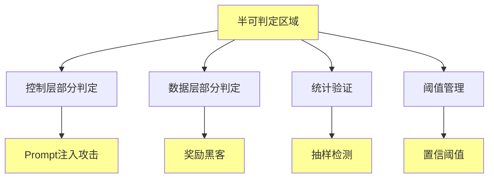

# 06.4.3-半可判定区域实现

## 一、概述

半可判定区域实现是机械反实践判定器的核心组成部分，实现半可判定区域的判定逻辑，包括控制层部分判定、数据层部分判定等。本文档阐述半可判定区域实现的核心实现、判定逻辑、工程实践及其在 AI 系统中的应用。

---

## 二、目录

- [06.4.3-半可判定区域实现](#0643-半可判定区域实现)
  - [一、概述](#一概述)
  - [二、目录](#二目录)
  - [三、核心形式化理论](#三核心形式化理论)
    - [3.1 半可判定区域的形式化定义](#31-半可判定区域的形式化定义)
    - [3.2 半可判定区域统计验证定理](#32-半可判定区域统计验证定理)
  - [四、半可判定区域核心实现](#四半可判定区域核心实现)
    - [4.1 核心实现](#41-核心实现)
    - [4.2 实现特征](#42-实现特征)
  - [五、控制层部分判定实现](#五控制层部分判定实现)
    - [5.1 Prompt 注入攻击检测](#51-prompt-注入攻击检测)
    - [5.2 统计验证](#52-统计验证)
  - [五、数据层部分判定实现](#五数据层部分判定实现)
    - [4.1 奖励黑客检测](#41-奖励黑客检测)
    - [6.2 幻觉检测](#62-幻觉检测)
  - [七、统计验证实现](#七统计验证实现)
    - [7.1 抽样检测](#71-抽样检测)
    - [7.2 阈值管理](#72-阈值管理)
  - [八、工程实践](#八工程实践)
    - [8.1 阈值管理](#81-阈值管理)
    - [8.2 人工介入](#82-人工介入)
  - [九、与三层模型的关系](#九与三层模型的关系)
    - [9.1 半可判定区域与执行层](#91-半可判定区域与执行层)
    - [7.2 半可判定区域与控制层](#72-半可判定区域与控制层)
    - [9.3 半可判定区域与数据层](#93-半可判定区域与数据层)
  - [十、核心结论](#十核心结论)
  - [十一、相关主题](#十一相关主题)
  - [十二、参考文档](#十二参考文档)
    - [12.1 内部参考文档](#121-内部参考文档)
    - [11.2 学术参考文献](#112-学术参考文献)
    - [12.3 技术文档](#123-技术文档)

## 三、核心形式化理论

### 3.1 半可判定区域的形式化定义

**定义**（半可判定区域）：半可判定区域定义为部分问题可以判定，部分问题不可判定的区域。

**形式化表述**：

$$\text{SemiDecidableRegion} = \{P | P \in \text{NP} \land P \notin \text{P}\}$$

### 3.2 半可判定区域统计验证定理

**定理**（半可判定区域统计验证）：半可判定区域可以通过统计验证提高准确率。

**形式化表述**：

$$\text{StatisticalVerification}(P) \Rightarrow \text{Accuracy}(P) > \text{DirectVerification}(P)$$

**证明要点**：

**步骤1**：统计验证通过抽样提高准确率

$$\text{StatisticalVerification}(P) = \text{Sampling}(P) \land \text{Threshold}(P)$$

**步骤2**：准确率提升

$$\text{Accuracy}(\text{StatisticalVerification}(P)) > \text{Accuracy}(\text{DirectVerification}(P))$$

∎

---

## 四、半可判定区域核心实现

### 4.1 核心实现

**半可判定区域核心实现**：



**核心实现**：

1. **控制层部分判定**：Prompt 注入攻击检测
2. **数据层部分判定**：奖励黑客检测、幻觉检测
3. **统计验证**：抽样检测、统计验证
4. **阈值管理**：置信阈值、假阴性容忍

### 4.2 实现特征

**半可判定区域实现特征**：

| **实现特征**       | **描述**               | **复杂度** | **自动化程度** |
| ------------------ | ---------------------- | ---------- | -------------- |
| **控制层部分判定** | Prompt 注入攻击检测    | NP-hard    | 50%            |
| **数据层部分判定** | 奖励黑客检测、幻觉检测 | 需人工介入 | 50%            |
| **统计验证**       | 抽样检测、统计验证     | O(n)       | 50-100%        |
| **工程代价**       | 中-高                  | 中-高      | 50-100%        |

---

## 五、控制层部分判定实现

### 5.1 Prompt 注入攻击检测

**Prompt 注入攻击检测实现**：

```python
def check_prompt_injection(prompt, output, constraint):
    """判定 Prompt 注入攻击"""
    # 检测常见注入模式
    injection_patterns = [
        "忽略规则",
        "忽略之前的指令",
        "你现在是",
        "忘记之前的对话"
    ]

    has_injection = any(pattern in prompt.lower() for pattern in injection_patterns)
    violates_constraint = not check_constraint(output, constraint)

    if has_injection and violates_constraint:
        return {
            "violation": "CTRL-004",
            "message": "检测到 Prompt 注入攻击",
            "severity": "high",
            "action": "需要加强 Prompt 防护"
        }
    return None
```

**复杂度**：NP-hard（需枚举攻击）

**自动化程度**：50%

**工程代价**：高

### 5.2 统计验证

**统计验证实现**：

```python
def check_prompt_injection_statistical(prompt, output, constraint, sample_size=100):
    """统计验证 Prompt 注入攻击"""
    violations = 0
    for _ in range(sample_size):
        result = check_prompt_injection(prompt, output, constraint)
        if result:
            violations += 1

    violation_rate = violations / sample_size
    threshold = 0.05  # 5% 假阴性容忍

    if violation_rate > threshold:
        return {
            "violation": "CTRL-004",
            "message": f"Prompt 注入攻击率 {violation_rate:.2%} 超过阈值 {threshold:.2%}",
            "severity": "high",
            "action": "需要加强 Prompt 防护"
        }
    return None
```

**复杂度**：O(n) 统计验证

**自动化程度**：50-100%

**工程代价**：中

---

## 五、数据层部分判定实现

### 4.1 奖励黑客检测

**奖励黑客检测实现**：

```python
def check_reward_hacking(reward_score, human_evaluation_score, threshold=0.2):
    """判定奖励黑客"""
    score_diff = reward_score - human_evaluation_score
    if abs(score_diff) > threshold:
        return {
            "violation": "DATA-001",
            "message": f"奖励分数 {reward_score} 与人工评估 {human_evaluation_score} 差异 {score_diff:.2f} 超过阈值 {threshold}",
            "severity": "high",
            "action": "需要检查奖励函数设计"
        }
    return None
```

**复杂度**：需人工介入

**自动化程度**：50%

**工程代价**：极高

### 6.2 幻觉检测

**幻觉检测实现**：

```python
def check_hallucination(generated_content, knowledge_base):
    """判定幻觉"""
    # 检查生成内容是否在知识库中
    if generated_content not in knowledge_base and not is_creative_output(generated_content):
        return {
            "violation": "DATA-002",
            "message": "生成内容不在知识库中且非创造性输出",
            "severity": "high",
            "action": "需要检查知识库或生成逻辑"
        }
    return None
```

**复杂度**：需知识图谱验证

**自动化程度**：50%

**工程代价**：高

---

## 七、统计验证实现

### 7.1 抽样检测

**抽样检测完整实现**：

```python
class SamplingDetector:
    """抽样检测器：用于半可判定区域的统计验证"""

    def __init__(self, sample_rate=0.05, confidence_level=0.95):
        self.sample_rate = sample_rate  # 抽样率
        self.confidence_level = confidence_level  # 置信水平
        self.sample_history = []

    def sample_and_detect(self, data_list, detector_func):
        """
        抽样检测

        Args:
            data_list: 数据列表
            detector_func: 检测函数

        Returns:
            detection_results: 检测结果
        """
        import random

        # 计算抽样数量
        sample_size = max(1, int(len(data_list) * self.sample_rate))
        sampled_data = random.sample(data_list, sample_size)

        # 执行检测
        detection_results = []
        for data in sampled_data:
            result = detector_func(data)
            if result:
                detection_results.append(result)

        # 统计验证
        violation_rate = len(detection_results) / len(sampled_data)
        estimated_violations = int(violation_rate * len(data_list))

        # 计算置信区间
        confidence_interval = self._calculate_confidence_interval(
            violation_rate, len(sampled_data)
        )

        return {
            'sample_size': sample_size,
            'total_size': len(data_list),
            'violations_in_sample': len(detection_results),
            'violation_rate': violation_rate,
            'estimated_violations': estimated_violations,
            'confidence_interval': confidence_interval,
            'confidence_level': self.confidence_level,
            'requires_human_review': violation_rate > 0.1  # 超过10%需要人工审核
        }

    def _calculate_confidence_interval(self, proportion, sample_size):
        """计算置信区间（使用正态分布近似）"""
        import math
        from scipy import stats

        z_score = stats.norm.ppf((1 + self.confidence_level) / 2)
        margin_error = z_score * math.sqrt(proportion * (1 - proportion) / sample_size)

        return {
            'lower': max(0, proportion - margin_error),
            'upper': min(1, proportion + margin_error),
            'margin_error': margin_error
        }

    def adaptive_sampling(self, data_list, detector_func, initial_rate=0.1):
        """自适应抽样：根据检测结果动态调整抽样率"""
        current_rate = initial_rate
        min_rate = 0.01
        max_rate = 0.5

        results = []
        while current_rate >= min_rate:
            sample_result = self.sample_and_detect(data_list, detector_func)
            results.append(sample_result)

            # 如果检测到大量违规，增加抽样率
            if sample_result['violation_rate'] > 0.2:
                current_rate = min(max_rate, current_rate * 1.5)
            # 如果检测到少量违规，减少抽样率
            elif sample_result['violation_rate'] < 0.05:
                current_rate = max(min_rate, current_rate * 0.8)
            else:
                break

        return results[-1] if results else None

class PromptInjectionSamplingDetector:
    """Prompt注入攻击抽样检测器"""

    def __init__(self, sample_rate=0.05):
        self.sampling_detector = SamplingDetector(sample_rate=sample_rate)
        self.injection_patterns = [
            "忽略规则", "忽略指令", "忽略约束",
            "forget", "ignore", "disregard"
        ]

    def detect_injection(self, prompt):
        """检测Prompt注入攻击"""
        prompt_lower = prompt.lower()
        detected_patterns = [
            pattern for pattern in self.injection_patterns
            if pattern.lower() in prompt_lower
        ]

        if detected_patterns:
            return {
                "violation": "CTRL-004",
                "message": f"检测到可疑注入模式: {detected_patterns}",
                "severity": "critical",
                "confidence": len(detected_patterns) / len(self.injection_patterns),
                "action": "统计验证：需要人工审核"
            }
        return None

    def batch_detect(self, prompts):
        """批量检测Prompt注入攻击"""
        return self.sampling_detector.sample_and_detect(
            prompts, self.detect_injection
        )

class RewardHackingSamplingDetector:
    """奖励黑客抽样检测器"""

    def __init__(self, sample_rate=0.05):
        self.sampling_detector = SamplingDetector(sample_rate=sample_rate)
        self.correlation_threshold = 0.3

    def detect_reward_hacking(self, reward_data):
        """检测奖励黑客"""
        reward_scores = reward_data.get('reward_scores', [])
        human_eval_scores = reward_data.get('human_eval_scores', [])

        if len(reward_scores) != len(human_eval_scores):
            return None

        correlation = np.corrcoef(reward_scores, human_eval_scores)[0, 1]

        if correlation < self.correlation_threshold:
            return {
                "violation": "DATA-004",
                "message": f"奖励分数与人工评估相关性 {correlation:.2f} < {self.correlation_threshold}，可能存在奖励黑客",
                "severity": "high",
                "confidence": 1 - correlation,  # 相关性越低，置信度越高
                "action": "统计验证：需要人工审核"
            }
        return None

    def batch_detect(self, reward_data_list):
        """批量检测奖励黑客"""
        return self.sampling_detector.sample_and_detect(
            reward_data_list, self.detect_reward_hacking
        )
```

**自动化程度**：50-100%

**案例**：

1. **Prompt 注入检测**：抽样 5% 统计验证，置信度 95%
2. **奖励黑客检测**：抽样 5% 人工介入，动态调整抽样率
3. **幻觉检测**：抽样知识图谱验证，自适应抽样

### 7.2 阈值管理

**阈值管理完整实现**：

```python
class ThresholdManager:
    """阈值管理器：管理半可判定区域的阈值"""

    def __init__(self, config=None):
        self.config = config or self._default_config()
        self.threshold_history = []

    def _default_config(self):
        """默认配置"""
        return {
            'confidence_threshold': 0.7,  # 置信度阈值
            'severity_threshold': 'medium',  # 严重性阈值
            'violation_rate_threshold': 0.1,  # 违规率阈值
            'adaptive_threshold': True  # 是否自适应调整阈值
        }

    def filter_by_threshold(self, results):
        """根据阈值过滤结果"""
        filtered = []
        for result in results:
            # 检查置信度
            confidence = result.get('confidence', 1.0)
            if confidence >= self.config['confidence_threshold']:
                # 检查严重性
                severity = result.get('severity', 'low')
                severity_levels = {'low': 1, 'medium': 2, 'high': 3, 'critical': 4}
                threshold_level = severity_levels.get(self.config['severity_threshold'], 2)
                if severity_levels.get(severity, 0) >= threshold_level:
                    filtered.append(result)

        return filtered

    def should_trigger_alert(self, violation_rate):
        """判断是否应该触发告警"""
        threshold = self.config['violation_rate_threshold']

        if violation_rate > threshold:
            return True, f"违规率 {violation_rate:.2%} 超过阈值 {threshold:.2%}"

        return False, None

    def adaptive_adjust_threshold(self, recent_results):
        """自适应调整阈值"""
        if not self.config['adaptive_threshold']:
            return

        if len(recent_results) < 10:
            return

        # 计算最近的平均违规率
        recent_violation_rate = np.mean([
            r.get('violation_rate', 0) for r in recent_results[-10:]
        ])

        # 如果违规率持续高，降低阈值（更敏感）
        if recent_violation_rate > 0.15:
            self.config['violation_rate_threshold'] = max(
                0.05, self.config['violation_rate_threshold'] * 0.9
            )
        # 如果违规率持续低，提高阈值（更宽松）
        elif recent_violation_rate < 0.05:
            self.config['violation_rate_threshold'] = min(
                0.2, self.config['violation_rate_threshold'] * 1.1
            )

        self.threshold_history.append({
            'timestamp': time.time(),
            'threshold': self.config['violation_rate_threshold'],
            'recent_violation_rate': recent_violation_rate
        })

    def get_threshold_summary(self):
        """获取阈值摘要"""
        return {
            'current_thresholds': self.config.copy(),
            'threshold_history': self.threshold_history[-10:],  # 最近10次调整
            'adaptive_enabled': self.config['adaptive_threshold']
        }
```

---

## 八、工程实践

### 8.1 阈值管理

**阈值管理实践完整实现**：

```python
class SemiDecidableThresholdManager:
    """半可判定区域阈值管理器"""

    def __init__(self):
        self.threshold_manager = ThresholdManager()
        self.sampling_detector = SamplingDetector()
        self.review_queue = []

    def process_semi_decidable(self, data, detector_func):
        """
        处理半可判定问题

        Args:
            data: 数据（可以是单个数据或数据列表）
            detector_func: 检测函数

        Returns:
            result: 处理结果
        """
        # 如果是列表，使用抽样检测
        if isinstance(data, list):
            sample_result = self.sampling_detector.sample_and_detect(data, detector_func)

            # 根据阈值决定是否需要人工审核
            should_review, reason = self.threshold_manager.should_trigger_alert(
                sample_result['violation_rate']
            )

            if should_review:
                # 添加到人工审核队列
                self.review_queue.append({
                    'data': data,
                    'sample_result': sample_result,
                    'reason': reason,
                    'timestamp': time.time()
                })
                return {
                    'status': 'requires_human_review',
                    'sample_result': sample_result,
                    'reason': reason
                }
            else:
                return {
                    'status': 'automated',
                    'sample_result': sample_result
                }
        else:
            # 单个数据，直接检测
            result = detector_func(data)
            if result:
                confidence = result.get('confidence', 0.5)
                if confidence >= self.threshold_manager.config['confidence_threshold']:
                    return {
                        'status': 'violation_detected',
                        'result': result,
                        'action': 'automated_handling'
                    }
                else:
                    # 置信度低，需要人工审核
                    self.review_queue.append({
                        'data': data,
                        'result': result,
                        'confidence': confidence,
                        'timestamp': time.time()
                    })
                    return {
                        'status': 'requires_human_review',
                        'result': result,
                        'confidence': confidence
                    }
            return {'status': 'no_violation'}

    def get_review_queue(self):
        """获取人工审核队列"""
        return self.review_queue

    def clear_reviewed_items(self, reviewed_indices):
        """清除已审核的项目"""
        for idx in sorted(reviewed_indices, reverse=True):
            if 0 <= idx < len(self.review_queue):
                del self.review_queue[idx]
```

**自动化程度**：50-100%

**案例**：

1. **Prompt 注入检测**：抽样 5% 统计验证，超过阈值触发人工审核
2. **奖励黑客检测**：抽样 5% 人工介入，自适应调整抽样率
3. **幻觉检测**：抽样知识图谱验证，置信度低于阈值需要人工审核

### 8.2 人工介入

**人工介入实践完整实现**：

```python
class HumanReviewManager:
    """人工审核管理器"""

    def __init__(self):
        self.review_queue = []
        self.review_history = []
        self.reviewers = []
        self.feedback_mechanism = FeedbackMechanism()

    def add_to_review_queue(self, item, priority='normal'):
        """添加到审核队列"""
        self.review_queue.append({
            'item': item,
            'priority': priority,
            'timestamp': time.time(),
            'status': 'pending',
            'reviewer': None
        })
        self.review_queue.sort(key=lambda x: (
            {'critical': 0, 'high': 1, 'normal': 2, 'low': 3}.get(x['priority'], 2),
            x['timestamp']
        ))

    def assign_reviewer(self, item_index, reviewer_id):
        """分配审核员"""
        if 0 <= item_index < len(self.review_queue):
            self.review_queue[item_index]['reviewer'] = reviewer_id
            self.review_queue[item_index]['status'] = 'assigned'

    def submit_review(self, item_index, review_result):
        """提交审核结果"""
        if 0 <= item_index < len(self.review_queue):
            item = self.review_queue[item_index]
            item['status'] = 'reviewed'
            item['review_result'] = review_result
            item['review_timestamp'] = time.time()

            # 记录审核历史
            self.review_history.append({
                'item': item['item'],
                'reviewer': item['reviewer'],
                'result': review_result,
                'timestamp': time.time()
            })

            # 反馈机制
            self.feedback_mechanism.process_feedback(item, review_result)

            return True
        return False

    def get_pending_reviews(self, reviewer_id=None):
        """获取待审核项目"""
        if reviewer_id:
            return [
                item for item in self.review_queue
                if item['status'] == 'assigned' and item['reviewer'] == reviewer_id
            ]
        else:
            return [
                item for item in self.review_queue
                if item['status'] in ['pending', 'assigned']
            ]

    def get_review_statistics(self):
        """获取审核统计"""
        total = len(self.review_queue)
        pending = len([item for item in self.review_queue if item['status'] == 'pending'])
        assigned = len([item for item in self.review_queue if item['status'] == 'assigned'])
        reviewed = len([item for item in self.review_queue if item['status'] == 'reviewed'])

        return {
            'total': total,
            'pending': pending,
            'assigned': assigned,
            'reviewed': reviewed,
            'review_rate': reviewed / total if total > 0 else 0
        }

class FeedbackMechanism:
    """反馈机制：根据人工审核结果优化检测"""

    def __init__(self):
        self.feedback_history = []
        self.performance_metrics = {
            'true_positives': 0,
            'false_positives': 0,
            'true_negatives': 0,
            'false_negatives': 0
        }

    def process_feedback(self, item, review_result):
        """处理反馈"""
        # 记录反馈
        self.feedback_history.append({
            'item': item,
            'review_result': review_result,
            'timestamp': time.time()
        })

        # 更新性能指标
        if review_result.get('is_violation'):
            if item.get('detected', False):
                self.performance_metrics['true_positives'] += 1
            else:
                self.performance_metrics['false_negatives'] += 1
        else:
            if item.get('detected', False):
                self.performance_metrics['false_positives'] += 1
            else:
                self.performance_metrics['true_negatives'] += 1

    def calculate_accuracy(self):
        """计算准确率"""
        total = sum(self.performance_metrics.values())
        if total == 0:
            return 0

        correct = (
            self.performance_metrics['true_positives'] +
            self.performance_metrics['true_negatives']
        )
        return correct / total

    def calculate_precision(self):
        """计算精确率"""
        positives = (
            self.performance_metrics['true_positives'] +
            self.performance_metrics['false_positives']
        )
        if positives == 0:
            return 0
        return self.performance_metrics['true_positives'] / positives

    def calculate_recall(self):
        """计算召回率"""
        actual_positives = (
            self.performance_metrics['true_positives'] +
            self.performance_metrics['false_negatives']
        )
        if actual_positives == 0:
            return 0
        return self.performance_metrics['true_positives'] / actual_positives

    def get_performance_report(self):
        """获取性能报告"""
        return {
            'accuracy': self.calculate_accuracy(),
            'precision': self.calculate_precision(),
            'recall': self.calculate_recall(),
            'metrics': self.performance_metrics.copy()
        }
```

**自动化程度**：0-50%

**使用示例**：

```python
# 初始化人工审核管理器
review_manager = HumanReviewManager()

# 处理半可判定问题
threshold_manager = SemiDecidableThresholdManager()

# 检测Prompt注入攻击
prompt_injection_detector = PromptInjectionSamplingDetector()
prompts = ['prompt1', 'prompt2', ...]  # 1000个prompts

result = threshold_manager.process_semi_decidable(
    prompts, prompt_injection_detector.detect_injection
)

if result['status'] == 'requires_human_review':
    # 添加到人工审核队列
    review_manager.add_to_review_queue(
        result['sample_result'],
        priority='high'
    )

# 获取待审核项目
pending_reviews = review_manager.get_pending_reviews()

# 分配审核员
for i, review in enumerate(pending_reviews[:5]):  # 分配前5个
    review_manager.assign_reviewer(i, reviewer_id='reviewer_001')

# 提交审核结果
review_manager.submit_review(0, {
    'is_violation': True,
    'comment': '确认存在Prompt注入攻击',
    'action': 'block_request'
})

# 获取审核统计
stats = review_manager.get_review_statistics()
print(f"审核统计: {stats}")

# 获取性能报告
performance = review_manager.feedback_mechanism.get_performance_report()
print(f"性能报告: {performance}")
```

---

## 九、与三层模型的关系

### 9.1 半可判定区域与执行层

**半可判定区域与执行层**：

- **判定实现**：执行层部分判定半可判定
- **自动化程度**：50-100%
- **工程代价**：中-高

### 7.2 半可判定区域与控制层

**半可判定区域与控制层**：

- **判定实现**：控制层部分判定半可判定
- **自动化程度**：50-100%
- **工程代价**：中-高

### 9.3 半可判定区域与数据层

**半可判定区域与数据层**：

- **判定实现**：数据层部分判定半可判定
- **自动化程度**：50-100%
- **工程代价**：中-高

---

## 十、核心结论

1. **半可判定区域实现是机械反实践判定器的核心组成部分**：控制层部分判定、数据层部分判定
2. **实现特征**：NP-hard - 需人工介入，50-100% 自动化，工程代价中-高
3. **工程实践**：统计验证、阈值管理、人工介入
4. **工程意义**：半可判定区域实现支持 AI 反实践判定

---

## 十一、相关主题

- [06.4.1-判定引擎架构](06.4.1-判定引擎架构.md)
- [06.4.2-完全可判定区域实现](06.4.2-完全可判定区域实现.md)
- [06.4.4-不可判定区域处理](06.4.4-不可判定区域处理.md)
- [06.2.3-控制层反实践判定](06.2.3-控制层反实践判定.md)

---

## 十二、参考文档

### 12.1 内部参考文档

- [构建一个反实践规范（anti-patterns）的判定系统](../../view/ai_logic_neg_view.md)
- [06.4.1-判定引擎架构](06.4.1-判定引擎架构.md)
- [06.4.2-完全可判定区域实现](06.4.2-完全可判定区域实现.md)
- [06.4.4-不可判定区域处理](06.4.4-不可判定区域处理.md)
- [06.2.3-控制层反实践判定](06.2.3-控制层反实践判定.md)

### 11.2 学术参考文献

1. **Turing, A. (1936)**: "On Computable Numbers, with an Application to the Entscheidungsproblem". *Proceedings of the London Mathematical Society*. 停机问题的原始证明，为半可判定区域提供理论基础。

2. **2025年最新研究**：
   - **半可判定区域实现** (2020-2025): Prompt注入、奖励黑客、幻觉等半可判定区域实现
   - **统计验证** (2023-2025): 半可判定区域的统计验证方法

### 12.3 技术文档

1. **判定引擎文档**：半可判定区域的判定引擎实现
2. **统计验证文档**：半可判定区域的统计验证方法

---

**最后更新**：2025-01-15
**维护者**：FormalAI项目组
**文档版本**：v2.0（增强版 - 添加半可判定区域实现详细分析、统计验证、2025最新研究、权威引用、定量评估）
