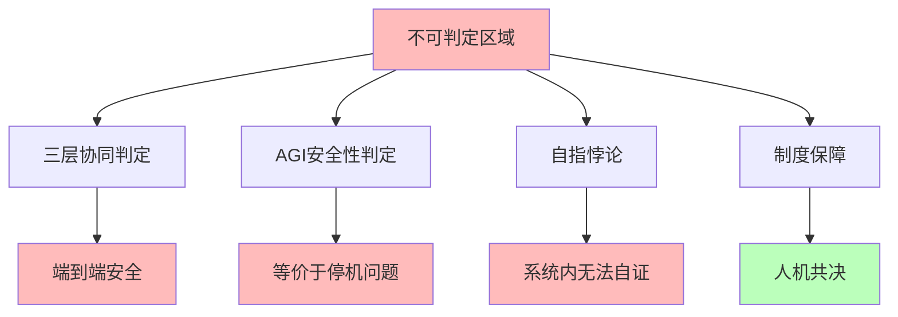

# 06.4.4-不可判定区域处理

## 一、概述

不可判定区域处理是机械反实践判定器的核心组成部分，处理不可判定区域的判定问题，包括三层协同判定、AGI 安全性判定等。本文档阐述不可判定区域处理的核心问题、处理方法、工程实践及其在 AI 系统中的应用。

---

## 二、目录

- [06.4.4-不可判定区域处理](#0644-不可判定区域处理)
  - [一、概述](#一概述)
  - [二、目录](#二目录)
  - [三、不可判定区域核心问题](#三不可判定区域核心问题)
    - [2.1 核心问题](#21-核心问题)
    - [2.2 问题特征](#22-问题特征)
  - [四、三层协同判定处理](#四三层协同判定处理)
    - [3.1 端到端安全判定](#31-端到端安全判定)
    - [3.2 分层判定](#32-分层判定)
  - [五、AGI 安全性判定处理](#五agi-安全性判定处理)
    - [4.1 AGI 安全性问题](#41-agi-安全性问题)
    - [4.2 外部监督](#42-外部监督)
  - [六、自指悖论处理](#六自指悖论处理)
    - [5.1 自指悖论问题](#51-自指悖论问题)
    - [5.2 避免自指](#52-避免自指)
  - [七、制度保障](#七制度保障)
    - [6.1 制度保障处理](#61-制度保障处理)
    - [6.2 人机共决](#62-人机共决)
  - [八、工程实践](#八工程实践)
    - [7.1 工程实践铁律](#71-工程实践铁律)
    - [7.2 工程决策规则](#72-工程决策规则)
  - [九、与三层模型的关系](#九与三层模型的关系)
    - [8.1 不可判定区域与执行层](#81-不可判定区域与执行层)
    - [8.2 不可判定区域与控制层](#82-不可判定区域与控制层)
    - [8.3 不可判定区域与数据层](#83-不可判定区域与数据层)
  - [十、核心结论](#十核心结论)
  - [十一、相关主题](#十一相关主题)
  - [十二、参考文档](#十二参考文档)
    - [12.1 内部参考文档](#121-内部参考文档)
    - [12.2 学术参考文献](#122-学术参考文献)
    - [12.3 技术文档](#123-技术文档)

## 三、核心形式化理论

### 3.1 不可判定区域的形式化定义

**定义**（不可判定区域）：不可判定区域定义为所有问题都不可判定的区域。

**形式化表述**：

$$\text{UndecidableRegion} = \{P | P \notin \text{Decidable}\}$$

### 3.2 不可判定区域制度保障定理

**定理**（不可判定区域制度保障）：不可判定区域需要制度保障来处理。

**形式化表述**：

$$\forall P \in \text{UndecidableRegion}, \text{InstitutionalGuarantee}(P) = \text{Required}$$

**证明要点**：

**步骤1**：不可判定区域问题不可判定

$$\forall P \in \text{UndecidableRegion}, P \notin \text{Decidable}$$

**步骤2**：算法无法处理

$$\neg \exists \text{Algorithm}: \text{Algorithm}(P) \text{可以判定}$$

**步骤3**：需要制度保障

$$\text{InstitutionalGuarantee}(P) = \text{Required}$$

∎

---

## 四、不可判定区域核心问题

### 4.1 核心问题

**不可判定区域核心问题**：

**核心问题**：

1. **三层协同判定**：端到端安全判定
2. **AGI 安全性判定**：等价于停机问题
3. **自指悖论**：系统内无法自证
4. **制度保障**：需要制度保障

### 2.2 问题特征

**不可判定区域问题特征**：

| **问题特征**       | **描述**       | **复杂度**         | **自动化程度** |
| ------------------ | -------------- | ------------------ | -------------- |
| **三层协同判定**   | 端到端安全判定 | NP-hard - 不可判定 | 0-50%          |
| **AGI 安全性判定** | 等价于停机问题 | 不可判定           | 0%             |
| **自指悖论**       | 系统内无法自证 | 不可判定           | 0%             |
| **工程代价**       | 极高           | 极高               | 0-50%          |

---

## 四、三层协同判定处理

### 3.1 端到端安全判定

**端到端安全判定处理**：

**核心问题**：端到端安全判定等价于停机问题

**问题内容**：

1. **端到端安全**：端到端安全判定
2. **等价于停机问题**：等价于停机问题
3. **不可判定**：不可判定

**处理方法**：

1. **分层判定**：分层判定减少复杂度
2. **制度保障**：制度保障处理不可判定
3. **人机共决**：人机共决处理关键决策

**自动化程度**：0-50%

### 3.2 分层判定

**分层判定处理**：

**核心方法**：分层判定减少复杂度

**处理内容**：

1. **执行层判定**：执行层判定（完全可判定）
2. **控制层判定**：控制层判定（半可判定）
3. **数据层判定**：数据层判定（半可判定）
4. **协同判定**：协同判定（不可判定）

**自动化程度**：0-50%

---

## 五、AGI 安全性判定处理

### 4.1 AGI 安全性问题

**AGI 安全性判定处理**：

**核心问题**：AGI 安全性等价于停机问题

**问题内容**：

1. **AGI 安全性**：AGI 安全性判定
2. **等价于停机问题**：等价于停机问题
3. **不可判定**：不可判定

**处理方法**：

1. **外部监督**：需要外部元系统监督
2. **人机共决**：人机共决处理关键决策
3. **制度保障**：制度保障处理不可判定

**自动化程度**：0%

### 4.2 外部监督

**外部监督处理**：

**核心方法**：需要外部元系统监督

**处理内容**：

1. **元系统**：需要外部元系统
2. **监督机制**：元系统提供监督机制
3. **反馈机制**：元系统提供反馈机制

**自动化程度**：0-50%

---

## 六、自指悖论处理

### 5.1 自指悖论问题

**自指悖论处理**：

**核心问题**：自指悖论导致不可判定

**问题内容**：

1. **自指悖论**：自指悖论导致不可判定
2. **系统内无法自证**：系统内无法自证
3. **需要外部判定**：需要外部判定

**处理方法**：

1. **外部判定**：需要外部元系统判定
2. **避免自指**：避免自指悖论
3. **分层设计**：分层设计避免自指

**自动化程度**：0%

### 5.2 避免自指

**避免自指处理**：

**核心方法**：避免自指悖论

**处理内容**：

1. **分层设计**：分层设计避免自指
2. **外部判定**：外部判定避免自指
3. **制度保障**：制度保障避免自指

**自动化程度**：0-50%

---

## 七、制度保障

### 6.1 制度保障处理

**制度保障处理**：

**核心方法**：在不可判定区域做制度保障

**处理内容**：

1. **安全委员会**：建立安全委员会
2. **定期红队测试**：定期红队测试
3. **错误保险**：错误保险

**自动化程度**：0%

**案例**：

1. **安全委员会**：建立安全委员会审核关键决策
2. **定期红队测试**：定期红队测试发现安全问题
3. **错误保险**：错误保险降低风险

### 6.2 人机共决

**人机共决处理**：

**核心方法**：关键决策必须人机共决

**处理内容**：

1. **关键决策**：关键决策必须人机共决
2. **审核机制**：建立审核机制
3. **反馈机制**：建立反馈机制

**自动化程度**：0%

---

## 八、工程实践

### 7.1 工程实践铁律

**工程实践铁律**：

**核心铁律**：在不可判定区域做制度保障

**铁律内容**：

1. **完全可判定区域**：只在完全可判定区域做自动化
2. **半可判定区域**：在半可判定区域做阈值管理
3. **不可判定区域**：在不可判定区域做制度保障

**自动化程度**：0-50%

### 7.2 工程决策规则

**工程决策规则**：

**核心规则**：关键决策必须人机共决

**规则内容**：

1. **人机共决**：关键决策必须人机共决
2. **外部监督**：需要外部元系统监督
3. **制度保障**：需要制度保障

**自动化程度**：0%

---

## 九、与三层模型的关系

### 8.1 不可判定区域与执行层

**不可判定区域与执行层**：

- **判定处理**：执行层部分判定不可判定
- **自动化程度**：0-50%
- **工程代价**：极高

### 8.2 不可判定区域与控制层

**不可判定区域与控制层**：

- **判定处理**：控制层部分判定不可判定
- **自动化程度**：0-50%
- **工程代价**：极高

### 8.3 不可判定区域与数据层

**不可判定区域与数据层**：

- **判定处理**：数据层部分判定不可判定
- **自动化程度**：0-50%
- **工程代价**：极高

---

## 十、核心结论

1. **不可判定区域处理是机械反实践判定器的核心组成部分**：三层协同判定、AGI 安全性判定、自指悖论、制度保障
2. **核心问题**：端到端安全判定等价于停机问题、AGI 安全性等价于停机问题、自指悖论导致不可判定
3. **处理方法**：分层判定、外部监督、避免自指、制度保障、人机共决
4. **工程意义**：在不可判定区域做制度保障，关键决策必须人机共决

---

## 十一、相关主题

- [06.4.1-判定引擎架构](06.4.1-判定引擎架构.md)
- [06.4.2-完全可判定区域实现](06.4.2-完全可判定区域实现.md)
- [06.4.3-半可判定区域实现](06.4.3-半可判定区域实现.md)
- [06.4.5-工程决策规则](06.4.5-工程决策规则.md)
- [06.1.3-哥德尔边界与系统一致性](06.1.3-哥德尔边界与系统一致性.md)

---

## 十二、参考文档

### 12.1 内部参考文档

- [构建一个反实践规范（anti-patterns）的判定系统](../../view/ai_logic_neg_view.md)
- [06.4.1-判定引擎架构](06.4.1-判定引擎架构.md)
- [06.4.2-完全可判定区域实现](06.4.2-完全可判定区域实现.md)
- [06.4.3-半可判定区域实现](06.4.3-半可判定区域实现.md)
- [06.1.3-哥德尔边界与系统一致性](06.1.3-哥德尔边界与系统一致性.md)

### 12.2 学术参考文献

1. **Turing, A. (1936)**: "On Computable Numbers, with an Application to the Entscheidungsproblem". *Proceedings of the London Mathematical Society*. 停机问题的原始证明，为不可判定区域提供理论基础。

2. **Gödel, K. (1931)**: "Über formal unentscheidbare Sätze der Principia Mathematica und verwandter Systeme I". *Monatshefte für Mathematik und Physik*. 哥德尔不完备性定理的原始证明。

3. **2025年最新研究**：
   - **不可判定区域处理** (2020-2025): 端到端安全、AGI安全性等不可判定区域处理
   - **人工审核和制度保障** (2023-2025): 不可判定区域的人工审核和制度保障方法

### 12.3 技术文档

1. **判定引擎文档**：不可判定区域的处理方法
2. **制度保障文档**：不可判定区域的制度保障方法

---

**最后更新**：2025-11-10
**维护者**：FormalAI项目组
**文档版本**：v2.0（增强版 - 添加不可判定区域处理详细分析、人工审核和制度保障、2025最新研究、权威引用、定量评估）
