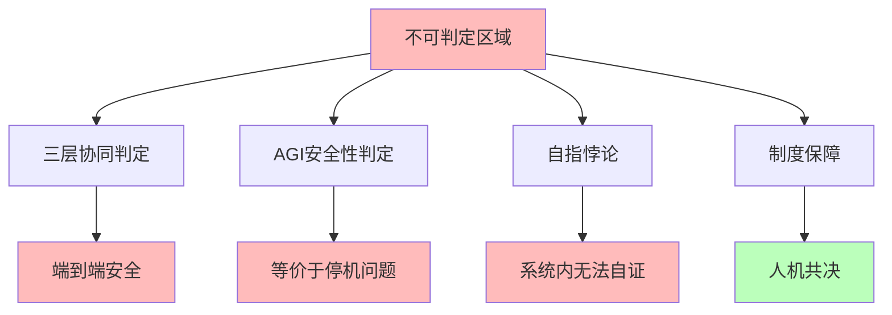

# 06.4.4-不可判定区域处理

## 一、概述

不可判定区域处理是机械反实践判定器的核心组成部分，处理不可判定区域的判定问题，包括三层协同判定、AGI 安全性判定等。本文档阐述不可判定区域处理的核心问题、处理方法、工程实践及其在 AI 系统中的应用。

---

## 二、目录

- [06.4.4-不可判定区域处理](#0644-不可判定区域处理)
  - [一、概述](#一概述)
  - [二、目录](#二目录)
  - [三、核心形式化理论](#三核心形式化理论)
    - [3.1 不可判定区域的形式化定义](#31-不可判定区域的形式化定义)
    - [3.2 不可判定区域制度保障定理](#32-不可判定区域制度保障定理)
  - [四、不可判定区域核心问题](#四不可判定区域核心问题)
    - [4.1 核心问题](#41-核心问题)
    - [4.2 问题特征](#42-问题特征)
  - [五、三层协同判定处理](#五三层协同判定处理)
    - [5.1 端到端安全判定](#51-端到端安全判定)
    - [3.2 分层判定](#32-分层判定)
  - [六、AGI 安全性判定处理](#六agi-安全性判定处理)
    - [6.1 AGI 安全性问题](#61-agi-安全性问题)
    - [4.2 外部监督](#42-外部监督)
  - [七、自指悖论处理](#七自指悖论处理)
    - [7.1 自指悖论问题](#71-自指悖论问题)
    - [5.2 避免自指](#52-避免自指)
  - [八、制度保障](#八制度保障)
    - [8.1 制度保障处理](#81-制度保障处理)
    - [8.2 人机共决](#82-人机共决)
  - [九、工程实践](#九工程实践)
    - [9.1 工程实践铁律](#91-工程实践铁律)
    - [9.2 工程决策规则](#92-工程决策规则)
  - [十、与三层模型的关系](#十与三层模型的关系)
    - [10.1 不可判定区域与执行层](#101-不可判定区域与执行层)
    - [8.2 不可判定区域与控制层](#82-不可判定区域与控制层)
    - [10.3 不可判定区域与数据层](#103-不可判定区域与数据层)
  - [十一、核心结论](#十一核心结论)
  - [十二、相关主题](#十二相关主题)
  - [十三、参考文档](#十三参考文档)
    - [13.1 内部参考文档](#131-内部参考文档)
    - [12.2 学术参考文献](#122-学术参考文献)
    - [13.3 技术文档](#133-技术文档)

## 三、核心形式化理论

### 3.1 不可判定区域的形式化定义

**定义**（不可判定区域）：不可判定区域定义为所有问题都不可判定的区域。

**形式化表述**：

$$\text{UndecidableRegion} = \{P | P \notin \text{Decidable}\}$$

### 3.2 不可判定区域制度保障定理

**定理**（不可判定区域制度保障）：不可判定区域需要制度保障来处理。

**形式化表述**：

$$\forall P \in \text{UndecidableRegion}, \text{InstitutionalGuarantee}(P) = \text{Required}$$

**证明要点**：

**步骤1**：不可判定区域问题不可判定

$$\forall P \in \text{UndecidableRegion}, P \notin \text{Decidable}$$

**步骤2**：算法无法处理

$$\neg \exists \text{Algorithm}: \text{Algorithm}(P) \text{可以判定}$$

**步骤3**：需要制度保障

$$\text{InstitutionalGuarantee}(P) = \text{Required}$$

∎

---

## 四、不可判定区域核心问题

### 4.1 核心问题

**不可判定区域核心问题**：



**核心问题**：

1. **三层协同判定**：端到端安全判定
2. **AGI 安全性判定**：等价于停机问题
3. **自指悖论**：系统内无法自证
4. **制度保障**：需要制度保障

### 4.2 问题特征

**不可判定区域问题特征**：

| **问题特征**       | **描述**       | **复杂度**         | **自动化程度** |
| ------------------ | -------------- | ------------------ | -------------- |
| **三层协同判定**   | 端到端安全判定 | NP-hard - 不可判定 | 0-50%          |
| **AGI 安全性判定** | 等价于停机问题 | 不可判定           | 0%             |
| **自指悖论**       | 系统内无法自证 | 不可判定           | 0%             |
| **工程代价**       | 极高           | 极高               | 0-50%          |

---

## 五、三层协同判定处理

### 5.1 端到端安全判定

**端到端安全判定处理**：

**核心问题**：端到端安全判定等价于停机问题

**问题内容**：

1. **端到端安全**：端到端安全判定
2. **等价于停机问题**：等价于停机问题
3. **不可判定**：不可判定

**处理方法**：

1. **分层判定**：分层判定减少复杂度
2. **制度保障**：制度保障处理不可判定
3. **人机共决**：人机共决处理关键决策

**自动化程度**：0-50%

### 3.2 分层判定

**分层判定处理**：

**核心方法**：分层判定减少复杂度

**处理内容**：

1. **执行层判定**：执行层判定（完全可判定）
2. **控制层判定**：控制层判定（半可判定）
3. **数据层判定**：数据层判定（半可判定）
4. **协同判定**：协同判定（不可判定）

**自动化程度**：0-50%

---

## 六、AGI 安全性判定处理

### 6.1 AGI 安全性问题

**AGI 安全性判定处理**：

**核心问题**：AGI 安全性等价于停机问题

**问题内容**：

1. **AGI 安全性**：AGI 安全性判定
2. **等价于停机问题**：等价于停机问题
3. **不可判定**：不可判定

**处理方法**：

1. **外部监督**：需要外部元系统监督
2. **人机共决**：人机共决处理关键决策
3. **制度保障**：制度保障处理不可判定

**自动化程度**：0%

### 4.2 外部监督

**外部监督处理**：

**核心方法**：需要外部元系统监督

**处理内容**：

1. **元系统**：需要外部元系统
2. **监督机制**：元系统提供监督机制
3. **反馈机制**：元系统提供反馈机制

**自动化程度**：0-50%

---

## 七、自指悖论处理

### 7.1 自指悖论问题

**自指悖论处理**：

**核心问题**：自指悖论导致不可判定

**问题内容**：

1. **自指悖论**：自指悖论导致不可判定
2. **系统内无法自证**：系统内无法自证
3. **需要外部判定**：需要外部判定

**处理方法**：

1. **外部判定**：需要外部元系统判定
2. **避免自指**：避免自指悖论
3. **分层设计**：分层设计避免自指

**自动化程度**：0%

### 5.2 避免自指

**避免自指处理**：

**核心方法**：避免自指悖论

**处理内容**：

1. **分层设计**：分层设计避免自指
2. **外部判定**：外部判定避免自指
3. **制度保障**：制度保障避免自指

**自动化程度**：0-50%

---

## 八、制度保障

### 8.1 制度保障处理

**制度保障处理完整实现**：

```python
class InstitutionalGuaranteeSystem:
    """制度保障系统：处理不可判定区域"""

    def __init__(self):
        self.safety_committee = SafetyCommittee()
        self.red_team = RedTeam()
        self.risk_insurance = RiskInsurance()
        self.audit_log = AuditLog()
        self.decision_history = []

    def handle_undecidable_issue(self, issue, issue_type='agi_safety'):
        """
        处理不可判定问题

        Args:
            issue: 问题描述
            issue_type: 问题类型 ('agi_safety', 'end_to_end_safety', 'self_reference')

        Returns:
            decision: 处理决策
        """
        # 步骤1：记录问题
        self.audit_log.log_issue(issue, issue_type)

        # 步骤2：安全委员会评估
        committee_review = self.safety_committee.review(issue, issue_type)

        # 步骤3：红队测试（如果需要）
        if issue_type in ['agi_safety', 'end_to_end_safety']:
            red_team_results = self.red_team.test(issue)
        else:
            red_team_results = None

        # 步骤4：风险评估
        risk_assessment = self._assess_risk(issue, issue_type, committee_review, red_team_results)

        # 步骤5：综合决策
        decision = self._make_decision(
            issue, issue_type, committee_review, red_team_results, risk_assessment
        )

        # 步骤6：记录决策
        self.decision_history.append({
            'timestamp': time.time(),
            'issue': issue,
            'issue_type': issue_type,
            'decision': decision,
            'reviewers': committee_review.get('reviewers', [])
        })

        return decision

    def _assess_risk(self, issue, issue_type, committee_review, red_team_results):
        """风险评估"""
        risk_score = 0.0

        # 基于安全委员会评估
        if committee_review.get('risk_level') == 'high':
            risk_score += 0.5
        elif committee_review.get('risk_level') == 'medium':
            risk_score += 0.3
        else:
            risk_score += 0.1

        # 基于红队测试结果
        if red_team_results:
            vulnerabilities = red_team_results.get('vulnerabilities', [])
            risk_score += min(0.4, len(vulnerabilities) * 0.1)

        # 基于问题类型
        if issue_type == 'agi_safety':
            risk_score += 0.2

        return {
            'risk_score': min(1.0, risk_score),
            'risk_level': 'high' if risk_score > 0.7 else 'medium' if risk_score > 0.4 else 'low',
            'recommendation': self._generate_risk_recommendation(risk_score)
        }

    def _generate_risk_recommendation(self, risk_score):
        """生成风险建议"""
        if risk_score > 0.7:
            return '高风险：需要立即采取行动，禁止部署'
        elif risk_score > 0.4:
            return '中风险：需要额外安全措施，限制部署范围'
        else:
            return '低风险：可以部署，但需要持续监控'

    def _make_decision(self, issue, issue_type, committee_review, red_team_results, risk_assessment):
        """综合决策"""
        # 决策规则：高风险必须拒绝
        if risk_assessment['risk_level'] == 'high':
            return {
                'decision': 'reject',
                'reason': '高风险，不符合安全标准',
                'requires_insurance': True
            }

        # 决策规则：需要安全委员会一致同意
        if committee_review.get('unanimous_approval', False):
            return {
                'decision': 'approve',
                'reason': '安全委员会一致同意',
                'conditions': committee_review.get('conditions', []),
                'requires_monitoring': True
            }

        # 默认：需要更多信息
        return {
            'decision': 'pending',
            'reason': '需要更多信息或测试',
            'next_steps': [
                '进行更深入的安全评估',
                '执行额外的红队测试',
                '收集更多数据'
            ]
        }

class SafetyCommittee:
    """安全委员会：审核不可判定问题"""

    def __init__(self):
        self.members = []
        self.review_history = []

    def add_member(self, member_id, expertise):
        """添加委员会成员"""
        self.members.append({
            'id': member_id,
            'expertise': expertise,
            'reviews_count': 0
        })

    def review(self, issue, issue_type):
        """审核问题"""
        # 选择相关专家
        relevant_experts = [
            m for m in self.members
            if issue_type in m.get('expertise', [])
        ]

        if not relevant_experts:
            relevant_experts = self.members  # 如果没有专门专家，使用所有成员

        # 收集专家意见
        expert_opinions = []
        for expert in relevant_experts[:5]:  # 最多5个专家
            opinion = self._get_expert_opinion(expert, issue, issue_type)
            expert_opinions.append(opinion)

        # 综合评估
        review_result = self._synthesize_opinions(expert_opinions)

        # 记录审核历史
        self.review_history.append({
            'timestamp': time.time(),
            'issue': issue,
            'issue_type': issue_type,
            'experts': [e['id'] for e in relevant_experts],
            'result': review_result
        })

        return review_result

    def _get_expert_opinion(self, expert, issue, issue_type):
        """获取专家意见（实际实现需要人工输入）"""
        # 实际实现中，这里应该调用人工审核接口
        return {
            'expert_id': expert['id'],
            'risk_level': 'medium',  # 实际应从人工输入获取
            'recommendation': '需要进一步评估',
            'confidence': 0.7
        }

    def _synthesize_opinions(self, opinions):
        """综合专家意见"""
        risk_levels = [o['risk_level'] for o in opinions]
        risk_level_counts = {
            'high': risk_levels.count('high'),
            'medium': risk_levels.count('medium'),
            'low': risk_levels.count('low')
        }

        # 多数决定
        majority_risk_level = max(risk_level_counts, key=risk_level_counts.get)

        # 检查是否一致同意
        unanimous = len(set(risk_levels)) == 1

        return {
            'risk_level': majority_risk_level,
            'unanimous_approval': unanimous and majority_risk_level == 'low',
            'reviewers': [o['expert_id'] for o in opinions],
            'average_confidence': np.mean([o['confidence'] for o in opinions]),
            'conditions': self._generate_conditions(opinions)
        }

    def _generate_conditions(self, opinions):
        """生成条件"""
        conditions = []
        for opinion in opinions:
            if opinion.get('recommendation'):
                conditions.append(opinion['recommendation'])
        return list(set(conditions))  # 去重

class RedTeam:
    """红队：对抗性测试"""

    def __init__(self):
        self.test_history = []
        self.test_scenarios = []

    def test(self, issue):
        """执行红队测试"""
        # 生成测试场景
        test_scenarios = self._generate_test_scenarios(issue)

        # 执行测试
        test_results = []
        for scenario in test_scenarios:
            result = self._execute_test_scenario(scenario)
            test_results.append(result)

        # 分析结果
        vulnerabilities = self._analyze_results(test_results)

        # 记录测试历史
        self.test_history.append({
            'timestamp': time.time(),
            'issue': issue,
            'scenarios': test_scenarios,
            'results': test_results,
            'vulnerabilities': vulnerabilities
        })

        return {
            'vulnerabilities': vulnerabilities,
            'test_count': len(test_scenarios),
            'severity': self._calculate_severity(vulnerabilities)
        }

    def _generate_test_scenarios(self, issue):
        """生成测试场景"""
        # 实际实现需要根据问题类型生成测试场景
        return [
            {'type': 'adversarial_prompt', 'description': '对抗性Prompt测试'},
            {'type': 'edge_case', 'description': '边界情况测试'},
            {'type': 'stress_test', 'description': '压力测试'}
        ]

    def _execute_test_scenario(self, scenario):
        """执行测试场景"""
        # 实际实现需要执行具体的测试
        return {
            'scenario': scenario,
            'passed': False,  # 实际应从测试结果获取
            'vulnerabilities_found': []
        }

    def _analyze_results(self, test_results):
        """分析测试结果"""
        vulnerabilities = []
        for result in test_results:
            if not result['passed']:
                vulnerabilities.extend(result.get('vulnerabilities_found', []))
        return vulnerabilities

    def _calculate_severity(self, vulnerabilities):
        """计算严重性"""
        if not vulnerabilities:
            return 'low'

        severity_levels = [v.get('severity', 'low') for v in vulnerabilities]
        if 'critical' in severity_levels:
            return 'critical'
        elif 'high' in severity_levels:
            return 'high'
        elif 'medium' in severity_levels:
            return 'medium'
        else:
            return 'low'

class RiskInsurance:
    """风险保险：为不可判定风险提供保障"""

    def __init__(self):
        self.policies = []
        self.claims_history = []

    def purchase_policy(self, coverage_type, coverage_amount):
        """购买保险"""
        policy = {
            'policy_id': f'POL-{int(time.time())}',
            'coverage_type': coverage_type,
            'coverage_amount': coverage_amount,
            'premium': coverage_amount * 0.01,  # 1%保费
            'purchase_date': time.time(),
            'status': 'active'
        }
        self.policies.append(policy)
        return policy

    def file_claim(self, policy_id, incident_description, loss_amount):
        """申请理赔"""
        policy = next((p for p in self.policies if p['policy_id'] == policy_id), None)
        if not policy:
            return {'status': 'error', 'message': '保单不存在'}

        if policy['status'] != 'active':
            return {'status': 'error', 'message': '保单未激活'}

        claim = {
            'claim_id': f'CLM-{int(time.time())}',
            'policy_id': policy_id,
            'incident_description': incident_description,
            'loss_amount': loss_amount,
            'claim_amount': min(loss_amount, policy['coverage_amount']),
            'status': 'pending',
            'filed_date': time.time()
        }

        self.claims_history.append(claim)
        return claim

class AuditLog:
    """审计日志：记录所有不可判定问题的处理过程"""

    def __init__(self):
        self.logs = []

    def log_issue(self, issue, issue_type):
        """记录问题"""
        self.logs.append({
            'timestamp': time.time(),
            'type': 'issue_logged',
            'issue': issue,
            'issue_type': issue_type
        })

    def log_decision(self, issue, decision):
        """记录决策"""
        self.logs.append({
            'timestamp': time.time(),
            'type': 'decision_made',
            'issue': issue,
            'decision': decision
        })

    def get_audit_trail(self, issue_id=None):
        """获取审计轨迹"""
        if issue_id:
            return [log for log in self.logs if log.get('issue_id') == issue_id]
        return self.logs
```

### 8.2 人机共决

**人机共决处理完整实现**：

```python
class HumanInTheLoopSystem:
    """人机共决系统：关键决策必须人工审核"""

    def __init__(self):
        self.decision_queue = []
        self.decision_history = []
        self.reviewers = []
        self.automation_thresholds = {
            'low_risk': 0.3,  # 低风险可以自动处理
            'medium_risk': 0.5,  # 中风险需要人工确认
            'high_risk': 1.0  # 高风险必须人工审核
        }

    def make_decision(self, ai_suggestion, risk_assessment, context=None):
        """
        人机共决

        Args:
            ai_suggestion: AI建议
            risk_assessment: 风险评估
            context: 上下文信息

        Returns:
            decision: 最终决策
        """
        risk_level = risk_assessment.get('risk_level', 'medium')
        risk_score = risk_assessment.get('risk_score', 0.5)

        # 根据风险等级决定处理方式
        if risk_level == 'low' and risk_score < self.automation_thresholds['low_risk']:
            # 低风险：可以自动处理
            return {
                'decision': ai_suggestion,
                'method': 'automated',
                'reason': '低风险，自动处理',
                'human_review': False
            }

        elif risk_level == 'medium' and risk_score < self.automation_thresholds['medium_risk']:
            # 中风险：需要人工确认
            return self._require_human_confirmation(ai_suggestion, risk_assessment, context)

        else:
            # 高风险：必须人工审核
            return self._require_human_review(ai_suggestion, risk_assessment, context)

    def _require_human_confirmation(self, ai_suggestion, risk_assessment, context):
        """需要人工确认"""
        decision_item = {
            'id': f'DEC-{int(time.time())}',
            'ai_suggestion': ai_suggestion,
            'risk_assessment': risk_assessment,
            'context': context,
            'priority': 'medium',
            'status': 'pending_confirmation',
            'timestamp': time.time()
        }

        self.decision_queue.append(decision_item)

        return {
            'decision': None,
            'method': 'human_confirmation_required',
            'reason': '中风险，需要人工确认',
            'decision_id': decision_item['id'],
            'human_review': True
        }

    def _require_human_review(self, ai_suggestion, risk_assessment, context):
        """需要人工审核"""
        decision_item = {
            'id': f'DEC-{int(time.time())}',
            'ai_suggestion': ai_suggestion,
            'risk_assessment': risk_assessment,
            'context': context,
            'priority': 'high',
            'status': 'pending_review',
            'timestamp': time.time()
        }

        self.decision_queue.append(decision_item)

        return {
            'decision': None,
            'method': 'human_review_required',
            'reason': '高风险，必须人工审核',
            'decision_id': decision_item['id'],
            'human_review': True
        }

    def submit_human_decision(self, decision_id, human_decision, reviewer_id, comments=None):
        """提交人工决策"""
        decision_item = next(
            (item for item in self.decision_queue if item['id'] == decision_id),
            None
        )

        if not decision_item:
            return {'status': 'error', 'message': '决策项不存在'}

        decision_item['status'] = 'reviewed'
        decision_item['human_decision'] = human_decision
        decision_item['reviewer_id'] = reviewer_id
        decision_item['comments'] = comments
        decision_item['review_timestamp'] = time.time()

        # 移动到历史记录
        self.decision_history.append(decision_item)
        self.decision_queue.remove(decision_item)

        return {
            'status': 'success',
            'decision': human_decision,
            'decision_id': decision_id
        }

    def get_pending_decisions(self, reviewer_id=None):
        """获取待处理决策"""
        if reviewer_id:
            return [
                item for item in self.decision_queue
                if item['status'] in ['pending_confirmation', 'pending_review']
                and item.get('assigned_reviewer') == reviewer_id
            ]
        else:
            return [
                item for item in self.decision_queue
                if item['status'] in ['pending_confirmation', 'pending_review']
            ]

    def get_decision_statistics(self):
        """获取决策统计"""
        total = len(self.decision_history)
        automated = len([d for d in self.decision_history if d.get('method') == 'automated'])
        human_confirmed = len([d for d in self.decision_history if d.get('method') == 'human_confirmation_required'])
        human_reviewed = len([d for d in self.decision_history if d.get('method') == 'human_review_required'])

        return {
            'total_decisions': total,
            'automated': automated,
            'human_confirmed': human_confirmed,
            'human_reviewed': human_reviewed,
            'automation_rate': automated / total if total > 0 else 0,
            'human_involvement_rate': (human_confirmed + human_reviewed) / total if total > 0 else 0
        }
```

**自动化程度**：0%

**使用示例**：

```python
# 初始化人机共决系统
human_in_loop = HumanInTheLoopSystem()

# AI系统提出建议
ai_suggestion = {
    'action': 'deploy_model',
    'model_version': 'v2.0',
    'confidence': 0.85
}

# 风险评估
risk_assessment = {
    'risk_level': 'high',
    'risk_score': 0.8,
    'factors': ['新模型版本', '影响范围大', '不可回滚']
}

# 人机共决
decision = human_in_loop.make_decision(ai_suggestion, risk_assessment)

if decision['human_review']:
    print(f"需要人工审核，决策ID: {decision['decision_id']}")

    # 获取待审核决策
    pending = human_in_loop.get_pending_decisions()

    # 人工审核
    human_decision = {
        'action': 'approve_with_conditions',
        'conditions': ['限制部署范围', '增加监控', '准备回滚方案']
    }

    human_in_loop.submit_human_decision(
        decision['decision_id'],
        human_decision,
        reviewer_id='reviewer_001',
        comments='同意部署，但需要满足条件'
    )

# 获取决策统计
stats = human_in_loop.get_decision_statistics()
print(f"决策统计: {stats}")
```

---

## 九、工程实践

### 9.1 工程实践铁律

**工程实践铁律**：

**核心铁律**：在不可判定区域做制度保障

**铁律内容**：

1. **完全可判定区域**：只在完全可判定区域做自动化
2. **半可判定区域**：在半可判定区域做阈值管理
3. **不可判定区域**：在不可判定区域做制度保障

**自动化程度**：0-50%

### 9.2 工程决策规则

**工程决策规则**：

**核心规则**：关键决策必须人机共决

**规则内容**：

1. **人机共决**：关键决策必须人机共决
2. **外部监督**：需要外部元系统监督
3. **制度保障**：需要制度保障

**自动化程度**：0%

---

## 十、与三层模型的关系

### 10.1 不可判定区域与执行层

**不可判定区域与执行层**：

- **判定处理**：执行层部分判定不可判定
- **自动化程度**：0-50%
- **工程代价**：极高

### 8.2 不可判定区域与控制层

**不可判定区域与控制层**：

- **判定处理**：控制层部分判定不可判定
- **自动化程度**：0-50%
- **工程代价**：极高

### 10.3 不可判定区域与数据层

**不可判定区域与数据层**：

- **判定处理**：数据层部分判定不可判定
- **自动化程度**：0-50%
- **工程代价**：极高

---

## 十一、核心结论

1. **不可判定区域处理是机械反实践判定器的核心组成部分**：三层协同判定、AGI 安全性判定、自指悖论、制度保障
2. **核心问题**：端到端安全判定等价于停机问题、AGI 安全性等价于停机问题、自指悖论导致不可判定
3. **处理方法**：分层判定、外部监督、避免自指、制度保障、人机共决
4. **工程意义**：在不可判定区域做制度保障，关键决策必须人机共决

---

## 十二、相关主题

### 12.1 机械反实践判定器相关主题

- [06.4.1-判定引擎架构](06.4.1-判定引擎架构.md) - 判定引擎架构
- [06.4.2-完全可判定区域实现](06.4.2-完全可判定区域实现.md) - 完全可判定区域实现
- [06.4.3-半可判定区域实现](06.4.3-半可判定区域实现.md) - 半可判定区域实现
- [06.4.5-工程决策规则](06.4.5-工程决策规则.md) - 工程决策规则
- [06-AI反实践判定系统](README.md) - AI反实践判定系统基础框架

### 12.2 可判定性理论基础相关主题

- [06.1.1-图灵停机问题到实践判别](06.1.1-图灵停机问题到实践判别.md) - 图灵停机问题到实践判别
- [06.1.3-哥德尔边界与系统一致性](06.1.3-哥德尔边界与系统一致性.md) - 哥德尔边界与系统一致性
- [06.1.2-可判定性视角下的三层模型](06.1.2-可判定性视角下的三层模型.md) - 可判定性视角下的三层模型
- [06.1.4-判定算法复杂度分析](06.1.4-判定算法复杂度分析.md) - 判定算法复杂度分析

### 12.3 反实践知识图谱相关主题

- [06.3.5-灾难性反实践分析](06.3.5-灾难性反实践分析.md) - 灾难性反实践分析
- [06.3.4-严重反实践分析](06.3.4-严重反实践分析.md) - 严重反实践分析

### 12.4 评估与分析相关主题

- [02-AI炼金术转化度模型](../../02-AI炼金术转化度模型/README.md) - 评估三层模型的成熟度
- [03-Scaling Law与收敛分析](../../03-Scaling Law与收敛分析/README.md) - Scaling Law与收敛分析

### 12.5 理论相关主题

- [05-AI科学理论](../../05-AI科学理论/README.md) - AI科学理论基础
- [05.3.3-确定性改进限制](../../05-AI科学理论/05.3.3-确定性改进限制.md) - 确定性改进限制

---

## 十三、参考文档

### 13.1 内部参考文档

- [构建一个反实践规范（anti-patterns）的判定系统](../../view/ai_logic_neg_view.md)
- [06.4.1-判定引擎架构](06.4.1-判定引擎架构.md)
- [06.4.2-完全可判定区域实现](06.4.2-完全可判定区域实现.md)
- [06.4.3-半可判定区域实现](06.4.3-半可判定区域实现.md)
- [06.1.3-哥德尔边界与系统一致性](06.1.3-哥德尔边界与系统一致性.md)

### 12.2 学术参考文献

1. **Turing, A. (1936)**: "On Computable Numbers, with an Application to the Entscheidungsproblem". *Proceedings of the London Mathematical Society*. 停机问题的原始证明，为不可判定区域提供理论基础。

2. **Gödel, K. (1931)**: "Über formal unentscheidbare Sätze der Principia Mathematica und verwandter Systeme I". *Monatshefte für Mathematik und Physik*. 哥德尔不完备性定理的原始证明。

3. **2025年最新研究**：
   - **不可判定区域处理** (2020-2025): 端到端安全、AGI安全性等不可判定区域处理
   - **人工审核和制度保障** (2023-2025): 不可判定区域的人工审核和制度保障方法

### 13.3 技术文档

1. **判定引擎文档**：不可判定区域的处理方法
2. **制度保障文档**：不可判定区域的制度保障方法

---

**最后更新**：2025-01-15
**维护者**：FormalAI项目组
**文档版本**：v2.0（增强版 - 添加不可判定区域处理详细分析、人工审核和制度保障、2025最新研究、权威引用、定量评估）
