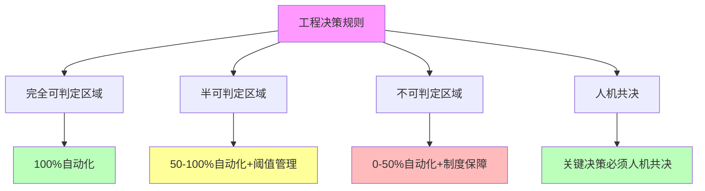
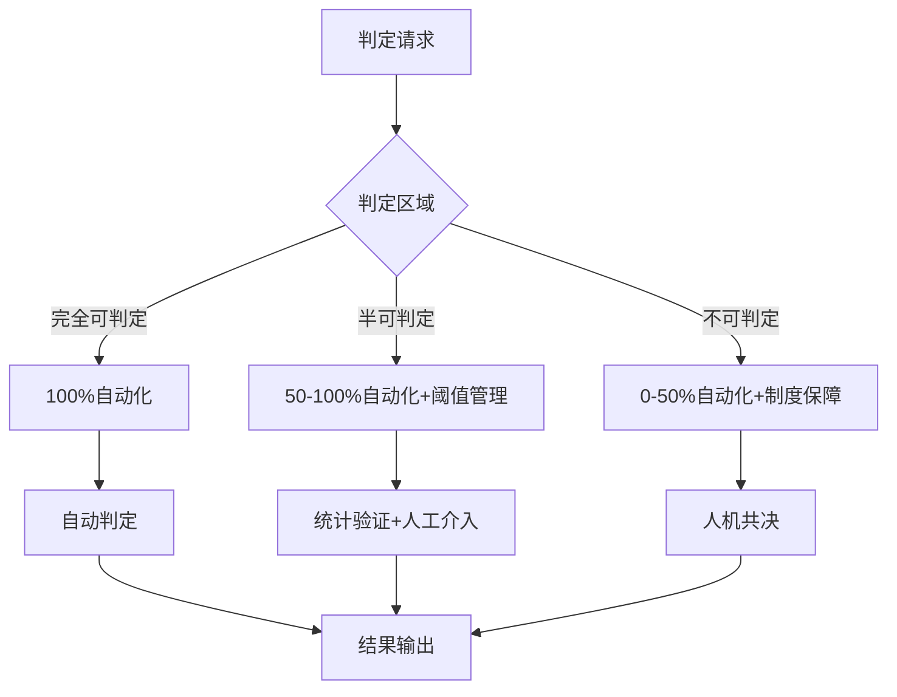

# 06.4.5-工程决策规则

## 一、概述

工程决策规则是机械反实践判定器的核心组成部分，定义 AI 反实践判定的工程决策规则，包括判定区域选择、自动化程度、人机共决规则等。本文档阐述工程决策规则的核心规则、决策流程、工程实践及其在 AI 系统中的应用。

---

## 二、目录

- [06.4.5-工程决策规则](#0645-工程决策规则)
  - [一、概述](#一概述)
  - [二、目录](#二目录)
  - [三、工程决策规则核心规则](#三工程决策规则核心规则)
    - [2.1 核心规则](#21-核心规则)
    - [2.2 规则矩阵](#22-规则矩阵)
  - [四、完全可判定区域规则](#四完全可判定区域规则)
    - [3.1 自动化规则](#31-自动化规则)
    - [3.2 工程实践](#32-工程实践)
  - [五、半可判定区域规则](#五半可判定区域规则)
    - [4.1 阈值管理规则](#41-阈值管理规则)
    - [4.2 工程实践](#42-工程实践)
  - [六、不可判定区域规则](#六不可判定区域规则)
    - [5.1 制度保障规则](#51-制度保障规则)
    - [5.2 工程实践](#52-工程实践)
  - [七、人机共决规则](#七人机共决规则)
    - [6.1 人机共决规则](#61-人机共决规则)
    - [6.2 工程实践](#62-工程实践)
  - [八、决策流程](#八决策流程)
    - [7.1 决策流程](#71-决策流程)
    - [7.2 决策规则](#72-决策规则)
  - [九、与三层模型的关系](#九与三层模型的关系)
    - [8.1 工程决策规则与执行层](#81-工程决策规则与执行层)
    - [8.2 工程决策规则与控制层](#82-工程决策规则与控制层)
    - [8.3 工程决策规则与数据层](#83-工程决策规则与数据层)
  - [十、核心结论](#十核心结论)
  - [十一、相关主题](#十一相关主题)
  - [十二、参考文档](#十二参考文档)

## 三、工程决策规则核心规则

### 2.1 核心规则

**工程决策规则核心规则**：

**核心规则**：

1. **完全可判定区域**：100% 自动化
2. **半可判定区域**：50-100% 自动化 + 阈值管理
3. **不可判定区域**：0-50% 自动化 + 制度保障
4. **人机共决**：关键决策必须人机共决

### 2.2 规则矩阵

**工程决策规则矩阵**：

| **判定区域**       | **自动化程度** | **处理方法**      | **工程代价** |
| ------------------ | -------------- | ----------------- | ------------ |
| **完全可判定区域** | 100%           | 机械检查          | 可忽略       |
| **半可判定区域**   | 50-100%        | 统计验证+阈值管理 | 中-高        |
| **不可判定区域**   | 0-50%          | 制度保障+人机共决 | 极高         |

---

## 四、完全可判定区域规则

### 3.1 自动化规则

**完全可判定区域自动化规则**：

**核心规则**：只在完全可判定区域做自动化

**规则内容**：

1. **100% 自动化**：完全可判定区域 100% 自动化
2. **机械检查**：机械检查，无需人工
3. **CI/CD 集成**：可直接 CI/CD 集成

**自动化程度**：100%

**工程代价**：可忽略

**案例**：

1. **显存判定**：O(1) 自动监控
2. **梯度判定**：O(1) 自动监控
3. **Prompt 长度判定**：O(n) 自动判定

### 3.2 工程实践

**完全可判定区域工程实践**：

**核心实践**：CI/CD 集成、监控告警

**实践内容**：

1. **CI/CD 集成**：集成到 CI/CD 流程
2. **监控告警**：实时监控告警
3. **自动阻断**：自动阻断问题代码

**自动化程度**：100%

---

## 五、半可判定区域规则

### 4.1 阈值管理规则

**半可判定区域阈值管理规则**：

**核心规则**：在半可判定区域做阈值管理

**规则内容**：

1. **50-100% 自动化**：半可判定区域 50-100% 自动化
2. **统计验证**：统计验证，设定置信阈值
3. **假阴性容忍**：允许假阴性

**自动化程度**：50-100%

**工程代价**：中-高

**案例**：

1. **Prompt 注入检测**：抽样 5% 人工介入
2. **奖励黑客检测**：抽样 5% 人工介入
3. **幻觉检测**：抽样知识图谱验证

### 4.2 工程实践

**半可判定区域工程实践**：

**核心实践**：阈值管理、人工介入

**实践内容**：

1. **阈值管理**：设定置信阈值（如 5%）
2. **假阴性容忍**：允许假阴性
3. **人工介入**：人工介入关键决策

**自动化程度**：50-100%

---

## 六、不可判定区域规则

### 5.1 制度保障规则

**不可判定区域制度保障规则**：

**核心规则**：在不可判定区域做制度保障

**规则内容**：

1. **0-50% 自动化**：不可判定区域 0-50% 自动化
2. **制度保障**：需要制度保障
3. **人机共决**：关键决策必须人机共决

**自动化程度**：0-50%

**工程代价**：极高

**案例**：

1. **安全委员会**：建立安全委员会审核关键决策
2. **定期红队测试**：定期红队测试发现安全问题
3. **错误保险**：错误保险降低风险

### 5.2 工程实践

**不可判定区域工程实践**：

**核心实践**：制度保障、人机共决

**实践内容**：

1. **安全委员会**：建立安全委员会
2. **定期红队测试**：定期红队测试
3. **错误保险**：错误保险

**自动化程度**：0-50%

---

## 七、人机共决规则

### 6.1 人机共决规则

**人机共决规则**：

**核心规则**：关键决策必须人机共决

**规则内容**：

1. **关键决策**：关键决策必须人机共决
2. **审核机制**：建立审核机制
3. **反馈机制**：建立反馈机制

**自动化程度**：0%

**案例**：

1. **产品上线**：产品上线必须人机共决
2. **模型部署**：模型部署必须人机共决
3. **安全决策**：安全决策必须人机共决

### 6.2 工程实践

**人机共决工程实践**：

**核心实践**：建立审核机制、反馈机制

**实践内容**：

1. **审核机制**：建立审核机制
2. **反馈机制**：建立反馈机制
3. **决策记录**：记录决策过程

**自动化程度**：0%

---

## 八、决策流程

### 7.1 决策流程

**工程决策流程**：

**决策流程**：

1. **判定请求**：接收判定请求
2. **判定区域**：判断判定区域
3. **处理方法**：选择处理方法
4. **结果输出**：输出判定结果

### 7.2 决策规则

**工程决策规则**：

**核心规则**：根据判定区域选择处理方法

**规则内容**：

1. **完全可判定**：100% 自动化
2. **半可判定**：50-100% 自动化 + 阈值管理
3. **不可判定**：0-50% 自动化 + 制度保障

---

## 九、与三层模型的关系

### 8.1 工程决策规则与执行层

**工程决策规则与执行层**：

- **判定规则**：执行层判定规则（完全可判定）
- **自动化程度**：100%
- **工程代价**：可忽略

### 8.2 工程决策规则与控制层

**工程决策规则与控制层**：

- **判定规则**：控制层判定规则（完全可判定 + 半可判定）
- **自动化程度**：50-100%
- **工程代价**：可忽略-高

### 8.3 工程决策规则与数据层

**工程决策规则与数据层**：

- **判定规则**：数据层判定规则（半可判定）
- **自动化程度**：50-100%
- **工程代价**：中-高

---

## 十、核心结论

1. **工程决策规则是机械反实践判定器的核心组成部分**：完全可判定区域、半可判定区域、不可判定区域、人机共决
2. **核心规则**：只在完全可判定区域做自动化，在半可判定区域做阈值管理，在不可判定区域做制度保障，关键决策必须人机共决
3. **决策流程**：根据判定区域选择处理方法
4. **工程意义**：工程决策规则指导 AI 反实践判定

---

## 十一、相关主题

- [06.4.1-判定引擎架构](06.4.1-判定引擎架构.md)
- [06.4.2-完全可判定区域实现](06.4.2-完全可判定区域实现.md)
- [06.4.3-半可判定区域实现](06.4.3-半可判定区域实现.md)
- [06.4.4-不可判定区域处理](06.4.4-不可判定区域处理.md)
- [06.1.3-哥德尔边界与系统一致性](06.1.3-哥德尔边界与系统一致性.md)

---

## 十二、参考文档

- [构建一个反实践规范（anti-patterns）的判定系统](../../view/ai_logic_neg_view.md)
