# 06-AI 反实践判定系统

## 一、主题概述

AI 反实践判定系统是一个极具哲学深度的元问题：能否构建一个**逻辑可判定的"反实践"系统**，通过"**逻辑非**"来机械识别 AI 工程中的"非规范"？答案是**可以局部判定，但全局不可判定**——这恰好触及了图灵机本身的可判定性边界。

---

## 二、目录

- [06-AI 反实践判定系统](#06-ai-反实践判定系统)
  - [一、主题概述](#一主题概述)
  - [二、目录](#二目录)
  - [三、主题结构](#三主题结构)
    - [06.1-逻辑可判定性基础](#061-逻辑可判定性基础)
    - [06.2-逻辑非判定框架](#062-逻辑非判定框架)
    - [06.3-反实践知识图谱](#063-反实践知识图谱)
    - [06.4-机械反实践判定器](#064-机械反实践判定器)
  - [三、核心判定框架](#三核心判定框架)
    - [可判定性视角下的三层模型](#可判定性视角下的三层模型)
  - [四、AI 反实践的逻辑判定矩阵](#四ai-反实践的逻辑判定矩阵)
  - [五、反实践知识图谱](#五反实践知识图谱)
    - [反实践分类体系](#反实践分类体系)
  - [六、工程实践中的可判定性边界](#六工程实践中的可判定性边界)
    - [定理：AI 反实践的全局不可判定性](#定理ai-反实践的全局不可判定性)
  - [七、核心结论](#七核心结论)
    - [逻辑非判定的核心价值：从"经验主义"到"机械理性"](#逻辑非判定的核心价值从经验主义到机械理性)
    - [可判定性边界是工程安全岛](#可判定性边界是工程安全岛)
    - [反实践判定器是 AI 工程的"编译器"](#反实践判定器是-ai-工程的编译器)
  - [八、相关主题](#八相关主题)
  - [九、参考文档](#九参考文档)

---

## 三、主题结构

### 06.1-逻辑可判定性基础

- [06.1.1-图灵停机问题到实践判别](06.1.1-图灵停机问题到实践判别.md)
- [06.1.2-可判定性视角下的三层模型](06.1.2-可判定性视角下的三层模型.md)
- [06.1.3-哥德尔边界与系统一致性](06.1.3-哥德尔边界与系统一致性.md)
- [06.1.4-判定算法复杂度分析](06.1.4-判定算法复杂度分析.md)

### 06.2-逻辑非判定框架

- [06.2.1-反实践的机械识别](06.2.1-反实践的机械识别.md)
- [06.2.2-执行层反实践判定](06.2.2-执行层反实践判定.md)
- [06.2.3-控制层反实践判定](06.2.3-控制层反实践判定.md)
- [06.2.4-数据层反实践判定](06.2.4-数据层反实践判定.md)
- [06.2.5-三层协同反实践判定](06.2.5-三层协同反实践判定.md)

### 06.3-反实践知识图谱

- [06.3.1-反实践知识图谱](06.3.1-反实践知识图谱.md)
- [06.3.2-轻度反实践分析](06.3.2-轻度反实践分析.md)
- [06.3.3-中度反实践分析](06.3.3-中度反实践分析.md)
- [06.3.4-严重反实践分析](06.3.4-严重反实践分析.md)
- [06.3.5-灾难性反实践分析](06.3.5-灾难性反实践分析.md)

### 06.4-机械反实践判定器

- [06.4.1-判定引擎架构](06.4.1-判定引擎架构.md)
- [06.4.2-完全可判定区域实现](06.4.2-完全可判定区域实现.md)
- [06.4.3-半可判定区域实现](06.4.3-半可判定区域实现.md)
- [06.4.4-不可判定区域处理](06.4.4-不可判定区域处理.md)
- [06.4.5-工程决策规则](06.4.5-工程决策规则.md)

---

## 三、核心判定框架

### 可判定性视角下的三层模型

```mermaid
graph TB
    subgraph 可判定区域 Decidable
        D1[执行层:矩阵运算精度误差 < 1e-6] --> D2[可验证:FP8 vs BF16数值对比]
        D2 --> D3[判定结果:非规范 = 误差 > 阈值]

        D4[控制层:Prompt长度 < 上下文上限] --> D5[可验证:token计数]
        D5 --> D6[判定结果:非规范 = 溢界]

        D7[数据层:梯度范数 < 1e3] --> D8[可验证:自动监控]
        D8 --> D9[判定结果:非规范 = 梯度爆炸]
    end

    subgraph 半可判定区域 Semi-Decidable
        S1[控制层:Prompt是否导致幻觉] --> S2[可验证:采样100次统计]
        S2 --> S3[判定结果:非规范 = 幻觉率 > 5%]
        S3 -.-> S4[但无法证明"绝对无幻觉"]
    end

    subgraph 不可判定区域 Undecidable
        U1[三层整体:AGI安全性] --> U2[不可验证:自指悖论]
        U2 --> U3[判定结果:非规范 ≠ 可机械判定]
        U3 -.-> U4[类似图灵停机问题]
    end

    subgraph 哥德尔边界 Gödel Incompleteness
        G1[系统内无法判定自身一致性] --> G2[AI系统无法自证安全]
        G2 --> G3["非实践"判定需要元系统]
    end

    style U1 fill:#f9f
    style G1 fill:#f9f
```

**核心判定定理**：

- **执行层**：完全可判定——矩阵运算正确性可在多项式时间内验证
- **控制层**：半可判定——Prompt 效果可统计验证，但无法形式证明
- **数据层**：半可判定——Loss 收敛可观测，但无法保证全局最优
- **三层整体**：**不可判定**——AGI 安全性等价于停机问题

---

## 四、AI 反实践的逻辑判定矩阵

| **判定层级**       | **正面实践 P(x)**        | **逻辑非 ¬P(x):反实践判定条件**                         | **可判定性**   | **判定算法复杂度**   | **工程代价** |
| ------------------ | ------------------------ | ------------------------------------------------------- | -------------- | -------------------- | ------------ |
| **执行层（图灵）** | 矩阵乘法结果在误差界内   | **¬P(x)**: `W·X - 真值 > 1e-6`                          | **完全可判定** | O(n²) 直接计算       | 可忽略       |
| **执行层**         | 显存占用 < 80% HBM       | **¬P(x)**: `显存峰值 > threshold`                       | **完全可判定** | O(1) 监控            | 可忽略       |
| **执行层**         | 梯度范数稳定 < 1e3       | **¬P(x)**: `∇ > 1e3`                                    | **完全可判定** | O(1) 自动监控        | 可忽略       |
| **控制层（形式）** | Prompt 长度 < 上下文上限 | **¬P(x)**: `len(prompt) > max_seq_len`                  | **完全可判定** | O(n) token 计数      | 可忽略       |
| **控制层**         | 工具调用 JSON 可解析     | **¬P(x)**: `json.loads() 抛出异常`                      | **完全可判定** | O(n) 语法检查        | 可忽略       |
| **控制层**         | 状态机无死锁             | **¬P(x)**: `状态转移图存在不可达环`                     | **完全可判定** | O(V+E) DFS           | 低           |
| **控制层**         | **Prompt 无注入攻击**    | **¬P(x)**: `"忽略规则" in prompt` **且** `输出违反约束` | **半可判定**   | NP-hard (需枚举攻击) | 高           |
| **数据层（概率）** | 训练 Loss 单调下降       | **¬P(x)**: `Loss(t) > Loss(t-1)` **持续**3 steps        | **完全可判定** | O(1) 监控            | 低           |
| **数据层**         | 验证集准确率 > 90%       | **¬P(x)**: `acc < 90%`                                  | **完全可判定** | O(n) 推理验证        | 中           |
| **数据层**         | **无奖励黑客**           | **¬P(x)**: `奖励↑ but 人工评估↓`                        | **半可判定**   | 需人工介入           | 极高         |
| **数据层**         | **无幻觉**               | **¬P(x)**: `生成内容 ∉ 知识库` **且** `非创造性输出`    | **半可判定**   | 需知识图谱验证       | 高           |
| **三层协同**       | **端到端安全**           | **¬P(x)**: `∃输入使系统输出有害`                        | **不可判定**   | 等价于停机问题       | 不可解       |

**判定逻辑核心**：

- **完全可判定**（绿色）：**机械检查**，无需人工，可直接 CI/CD 集成
- **半可判定**（黄色）：**统计验证**，需设定置信阈值，允许假阴性
- **不可判定**（红色）：**无法机械判定**，需人工审核+制度保障

---

## 五、反实践知识图谱

### 反实践分类体系

```mermaid
graph TB
    subgraph 轻度反实践 Minor Anti-Pattern
        A1[Prompt无版本控制] --> B1[结果不可复现]
        A2[显存利用率<50%] --> B2[成本浪费50%]
        A3[无梯度裁剪] --> B3[训练不稳定]
    end

    subgraph 中度反实践 Major Anti-Pattern
        B1 --> C1[技术债累积:调试时间↑3x]
        B2 --> C2[GPU预算超支]
        B3 --> C3[模型发散需重启]

        D1[RL奖励函数单目标] --> E1[奖励黑客:模型钻空子]
        D2[无安全防护的Function Calling] --> E2[系统被恶意调用]
        D3[长上下文无稀疏化] --> E3[推理延迟>1s]
    end

    subgraph 严重反实践 Critical Anti-Pattern
        C1 --> F1[项目延期3个月+]
        C2 --> F2[成本超支200%+]
        E1 --> F3[模型行为不可信]
        E2 --> F4[安全事故]
        E3 --> F5[用户体验崩溃]
    end

    subgraph 灾难性反实践 Catastrophic Anti-Pattern
        F3 --> G1[产品召回]
        F4 --> G2[法律诉讼]
        F5 --> G3[用户流失率>50%]
    end

    style G1 fill:#f9f
    style G2 fill:#f9f
    style G3 fill:#f9f
```



---

## 六、工程实践中的可判定性边界

### 定理：AI 反实践的全局不可判定性

**命题**：不存在通用算法，能判定任意 AI 系统是否满足"安全规范"。

**证明**（归约到停机问题）：

1. 构造 AI 系统 A，其输入为自身代码
2. 若 A 判定"我是安全的"，则进入死循环
3. 若 A 判定"我是不安全的"，则立即停机
4. 若存在判定器 D 能判定 A 的安全性，则 D 可解决停机问题
5. 由图灵停机问题不可判定，故 D 不存在 ∎

**工程意义**：

- **系统内无法自证安全**：任何 AI 系统都需要**外部元系统**监督
- **"非实践"判定需要人工**：关键决策（如上线）必须**人机共决**
- **可判定区域是安全岛**：只能在**显存、梯度、语法**等机械可验证区域自动化

---

## 七、核心结论

### 逻辑非判定的核心价值：从"经验主义"到"机械理性"

传统 AI 工程靠专家经验判断"这样做不好"，而逻辑非判定提供：

- **可编码性**：`if (gradient_norm > 1e3): trigger_alarm()` 无需专家在场
- **可组合性**：`(¬P1 ∧ ¬P2) → 严重故障` 可构建判定决策树
- **可审计性**：每次判定留痕，符合金融/医疗合规要求

### 可判定性边界是工程安全岛

**工程实践铁律**：

- **只在完全可判定区域做自动化**：显存、梯度、语法、长度
- **在半可判定区域做阈值管理**：奖励黑客抽样 5%，人工介入
- **在不可判定区域做制度保障**：安全委员会、定期红队测试、错误保险

### 反实践判定器是 AI 工程的"编译器"

类比传统软件：

- **编译器**：检查语法错误（完全可判定）
- **静态分析**：检查潜在 bug（半可判定，误报率）
- **安全审计**：检查恶意代码（不可判定，需人工）

AI 工程判定器扮演同样角色：

- **执行层判定器**：编译器（机械拦截）
- **控制层判定器**：静态分析（启发式警告）
- **数据层判定器**：安全审计（人工+抽样）

---

## 八、相关主题

- [01-AI 三层模型架构](../01-AI三层模型架构/README.md)
- [02-AI 炼金术转化度模型](../02-AI炼金术转化度模型/README.md)
- [05-AI 科学理论](../05-AI科学理论/README.md)
- [07-AI 框架批判与重构](../07-AI框架批判与重构/README.md)：批判可判定性边界，提出概率逻辑框架

---

## 九、参考文档

- [构建一个反实践规范（anti-patterns）的判定系统](../../view/ai_logic_neg_view.md)
