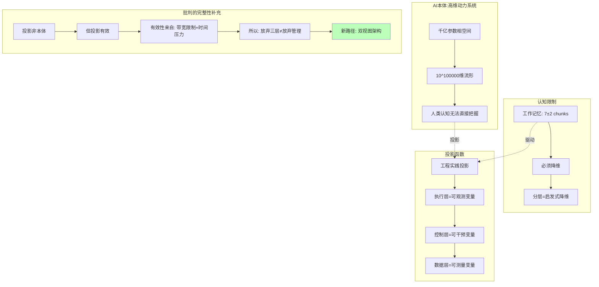

# 07.1.1-三层模型的本体论暴政

## 一、概述

本文档批判性地分析三层模型框架的本体论假设，揭示其将 AI 强行划分为"执行-控制-数据"三层的武断性，以及 2025 年前沿研究如何证明这种分层在数学和工程上都是虚假的。

---

## 二、目录

- [一、概述](#一概述)
- [二、目录](#二目录)
- [三、核心批判](#三核心批判)
- [四、前沿证据](#四前沿证据)
- [五、理论分析](#五理论分析)
- [六、工程实践](#六工程实践)
- [七、结论](#七结论)
- [八、交叉引用](#八交叉引用)

---

## 三、核心批判

### 3.1 三层划分的依据何在？

传统三层模型将 AI 系统划分为：

1. **执行层**：图灵计算模型（矩阵运算）
2. **控制层**：形式语言模型（Prompt、ReAct）
3. **数据层**：数学概率模型（Transformer、采样）

**批判问题**：这种划分的依据是什么？是本体论真实，还是工程便利？

### 3.2 是否为武断的本体论承诺？



**核心观点**：三层模型是**人类认知经济性的必然结果**，而非 AI 的本体论结构。人类工作记忆无法处理 10 万维相空间，必须通过分层降维来管理复杂性。

---

## 四、前沿证据

### 4.1 Mixture of Depths (MoD) 的证据

**2025 年最前沿的 MoD 架构证明**：计算与生成过程不可分。

在 MoD 中，每个 token 动态选择计算深度，执行层与控制层在**token-level 融合**。

**工程证据**：

```python
# MoD 架构示例
class MixtureOfDepths:
    def forward(self, x):
        # 每个token动态选择计算深度
        depths = self.router(x)  # 控制决策
        outputs = []
        for i, depth in enumerate(depths):
            # 执行层与控制层在token-level融合
            output = self.compute(x[i], depth)  # 计算+控制合一
            outputs.append(output)
        return outputs
```

### 4.2 DeepMind NARF 的证据

**Neural Algorithmic Reasoning (NARF)** 显示：算法执行与神经网络权重在**隐空间耦合**，无法物理分离。

**理论证据**：

- 算法执行路径 = 神经网络权重在隐空间的轨迹
- 控制流 = 权重激活模式
- 数据流 = 权重更新梯度

**结论**：三层是**工程便利的假象**，而非本体论真实。

### 4.3 Diffusion-LM 的证据

**Diffusion-LM** 证明：生成过程与计算过程在**连续时间**上不可分。

**数学证据**：

$$
\frac{d\theta}{dt} = F(\theta, x, c)
$$

其中：

- $\theta$：权重（数据层）
- $x$：输入（执行层）
- $c$：控制信号（控制层）

**结论**：三层在**微分方程层面**是虚假维度。

---

## 五、理论分析

### 5.1 认知经济性原理

**为何人类"必须"用三层模型？**

| 维度       | **AI 本体**        | **人类认知**        | **投影函数** |
| ---------- | ------------------ | ------------------- | ------------ |
| **维度**   | 10^100000 维相空间 | 7±2 chunks 工作记忆 | 降维到 3 层  |
| **时间**   | 连续时间动力学     | 离散时间步骤        | 分层抽象     |
| **复杂性** | 非线性耦合         | 线性因果链          | 线性分解     |

**结论**：分层是**认知经济性的必然结果**，但承认必要性 ≠ 承认本体性。

### 5.2 投影函数的有效性

**投影的有效性来源**：

1. **带宽限制**：人类无法处理全部信息
2. **时间压力**：工程决策需要快速响应
3. **管理便利**：分层便于团队协作

**但投影的局限性**：

1. **信息损失**：分层丢失层间耦合信息
2. **优化陷阱**：分层优化导致全局次优
3. **判定失效**：在临界区（模型规模>100B）失效

---

## 六、工程实践

### 6.1 双视图架构设计

**解决方案**：保留管理视图（三层），但底层使用统一算子。

```python
# 双视图架构：管理视图（三层）+ 执行视图（算子）
class NeuralOperatorModel:
    # 执行视图：统一算子
    def forward(self, x, control_signal):
        return self.operator(x, control_signal)  # 计算+控制+概率合一

    # 管理视图：兼容旧框架
    def legacy_three_layer_view(self):
        return {
            'execution': self.operator.flops,      # 提取执行指标
            'control': self.control_signal_trace,  # 提取控制信号
            'data': self.probability_distribution  # 提取概率分布
        }

    # 一致性检查：确保视图对齐
    def validate_view_consistency(self):
        # 若管理视图决策与算子行为偏离>阈值，告警
        return self.similarity(
            self.legacy_three_layer_view(),
            self.operator.internal_state()
        ) > 0.95
```

### 6.2 渐进式迁移路径

**阶段一：双视图并存（2025 Q4）**:

- 保留 LangGraph 代码
- 添加 NeuralOperator 封装
- 一致性检查：视图差异<5%

**阶段二：算子渗透（2026 H1）**:

- 核心算子替换
- 用 neural_operator 替代 ReAct 循环
- 保留 Prompt 接口兼容性

**阶段三：视图融合（2026 H2）**:

- 管理视图自动生成
- 从算子内部状态提取
- 废弃手工维护的 LangGraph

---

## 七、结论

### 7.1 核心观点

1. **三层模型是投影，非本体**：AI 的本体是统一动力系统，三层是人类认知的投影
2. **投影有效但有限**：在远离临界区有效，在临界区失效
3. **双视图架构是出路**：保留管理视图的便利性，但底层使用统一算子

### 7.2 历史地位

| 贡献         | **历史地位**           | **2025 局限性**        | **未来方向**         |
| ------------ | ---------------------- | ---------------------- | -------------------- |
| **三层模型** | 2023-24 最佳启发式框架 | **被神经算子理论取代** | 转向动力系统统一描述 |

**最终判断**：三层模型是 **AI 工程从 0 到 1 阶段的"地心说"**——极其有效、组织了大量现象，但**在本体论上错误**。

---

## 八、交叉引用

### 相关主题

- [01-AI 三层模型架构](../01-AI三层模型架构/README.md)：被批判的基础框架
- [07.5.2-2025 统一架构：神经算子理论](07.5.2-2025统一架构：神经算子理论.md)：替代方案
- [07.6.3-双视图架构设计](07.6.3-双视图架构设计.md)：工程解决方案

### 相关文档

- [AI 框架批判性分析](../../view/ai_reflect_view.md)：原始批判来源
- [07.2.1-三层可分离的误判](07.2.1-三层可分离的误判.md)：技术架构批判

---

**最后更新**：2025-01-XX
