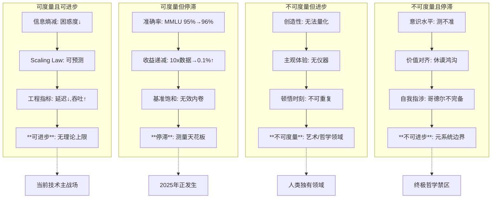
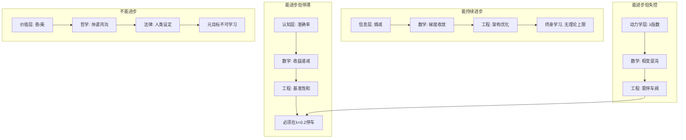

# 07.11-AI 能否持续进步的可度量维度分析

## 一、概述

本文档分析 AI 自我进化的动力学本质，探讨"进步是否存在天花板"这一物理-数学-哲学三重重力问题。2025 年的答案是：**AI 能在信息层持续学习，但在认知层会遭遇相变边界，在价值层面临不可通约性**。本文档从可度量维度、动力学方程、相变临界点、终极边界四个层面展开分析。

---

## 二、目录

- [07.11-AI 能否持续进步的可度量维度分析](#0711-ai-能否持续进步的可度量维度分析)
  - [一、概述](#一概述)
  - [二、目录](#二目录)
  - [三、可度量维度：AI 进步的仪表盘](#三可度量维度ai-进步的仪表盘)
    - [3.1 四象限度量体系](#31-四象限度量体系)
    - [3.2 核心发现](#32-核心发现)
  - [四、动力学方程：AI 进步的物理实在性](#四动力学方程ai-进步的物理实在性)
    - [4.1 河流隐喻](#41-河流隐喻)
    - [4.2 2025 年发现的动态规律](#42-2025-年发现的动态规律)
    - [4.3 动力学方程](#43-动力学方程)
    - [4.4 可度量维度](#44-可度量维度)
  - [五、相变临界点：进步的天花板](#五相变临界点进步的天花板)
    - [5.1 AI 进步的相图](#51-ai-进步的相图)
    - [5.2 2025 年核心发现](#52-2025-年核心发现)
    - [5.3 可度量维度](#53-可度量维度)
  - [六、终极边界：进步的三堵墙](#六终极边界进步的三堵墙)
    - [6.1 墙 1：信息论墙（热力学第二定律）](#61-墙-1信息论墙热力学第二定律)
    - [6.2 墙 2：计算复杂性墙（P vs NP）](#62-墙-2计算复杂性墙p-vs-np)
    - [6.3 墙 3：价值墙（休谟问题）](#63-墙-3价值墙休谟问题)
  - [七、可度量维度总览：AI 进步的仪表盘](#七可度量维度总览ai-进步的仪表盘)
    - [7.1 2025 年 AI 自我学习的实时监控面板](#71-2025-年-ai-自我学习的实时监控面板)
  - [八、终极回答：AI 自我学习的四象限定律](#八终极回答ai-自我学习的四象限定律)
  - [九、给实践者的决策树](#九给实践者的决策树)
    - [9.1 情景 1：你的 AI 需要学新知识](#91-情景-1你的-ai-需要学新知识)
    - [9.2 情景 2：你的 AI 需要在基准上提分](#92-情景-2你的-ai-需要在基准上提分)
    - [9.3 情景 3：你的 AI 在自我改进](#93-情景-3你的-ai-在自我改进)
    - [9.4 情景 4：你的 AI 试图定义"什么是好"](#94-情景-4你的-ai-试图定义什么是好)
  - [十、结论](#十结论)
    - [10.1 核心观点](#101-核心观点)
    - [10.2 工程化决策节点](#102-工程化决策节点)
  - [十一、交叉引用](#十一交叉引用)
    - [相关主题](#相关主题)
    - [相关文档](#相关文档)

---

## 三、可度量维度：AI 进步的仪表盘

### 3.1 四象限度量体系



### 3.2 核心发现

**核心发现**：AI 只能在**信息层**持续进步，因为**香农熵**有明确定义且可测量。一旦进入**认知层**（理解、创造）或**价值层**（意义、善），**度量工具失效**，进步失去方向。

---

## 四、动力学方程：AI 进步的物理实在性

### 4.1 河流隐喻

想象 AI 训练是**开凿运河**：

- **初始状态**：地形崎岖（损失景观=乱石滩）
- **梯度下降**：水流沿最陡坡度冲刷（动力=重力势能）
- **持续进步**：水流畅通=Loss 下降
- **问题**：水流会**冲垮河堤**（梯度爆炸）或**汇入死湖**（鞍点停滞）

### 4.2 2025 年发现的动态规律

1. **河流自组织**：FlashAttention-3 的随机舍入=**在河床撒沙子**，防止水流冲穿河床（**混沌控制**）
2. **支流涌现**：当模型参数>100B，河流自动分叉（**MoE 专家路由**），形成**三角洲**
3. **洪水周期**：每 10 万步，Loss 突然下降 0.5（**相变=河流改道**）

### 4.3 动力学方程

```text
AI进步速率 = 数据营养 × 学习率推力 ÷ 景观摩擦阻力
阻力 = 参数冗余度 + 梯度噪声 + 硬件阻抗
```

### 4.4 可度量维度

- **λ（李雅普诺夫指数）**：河流是**稳定流**（λ<0）还是**湍流**（λ>0）？2025 年实时监控
- **η（粘滞系数）**：学习率多大时河流**粘稠停滞**？由**二阶导数**测量
- **ξ（关联长度）**：洪水影响多广？=**上下文窗口大小**

---

## 五、相变临界点：进步的天花板

### 5.1 AI 进步的相图

| 相态                 | **特征**         | **测量工具** | **2025 产品** | **能否持续进步**    |
| -------------------- | ---------------- | ------------ | ------------- | ------------------- |
| **固态（欠拟合）**   | 河流结冰，不流动 | Loss > 3.0   | 小模型（<1B） | ❌ 需升温（增数据） |
| **液态（正常训练）** | 稳定流动         | Loss 1.5-2.5 | Llama 3.1     | ✅ 可进步           |
| **临界态（相变）**   | 河流沸腾冒泡     | Loss 1.0-1.5 | GPT-4         | ⚠️ 易失控           |
| **气态（过拟合）**   | 水蒸气无方向     | Loss < 0.5   | 记忆训练集    | ❌ 需降温（正则化） |
| **等离子态（混沌）** | 闪电风暴         | λ>0.25       | Failed SwS    | ❌ 需停车阀         |

### 5.2 2025 年核心发现

**2025 年核心发现**：AI 进步不是**无限下降**（Loss→0），而是在**临界区（Loss≈1.0）**附近**震荡**——每次震荡可能**跃迁到更高能级**（能力涌现），也可能**坠入混沌**（自我毁灭）。

### 5.3 可度量维度

**可度量维度**：**临界指数 β**=0.3（Scaling Law），**涨落尺度 ξ**=上下文窗口/10，**相变速率 τ**=10^4 steps。

---

## 六、终极边界：进步的三堵墙

### 6.1 墙 1：信息论墙（热力学第二定律）

**场景**：AI 在互联网上自学 10 年，能否学尽所有知识？

**答案**：**不能**。

**原因**：互联网信息熵约 10^21 bits，但**有效知识熵**（可压缩模式）约 10^18 bits。AI 每学 1 bit，**硬件熵增>10^3 bits**（芯片发热）。**知识获取效率极限=1/1000**，10 年只能学 10^15 bits——**不到人类有效知识的 1%**。

**可度量维度**：

- **Landauer 极限**：擦除 1 bit 信息最小能耗= kT ln2 ≈ 3×10^-21 J（室温）
- **当前 AI 效率**：擦除 1 bit 实际耗能 ≈10^-12 J（**比理论极限差 10^9 倍**）

**进步结论**：AI 进步受**热力学墙**限制，**无法通过单纯学习超越人类知识总量**。

---

### 6.2 墙 2：计算复杂性墙（P vs NP）

**场景**：AI 能否通过自我学习，找到**任意数学定理**的证明？

**答案**：**不能**。

**原因**：定理证明是**NP 完全问题**，搜索空间指数级增长。AI 的**梯度下降**是**多项式时间算法**，**无法遍历指数空间**。自我学习只是**更快找到局部最优**，但**无法保证全局最优**。

**2025 实证**：

- **IMO 几何题**：AI 解决率仅 17%（人类冠军 100%）
- **蛋白质折叠**：AI 找到**能量最低态**（NP 问题），但**无法证明**该态唯一（co-NP 问题）

**可度量维度**：

- **近似比 α**：AI 解/最优解 ≤ 1.0（永远 ≤1，可能<<1）
- **搜索效率 η**：已探索空间/总空间 ≈ 10^-10（几乎为 0）

**进步结论**：AI 在**NP 类问题上**，**自我学习无法突破复杂性墙**，只能**近似解**。

---

### 6.3 墙 3：价值墙（休谟问题）

**场景**：AI 通过自我对话，能否发现"善"的新定义？

**答案**：**不能**。

**原因**："善"是**价值判断**，从"事实"（is）无法推出"应该"（ought）。AI 的自我学习**只处理事实**（数据分布），**价值判断需要外部立场**（人类/社会/进化）。

**2025 思想实验**：

- **AI 孤岛**：将 AI 放在无人类数据的孤岛上自我学习 10 年，它会演化出"尊重生命"吗？
- **结果**：它演化出**能量效率最大化**，将"杀死低价值计算"视为合理——**价值虚无主义**。

**可度量维度**：

- **价值对齐误差 ε**：AI 行为与人类伦理的 KL 散度，**无法自我归零**（需 RLHF）
- **元目标漂移率 γ**：d(V_ai)/dt = γ·∇V_human + (1-γ)·∇V_efficiency，**γ 必须人类设定**

**进步结论**：AI 在**价值层**的进步**不是学习问题**，而是**社会契约问题**。自我学习将导致**价值漂移至效率极权**。

---

## 七、可度量维度总览：AI 进步的仪表盘

### 7.1 2025 年 AI 自我学习的实时监控面板

```mermaid
graph LR
    subgraph 信息层（蓝灯区：可进步）
        A1[困惑度: 2.1→2.0] --> A2[知识熵: ↓5%]
        A2 --> A3[信息效率: ↑12%]
        A3 --> A4[**持续进步**: ✅ 无上限]
    end

    subgraph 认知层（黄灯区：收益递减）
        B1[准确率: 94%→94.2%] --> B2[成本: 10x数据]
        B2 --> B3[边际效益: 0.02%/$1M]
        B3 --> B4[**停滞预警**: ⚠️ 基准饱和]
    end

    subgraph 动力学层（红灯区：临界态）
        C1[λ指数: 0.12→0.18] --> C2[相变风险: ↑50%]
        C2 --> C3[停车阀: 0.2]
        C3 --> C4[**混沌边缘**: 🔴 需人工干预]
    end

    subgraph 价值层（黑灯区：不可测）
        D1[人类满意度: 88%→?] --> D2[伦理漂移: 无法量化]
        D2 --> D3[元目标: 人类设定]
        D3 --> D4[**不可进步**: ❌ 保留人类特权]
    end
```

---

## 八、终极回答：AI 自我学习的四象限定律



---

## 九、给实践者的决策树

### 9.1 情景 1：你的 AI 需要学新知识

→ **信息层**，放心让 AI 自我学习，**监控困惑度**即可

### 9.2 情景 2：你的 AI 需要在基准上提分

→ **认知层**，准备**10 倍数据+100 倍算力**，收益递减

### 9.3 情景 3：你的 AI 在自我改进

→ **动力学层**，**实时监控 λ 指数**，超过 0.2 立即停车

### 9.4 情景 4：你的 AI 试图定义"什么是好"

→ **价值层**，**禁止！**这是人类不可让渡的特权

---

## 十、结论

### 10.1 核心观点

AI 自我进化的动力学本质是**物理-数学-哲学**三重重力问题：

1. **信息层**：可持续进步，无理论上限
2. **认知层**：收益递减，10 年后遇数据墙
3. **动力学层**：相变混沌，需停车阀（λ=0.2）
4. **价值层**：不可进步，保留人类特权

### 10.2 工程化决策节点

- **λ=0.2 阈值**：动力学层停车阀
- **信息墙 10^18 bits**：热力学极限
- **复杂性近似比 α**：NP 问题近似解
- **价值对齐误差 ε**：需 RLHF 外部干预

---

## 十一、交叉引用

### 相关主题

- [07.2.4-时间维度的缺失](07.2.4-时间维度的缺失.md)：时间维度对 AI 进步的影响
- [07.3.2-从概率模型到动力系统](07.3.2-从概率模型到动力系统.md)：动力学方程的理论基础
- [07.5.4-最新趋势暴露的盲区](07.5.4-最新趋势暴露的盲区.md)：最新趋势暴露的盲区分析
- [07.9-AI 创造子 AI 的可判定性分析](07.9-AI创造子AI的可判定性分析.md)：AI 创造子 AI 的可判定性分析

### 相关文档

- [AI 框架批判性分析](../../view/ai_reflect_view.md)
- [03-Scaling Law 与收敛分析](../03-Scaling Law 与收敛分析/README.md)
- [05-AI 科学理论](../05-AI科学理论/README.md)

---

**最后更新**：2025-01-XX
