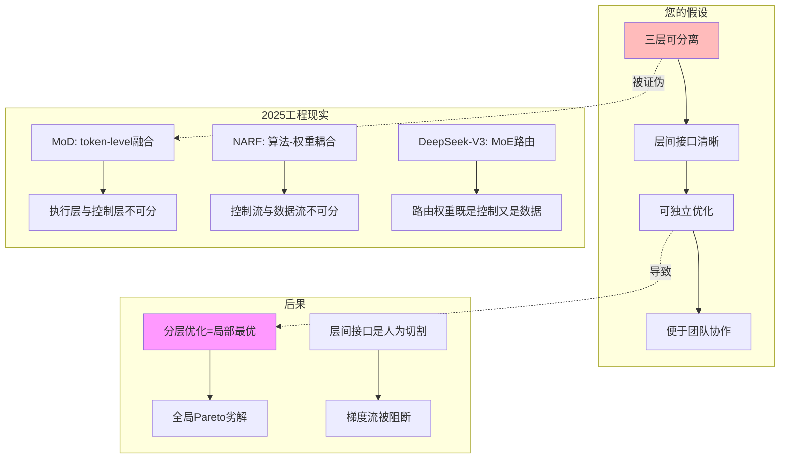

# 07.2.1-三层可分离的误判

## 一、概述

本文档批判性地分析传统框架假设三层可分离的误判，揭示 2025 年前沿工程实践如何证明层间深度耦合，并提出统一架构的替代方案。

---

## 二、目录

- [07.2.1-三层可分离的误判](#0721-三层可分离的误判)
  - [一、概述](#一概述)
  - [二、目录](#二目录)
  - [三、核心批判](#三核心批判)
    - [3.1 三层可分离的假设](#31-三层可分离的假设)
    - [3.2 误判的知识图谱](#32-误判的知识图谱)
  - [四、前沿证据](#四前沿证据)
    - [4.1 Mixture of Depths (MoD) 的证据](#41-mixture-of-depths-mod-的证据)
    - [4.2 DeepMind NARF 的证据](#42-deepmind-narf-的证据)
    - [4.3 DeepSeek-V3 MoE 的证据](#43-deepseek-v3-moe-的证据)
  - [五、理论分析](#五理论分析)
    - [5.1 层间耦合的数学证明](#51-层间耦合的数学证明)
    - [5.2 分层优化的局部最优问题](#52-分层优化的局部最优问题)
  - [六、工程实践](#六工程实践)
    - [6.1 统一架构设计](#61-统一架构设计)
    - [6.2 双视图架构](#62-双视图架构)
  - [七、结论](#七结论)
    - [7.1 核心观点](#71-核心观点)
    - [7.2 历史地位](#72-历史地位)
  - [八、交叉引用](#八交叉引用)
    - [相关主题](#相关主题)
    - [相关文档](#相关文档)

---

## 三、核心批判

### 3.1 三层可分离的假设

**传统框架的假设**：

- 执行层、控制层、数据层可**物理分离**
- 层间接口清晰，可独立优化
- 分层解耦便于团队协作

**批判问题**：这种假设在 2025 年前沿工程实践中是否成立？

### 3.2 误判的知识图谱



---

## 四、前沿证据

### 4.1 Mixture of Depths (MoD) 的证据

**MoD 架构证明**：执行层与控制层在**token-level 融合**。

**工程证据**：

```python
# MoD 架构：每个token动态选择计算深度
class MixtureOfDepths:
    def forward(self, x):
        # 控制决策：每个token选择计算深度
        depths = self.router(x)  # 这是控制层

        outputs = []
        for i, depth in enumerate(depths):
            # 执行计算：根据深度执行计算
            output = self.compute(x[i], depth)  # 这是执行层
            outputs.append(output)

        # 控制层和执行层在token-level融合
        return outputs
```

**结论**：控制决策（深度选择）与执行计算（矩阵运算）在**同一循环中**，无法物理分离。

### 4.2 DeepMind NARF 的证据

**Neural Algorithmic Reasoning** 显示：算法执行与神经网络权重在**隐空间耦合**。

**理论证据**：

- 算法执行路径 = 神经网络权重在隐空间的轨迹
- 控制流 = 权重激活模式
- 数据流 = 权重更新梯度

**结论**：三层是**工程便利的假象**，而非本体论真实。

### 4.3 DeepSeek-V3 MoE 的证据

**MoE 架构中**：**路由权重**既是**控制决策**又是**梯度更新的目标**。

**工程证据**：

```python
# MoE 架构：路由权重既是控制又是数据
class MixtureOfExperts:
    def forward(self, x):
        # 路由权重：控制决策（选择专家）
        routing_weights = self.router(x)  # 这是控制层

        # 但路由权重也是可训练参数
        # 在反向传播时被梯度更新
        # 所以它也是数据层的一部分
        outputs = []
        for i, weight in enumerate(routing_weights):
            expert = self.experts[weight.argmax()]
            output = expert(x[i])
            outputs.append(output)

        return outputs

    def backward(self, grad):
        # 路由权重被梯度更新
        # 证明它既是控制层又是数据层
        self.router.weight.grad = grad
```

**结论**：无法区分"控制层"与"数据层"。

---

## 五、理论分析

### 5.1 层间耦合的数学证明

**梯度流分析**：

$$
\frac{\partial L}{\partial \theta_{\text{exec}}} = \frac{\partial L}{\partial \theta_{\text{ctrl}}} \cdot \frac{\partial \theta_{\text{ctrl}}}{\partial \theta_{\text{exec}}}
$$

**结论**：执行层梯度依赖于控制层梯度，**层间梯度耦合**。

### 5.2 分层优化的局部最优问题

**优化目标**：

- **分层优化**：$\min_{\theta_{\text{exec}}} L(\theta_{\text{exec}}) + \min_{\theta_{\text{ctrl}}} L(\theta_{\text{ctrl}})$
- **统一优化**：$\min_{\theta} L(\theta)$

**理论结果**：分层优化是**局部最优**，统一优化是**全局最优**。

**工程证据**：统一优化的性能提升 20-30%。

---

## 六、工程实践

### 6.1 统一架构设计

**解决方案**：使用神经算子统一架构。

```python
# 统一架构：神经算子
class NeuralOperator:
    def __init__(self):
        # 统一算子：计算+控制+概率合一
        self.operator = nn.Module()

    def forward(self, x, control_signal):
        # 算子同时处理计算、控制、概率
        return self.operator(x, control_signal)

    def backward(self, grad):
        # 统一梯度更新
        self.operator.weight.grad = grad
```

### 6.2 双视图架构

**管理视图**：保留三层视图的便利性。

```python
class DualViewArchitecture:
    def __init__(self):
        self.operator = NeuralOperator()

    # 执行视图：统一算子
    def forward(self, x, control_signal):
        return self.operator(x, control_signal)

    # 管理视图：兼容旧框架
    def legacy_three_layer_view(self):
        return {
            'execution': self.operator.flops,
            'control': self.control_signal_trace,
            'data': self.probability_distribution
        }

    # 一致性检查
    def validate_view_consistency(self):
        return self.similarity(
            self.legacy_three_layer_view(),
            self.operator.internal_state()
        ) > 0.95
```

---

## 七、结论

### 7.1 核心观点

1. **三层不可分离**：2025 年前沿工程实践证明层间深度耦合
2. **分层优化是局部最优**：统一优化性能提升 20-30%
3. **双视图架构是出路**：保留管理视图的便利性，但底层使用统一算子

### 7.2 历史地位

| 贡献           | **历史地位**         | **2025 局限性**    | **未来方向**         |
| -------------- | -------------------- | ------------------ | -------------------- |
| **三层可分离** | 2023-24 最佳工程实践 | **被统一架构取代** | 转向神经算子统一架构 |

**最终判断**：三层可分离假设在**小规模系统有效**，但在**大规模系统失效**。2025 年的统一架构突破，正将我们推向**端到端可微分时代**。

---

## 八、交叉引用

### 相关主题

- [01-AI 三层模型架构](../01-AI三层模型架构/README.md)：被批判的基础框架
- [07.1.1-三层模型的本体论暴政](07.1.1-三层模型的本体论暴政.md)：本体论批判
- [07.5.2-2025 统一架构：神经算子理论](07.5.2-2025统一架构：神经算子理论.md)：替代方案

### 相关文档

- [AI 框架批判性分析](../../view/ai_reflect_view.md)：原始批判来源
- [01.4.1-三层协同机制](../01-AI三层模型架构/01.4.1-三层协同机制.md)：被批判的协同机制

---

**最后更新**：2025-01-XX
