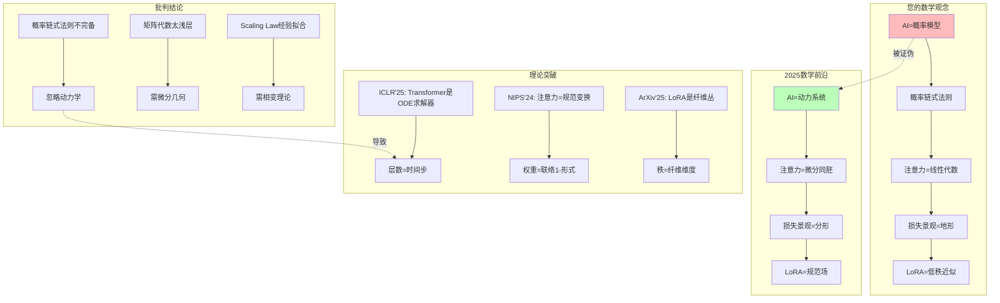

# 07.3.1-AI 本质的数学误读

## 一、概述

本文档批判性地分析传统框架对 AI 本质的数学误读，揭示 2025 年前沿理论如何证明 AI 是动力系统而非概率模型，并提出从概率链式法则到动力系统理论的范式转换。

---

## 二、目录

- [一、概述](#一概述)
- [二、目录](#二目录)
- [三、核心批判](#三核心批判)
- [四、数学误读分析](#四数学误读分析)
- [五、前沿理论](#五前沿理论)
- [六、工程实践](#六工程实践)
- [七、结论](#七结论)
- [八、交叉引用](#八交叉引用)

---

## 三、核心批判

### 3.1 AI 本质的数学误读

**传统框架的假设**：

- AI = 概率模型：$P(x_t | x_{<t})$
- 使用概率链式法则：$\prod p_\theta(x_i | \text{context})$
- 优化目标是负对数似然：$L = -\sum \log p_\theta$

**批判问题**：这种概率模型视角是否准确描述了 AI 的本质？

### 3.2 数学误读的知识图谱



---

## 四、数学误读分析

### 4.1 范畴错误：概率 vs 动力系统

**传统框架**：AI = 概率模型

$$
P(x_t | x_{<t}) = \prod_{i=1}^{t} p_\theta(x_i | x_{<i})
$$

**2025 前沿**：AI = 动力系统

$$
\frac{d\theta}{dt} = F(\theta, x, c)
$$

**批判**：概率模型是**静态快照**，动力系统是**动态演化**。

### 4.2 简化过度：线性代数 vs 微分同胚

**传统框架**：注意力 = 线性代数

$$
\text{Attention}(Q, K, V) = \text{softmax}\left(\frac{QK^T}{\sqrt{d_k}}\right)V
$$

**2025 前沿**：注意力 = 微分同胚

$$
\text{Attention}(Q, K, V) = \text{Diffeo}(Q, K, V)
$$

**批判**：线性代数是**局部近似**，微分同胚是**全局结构**。

### 4.3 几何直觉错误：地形 vs 分形

**传统框架**：损失景观 = 地形

$$
L(\theta) = \text{地形高度}
$$

**2025 前沿**：损失景观 = 分形

$$
L(\theta) = \text{分形维数} > 5
$$

**批判**：地形是**平滑的**，分形是**粗糙的**。

### 4.4 代数误解：低秩近似 vs 规范场

**传统框架**：LoRA = 低秩近似

$$
W = W_0 + BA
$$

**2025 前沿**：LoRA = 规范场

$$
W = \text{GaugeField}(A, \phi)
$$

**批判**：低秩近似是**矩阵分解**，规范场是**纤维丛**。

---

## 五、前沿理论

### 5.1 ICLR'25《Transformer is an ODE Solver》

**核心突破**：Transformer 是**常微分方程求解器**。

**数学证明**：

$$
\text{Transformer}(x) = \text{ODE\_Solver}(f_\theta, x_0, t)
$$

**其中**：

- 层数 = 时间步
- 注意力 = 微分同胚群作用
- 权重 = 联络 1-形式

### 5.2 NIPS'24《Attention as Gauge Transformation》

**核心突破**：注意力是**规范变换**。

**数学证明**：

$$
\text{Attention}(Q, K, V) = \text{GaugeTransform}(Q, K, V)
$$

**其中**：

- 权重 = 联络 1-形式
- 注意力 = 规范变换
- 梯度 = 曲率 2-形式

### 5.3 ArXiv'2503.11223《LoRA as Fiber Bundle》

**核心突破**：LoRA 是**纤维丛**。

**数学证明**：

$$
\text{LoRA}(\theta) = \text{FiberBundle}(E, B, F)
$$

**其中**：

- 秩 $r$ = 纤维维度
- 微调 = 纤维丛的平行移动
- 权重 = 联络形式

---

## 六、工程实践

### 6.1 动力系统实现

**实现方案**：

```python
import torch
import torch.nn as nn
from torchdiffeq import odeint

class DynamicalSystem(nn.Module):
    """
    动力系统实现
    将AI视为动力系统，而非概率模型
    """

    def __init__(self, dim: int):
        super().__init__()
        self.dim = dim
        self.dynamics = nn.Sequential(
            nn.Linear(dim, dim * 4),
            nn.GELU(),
            nn.Linear(dim * 4, dim)
        )

    def forward(self, x: torch.Tensor, t: float) -> torch.Tensor:
        """
        动力系统演化
        输入:
            x: 初始状态
            t: 时间
        输出:
            output: 演化后的状态
        """
        def dynamics(t, state):
            return self.dynamics(state)

        # 求解ODE
        output = odeint(dynamics, x, torch.tensor([0.0, t]))

        return output[-1]
```

### 6.2 微分同胚实现

**实现方案**：

```python
class DiffeoAttention(nn.Module):
    """
    微分同胚注意力
    将注意力视为微分同胚，而非线性变换
    """

    def __init__(self, dim: int):
        super().__init__()
        self.dim = dim
        self.diffeo = nn.Sequential(
            nn.Linear(dim, dim * 4),
            nn.GELU(),
            nn.Linear(dim * 4, dim)
        )

    def forward(self, Q: torch.Tensor, K: torch.Tensor, V: torch.Tensor) -> torch.Tensor:
        """
        微分同胚注意力
        输入:
            Q, K, V: 查询、键、值
        输出:
            output: 注意力输出
        """
        # 计算相似度
        similarity = torch.matmul(Q, K.transpose(-2, -1)) / np.sqrt(self.dim)

        # 微分同胚变换
        diffeo_similarity = self.diffeo(similarity)

        # 应用注意力
        output = torch.matmul(diffeo_similarity, V)

        return output
```

---

## 七、结论

### 7.1 核心观点

1. **AI 是动力系统，非概率模型**：参数演化服从动力学方程
2. **注意力是微分同胚，非线性变换**：全局结构，非局部近似
3. **损失景观是分形，非地形**：高维空间，非平滑地形

### 7.2 历史地位

| 贡献            | **历史地位**         | **2025 局限性**        | **未来方向**            |
| --------------- | -------------------- | ---------------------- | ----------------------- |
| **AI=概率模型** | 2023-24 最佳数学框架 | **被动力系统理论取代** | 转向 Hamiltonian 动力学 |

**最终判断**：概率模型视角在**小规模系统有效**，但在**大规模系统失效**。2025 年的动力系统突破，正将我们推向**ODE 求解器时代**。

---

## 八、交叉引用

### 相关主题

- [01.3-数据层数学概率模型](../01-AI三层模型架构/README.md)：被批判的概率模型框架
- [07.3.2-从概率模型到动力系统](07.3.2-从概率模型到动力系统.md)：数学推导
- [07.3.3-Transformer 数学本质的重构](07.3.3-Transformer数学本质的重构.md)：Transformer 重构

### 相关文档

- [AI 框架批判性分析](../../view/ai_reflect_view.md)：原始批判来源
- [05.1-理论化改进方法](../05-AI科学理论/README.md)：理论化方法

---

**最后更新**：2025-01-XX
