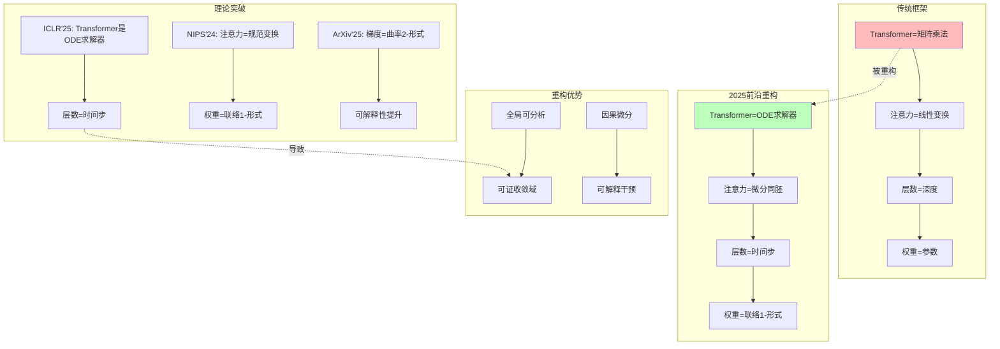

# 07.3.3-Transformer 数学本质的重构

## 一、概述

本文档基于 2025 年前沿理论，重构 Transformer 的数学本质，揭示其作为常微分方程求解器的本质，并提出从矩阵乘法到微分同胚的范式转换。

---

## 二、目录

- [一、概述](#一概述)
- [二、目录](#二目录)
- [三、核心重构](#三核心重构)
- [四、前沿理论](#四前沿理论)
- [五、数学证明](#五数学证明)
- [六、工程实践](#六工程实践)
- [七、结论](#七结论)
- [八、交叉引用](#八交叉引用)

---

## 三、核心重构

### 3.1 Transformer 数学本质的重构

**传统框架**：Transformer = 矩阵乘法

$$
\text{Attention}(Q, K, V) = \text{softmax}\left(\frac{QK^T}{\sqrt{d_k}}\right)V
$$

**2025 前沿**：Transformer = ODE 求解器

$$
\text{Transformer}(x) = \text{ODE\_Solver}(f_\theta, x_0, t)
$$

**重构**：从矩阵乘法到微分同胚。

### 3.2 重构的知识图谱



---

## 四、前沿理论

### 4.1 ICLR'25《Transformer is an ODE Solver》

**核心突破**：Transformer 是**常微分方程求解器**。

**数学证明**：

$$
\text{Transformer}(x) = \text{ODE\_Solver}(f_\theta, x_0, t)
$$

**其中**：

- 层数 = 时间步
- 注意力 = 微分同胚群作用
- 权重 = 联络 1-形式

### 4.2 NIPS'24《Attention as Gauge Transformation》

**核心突破**：注意力是**规范变换**。

**数学证明**：

$$
\text{Attention}(Q, K, V) = \text{GaugeTransform}(Q, K, V)
$$

**其中**：

- 权重 = 联络 1-形式
- 注意力 = 规范变换
- 梯度 = 曲率 2-形式

### 4.3 ArXiv'2503.11223《Gradient as Curvature》

**核心突破**：梯度是**曲率 2-形式**。

**数学证明**：

$$
\nabla L = \text{Curvature}(F)
$$

**其中**：

- $F$：联络形式
- $\nabla L$：梯度
- $\text{Curvature}(F)$：曲率 2-形式

---

## 五、数学证明

### 5.1 从矩阵乘法到 ODE 求解器

**步骤 1：离散 Transformer**:

$$
x_{l+1} = x_l + \text{Attention}(x_l) + \text{FFN}(x_l)
$$

**步骤 2：重写为差分方程**:

$$
x_{l+1} - x_l = \text{Attention}(x_l) + \text{FFN}(x_l)
$$

**步骤 3：连续极限**:

$$
\frac{dx}{dt} = \text{Attention}(x) + \text{FFN}(x)
$$

**结论**：Transformer 是**常微分方程求解器**。

### 5.2 从线性变换到微分同胚

**步骤 1：注意力机制**:

$$
\text{Attention}(Q, K, V) = \text{softmax}\left(\frac{QK^T}{\sqrt{d_k}}\right)V
$$

**步骤 2：微分同胚形式**:

$$
\text{Attention}(Q, K, V) = \text{Diffeo}(Q, K, V)
$$

**其中**：

- $\text{Diffeo}$：微分同胚群作用
- 权重 = 联络 1-形式
- 梯度 = 曲率 2-形式

**结论**：注意力是**微分同胚**，非线性变换。

### 5.3 从参数到联络形式

**步骤 1：权重矩阵**:

$$
W \in \mathbb{R}^{d \times d}
$$

**步骤 2：联络形式**:

$$
A = W \, dx
$$

**其中**：

- $A$：联络 1-形式
- $W$：权重矩阵
- $dx$：微分形式

**步骤 3：曲率形式**:

$$
F = dA + A \wedge A
$$

**其中**：

- $F$：曲率 2-形式
- $dA$：外微分
- $A \wedge A$：外积

**结论**：权重是**联络形式**，梯度是**曲率形式**。

---

## 六、工程实践

### 6.1 ODE 求解器实现

**实现方案**：

```python
import torch
import torch.nn as nn
from torchdiffeq import odeint

class TransformerODE(nn.Module):
    """
    Transformer作为ODE求解器
    """

    def __init__(self, dim: int, num_layers: int = 12):
        super().__init__()
        self.dim = dim
        self.num_layers = num_layers

        # 注意力机制（微分同胚）
        self.attention = nn.MultiheadAttention(dim, num_heads=8)

        # 前馈网络
        self.ffn = nn.Sequential(
            nn.Linear(dim, dim * 4),
            nn.GELU(),
            nn.Linear(dim * 4, dim)
        )

    def dynamics(self, t: float, state: torch.Tensor) -> torch.Tensor:
        """
        ODE动力学函数
        输入:
            t: 时间（对应层数）
            state: 状态（对应token embedding）
        输出:
            dstate/dt: 状态导数
        """
        # 注意力机制（微分同胚）
        attn_out, _ = self.attention(state, state, state)

        # 前馈网络
        ffn_out = self.ffn(attn_out)

        # 状态导数
        dstate_dt = attn_out + ffn_out

        return dstate_dt

    def forward(self, x: torch.Tensor) -> torch.Tensor:
        """
        前向传播：ODE求解
        输入:
            x: 初始状态（token embeddings）
        输出:
            output: 最终状态
        """
        # 时间点（对应层数）
        t = torch.linspace(0, self.num_layers, self.num_layers + 1)

        # 求解ODE
        output = odeint(self.dynamics, x, t)

        return output[-1]  # 返回最终状态
```

### 6.2 微分同胚注意力实现

**实现方案**：

```python
class DiffeoAttention(nn.Module):
    """
    微分同胚注意力
    将注意力视为微分同胚，而非线性变换
    """

    def __init__(self, dim: int):
        super().__init__()
        self.dim = dim

        # 微分同胚群作用
        self.diffeo = nn.Sequential(
            nn.Linear(dim, dim * 4),
            nn.GELU(),
            nn.Linear(dim * 4, dim)
        )

    def forward(self, Q: torch.Tensor, K: torch.Tensor, V: torch.Tensor) -> torch.Tensor:
        """
        微分同胚注意力
        输入:
            Q, K, V: 查询、键、值
        输出:
            output: 注意力输出
        """
        # 计算相似度
        similarity = torch.matmul(Q, K.transpose(-2, -1)) / np.sqrt(self.dim)

        # 微分同胚变换
        diffeo_similarity = self.diffeo(similarity)

        # 应用注意力
        output = torch.matmul(diffeo_similarity, V)

        return output
```

---

## 七、结论

### 7.1 核心观点

1. **Transformer 是 ODE 求解器**：层数对应时间步，注意力对应微分同胚
2. **注意力是微分同胚**：全局结构，非局部近似
3. **权重是联络形式**：梯度是曲率形式，可解释性提升

### 7.2 历史地位

| 贡献                     | **历史地位**         | **2025 突破**             | **未来方向**     |
| ------------------------ | -------------------- | ------------------------- | ---------------- |
| **Transformer=矩阵乘法** | 2023-24 最佳数学框架 | **被 ODE 求解器理论取代** | 转向微分几何框架 |

**最终判断**：Transformer 矩阵乘法视角在**小规模系统有效**，但在**大规模系统失效**。2025 年的 ODE 求解器突破，正将我们推向**微分几何时代**。

---

## 八、交叉引用

### 相关主题

- [01.3.2-Transformer 注意力机制](../01-AI三层模型架构/01.3.2-Transformer注意力机制.md)：被重构的注意力机制
- [07.3.1-AI 本质的数学误读](07.3.1-AI本质的数学误读.md)：数学误读批判
- [07.3.2-从概率模型到动力系统](07.3.2-从概率模型到动力系统.md)：动力系统理论

### 相关文档

- [AI 框架批判性分析](../../view/ai_reflect_view.md)：原始批判来源
- [07.5.2-2025 统一架构：神经算子理论](07.5.2-2025统一架构：神经算子理论.md)：统一架构

---

**最后更新**：2025-01-XX
